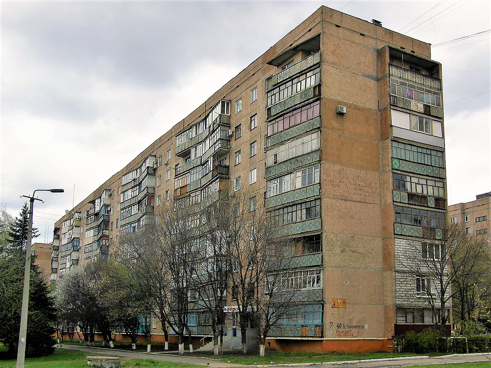

# Piso Mortal en Kramatorsk

El apartamento número 85, edificio 7, Calle Mariyi Pryimachenko, Kramatorsk (antigua USSR, actual Ucrania),
estaba realmente maldito y solo trajo miserias
a sus inquilinos. Entre 1980 y 1989, dos familias vivieron allí
por separado y ambas vieron, impotentes, cómo murieron sus hijos de leucemia. Una
hija de 18 años murió de repente en 1980, seguida de su hermano de 16 años
y su madre en 1982. Ninguna de estas muertes llamaron la atención
de las autoridades, y el apartamento fue habitado por nuevos inquilinos. 
Por desgracia, estos tampoco tuvieron suerte, ya que su hijo también murió de leucemia al poco tiempo de estar allí.

## Accidente en la Cantera de Karansky

Solo después de otra muerte, y gracias a la persistencia de un nuevo inquilino, se inspeccionó el apartamento. Los inspectores se quedaron en shock.
Descubrieron que la habitación de los niños era una fuente de radiación
activa. Una gran parte de la pared había sido cortada y
estudiada. Un examen minucioso reveló un emisor de radiación en el
panel, del tipo utilizado en las canteras. La marca del emisor reveló
que se había perdido a finales de 1970 en la Cantera de Karansky.

En las canteras, los materiales radiactivos pueden ser usados, por ejemplo, para
determinar la densidad de rocas o el nivel de llenado de contenedores
opacos. A pesar del hecho de que la manipulación de estos materiales está
sujeta a estrictas regulaciones, a veces se produce algún accidente. Un accidente
similar sucedió a principios de 2023 en
Australia. Allí, se perdió un emisor durante su transporte a una distancia de
1 400 kilómetros. La búsqueda fue como intentar encontrar una aguja en
un pajar. El emisor es un cilindro del tamaño de una pila de botón,
de 8 milímetros. Afortunadamente, el emisor australiano fue encontrado en
la carretera por la que circulaba el transporte. Por desgracia, el emisor
ucraniano no tuvo tanta suerte y acabó en el panel que fue usado en
la construcción de una casa que quedó, a partir de ese momento, condenada.

> **Problema 1.** El panel que forma la pared de la habitación de los niños contiene
> un emisor radiactivo. Por una desafortunada coincidencia, está localizado justamente al lado de una de las camas de los niños. Intenta calcular cuánto se reduciría la
> dosis de radiación si la cama infantil se trasladara al
> lado opuesto de la habitación afectada. Supongamos que el emisor irradia uniformemente en todas las direcciones. Además, supongamos que la distancia
> del emisor desde la cama infantil es de medio metro, y que, tras trasladar la
> cama al lado opuesto de la habitación, la distancia aumenta a tres
> metros, i.e., es seis veces mayor.

\iffalse

*Solución.* De acuerdo con el enunciado del problema, podemos suponer que la radiación se distribuye uniformemente sobre
un área esférica.

El área de una esfera de radio $r$ viene dada por la fórmula: 

$$S = 4 \pi r^2.$$

De esto, se deduce que el área esférica con seis veces un
radio tiene 36 veces su área. Por lo tanto, el potencial total del emisor
se reparte en una superficie 36 veces mayor. Luego la
intensidad de radiación a una distancia seis veces mayor, es 36 veces menor.

\fi

> **Problema 2.** El cesio utilizado como fuente de radiación radiactiva
> en el incidente descrito tiene una esperanza de vida de 30 años. Determina cuánto
> tiempo tardaría la radiactividad en disminuir en el mismo
> factor que tras el traslado de la cama en el problema anterior.

\iffalse

*Solución.* Por Física, sabemos que la actividad de un radiador
y la cantidad de material sin descomponer son proporcionales y ambos
disminuyen exponencialmente con el tiempo siguiendo la ecuación:

$$
N(t) = N_0\mathrm{e}^{-\lambda t},\tag{1}
$$

* $N(t)$ representa la cantidad de sustancia no desintegrada en el tiempo $t$;
* $N_0$ es la cantidad inicial de la sustancia;
* $\lambda$ es la constante de desintegración, que caracteriza la velocidad prevista de la transformación;
* $t$ es el tiempo.

Luego es necesario encontrar en qué momento la cantidad de material
radiactivo es 36 veces menor. Tomando el logaritmo de ambos lados en la ecuación (1), obtenemos:

$$
-\lambda t = \ln \frac{N(t)}{N_0}\tag{2}.
$$

Dado que la cantidad se reduce a la mitad en 30 años ($N(30)=\frac{1}{2}N_0$), tenemos:
$$
-\lambda\,30 = \ln \frac 12
$$
y
$$
\lambda = \frac 1{30}\ln 2.
$$ 
Sustituyendo en la ecuación (2), se obtiene: 
$$
-\frac 1{30}t\ln 2 = \ln \frac{N(t)}{N_0}
$$
y 
$$
t = -30 \frac{\ln \frac{N(t)}{N_0}}{\ln 2}.
$$

Tenemos que determinar el momento en el que $\frac{N(t)}{N_0}=\frac {1}{36}$. Entonces:

$$
t = -30 \frac{\ln \frac{1}{36}}{\ln 2} =
30 \frac{\ln {36}}{\ln 2} \doteq 155.
$$

El nivel de radiación desciende hasta el nivel equivalente a trasladar la cama al otro lado de la habitación después de 155 años aproximadamente.

\fi

## Referencias y Bibliografía

### Bibliografía

* Wikipedie, Kramatorsk radiological accident,
  <https://en.wikipedia.org/wiki/Kramatorsk_radiological_accident>,
  September 28, 2023

* <https://www.irozhlas.cz/zpravy-svet/australie-radiace-nebezpeci-varovani-radioaktivita-cesium-137-ozareni_2301311701_har>,
  September 28, 2023

* <https://edition.cnn.com/2023/02/01/australia/australia-radioactive-capsule-found-intl-hnk/index.html>, September 28, 2023

### Fuentes de las imágenes

* Artemka, Own work, <https://commons.wikimedia.org/wiki/File:%D0%A3%D0%BB%D0%B8%D1%86%D0%B0_%D0%9C%D0%B0%D1%80%D0%B8%D0%B8_%D0%9F%D1%80%D0%B8%D0%B9%D0%BC%D0%B0%D1%87%D0%B5%D0%BD%D0%BA%D0%BE,_7.jpg>, September 28, 2023

* <https://edition.cnn.com/2023/02/01/australia/australia-radioactive-capsule-found-intl-hnk/index.html>, September 28, 2023
                                              

