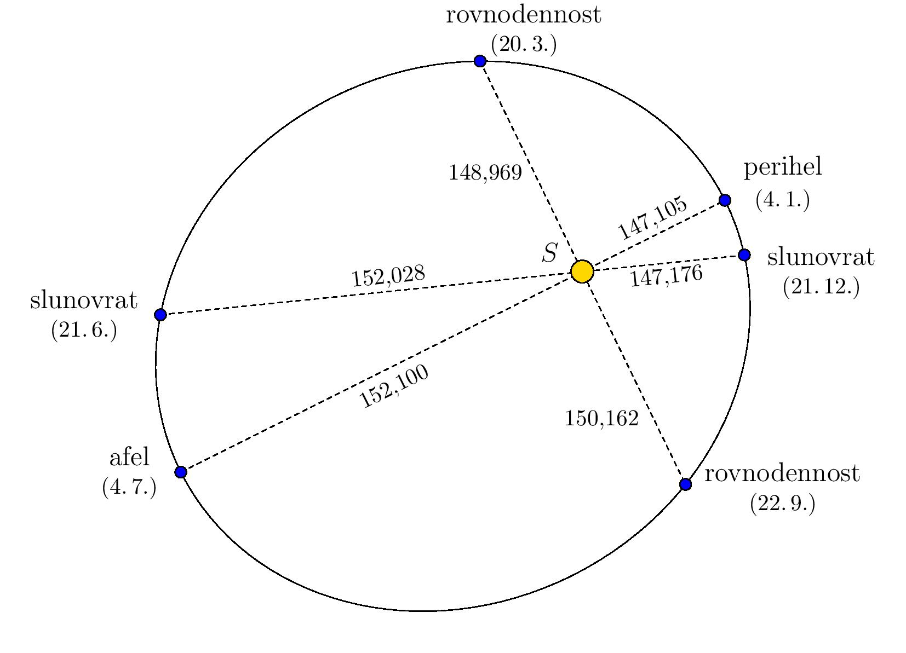
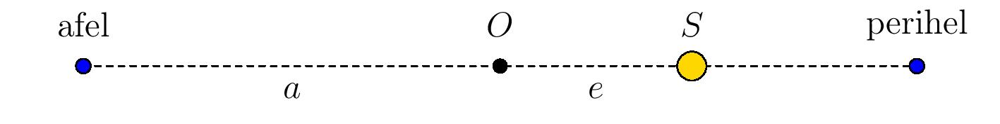
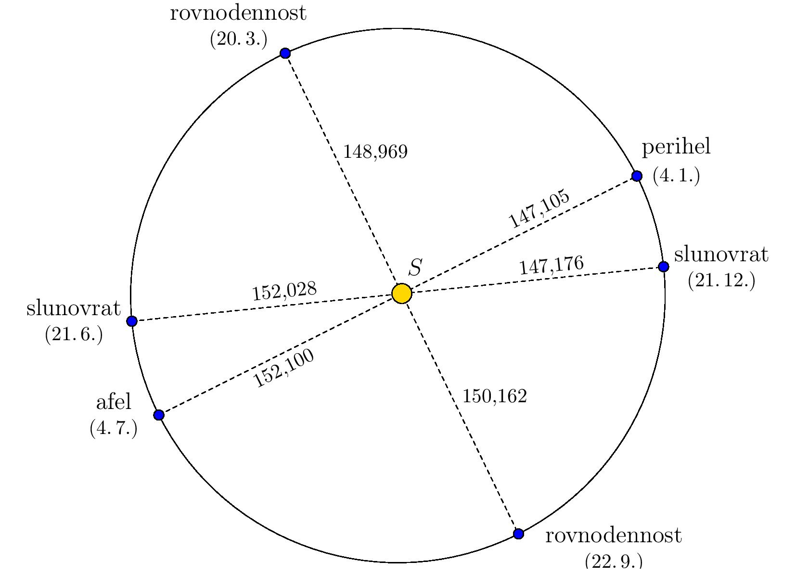

# První Keplerův zákon

První Keplerův zákon říká:

*Planety se pohybují kolem Slunce po eliptických trajektoriích, přičemž Slunce je v jednom z jejich ohnisek.*

Místo na trajektorii, kde je Země nejblíže (resp. nejdále) 
Slunci se pak nazývá *perihel* (resp. *afel*). Situace je znázorněna na obrázku, který je záměrně zkreslený, aby byl patrný eliptický tvar trajektorie. Vzdálenosti jsou uvedeny v milionech kilometrů (data jsou z programu Stellarium a odpovídají roku 2022).

> **Úloha.** Určete excentricitu a délky hlavní a vedlejší 
> poloosy eliptické trajektorie Země užitím informací na 
> obrázku.

\iffalse

*Řešení.* Protože se Slunce nachází v jednom z ohnisek elipsy, jsou 
afel a perihel její hlavní vrcholy. Součet vzdáleností 
Slunce od Země v afelu a perihelu je proto dvojnásobkem 
délky hlavní poloosy $a$ a tedy

$$a=\frac{152{,}100\cdot10^6\,\text{km} + 147{,}105\cdot10^6\,\text{km}}{2}\doteq149,603\cdot10^6\,\text{km}.$$

Jak je patrné z obrázku (bod $O$ zde značí střed elipsy), 
součet délky hlavní poloosy $a$ a excentricity $e$ je 
vzdáleností Slunce od Země v afelu. Tedy 

$$e=152,100\cdot10^6\,\text{km} - 149,603\cdot10^6\,\text{km} =2,497\cdot10^6\,\text{km}.$$

Protože pro elipsu platí vztah $a^2 = b^2 + e^2$ (kde $b$ je 
délka vedlejší poloosy), určíme nyní délku vedlejší poloosy:

$$b=\sqrt{a^2 - e^2}\doteq 149,582\cdot10^6\,\text{km}.$$

Pokud nyní obrázek ze zadání překreslíme tak, aby poměr 
velikostí poloos odpovídal skutečnosti, je z něj vidět, že 
se trajektorie skutečně velice podobá kružnici se Sluncem v 
jejím středu. 

\fi

## Literatura

* Stellarium contributors (2023). *Stellarium 23.4.*[software], <https://stellarium.org/cs/>
