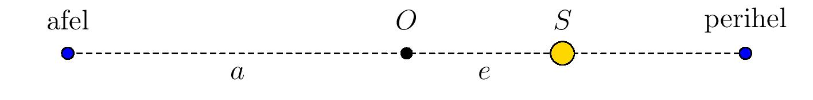
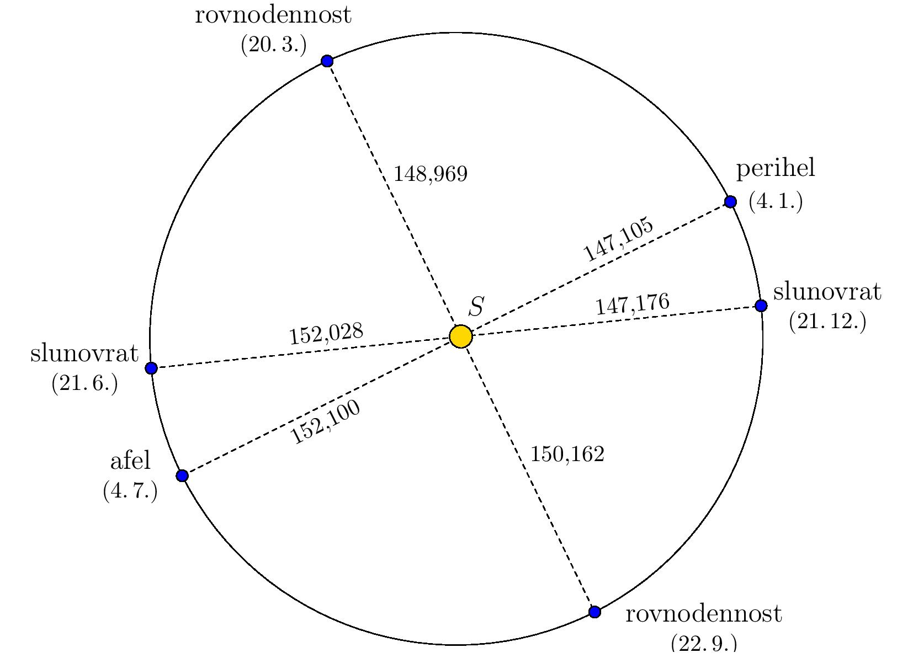

---
keywords:
- conic section
- ellipse
is_finished: False
---
<!-- Navrhuji spíše drobnější změny - většinou zpřesňující význam tvrzení. 
- "Earth" se většinou píše bez členu "the"
- Správná terminologie pro elipsu je "semi-major a semi-minor axes" místo "major and minor semi-axes" viz např. zde
https://en.wikipedia.org/wiki/Semi-major_and_semi-minor_axes -->
# Kepler's First Law of Planetary Motion

Kepler's first law states:

*The planets move around the Sun in elliptical trajectories, with the Sun located at one of their foci.*

The point on the trajectory where Earth is closest (or farthest) to the Sun
is called *perihelion* (or *aphelion*).
The situation is shown in the following figure, which is intentionally distorted 
so that the elliptical shape of the trajectory is visible. 
Distances are given in millions of kilometers, based on
data from the Stellarium program, and correspond to the year 2022.

> **Exercise 1.** Using the information in the figure, determine the eccentricity and the lengths of the semi-major and semi-minor
> axes of Earth's elliptical trajectory.

*Solution.* Since the Sun is at one of the foci of the ellipse,
aphelion and perihelion are its main vertices.
Therefore, the sum of the distances from the Sun to Earth at aphelion and perihelion is twice the length of the semi-major axis $a$. Thus,

$$a=\frac{152{,}100\cdot10^6\,\text{km} + 147{,}105\cdot10^6\,\text{km}}{2}\doteq149,603\cdot10^6\,\text{km}.$$

As seen in the figure (where point $O$ represents the center of the ellipse), 
the difference between the distance from the Sun to Earth at aphelion and the length of the semi-major axis $a$ gives the eccentricity $e$. Thus

$$e=152,100\cdot10^6\,\text{km} - 149,603\cdot10^6\,\text{km} =2,497\cdot10^6\,\text{km}.$$

Since for an ellipse the relation $a^2 = b^2 + e^2$ holds,  
where $b$ is the length of the semi-minor axis, 
we can now determine the length of the semi-minor axis:

$$b=\sqrt{a^2 - e^2}\doteq 149,582\cdot10^6\,\text{km}.$$

If we now redraw the figure from the exercise so that the ratio 
of the lengths of the axes corresponds to reality,
it is evident that the shape of the trajectory is indeed very close 
to a circle, with the Sun at its center.

## Literature

* Stellarium contributors (2023). *Stellarium 23.4.*[software], <https://stellarium.org/cs/>

