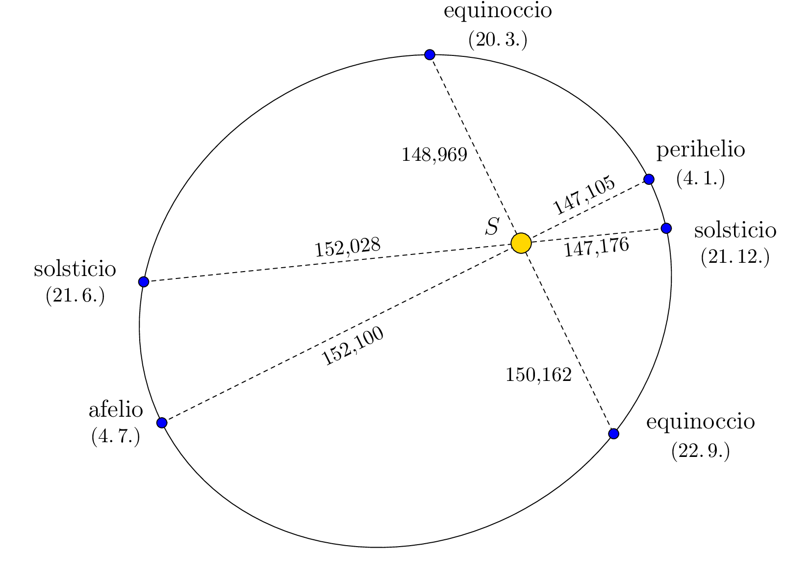

# La primera ley de Kepler sobre el movimiento planetario

La primera ley de Kepler establece:

*Los planetas se mueven alrededor del Sol en trayectorias elípticas, con el Sol situado en uno de sus focos.*

El punto de la trayectoria en el que la Tierra está más cerca (o más lejos) del Sol se denomina *perihelio* (o *afelio*).
La situación se muestra en la siguiente figura, que está intencionadamente distorsionada para que sea visible la forma elíptica de la trayectoria.  Las distancias están dadas en millones de kilómetros, basadas en datos del programa Stellarium, y corresponden al año 2022.

> **Ejercicio.** A partir de la información de la figura, determina la excentricidad y las longitudes de los ejes semimayor y semimenor de la trayectoria elíptica de la Tierra.

*Solución.* Dado que el Sol se encuentra en uno de los focos de la elipse, el afelio y el perihelio son sus vértices principales.
Por lo tanto, la suma de las distancias del Sol a la Tierra en el afelio y el perihelio es el doble de la longitud del semieje mayor $a$. Por lo tanto,

$$a=\frac{152{,}100\cdot10^6\,\text{km} + 147{,}105\cdot10^6\,\text{km}}{2}\doteq149,603\cdot10^6\,\text{km}.$$

Como se ve en la figura (donde el punto $O$ representa el centro de la elipse), la diferencia entre la distancia del Sol a la Tierra en el afelio y la longitud del semieje mayor $a$ da la excentricidad $e$. Así,

$$e=152,100\cdot10^6\,\text{km} - 149,603\cdot10^6\,\text{km} =2,497\cdot10^6\,\text{km}.$$

Como para una elipse se cumple la relación $a^2 = b^2 + e^2$,  
donde $b$ es la longitud del semieje menor, ahora podemos determinar la longitud del semieje menor:

$$b=\sqrt{a^2 - e^2}\doteq 149,582\cdot10^6\,\text{km}.$$

Si ahora volvemos a dibujar la figura del ejercicio de forma que la relación entre las longitudes de los ejes se corresponda con la realidad, es evidente que la forma de la trayectoria es, en efecto, muy cercana a a un círculo, con el Sol en su centro.

## Bibliografía

* Stellarium contributors (2023). *Stellarium 23.4.*[software], <https://stellarium.org/cs/>

