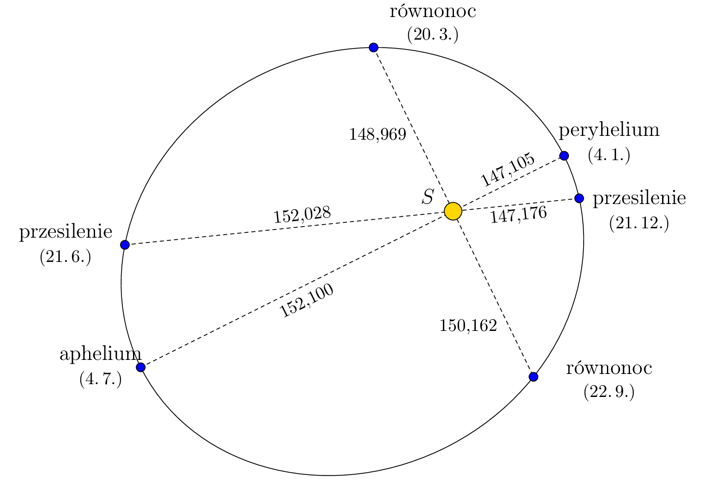
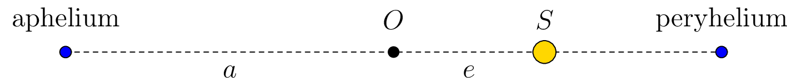
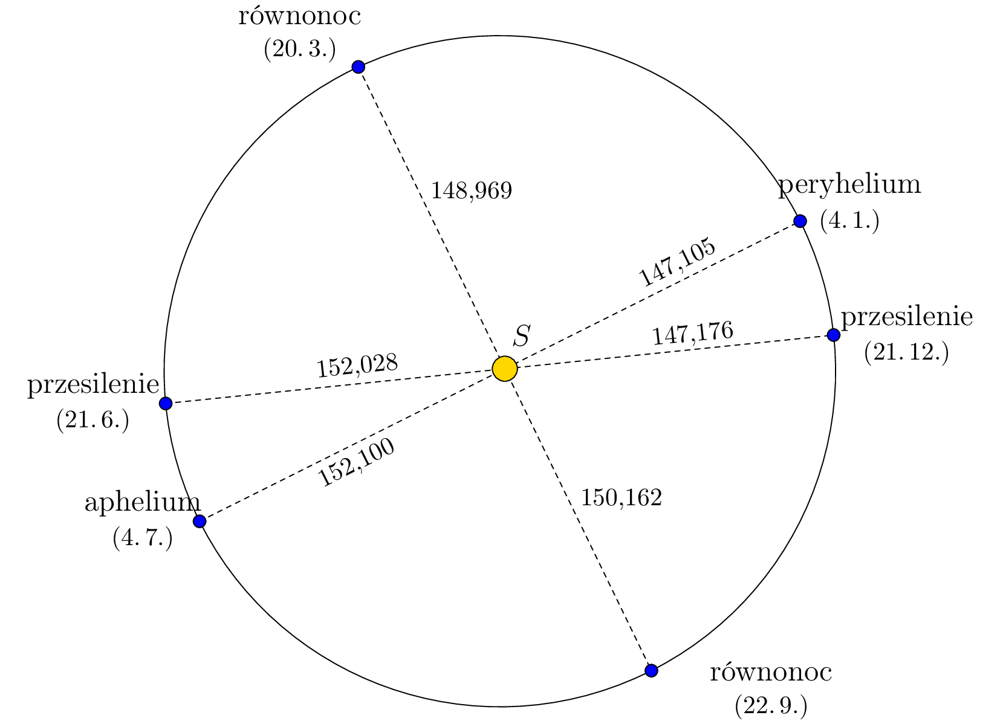

---
keywords:
- przekrój stożkowy
- elipsa 
is_finished: True
---

# Pierwsze prawo Keplera o ruchu planet 

Pierwsze prawo Keplera mówi:

*Planety poruszają się wokół Słońca po eliptycznych trajektoriach, a Słońce znajduje się w jednym z ich ognisk.*

Punkt na trajektorii, w którym Ziemia znajduje się najbliżej (lub najdalej) Słońca nazywany jest *peryhelium* (lub *aphelium*). Sytuacja jest pokazana na poniższym rysunku, który jest celowo zniekształcony, aby widoczny był eliptyczny kształt trajektorii. Odległości podane są w milionach kilometrów, na podstawie danych z programu Stellarium i odpowiadają rokowi 2022.

> **Zadanie.** Korzystając z informacji przedstawionych na rysunku, określ mimośród oraz długości półosi głównej i półosi małej eliptycznej trajektorii Ziemi.

\iffalse

*Rozwiązanie.*  Ponieważ Słońce znajduje się w jednym z ognisk elipsy, aphelium i peryhelium są jej głównymi wierzchołkami.
Dlatego suma odległości od Słońca do Ziemi w aphelium i peryhelium jest dwa razy większa od długości osi półcienia $a$. Zatem,

$$a=\frac{152{\,}100\cdot10^6\,\text{km} + 147{\,}105\cdot10^6\,\text{km}}{2}\doteq149\,603\cdot10^6\,\text{km}.$$

Jak widać na rysunku (gdzie punkt $O$ reprezentuje środek elipsy), 
różnica między odległością Słońca od Ziemi w aphelium a długością półosi głównej $a$ daje mimośród $e$. Zatem

$$e=152\,100\cdot10^6\,\text{km} - 149\,603\cdot10^6\,\text{km} =2\,497\cdot10^6\,\text{km}.$$

Ponieważ dla elipsy zachodzi zależność $a^2 = b^2 + e^2$, gdzie $b$ jest długością osi półminimalnej, możemy teraz określić długość osi półminimalnej:

$$b=\sqrt{a^2 - e^2}\doteq 149\,582\cdot10^6\,\text{km}.$$

Jeśli teraz przerysujemy figurę z ćwiczenia tak, aby stosunek długości osi odpowiadał rzeczywistości, okaże się, że kształt trajektorii jest rzeczywiście bardzo zbliżony do okręgu, ze Słońcem w środku.

\fi

## Literatura

* Stellarium contributors (2023). *Stellarium 23.4.*[software], <https://stellarium.org/cs/>

