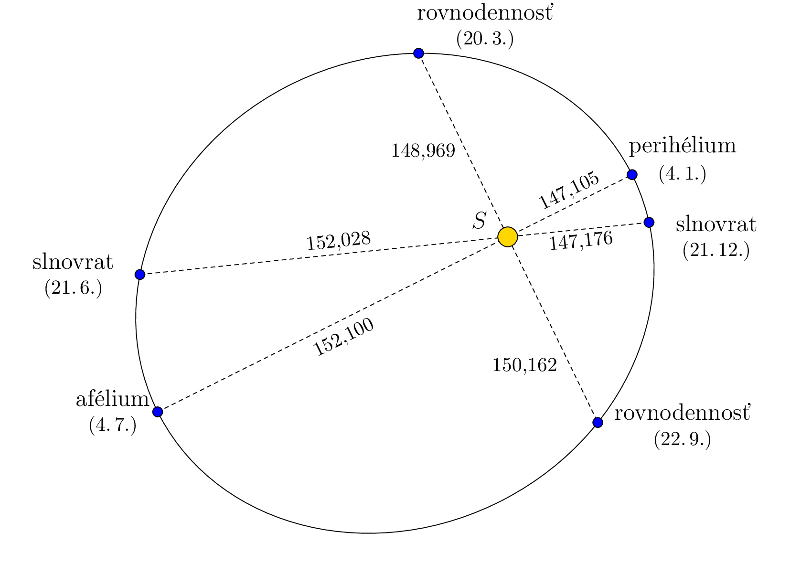
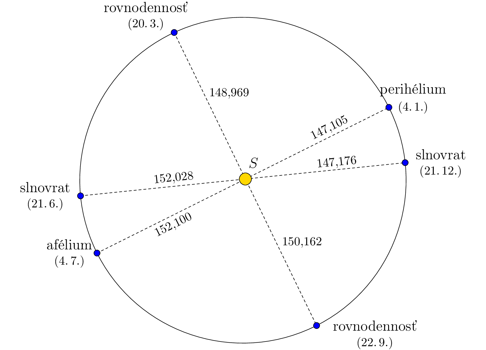

---
keywords:
- kuželosečky
- elipsa
is_finished: True
---

# Prvý Keplerov zákon o pohybe planét

Prvý Keplerov zákon hovorí:

*Planéty sa pohybujú okolo Slnka po eliptických dráhach, pričom Slnko je umiestnené v jednom z ohnísk tejto elipsy.*

Miesto na trajektórii, kde je Zem najbližšie (alebo najďalej) od Slnka, sa nazýva *perihélium* (alebo *afélium*). Situácia je znázornená na nasledujúcom obrázku, ktorý je zámerne zdeformovaný, aby bol eliptický tvar dráhy viditeľný. Vzdialenosti sú uvedené v miliónoch kilometrov na základe údajov z programu Stellarium a zodpovedajú roku 2022.

> **Úloha.** Použitím informácií na obrázku určte excentricitu a dĺžky veľkej a malej polosy eliptickej trajektórie Zeme.

\iffalse

*Riešenie.* Keďže Slnko je v jednom z ohnísk elipsy, afélium a perihélium sú jej hlavnými vrcholmi. Súčet vzdialeností od Slnka k Zemi v aféliu a perihéliu je teda dvojnásobkom dĺžky veľkej polosy $a$. A teda

$$a=\frac{152{,}100\cdot10^6\,\text{km} + 147{,}105\cdot10^6\,\text{km}}{2}\doteq149,603\cdot10^6\,\text{km}.$$

Ako je vidieť na obrázku (kde bod $O$ predstavuje stred elipsy), rozdiel medzi vzdialenosťou od Slnka k Zemi v aféliu a dĺžkou veľkej polosy $a$ určuje excentricitu $e$. Teda

$$e=152,100\cdot10^6\,\text{km} - 149,603\cdot10^6\,\text{km} =2,497\cdot10^6\,\text{km}.$$

Keďže pre elipsu platí vzťah $a^2 = b^2 + e^2$, kde $b$ je dĺžka malej polosy, môžeme teraz určiť dĺžku malej polosy:

$$b=\sqrt{a^2 - e^2}\doteq 149,582\cdot10^6\,\text{km}.$$

Ak teraz prekreslíme obrázok z úlohy tak, aby pomer dĺžok osí zodpovedal realite, je zrejmé, že tvar dráhy je skutočne veľmi blízky kruhu, so Slnkom v jeho strede.

\fi

## Literatúra

* Stellarium contributors (2023). *Stellarium 23.4.*[software], <https://stellarium.org/cs/>

