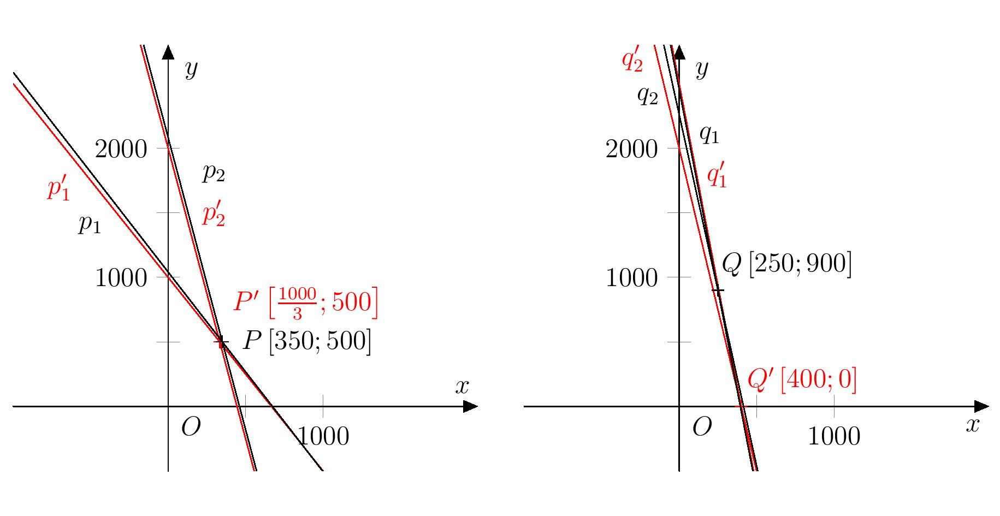

# The Curious Warehouse Manager

When we solve purely mathematical problems, we get exact results. 
However, when we use mathematics to solve problems in the world around us, 
we rarely achieve absolute precision in the answer. 
Approximation is sometimes the result of
a simplification of the real situation in our minds. 
Sometimes the input data are approximated 
(e.g. we can only measure lengths or time with limited accuracy) 
or an absolutely exact result is realistically unattainable 
and must be rounded off.

Rounding to a given number of significant digits 
is often used in practice (and in the following problems). 
We round a positive real number $r$ to $n$ significant digits as follows:

* We express $r$ in the form $a\cdot 10^b$, where $a\in\mathbb{R}$,$a\in\left\langle 1,10 \right)$ and $b\in\mathbb{Z}$,
and then we round the number $a$ to $n-1$ decimal places according to the standard rules for rounding.
* E.g. numbers $r=31{.}258\,16$ and $s=0{.}023 \,123\,6$ 
we round to four valid digits as follows:
$$
\begin{aligned}
r &= 31{.}258\,16 = 3{.}125\,816 \cdot 10^1 \quad \doteq\quad 3{.}126 \cdot 10^1 = 31{.}26 \\
s &= 0{.}023 \,123\,6 = 2{.}312\,36 \cdot 10^{-2} \quad \doteq\quad 2{.}312 \cdot 10^{-2} = 0{.}023\,12.
\end{aligned}
$$

Notably, rounding input data can have surprising consequences for the accuracy of the result,
for example when solving equations, as we will see in the following series of problems.

> **Exercise 1.** The manager of the pharmaceutical warehouse received
> an invoice for two types of ordered vaccines.
> A total of $401{,}950\,\text{CZK}$ was paid for the delivery of
> $597$ packages of Ixodinum vaccines against encephalitis
> and $386$ packages of Nopolio vaccines against polio.
> However, during initial inspection, $86$ packages of Ixodinum vaccine
> and $19$ packages of Nopolio vaccine were found to be expired
> and had to be returned. A total of $39{,}600\,\text{CZK}$ was refunded
> for the expired medicines.
>
> Out of curiosity, the manager
> wants to calculate the purchase price of one package of both vaccines.
> However, he does not have a calculator or a mobile phone on hand,
> so he settles for an approximate solution.
> He rounds all the figures he knows to one significant digit before calculating.
>
> How much will his result differ from the actual purchase price?
> For both types of vaccines, determine the absolute difference between
> the calculated and actual prices, as well as the relative error expressed as a percentage.

\iffalse

*Solution.* First, let's solve the problem without rounding. 
Let $x$ be the price per package of Ixodine and $y$ be the price per package of Nopolio. 
The information in the assignment leads to a system of two linear equations with two unknowns
$$
\begin{alignat*}{2}
597x &\,+& 386 y &= 401{,}950 \\
86x &\,+& 19 y &= 39{,}600
\end{alignat*}
$$
whose solution gives us the real purchase price 
of a package of Ixodin vaccine $350\,\text{CZK}$ 
and of a package of Nopolio vaccine $500\,\text{CZK}$.

After rounding the coefficients to one significant digit, we solve the system
$$
\begin{alignat*}{2}
600x' &\,+ & 400 y' &= 400\,000 \\
90x' &\,+ & 20 y' &= 40\,000.
\end{alignat*}
$$
The solution is the pair $x'=\frac{1{,}000}{3}\doteq333$ and $y'=500$.
Now we have the actual price of the medicine and the estimate of the price by the warehause manager. 
Let's also calculate the relative error in the price of the medicine due to rounding. 
Relative error is the absolute error (absolute value of price difference) 
divided by the actual price per package. 
We summarize the results in the table:

| vaccine  | actual price | price estimate | relative error |
| ------------- | ------------- | --- | --- |
| Ixodinum  | $350\,\text{Kč}$  | $333\,\text{Kč}$ | $\frac{350-333}{350}=4{,}9\,\%$ |
| Nopolio | $500\,\text{Kč}$  | $500\,\text{Kč}$ | $\frac{500-500}{500}=0\,\%$ | 

\fi

> **Exercise 2.** After a few months, another delivery arrived at the warehouse,
> namely $504$ packages of Antiflu vaccines against influenza
> and $81$ packages of Kontradift vaccines against diphtheria.
> $198{,}900\,\text{CZK}$ was paid for this delivery. During initial inspection,
> $98$ packages of Antiflu and $18$ packages of Contradift were found to be expired.
> A total of $40{,}700\,\text{CZK}$ was refunded.
>
> The warehouse manager repeated his procedure
> and calculated the approximate purchase price of the two drugs off the top of his head.
> This time, however, he was surprised.
> What was the reason for his surprise
> and how much did his result differ from the actual prices?

\iffalse

*Solution.* We will solve the problem in the same way as before, 
this time we will denote $x$ the price of one package of Antiflu 
and $y$ the price of one package of Contradift. 
The real prices are the solution of the system
$$
\begin{alignat*}{2}
504x &\,+\,& 81 y &= 198{,}900 \\
98x &\,+\,& 18 y &= 40{,}700
\end{alignat*}
$$
where we get $x=250$ and $y=900$. 

When rounding the coefficients, we solve the system
$$
\begin{alignat*}{2}
500x' &\,+\,& 80 y' &= 200{,}000 \\
100x' &\,+\,& 20 y' &= 40{,}000,
\end{alignat*}
$$
whose solution is $x'=400$ and $y'=0$.
From the solution of the warehouse manager, it seems that
that the second vaccine was delivered to the warehouse free of charge,
while it is actually almost four times more expensive than the first one.
We calculate the relative error and enter all the values in the table again:

| vaccine  | actual price | price estimate | relative error |
| ------------- | ------------- | --- | --- |
| Antiflu  | $250\,\text{Kč}$  | $400\,\text{Kč}$ | $\frac{400-250}{250}=60\,\%$ |
| Kontradift | $900\,\text{Kč}$  | $0\,\text{Kč}$ | $\frac{900-0}{900}=100\,\%$ | 

\fi

> **Exercise 3.** Graphically represent the systems of equations
> from the previous two problems using appropriate software.
> Explain the difference in the accuracy of the results of the two exercises
> by comparing their graphs.

\iffalse

*Solution.* Let $p_1$, $p_2$ (or $q_1$, $q_2$) be the lines 
given by the equations of the system with unrounded coefficients 
in Exercise 1 (or Exercise 2), namely
$$
\begin{align*}
p_1 &\colon 597x + 386 y = 401{,}950 \\
p_2 &\colon 86x + 19 y = 39{,}600 \\[2mm]
q_1 &\colon 504x + 81 y = 198{,}900 \\
q_2 &\colon 98x + 18 y = 40{,}700.
\end{align*}
$$
Let us denote the lines given by the corresponding equations 
with rounded coefficients by $p'_1$, $p'_2$, $q'_1$ and $q'_2$ 
and further denote the points $P\in p_1\cap p_2$, $P'\in p'_1\cap p'_2$, 
$Q\in q_1\cap q_2$ and $Q'\in q'_1\cap q'_2$. 
A graphical representation of the pair of systems 
for each problem separately is shown in following figure. 

By comparing the two graphical representations, 
it can be seen that in the case of Exercise 2, 
the pair of lines $q_1$ and $q_2$ are almost parallel. 
When rounding the coefficients of the equation, 
the position of the lines relative to the coordinate system 
generally changes and the position of the intersection changes as well. 
The change in the position of the intersection is much 
greater for lines that are almost parallel. 
The figure also shows why the second coordinate of the intercept 
(i.e., the price of the vaccine Contradift) will be much 
more affected by rounding in the second problem. 
Because of the slope of the lines $q_1$ and $q_2$, 
a small change in the $x$ coordinate of the intersection would mean
a large change in its $y$ coordinate.

\fi

## Literature

* Biermann K., Grötschel M., Lutz-Westphal B. (2010). *Besser als Mathe: Moderne angewandte Mathematik aus dem MATHEON zum Mitmachen*. Berlin: Vieweg+Teubner.
