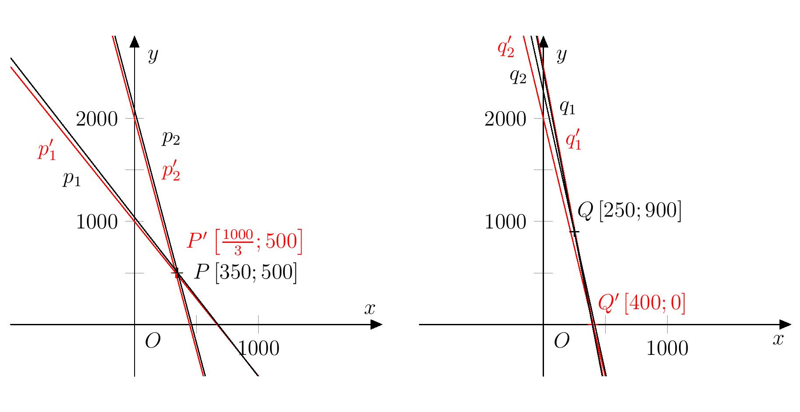

---
keywords:
- sistemas de ecuaciones lineales
- redondeo
is_finished: True
---

# El curioso jefe de almacén

Cuando resolvemos problemas puramente matemáticos, obtenemos resultados exactos. 
Sin embargo, cuando utilizamos las matemáticas para resolver problemas del mundo que nos rodea, 
rara vez conseguimos una precisión absoluta en la respuesta. 
La aproximación es a veces el resultado de
una simplificación de la situación real en nuestra mente. 
A veces, los datos de entrada son aproximados 
(por ejemplo, sólo podemos medir longitudes o el tiempo con una precisión limitada) 
o un resultado absolutamente exacto es inalcanzable desde un punto de vista realista 
y debe redondearse.

Redondeando a un número dado de cifras significativas
se utiliza a menudo en la práctica (y en los siguientes problemas).
Redondeamos un número real positivo $r$ a $n$ cifras significativas de la siguiente manera:

* Expresamos $r$ en la forma $a \cdot 10^b$, donde $a \in \mathbb{R}$, $a \in \left\langle 1,10 \right)$ y $b \in \mathbb{Z}$,
y luego redondeamos el número $a$ a $n - 1$ cifras decimales según las reglas estándar de redondeo.
* Por ejemplo, los números $r = 31{.}258,16$ y $s = 0{.}023,123,6$
los redondeamos a cuatro cifras significativas de la siguiente manera:
$$
\begin{aligned}
r &= 31{.}258\,16 = 3{.}125\,816 \cdot 10^1 \quad \doteq\quad 3{.}126 \cdot 10^1 = 31{.}26 \\
s &= 0{.}023 \,123\,6 = 2{.}312\,36 \cdot 10^{-2} \quad \doteq\quad 2{.}312 \cdot 10^{-2} = 0{.}023\,12.
\end{aligned}
$$

En particular, el redondeo de los datos de entrada puede tener consecuencias sorprendentes para la precisión del resultado,
por ejemplo al resolver ecuaciones, como veremos en la siguiente serie de problemas.

> **Ejercicio 1.** El encargado del almacén farmacéutico recibió
una factura por dos tipos de vacunas solicitadas.
Se pagó un total de $401{,}950,\text{CZK}$ por la entrega de
$597$ paquetes de la vacuna Ixodinum contra la encefalitis
y $386$ paquetes de la vacuna Nopolio contra la poliomielitis.
Sin embargo, durante la inspección inicial, se encontró que $86$ paquetes
de la vacuna Ixodinum y $19$ paquetes de la vacuna Nopolio estaban vencidos
y tuvieron que ser devueltos. Se reembolsó un total de $39{,}600,\text{CZK}$
por los medicamentos caducados.
>
> Por curiosidad, el gerente
> quiere calcular el precio de compra de un paquete de ambas vacunas.
> Sin embargo, no tiene una calculadora ni un teléfono móvil a mano,
> así que se conforma con una solución aproximada.
> Redondea todas las cifras que conoce a un dígito significativo antes de calcular.
>
> ¿Cuánto diferirá su resultado del precio de compra real?
> Para ambos tipos de vacunas, determine la diferencia absoluta entre
> los precios calculados y los reales, así como el error relativo expresado en porcentaje.

\iffalse

*Solución.* En primer lugar, resolvamos el problema sin redondear. 
Sea $x$ el precio por envase de Ixodine e $y$ el precio por envase de Nopolio. 
La información de la tarea conduce a un sistema de dos ecuaciones lineales con dos incógnitas
$$
\begin{alignat*}{2}
597x &\,+& 386 y &= 401{,}950 \\
86x &\,+& 19 y &= 39{,}600
\end{alignat*}
$$
cuya solución nos da el precio real de compra
de un paquete de la vacuna Ixodinum: $350,\text{CZK}$
y de un paquete de la vacuna Nopolio: $500,\text{CZK}$.

Tras redondear los coeficientes a una cifra significativa, resolvemos el sistema
$$
\begin{alignat*}{2}
600x' &\,+ & 400 y' &= 400\,000 \\
90x' &\,+ & 20 y' &= 40\,000.
\end{alignat*}
$$
La solución es el par $x' = \frac{1{,}000}{3} \doteq 333$ y $y' = 500$.
Ahora tenemos el precio real del medicamento y la estimación del precio hecha por el encargado del almacén.
Calculemos también el error relativo en el precio del medicamento debido al redondeo.
El error relativo es el error absoluto (valor absoluto de la diferencia de precios)
dividido por el precio real por paquete.
Resumimos los resultados en la tabla:

| vacuna | precio real | estimación del precio | error relativo |
| ------------- | ------------- | --- | --- |
| Ixodinum  | $350\,\text{Kč}$  | $333\,\text{Kč}$ | $\frac{350-333}{350}=4{,}9\,\%$ |
| Nopolio | $500\,\text{Kč}$  | $500\,\text{Kč}$ | $\frac{500-500}{500}=0\,\%$ | 

\fi

> **Ejercicio 2.** Después de unos meses, llegó otro envío al almacén,
concretamente $504$ paquetes de la vacuna Antiflu contra la gripe
y $81$ paquetes de la vacuna Kontradift contra la difteria.
Se pagaron $198{,}900,\text{CZK}$ por este envío. Durante la inspección inicial,
se encontraron $98$ paquetes de Antiflu y $18$ paquetes de Kontradift caducados.
Se reembolsó un total de $40{,}700,\text{CZK}$.
>
> El jefe de almacén repitió su procedimiento
> y calculó de memoria el precio aproximado de compra de los dos medicamentos.
> Sin embargo, esta vez se sorprendió.
> ¿Cuál fue el motivo de su sorpresa
> y en qué medida difirió su resultado de los precios reales?

\iffalse

*Solución.* Resolveremos el problema de la misma manera que antes, 
esta vez denotaremos $x$ el precio de un paquete de Antiflu 
e $y$ el precio de un paquete de Contradift. 
Los precios reales son la solución del sistema
$$
\begin{alignat*}{2}
504x &\,+\,& 81 y &= 198{,}900 \\
98x &\,+\,& 18 y &= 40{,}700
\end{alignat*}
$$
donde obtenemos $x=250$ y $y=900$. 

Al redondear los coeficientes, resolvemos el sistema
$$
\begin{alignat*}{2}
500x' &\,+\,& 80 y' &= 200{,}000 \\
100x' &\,+\,& 20 y' &= 40{,}000,
\end{alignat*}
$$
cuya solución es $x'=400$ and $y'=0$.
De la solución del jefe de almacén se desprende que
que la segunda vacuna se entregó gratuitamente en el almacén,
mientras que en realidad es casi cuatro veces más cara que la primera.
Calculamos el error relativo y volvemos a introducir todos los valores en la tabla:

| vacuna | precio real | estimación del precio | error relativo |
| ------------- | ------------- | --- | --- |
| Antiflu  | $250\,\text{Kč}$  | $400\,\text{Kč}$ | $\frac{400-250}{250}=60\,\%$ |
| Kontradift | $900\,\text{Kč}$  | $0\,\text{Kč}$ | $\frac{900-0}{900}=100\,\%$ | 

\fi

> **Ejercicio 3.** Representa gráficamente los sistemas de ecuaciones
> de los dos problemas anteriores utilizando el software adecuado.
> Explica la diferencia en la precisión de los resultados de los dos ejercicios
> comparando sus gráficas.

\iffalse

*Solución.* Let $p_1$, $p_2$ (or $q_1$, $q_2$) sean las líneas 
dadas por las ecuaciones del sistema con coeficientes no redondeados 
en el Ejercicio 1 (o Ejercicio 2), sabiendo
$$
\begin{align*}
p_1 &\colon 597x + 386 y = 401{,}950 \\
p_2 &\colon 86x + 19 y = 39{,}600 \\[2mm]
q_1 &\colon 504x + 81 y = 198{,}900 \\
q_2 &\colon 98x + 18 y = 40{,}700.
\end{align*}
$$
Denotemos las rectas dadas por las ecuaciones correspondientes
con coeficientes redondeados como $p'_1$, $p'_2$, $q'_1$ y $q'_2$,
y además denotemos los puntos $P \in p_1 \cap p_2$, $P' \in p'_1 \cap p'_2$,
$Q \in q_1 \cap q_2$ y $Q' \in q'_1 \cap q'_2$.
Una representación gráfica del par de sistemas
para cada problema por separado se muestra en la figura siguiente.

Al comparar las dos representaciones gráficas,
se puede observar que en el caso del Ejercicio 2,
el par de rectas $q_1$ y $q_2$ son casi paralelas.
Al redondear los coeficientes de la ecuación,
la posición de las rectas con respecto al sistema de coordenadas
cambia en general, y también cambia la posición de la intersección.
El cambio en la posición de la intersección es mucho
mayor para rectas que son casi paralelas.
La figura también muestra por qué la segunda coordenada de la intersección
(es decir, el precio de la vacuna Kontradift) se verá
mucho más afectada por el redondeo en el segundo problema.
Debido a la pendiente de las rectas $q_1$ y $q_2$,
un pequeño cambio en la coordenada $x$ de la intersección
implicaría un gran cambio en su coordenada $y$.

\fi

## Bibliografía

* Biermann K., Grötschel M., Lutz-Westphal B. (2010). *Besser als Mathe: Moderne angewandte Mathematik aus dem MATHEON zum Mitmachen*. Berlin: Vieweg+Teubner.

