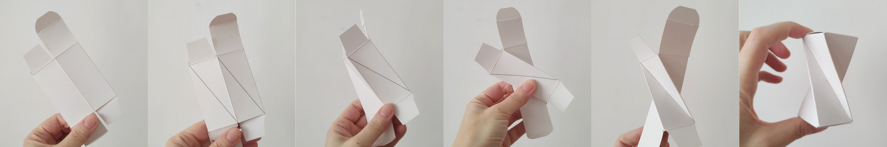
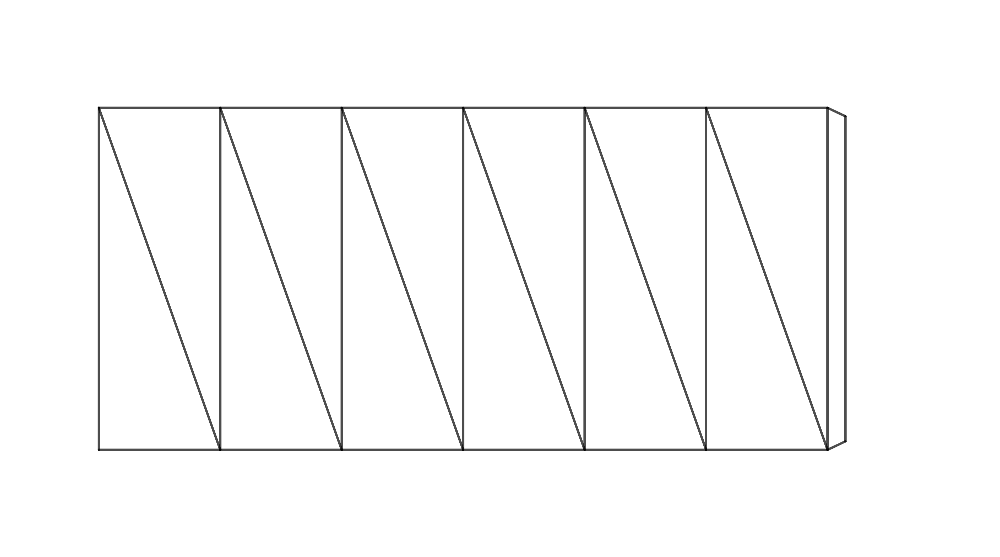

---
keywords:
- space geometry
- Pythagorean theorem
- stereometry
- trigonometry
- twisted prism
is_finished: true
---

# Twisted Prism

## Turning a Right Square Prism into a Twisted Prism

In furniture design, a shape appears that is also of interest from a geometrical point of view. 
It can be created from a right square prism by dividing each lateral face into two triangles using one of 
its diagonals and then rotating the top base by $90^\circ$, as illustrated in Figure 1. 
While preserving the lengths of the edges and diagonals, the height of the prism changes. 
The resulting shape is a special case of a so-called *twisted prism*.

 

Let’s try creating this shape using, for example, a box from children's cough syrup or eye drops. 
For it to work properly, the box’s lids (the top and bottom bases of the prism) must be square 
and able to be opened or unfolded in some way. Creating a twisted prism requires a bit of practice and skill, 
because performing a $90^\circ$ twist is not so easy in reality.

We can use the following procedure:

* Open the box flaps and flatten the box into a single plane, so that two lateral faces are on the top and two on the bottom.
* Divide all lateral faces along diagonals in the same direction, as shown in Figure 2. Try to crease the paper along these lines so that it can be folded later.
* Gently fold each diagonal inward to form ridges.
* Now, make the twist: hold the bottom part of the box lightly with one hand, lift the top part, and move it slightly to the left so that the top base rotates.
* Next, unfold the flattened box into a three-dimensional shape. This step takes a bit of practice. You can do it by pressing the box between two fingers
  at the point where all the marked diagonals overlap, while using your other hand to unfold the top or bottom part of the box into space.
* If you’ve made it this far, all that’s left is to close the box flaps — and you're done. Congratulations!

   

> **Exercise 1.** We want to build a stool in the shape of a twisted prism, and we have several suitable cardboard boxes available.
> These boxes all have square bases with side length $40,\text{cm}$, but their heights vary.
> From experience, we know that a stool height of $50,\text{cm}$ is comfortable for sitting.
> What box height is ideal for making a twisted rectangular prism stool with a vertical height of $50,\text{cm}$?
> The side length of the base is $a = 40,\text{cm}$.

\iffalse

*Solution.* The original side edge of the prism with length $v$, the desired stool height $h$, and the base edge $a$ form a right triangle.
The edge $a$ is the orthogonal projection of the edge $v$ onto the plane of the base (see Figure 3).

According to the Pythagorean Theorem, we get:

$$
v = \sqrt{h^2 + a^2} = \sqrt{50^2 + 40^2} \doteq 64\,\text{cm}. 
$$ 

Ideally, the cardboard box should be approximately $64,\text{cm}$ tall.

\fi

## Other Variants of Twisted Prisms

Could a similar shape be created from right prisms whose base is a different regular $n$-gon?

The answer is yes. However, the construction method described above (for creating a twisted prism from paper) can only be applied when $n$ is even.

In the following problem, we will focus on constructing a hexagonal twisted prism.
First, try to figure out by how many degrees the top base is rotated in this case.
If your spatial imagination fails you, build a model.
To keep things simple, you can work with a net of the prism’s lateral surface.
In Figure 4 below, such a net is already prepared for assembly (thicker paper works best).

Before gluing, make folds along the edges and diagonals — fold the edges upward and the diagonals downward.
After gluing, follow the instructions shown in Figure 5.

> **Exercise 2.** How does the height $h$ of a twisted hexagonal prism (created from a regular hexagonal prism) 
> depend on the original prism height $v$ and the side length $a$ of the base?

\iffalse

*Solution.* To calculate this, we need to know the angle by which one base is rotated relative to the other.
This angle can be determined from the model described above.
The following 3D diagram reveals the rotation angle.

If the 3D diagram is unclear, you can try to imagine what the solid looks like when viewed from above.
We will now treat the top base as transparent. The segments that were diagonals in the faces of the original 
prism intersect at a single point and, when viewed from above, divide the hexagon $A'B'C'D'E'F'$ into six equilateral triangles.
Let us focus on the line segment $A'B$, which was the diagonal in the face $ABB'A'$.

For the segment to pass through the center, point $A'$ must coincide with point $E$, because point $E$ lies opposite point $B$.
We complete the remaining vertices in alphabetical order, following the same direction used in the bottom base — that is, counterclockwise.

It is now clear that the top base has been rotated by $120^\circ$ relative to the bottom base.
Because of this, the edge $BB'$ lies directly above the edge $BF$, and the line segment $BF$ is the orthogonal projection of $BB'$.

The length of edge $BB'$ is $v$, and we denote the length of $BF$ as $v_1$.
The height of the solid, $h$, is equal to the length of the line segment $B'F$.
Points $F$, $B$, and $B'$ form a right triangle.
Using the Pythagorean Theorem, we obtain the following expression of the height:

$$
h = \sqrt{v^2 - v_1^2}.
$$

To find $v_1$, we use triangle $ABF$.

We can again use the Pythagorean Theorem.
To create a right triangle, we draw a perpendicular from point $A$ to the side $AF$.
Let us denote the foot of this perpendicular as point $P$.
The length of this height is $\frac a2$, because triangle $ABP$ is one half of an equilateral triangle with side length $a$.
We have:

$$
\frac{v_1}{2} = \sqrt{a^2 - \left(\frac{a}{2}\right)^2} = \sqrt{\frac{3}{4}a^2} = \frac{a}{2}\sqrt{3}
$$

and therefore

$$
v_1 = a\sqrt{3}.
$$

We can now substitute this expression into the formula for $h$, obtaining

$$
h = \sqrt{v^2 - (a\sqrt{3})^2} = \sqrt{v^2 - 3a^2},
$$

which is the desired expression for the height of the twisted hexagonal prism in terms of $v$ and $a$.

\fi

> **Exercise 3.** What is the limiting condition for constructing the models in the previous two exercises?

\iffalse

*Solution.* In Exercise 1, we must have $v$ greater than $a$.
If $v = a$, the hypotenuse of the right triangle would be the same length as one of the legs, and the other leg would have zero length.
The height of the twisted prism would therefore be zero, and the prism would collapse into a flat shape.
The diagonals of the original prism would still intersect at a single point.

Similarly, in Exercise 2, we must have $v > |AE|$, that is, $v > \sqrt{3}a$.
If $v = \sqrt{3}a$, the twisted prism would again have zero height and would collapse into a flat shape.

\fi

## Technique For Odd Values of $n$

It was already mentioned that the construction method described above does not work in the same way for odd values of $n$.
However, the only difference is that once the net of the prism's lateral surface is prepared, it is not a good idea to glue the side edge before shaping the prism.
Instead, first fold the net into the shape of a twisted prism, and only then glue the side edge.

## Technique For Using a Different Rotation Angle

What if we wanted to make a shape similar to the one in the first example,
but use it as a small vase for dried flowers or a pencil holder?
In that case, we don’t want the four edges of the twisted prism (formerly diagonals in the 
faces of the regular rectangular prism) to intersect in the middle — we want empty space inside.
To achieve that, we need to reduce the rotation angle between the two bases.

> **Exercise 4.** Construct a net of a vase in the shape of a twisted prism, given that the height
> of the vase is $h = 110,\text{mm}$, the side length of the square base is $a = 65,\text{mm}$,
> and the top base is rotated by $\alpha = 45^\circ$ relative to the bottom base.
> This time, solve the problem constructively, using only a ruler and a compass.

*Hint.* The left diagram shows a top view of the bottom base and the top base rotated by $45^\circ$.
On the right, all edges of the resulting solid are also shown.
You do not need to draw all of them — for the construction, the line segments $AA'$ and $BA'$ are the most important.
It is also important to realize that in the top view, the orthogonal projection $A_1$ of point $A'$ onto the plane of the bottom base satisfies $A_1 = A'$.

From the problem statement, we know that the height of the vase is $110,\text{mm}$, so $|AA_1| = 110,\text{mm}$.
Using the right triangle $A_1AA'$, we can determine the true length of edge $AA'$.
Similarly, we can determine the length of edge $BA'$ by constructing the right triangle $A_1BA'$.
With this information, we know all the necessary edge lengths to draw the net of the vase.

