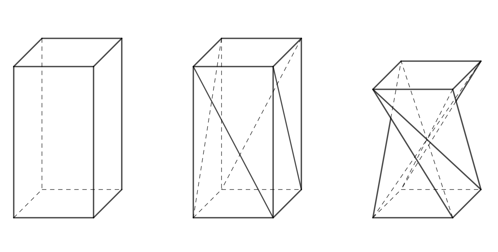

---
keywords:
- Teorema de Pitágoras
- estereometría 
- trigonometría, prisma truncado
is_finished: True
---

# Prisma truncado

## Cómo crear un prisma truncado a partir de un prisma cuadrangular perpendicular

En el diseño de muebles aparece una forma que es interesante también desde el punto de vista geométrico. 
Se puede crear a partir de un prisma cuadrangular regular dividiendo 
cada pared lateral en dos triángulos mediante una de las diagonales 
y girando la base superior $90^\circ$, tal y como se muestra en la Figura 1. 
Al mantener las longitudes de los bordes y las diagonales, se produce un cambio en la altura del prisma. 
La forma resultante es un caso especial del llamado *prisma retorcido* (en inglés, twisted prism).

 

Intentemos crear esta forma, por ejemplo, con una caja de jarabe infantil o de gotas para los ojos.
Para que todo funcione, es necesario que las tapas de la caja (la base superior e inferior del prisma) sean cuadradas 
y se puedan abrir o desmontar de alguna manera. 
Para crear un prisma deformado se necesita un poco de práctica y habilidad, 
ya que el giro de $90^\circ$ no se puede realizar tan fácilmente en la práctica.

Podemos utilizar el siguiente procedimiento.

* Abrimos las tapas de la caja y la colocamos en posición horizontal (dos paredes laterales arriba, dos paredes laterales abajo).
* Dividimos todas las paredes laterales con diagonales en una dirección, tal y como se muestra en la imagen. Intentamos crear marcas en el papel para poder doblarlo.
* Doblaremos ligeramente hacia dentro todas las diagonales resultantes.
* Realizaremos un cruce. Sujetaremos ligeramente la parte inferior con una mano,
cogeremos la parte superior, la levantaremos y la moveremos hacia la izquierda.
* Ahora desplegaremos la caja desde la superficie plana. Este paso requiere un poco de práctica.
Podemos hacerlo presionando la caja con dos dedos en el lugar donde se encuentran todas las diagonales marcadas una encima de otra.
Al mismo tiempo, intentamos desplegar la parte superior o inferior de la caja en el espacio con la otra mano.
* Si ha logrado el paso anterior, solo queda cerrar las tapas de la caja y ya está. ¡Enhorabuena!

   

> **Tarea 1.** Queremos crear una silla con forma de prisma truncado
> y disponemos de varias cajas de cartón adecuadas.
> Estas cajas tienen la misma base cuadrada con una longitud de lado de $40\,\text{cm}$, pero diferentes alturas.
> Para sentarnos, hemos comprobado que nos conviene una altura de silla de $50\,\text{cm}$.
> ¿Qué altura de caja es ideal para fabricar una silla con
> forma de prisma truncado cuadrangular con una altura de $50\,\text{cm}$?
> La longitud del borde de la base es $a=40\,\text{cm}$.

\iffalse

*Solución.* El borde lateral original del prisma con longitud $v$, 
altura de la silla $h$ y borde de la base inferior $a$ forman un triángulo rectángulo. 
La arista $a$ es la proyección perpendicular de la arista $v$ en el plano de la base inferior (véase la ilustración). 

Según el teorema de Pitágoras, se cumple lo siguiente: 

$$
v = \sqrt{h^2 + a^2} = \sqrt{50^2 + 40^2} \doteq 64\,\text{cm}. 
$$ 

Lo ideal es que la caja de cartón tenga una altura aproximada de $64\,\text{cm}$.

\fi

## Otras variantes de prismas truncados

¿Se podría crear una forma similar a partir de prismas perpendiculares, 
cuya base fuera otro polígono regular de $n$ lados? 
La respuesta es sí. Sin embargo, el procedimiento descrito anteriormente (para crear un prisma truncado con papel) solo se puede aplicar para $n$ par.

En la siguiente tarea nos ocuparemos de la creación de un prisma hexagonal truncado.
Primero, piensa en cuántos grados gira la base superior en este caso. 
Si tu imaginación espacial falla, crea un modelo. 
Para simplificar, basta con trabajar con la red de la cubierta del prisma. 
En la imagen de abajo, la red ya está lista para pegar (lo ideal es usar papel más duro).

Antes de pegar, haga pliegues en los bordes y las diagonales. 
En los bordes hacia arriba, en las diagonales hacia abajo. 
Después de pegar, siga las instrucciones de la imagen.

> **Tarea 2.** ¿Cómo depende la altura $h$ el prisma hexagonal truncado
> (que se forma a partir de un prisma hexagonal regular) de la altura del prisma 
> original $v$ y de la longitud del borde de la base inferior $a$?

\iffalse

*Solución.* Para realizar el cálculo, es necesario conocer el ángulo en el que una base
gira con respecto a la otra. Este se puede determinar a partir del modelo descrito anteriormente.
La siguiente imagen tridimensional revela el ángulo de rotación.

Si alguien encuentra confusa la imagen tridimensional, 
puede imaginarse cómo se ve el cuerpo desde arriba.
Ahora consideraremos la base superior como transparente. 
Las segmentos que eran diagonales en las paredes del prisma original, 
se cruzan en un punto y, al mirarlas desde arriba, dividen el hexágono 
$A'B'C'D'E'F'$ en seis triángulos equiláteros. 
Nos centraremos en el segmento $A'B$, que era la diagonal de la cara $ABB'A'$. 

Para que este segmento pase por el centro, 
debe ser $A'=E$, ya que el punto $E$ está frente al punto $B$. 
Completaremos los demás vértices gradualmente por orden alfabético en la misma dirección 
en que están marcados los puntos en la base inferior, es decir, en sentido antihorario.

Ahora está claro que la base superior ha girado $120^\circ$ con respecto a la base inferior.
Gracias a ello, sabemos que la arista $BB'$ se encuentra sobre la arista $BF$ 
y que el segmento $BF$ es la proyección perpendicular del segmento $BB'$.

La longitud de la arista $BB'$ es $v$, la longitud $BF$ la señalamos $v_1$. 
La altura del cuerpo $h$ es igual a la longitud del segmento $B'F$.
Los puntos $F$, $B$ y $B'$ forman un triángulo rectángulo. 
Mediante el teorema de Pitágoras obtenemos la relación para la altura

$$
h = \sqrt{v^2 - v_1^2}.
$$

Queda por determinar $v_1$. Para ello utilizaremos el triángulo $ABF$. 

Podemos proceder de nuevo utilizando el teorema de Pitágoras. Para crear
un triángulo rectángulo, basta con trazar la altura desde el punto $A$ hasta el lado $AF$.
Designaremos el vértice de esta altura como $P$. La longitud de esta altura es $\frac a2$, 
ya que el triángulo $ABP$ es la mitad de un triángulo equilátero con lado $a$. 
Se cumple que

$$
\frac{v_1}{2} = \sqrt{a^2 - \left(\frac{a}{2}\right)^2} = \sqrt{\frac{3}{4}a^2} = \frac{a}{2}\sqrt{3}
$$

y desde ahí

$$
v_1 = a\sqrt{3}.
$$

Ahora podemos sustituir esta expresión en la relación para   $h$. De este modo obtenemos

$$
h = \sqrt{v^2 - (a\sqrt{3})^2} = \sqrt{v^2 - 3a^2},
$$

que es la expresión buscada de la altura del prisma hexagonal truncado mediante $v$ y $a$.

\fi

> **Tarea 3.** ¿Cuál es la condición límite para la creación de modelos a partir de las dos tareas anteriores?

\iffalse

*Solución.* En la Tarea 1, $v$ debe ser mayor que $a$. Si se cumpliera la igualdad $v=a$, 
entonces, en el triángulo rectángulo, la hipotenusa tendría la misma longitud que el cateto 
y el cateto restante tendría longitud cero.
Por lo tanto, la altura del prisma deformado sería nula y el prisma se plegaría en un plano. 
Las diagonales del prisma original seguirían intersectándose en un punto.

En la Tarea 2, se aplicaría de forma similar $v > |AE|$, es decir, $v > \sqrt{3}a$. 
Para $v=\sqrt{3}a$ el prisma deformado volvería a tener una altura nula y se reduciría a un plano.

\fi

## Procedimiento para $n$ impar

Ya se ha mencionado que para los valores impares de $n$ no se puede proceder como se ha indicado anteriormente.
Sin embargo, la única diferencia es que, tras crear la red de la cubierta, no es conveniente
pegar la unión del borde lateral antes de crear la forma deseada. 
Primero modificamos la red para darle la forma de un prisma truncado y solo entonces pegamos el borde lateral.

## Procedimiento para otro ángulo de giro

¿Qué pasaría si quisiéramos crear una forma similar a la del primer ejemplo, 
pero utilizarla como jarrón para flores secas o como portalápices?
En ese caso, no nos conviene que los cuatro bordes del prisma deformado (las antiguas
diagonales de las caras del prisma cuadrangular regular) se crucen en el centro del prisma. 
Queremos que se cree un espacio libre en el interior. 
Por lo tanto, necesitamos reducir el ángulo de rotación de una base con respecto a la otra.

> **Tarea 4.** Construye la red de una vasija con forma de prisma truncado, si se da la altura de la vasija $h=110\,\text{mm}$,
> la longitud de la arista de la base cuadrada $a=65\,\text{mm}$ y el ángulo de rotación de la arista superior de la vasija con respecto a la base inferior es $\alpha=45^\circ$.
> Esta vez, resuelve la tarea de forma constructiva, es decir, utilizando una regla y un compás.

*Ayuda.* En la imagen de la izquierda se muestra una vista desde arriba de la base inferior y de la base superior girada $45^\circ$. 
A la derecha se muestran también todos los bordes del objeto resultante. 
No es necesario dibujar todos los bordes, para la construcción son importantes las líneas $AA'$ y $BA'$. 
También hay que tener en cuenta que, al mirar desde arriba, para la proyección perpendicular $A_1$ del punto $A'$ en el plano de la base inferior, se cumple que $A_1=A'$. 

Además, sabemos que la altura del jarrón es de $110\,\text{mm}$, por lo que $|AA_1|=110\,\text{mm}$.
A partir del triángulo rectángulo $A_1AA'$ podemos determinar la longitud real del lado $AA'$.
De forma similar, podemos determinar la longitud del lado $BA'$ mediante la construcción del triángulo rectángulo $A_1BA'$.
Entonces, conocemos todas las longitudes de los lados necesarias para dibujar la red del jarrón.

