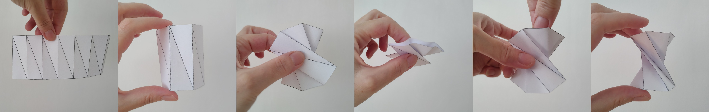
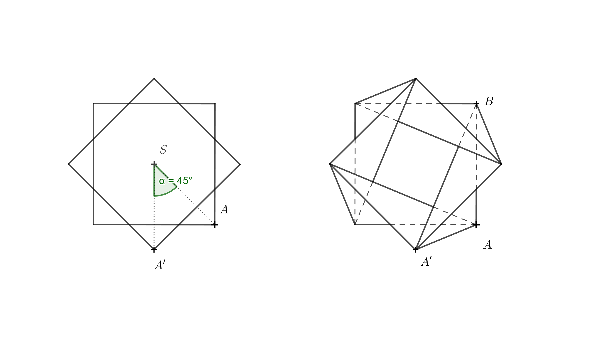

---
keywords:
 - Pythagorean Theorem
 - Solid Geometry
 - Trigonometry
 - Twisted Prism
is_finished: False
---

### Instructions for translators

1. Open this file on GitHub server. If you see `https://um.mendelu.cz/...` in
   URL, click `View on GitHub` to open this file on github.com.
1. If you see this file on GitHub server, you can edit the content of the file.
   Open the file in an editor. You can use simple editor (pres `e` on GitHub).
   However, an advanced VS Code editor (press `.` on GitHub) is better, since it
   provides preview how the Markdown code renders. Alternatively press pencil
   for simple editor or press triangle next to the pencil to get access to VS
   Code described as `github.dev`. 
1. Fix the keywords in the preamble.
1. Depending on which language version you want to use as a source for your
   translation, delete either English or Czech version below.
1. Translate to your language. Keep Markdown marking and math notation. If you
   use a tool to get first version of the translation, make sure that the markup
   is preserved. 
1. In VS Code you can open the preview in another window by pressing `Ctrl+V`
   and `K`. Keep the preview open as you work, or close using a mouse.
1. Instead of saving, you have to commit and push the changes to the repository.
   Fill the Message under `Source control` (describe your changes, such as
   "Polish translation started") and then press Commit&Push.
1. Make sure that your changes appear in the commit history. In rare cases
   (if you work with simultaneously with someone else) you have to download
   /Pull/ and merge his and yours changes. Usualy Sync (Pull & Push) should
   work.
1. When you finish the translation, change `is_finished: False` in header to `is_finished: True`.

### Instrukce pro překladatele

1. Otevřete tento soubor na serveru GitHub. Pokud máte soubor otevřen na `https://um.mendelu.cz/...`, otevřete jej na serveru github.com.
1. Pokud tento soubor vidíte na serveru GitHub, můžete obsah souboru upravit.
   Otevřete soubor v editoru. Můžete použít jednoduchý editor (stiskněte `e` na GitHubu).
   Lepší je však pokročilý editor VS Code (stikněte `.` na GitHubu), protože poskytuje náhled, jak se kód Markdown interpretuje. Případně stiskněte tužku
   pro jednoduchý editor nebo stiskněte trojúhelníček vedle tužky, abyste získali přístup k editoru VS
   Code popsaný jako `github.dev`. 
1. Opravte klíčová slova v preambuli.
1. V závislosti na tom, kterou jazykovou verzi chcete použít jako zdrojový kód pro svůj
   překladu, odstraňte níže uvedenou anglickou nebo českou verzi.
1. Přeložte do svého jazyka. Ponechte značení Markdown a matematický zápis. Pokud
   použijete nástroj typu DeepL pro získání první verze překladu, ujistěte se, že zápis matematických výrazů
   byl zachován. 
1. Ve VS Code můžete náhled otevřít v jiném okně stisknutím `Ctrl+V`.
   a `K`. Během práce nechte náhled otevřený nebo jej zavřete pomocí myši.
1. Místo uložení musíte změny zaregistrovat a odeslat do úložiště.
   Vyplňte zprávu v poli `Zpráva` (popište své změny, např.
   "Zahájen překlad do polštiny") a poté stiskněte tlačítko Commit&Push.
1. Ujistěte se, že se vaše změny objeví v historii revizí. Ve výjimečných případech
   (pokud pracujete současně s někým jiným) musíte stáhnout
   /Pull/ a sloučit jeho a vaše změny. Obvykle by synchronizace (Pull & Push) měla
   fungovat.
1. Po dokončení překladu změňte `is_finished: False` v záhlaví na `is_finished: True`.

---
---

### Czech source

# Zborcený hranol

## Jak vytvořit zborcený hranol z kolmého čtyřbokého hranolu

V designu nábytku se objevuje tvar, který je zajímavý i z geometrického hlediska. 
Lze ho vytvořit z pravidelného čtyřbokého hranolu rozdělením 
každé boční stěny na dva trojúhelníky pomocí jedné z úhlopříček 
a pootočením horní podstavy o $90^\circ$ tak, jak je to znázorněno na Obrázku 1. 
Při zachování délek hran a úhlopříček současně dochází ke změně výšky hranolu. 
Výsledný tvar je speciálním případem tzv. *zborceného hranolu* (v angličtině twisted prism).

 

Zkusme si tento tvar vytvořit třeba z krabičky od dětského sirupu nebo očních kapek.
Aby vše fungovalo je nutné, aby víčka krabičky (horní a dolní podstava hranolu) byla čtvercová 
a daly se nějakým způsobem odklopit nebo rozložit. 
K vytvoření zborceného hranolu je třeba trochu praxe a zručnosti, 
protože ono pootočení o $90^\circ$ nelze provést v praxi tak jednoduše.

Můžeme použít následující postup.

* Odklopíme víčka krabičky a krabičku složíme do roviny (dvě boční stěny nahoře, dvě boční stěny dole).
* Všechny boční stěny rozdělíme úhlopříčkami v jednom směru tak, jak je to na obrázku. Snažíme se v papíru vytvořit rýhy, v nichž půjde papír přehnout.
* Všechny vzniklé úhlopříčky prolomíme mírně směrem dovnitř.
* Provedeme překřížení. Spodní část přidržíme lehce jednou rukou,
vrchní část vezmeme, nadzvedneme a přesuneme směrem doleva.
* Nyní z roviny rozložíme krabičku do prostoru. Tento krok chce trochu cviku.
Můžeme to udělat tak, že v místě, kde leží všechny označené úhlopříčky nad sebou, přitlačíme krabičku dvěma prsty proti sobě.
Současně se snažíme druhou rukou rozložit horní nebo dolní část krabičky do prostoru.
* Pokud se vám předchozí krok podařil, zbývá už jen zavřít víčka krabičky a máte hotovo. Gratuluji!

   

> **Úloha 1.** Chceme vytvořit stoličku ve tvaru zborceného hranolu
> a máme k dispozici několik vhodných kartonových krabic.
> Tyto krabice mají stejné čtvercové podstavy o délce hrany $40\,\text{cm}$, ale různé výšky.
> Pro sezení máme odzkoušené, že nám vyhovuje výška stoličky $50\,\text{cm}$.
> Jaká výška krabice je ideální pro výrobu stoličky ve
> tvaru čtyřbokého zborceného hranolu o výšce $50\,\text{cm}$?
> Délka hrany podstavy je $a=40\,\text{cm}$.

\iffalse

*Řešení.* Původní boční hrana hranolu o délce $v$, 
výška židličky $h$ a hrana dolní podstavy $a$ tvoří pravoúhlý trojúhelník. 
Hrana $a$ je kolmým průmětem hrany $v$ do roviny dolní podstavy (viz obrázek). 

Podle Pythagorovy věty tedy platí 

$$
v = \sqrt{h^2 + a^2} = \sqrt{50^2 + 40^2} \doteq 64\,\text{cm}. 
$$ 

Kartonová krabice by v ideálním případě měla být vysoká přibližně $64\,\text{cm}$.

\fi

## Další varianty zborcených hranolů

Šlo by obdobný tvar vytvořit i z kolmých hranolů, 
jejichž podstava by byl jiný pravidelný $n$-úhelník? 
Odpověď zní ano. Postup uvedený výše (pro tvorbu zborceného hranolu z papíru) je však možné aplikovat pouze pro sudá $n$.

V následující úloze se budeme zabývat tvorbou šestibokého zborceného hranolu.
Rozmyslete si nejdříve, o kolik stupňů se tomto případě horní podstava pootočí. 
Pokud prostorová představivost selhává, vytvořte si model. 
Pro jednoduchost stačí pracovat se sítí pláště hranolu. 
Na obrázku níže je taková síť již připravená ke slepení (ideální je tvrdší papír).

Před slepením vytvořte ohyby v hranách a úhlopříčkách. 
Ve hranách směrem nahoru, v úhlopříčkách směrem dolů. 
Po slepení postupujte podle obrázku.

> **Úloha 2.** Jak závisí výška $h$ šestibokého zborceného hranolu
> (který vznikne z pravidelného šestibokého hranolu) na výšce původního
> hranolu $v$ a na délce hrany dolní podstavy $a$?

\iffalse

*Řešení.* K výpočtu je třeba znát úhel o který se jedna podstava
pootočí vzhledem k druhé. Ten lze určit z modelu popsaného výše.
Následující prostorový obrázek úhel rotace prozrazuje.

Pokud je pro někoho trojrozměrný obrázek nepřehledný, 
může si představit, jak těleso vypadá při pohledu shora.
Horní podstavu budeme brát nyní jako průhlednou. 
Úsečky, které byly úhlopříčkami ve stěnách původního hranolu, 
se protínají v jednom bodě a při pohledu shora dělí šestiúhelník 
$A'B'C'D'E'F'$ na šest rovnostranných trojúhelníků. 
Zaměříme se na úsečku $A'B$, která byla úhlopříčkou ve stěně $ABB'A'$. 

Aby tato úsečka procházela středem, 
musí být $A'=E$, protože bod $E$ je naproti bodu $B$. 
Ostatní vrcholy doplníme postupně podle abecedy ve stejném směru, 
v jakém jsou body označeny v dolní podstavě, tj. proti směru hodinových ručiček.

Nyní je už jasné, že se horní podstava pootočila vzhledem ke spodní podstavě o $120^\circ$.
Díky tomu víme, že hrana $BB'$ leží nad hranou $BF$ 
a úsečka $BF$ je kolmým průmětem úsečky $BB'$.

Délka hrany $BB'$ je $v$, délku $BF$ označme $v_1$. 
Výška tělesa $h$ je rovna délce úsečky $B'F$.
Body $F$, $B$ a $B'$ tvoří pravoúhlý trojúhelník. 
Pomocí Pythagorovy věty dostáváme pro výšku vztah

$$
h = \sqrt{v^2 - v_1^2}.
$$

Zbývá určit $v_1$. K tomu použijeme trojúhelník $ABF$. 

Postupovat můžeme opět pomocí Pythagorovy věty. K vytvoření
pravoúhlého trojúhelníka stačí bodem $A$ vést výšku na stranu $AF$.
Patu této výšky označíme $P$. Délka této výšky je $\frac a2$, 
protože trojúhelník $ABP$ je polovina rovnostranného trojúhelníku o straně $a$. 
Platí

$$
\frac{v_1}{2} = \sqrt{a^2 - \left(\frac{a}{2}\right)^2} = \sqrt{\frac{3}{4}a^2} = \frac{a}{2}\sqrt{3}
$$

a odtud

$$
v_1 = a\sqrt{3}.
$$

Toto vyjádření nyní můžeme dosadit do vztahu pro  $h$. Tím dostáváme

$$
h = \sqrt{v^2 - (a\sqrt{3})^2} = \sqrt{v^2 - 3a^2},
$$

což je hledané vyjádření výšky šestibokého zborceného hranolu pomocí $v$ a $a$.

\fi

> **Úloha 3.** Jaká je omezující podmínka pro vznik modelů z předchozích dvou úloh?

\iffalse

*Řešení.* V Úloze 1 musí být $v$ větší než $a$. Pokud by platila rovnost $v=a$, 
potom by v pravoúhlém trojúhelníku byla přepona stejně dlouhá jako odvěsna 
a zbylá odvěsna by měla nulovou délku.
Výška zborceného hranolu by tedy byla nulová a hranol by se složil do roviny. 
Úhlopříčky původního hranolu by se stále protínaly v jednom bodě.

V Úloze 2 by obdobně muselo platit $v > |AE|$, tedy $v > \sqrt{3}a$. 
Pro $v=\sqrt{3}a$ by zborcený hranol měl opět nulovou výšku a složil by se do roviny.

## Postup pro liché $n$

Už bylo zmíněno, že pro liché $n$ nelze postupovat tak, jak bylo uvedeno výše.
Rozdíl je ale pouze v tom, že po vytvoření sítě pláště není vhodné
lepit spoj v boční hraně předtím než vytvoříme požadovaný tvar. 
Nejdříve síť upravíme do tvaru zborceného hranolu a teprve poté slepíme boční hranu.

## Postup pro jiný úhel otočení

Co kdybychom chtěli vyrobit tvar podobný tomu z prvního příkladu, 
ale použít ho jako vázičku na suché květiny nebo stojan na tužky?
Nevyhovuje nám v tom případě, že se 4 hrany zborceného hranolu (bývalé
úhlopříčky stěn pravidelného čtyřbokého hranolu) uprostřed hranolu protínají. 
Chceme, aby uvnitř vznikl volný prostor. 
Proto potřebujeme zmenšit úhel rotace jedné podstavy vzhledem k druhé.

\fi

> **Úloha 4.** Sestrojte síť vázy tvaru zborceného hranolu, jestliže je dána výška vázy $h=110\,\text{mm}$,
> délka hrany čtvercové podstavy $a=65\,\text{mm}$ a úhel rotace horní hrany vázy oproti dolní podstavě je $\alpha=45^\circ$.
> Tentokrát úlohu řešte konstrukčně, tedy pomocí pravítka a kružítka.

\iffalse

*Nápověda.* Na obrázku vlevo je pohled shora na dolní podstavu a na horní podstavu pootočenou o $45^\circ$. 
Napravo jsou znázorněny i všechny hrany vzniklého objektu. 
Kreslit všechny hrany není třeba, pro konstrukci je důležitá spojnice $AA'$ a $BA'$. 
Je třeba si také uvědomit, že při pohledu shora pro kolmý průmět $A_1$ bodu $A'$ do roviny dolní podstavy platí $A_1=A'$. 

Ze zadání navíc víme, že výška vázy je $110\,\text{mm}$, tedy $|AA_1|=110\,\text{mm}$.
Z pravoúhlého trojúhelníka $A_1AA'$ můžeme určit skutečnou délku hrany $AA'$.
Obdobně můžeme určit délku hrany $BA'$ pomocí konstrukce pravoúhlého trojúhelníka $A_1BA'$.
Poté známe všechny délky hran potřebné pro narýsování sítě vázy.

\fi

---
---

### English source

# Twisted Prism

## Turning a Right Square Prism into a Twisted Prism

In furniture design, a shape appears that is also of interest from a geometrical point of view. 
It can be created from a right square prism by dividing each lateral face into two triangles using one of 
its diagonals and then rotating the top base by $90^\circ$, as illustrated in Figure 1. 
While preserving the lengths of the edges and diagonals, the height of the prism changes. 
The resulting shape is a special case of a so-called *twisted prism*.

 

Let’s try creating this shape using, for example, a box from children's cough syrup or eye drops. 
For it to work properly, the box’s lids (the top and bottom bases of the prism) must be square 
and able to be opened or unfolded in some way. Creating a twisted prism requires a bit of practice and skill, 
because performing a $90^\circ$ twist is not so easy in reality.

We can use the following procedure:

* Open the box flaps and flatten the box into a single plane, so that two lateral faces are on the top and two on the bottom.
* Divide all lateral faces along diagonals in the same direction, as shown in Figure 2. Try to crease the paper along these lines so that it can be folded later.
* Gently fold each diagonal inward to form ridges.
* Now, make the twist: hold the bottom part of the box lightly with one hand, lift the top part, and move it slightly to the left so that the top base rotates.
* Next, unfold the flattened box into a three-dimensional shape. This step takes a bit of practice. You can do it by pressing the box between two fingers
  at the point where all the marked diagonals overlap, while using your other hand to unfold the top or bottom part of the box into space.
* If you’ve made it this far, all that’s left is to close the box flaps — and you're done. Congratulations!

   

> **Exercise 1.** We want to build a stool in the shape of a twisted prism, and we have several suitable cardboard boxes available.
> These boxes all have square bases with side length $40,\text{cm}$, but their heights vary.
> From experience, we know that a stool height of $50,\text{cm}$ is comfortable for sitting.
> What box height is ideal for making a twisted rectangular prism stool with a vertical height of $50,\text{cm}$?
> The side length of the base is $a = 40,\text{cm}$.

*Solution.* The original side edge of the prism with length $v$, the desired stool height $h$, and the base edge $a$ form a right triangle.
The edge $a$ is the orthogonal projection of the edge $v$ onto the plane of the base (see Figure 3).

According to the Pythagorean Theorem, we get:

$$
v = \sqrt{h^2 + a^2} = \sqrt{50^2 + 40^2} \doteq 64\,\text{cm}. 
$$ 

Ideally, the cardboard box should be approximately $64,\text{cm}$ tall.

## Other Variants of Twisted Prisms

Could a similar shape be created from right prisms whose base is a different regular $n$-gon?

The answer is yes. However, the construction method described above (for creating a twisted prism from paper) can only be applied when $n$ is even.

In the following problem, we will focus on constructing a hexagonal twisted prism.
First, try to figure out by how many degrees the top base is rotated in this case.
If your spatial imagination fails you, build a model.
To keep things simple, you can work with a net of the prism’s lateral surface.
In Figure 4 below, such a net is already prepared for assembly (thicker paper works best).

Before gluing, make folds along the edges and diagonals — fold the edges upward and the diagonals downward.
After gluing, follow the instructions shown in Figure 5.

> **Exercise 2.** How does the height $h$ of a twisted hexagonal prism (created from a regular hexagonal prism) 
> depend on the original prism height $v$ and the side length $a$ of the base?

*Solution.* To calculate this, we need to know the angle by which one base is rotated relative to the other.
This angle can be determined from the model described above.
The following 3D diagram reveals the rotation angle.

If the 3D diagram is unclear, you can try to imagine what the solid looks like when viewed from above.
We will now treat the top base as transparent. The segments that were diagonals in the faces of the original 
prism intersect at a single point and, when viewed from above, divide the hexagon $A'B'C'D'E'F'$ into six equilateral triangles.
Let us focus on the line segment $A'B$, which was the diagonal in the face $ABB'A'$.

For the segment to pass through the center, point $A'$ must coincide with point $E$, because point $E$ lies opposite point $B$.
We complete the remaining vertices in alphabetical order, following the same direction used in the bottom base — that is, counterclockwise.

It is now clear that the top base has been rotated by $120^\circ$ relative to the bottom base.
Because of this, the edge $BB'$ lies directly above the edge $BF$, and the line segment $BF$ is the orthogonal projection of $BB'$.

The length of edge $BB'$ is $v$, and we denote the length of $BF$ as $v_1$.
The height of the solid, $h$, is equal to the length of the line segment $B'F$.
Points $F$, $B$, and $B'$ form a right triangle.
Using the Pythagorean Theorem, we obtain the following expression of the height:

$$
h = \sqrt{v^2 - v_1^2}.
$$

To find $v_1$, we use triangle $ABF$.

We can again use the Pythagorean Theorem.
To create a right triangle, we draw a perpendicular from point $A$ to the side $AF$.
Let us denote the foot of this perpendicular as point $P$.
The length of this height is $\frac a2$, because triangle $ABP$ is one half of an equilateral triangle with side length $a$.
We have:

$$
\frac{v_1}{2} = \sqrt{a^2 - \left(\frac{a}{2}\right)^2} = \sqrt{\frac{3}{4}a^2} = \frac{a}{2}\sqrt{3}
$$

and therefore

$$
v_1 = a\sqrt{3}.
$$

We can now substitute this expression into the formula for $h$, obtaining

$$
h = \sqrt{v^2 - (a\sqrt{3})^2} = \sqrt{v^2 - 3a^2},
$$

which is the desired expression for the height of the twisted hexagonal prism in terms of $v$ and $a$.

> **Exercise 3.** What is the limiting condition for constructing the models in the previous two exercises?

*Solution.* In Exercise 1, we must have $v$ greater than $a$.
If $v = a$, the hypotenuse of the right triangle would be the same length as one of the legs, and the other leg would have zero length.
The height of the twisted prism would therefore be zero, and the prism would collapse into a flat shape.
The diagonals of the original prism would still intersect at a single point.

Similarly, in Exercise 2, we must have $v > |AE|$, that is, $v > \sqrt{3}a$.
If $v = \sqrt{3}a$, the twisted prism would again have zero height and would collapse into a flat shape.

## Technique For Odd Values of $n$

It was already mentioned that the construction method described above does not work in the same way for odd values of $n$.
However, the only difference is that once the net of the prism's lateral surface is prepared, it is not a good idea to glue the side edge before shaping the prism.
Instead, first fold the net into the shape of a twisted prism, and only then glue the side edge.

## Technique For Using a Different Rotation Angle

What if we wanted to make a shape similar to the one in the first example,
but use it as a small vase for dried flowers or a pencil holder?
In that case, we don’t want the four edges of the twisted prism (formerly diagonals in the 
faces of the regular rectangular prism) to intersect in the middle — we want empty space inside.
To achieve that, we need to reduce the rotation angle between the two bases.

> **Exercise 4.** Construct a net of a vase in the shape of a twisted prism, given that the height
> of the vase is $h = 110,\text{mm}$, the side length of the square base is $a = 65,\text{mm}$,
> and the top base is rotated by $\alpha = 45^\circ$ relative to the bottom base.
> This time, solve the problem constructively, using only a ruler and a compass.

*Hint.* The left diagram shows a top view of the bottom base and the top base rotated by $45^\circ$.
On the right, all edges of the resulting solid are also shown.
You do not need to draw all of them — for the construction, the line segments $AA'$ and $BA'$ are the most important.
It is also important to realize that in the top view, the orthogonal projection $A_1$ of point $A'$ onto the plane of the bottom base satisfies $A_1 = A'$.

From the problem statement, we know that the height of the vase is $110,\text{mm}$, so $|AA_1| = 110,\text{mm}$.
Using the right triangle $A_1AA'$, we can determine the true length of edge $AA'$.
Similarly, we can determine the length of edge $BA'$ by constructing the right triangle $A_1BA'$.
With this information, we know all the necessary edge lengths to draw the net of the vase.

