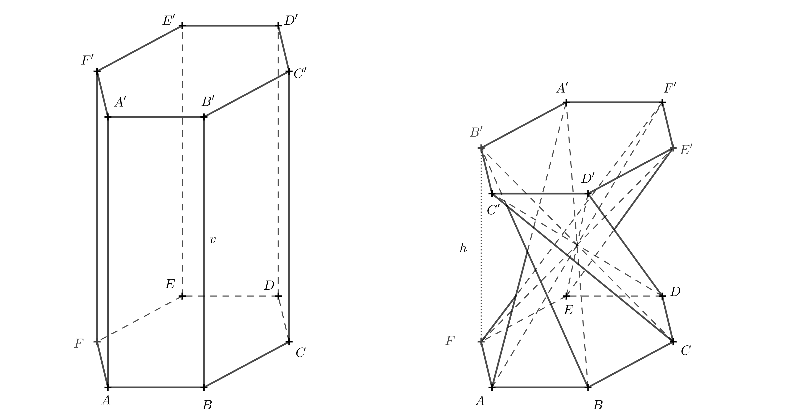
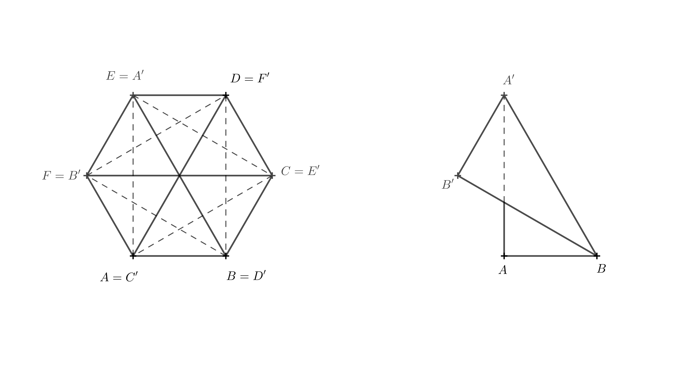
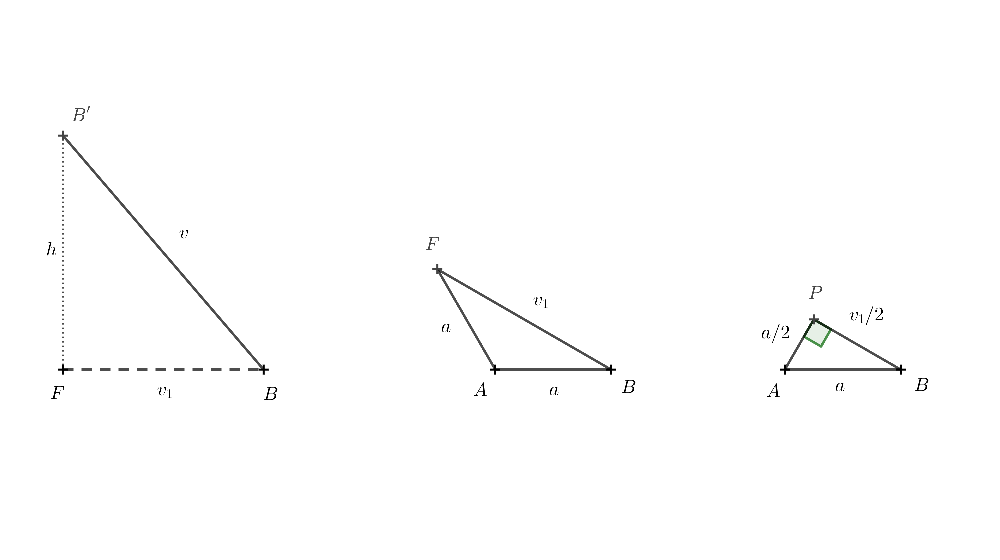

# Skręcony graniastosłup

## Przekształcenie prostokątnego graniastosłupa w skręcony graniastosłup

W projektowaniu mebli pojawia się kształt, który jest również interesujący z geometrycznego punktu widzenia. 
Można go uzyskać z prostokątnego graniastosłupa, dzieląc każdą ścianę boczną na dwa trójkąty za pomocą jednej z 
jej przekątnych, a następnie obracając górną podstawę o $90^\circ$, jak pokazano na rysunku 1. 
Przy zachowaniu długości krawędzi i przekątnych zmienia się wysokość graniastosłupa. 
Otrzymany kształt jest szczególnym przypadkiem tzw. *skręconego graniastosłupa*.

 

Spróbujmy stworzyć ten kształt, używając na przykład pudełka po syropie na kaszel lub kroplach do oczu dla dzieci. 
Aby wszystko działało prawidłowo, pokrywy pudełka (górna i dolna podstawa graniastosłupa) muszą być kwadratowe 
i można je w jakiś sposób otworzyć lub rozłożyć. Stworzenie skręconego graniastosłupa wymaga trochę praktyki i umiejętności, 
ponieważ wykonanie skrętu o 90^\circ nie jest w rzeczywistości takie proste.

Możemy skorzystać z następującej procedury:

* Otwórz klapki pudełka i spłaszcz je do jednej płaszczyzny, tak aby dwie boczne ścianki znalazły się na górze, a dwie na dole.
* Podziel wszystkie boczne ścianki wzdłuż przekątnych w tym samym kierunku, jak pokazano na rysunku 2. Spróbuj zagiąć papier wzdłuż tych linii, aby można go było później złożyć.
* Delikatnie zagnij każdą przekątną do wewnątrz, tworząc grzbiety.
* Teraz wykonaj skręt: jedną ręką delikatnie przytrzymaj dolną część pudełka, unieś górną część i przesuń ją lekko w lewo, tak aby górna podstawa obróciła się.
* Następnie rozłóż spłaszczone pudełko, nadając mu trójwymiarowy kształt. Ten krok wymaga nieco praktyki. Możesz to zrobić, ściskając pudełko między dwoma palcami
  w miejscu, gdzie wszystkie zaznaczone przekątne się pokrywają, a drugą ręką rozkładając górną lub dolną część pudełka w przestrzeni.
* Jeśli dotarłeś do tego miejsca, pozostaje tylko zamknąć klapki pudełka — i gotowe. Gratulacje!

   
> **Ćwiczenie 1.** Chcemy zbudować stołek w kształcie skręconego graniastosłupa i mamy do dyspozycji kilka odpowiednich kartonowych pudełek.
> Wszystkie te pudełka mają kwadratowe podstawy o długości boku $40,\text{cm}$, ale różnią się wysokością.
> Z doświadczenia wiemy, że stołek o wysokości $50,\text{cm}$ jest wygodny do siedzenia.
> Jaka wysokość pudełka jest idealna do wykonania stołka w kształcie skręconego prostopadłościanu o wysokości pionowej 50 cm?
> Długość boku podstawy wynosi a = 40 cm.

*Rozwiązanie.* Pierwotna krawędź boczna graniastosłupa o długości v, pożądana wysokość stołka h oraz krawędź podstawy a tworzą trójkąt prostokątny.
Krawędź $a$ jest rzutem prostokątnym krawędzi $v$ na płaszczyznę podstawy (patrz rysunek 3).

Zgodnie z twierdzeniem Pitagorasa otrzymujemy:

$$
v = \sqrt{h^2 + a^2} = \sqrt{50^2 + 40^2} \doteq 64\,\text{cm}. 
$$ 

Idealnie, kartonowe pudełko powinno mieć około 64 cm wysokości.

## Inne warianty skręconych graniastosłupów

Czy podobny kształt można uzyskać z prostych graniastosłupów, których podstawą jest inny regularny wielokąt o n bokach?

Odpowiedź brzmi: tak. Jednak opisana powyżej metoda konstrukcji (tworzenia skręconego graniastosłupa z papieru) może być zastosowana tylko wtedy, gdy n jest liczbą parzystą.
W poniższym zadaniu skupimy się na skonstruowaniu sześciokątnego pryzmatu skręconego.
Najpierw spróbuj ustalić, o ile stopni obrócona jest w tym przypadku górna podstawa.
Jeśli nie masz wystarczającej wyobraźni przestrzennej, zbuduj model.
Aby uprościć zadanie, możesz pracować z siatką powierzchni bocznej pryzmatu.
Na rysunku 4 poniżej taka siatka jest już przygotowana do złożenia (najlepiej sprawdzi się grubszy papier).

Przed sklejeniem należy wykonać zagięcia wzdłuż krawędzi i przekątnych — zagięcia krawędzi należy wykonać w górę, a przekątnych w dół.
Po sklejeniu należy postępować zgodnie z instrukcjami przedstawionymi na rysunku 5.

> **Ćwiczenie 2.** W jaki sposób wysokość $h$ skręconego sześciokątnego graniastosłupa (utworzonego z regularnego sześciokątnego graniastosłupa) 
> zależy od pierwotnej wysokości graniastosłupa $v$ i długości boku $a$ podstawy?

*Rozwiązanie.* Aby to obliczyć, musimy znać kąt, o który jedna podstawa jest obrócona względem drugiej.
Kąt ten można określić na podstawie opisanego powyżej modelu.
Poniższy diagram 3D pokazuje kąt obrotu.

Jeśli diagram 3D jest niejasny, możesz spróbować wyobrazić sobie, jak wygląda bryła widziana z góry.
Teraz potraktujemy górną podstawę jako przezroczystą. Odcinki, które były przekątnymi w ścianach pierwotnego 
pryzmatu, przecinają się w jednym punkcie i, patrząc z góry, dzielą sześciokąt $A'B'C'D'E'F'$ na sześć trójkątów równobocznych.
Skupmy się na odcinku $A'B$, który był przekątną w ścianie $ABB'A'$.

Aby odcinek przechodził przez środek, punkt $A'$ musi pokrywać się z punktem $E$, ponieważ punkt $E$ leży naprzeciwko punktu $B$.
Pozostałe wierzchołki uzupełniamy w porządku alfabetycznym, zgodnie z kierunkiem zastosowanym w dolnej podstawie — czyli przeciwnie do ruchu wskazówek zegara.

Teraz jest jasne, że górna podstawa została obrócona o $120^\circ$ względem dolnej podstawy.
Z tego powodu krawędź $BB'$ leży bezpośrednio nad krawędzią $BF$, a odcinek $BF$ jest rzutem prostokątnym $BB'$.

Długość krawędzi $BB'$ wynosi $v$, a długość $BF$ oznaczamy jako $v_1$.
Wysokość bryły, $h$, jest równa długości odcinka $B'F$.
Punkty $F$, $B$ i $B'$ tworzą trójkąt prostokątny.
Wykorzystując twierdzenie Pitagorasa, otrzymujemy następujące wyrażenie wysokości:

$$
h = \sqrt{v^2 - v_1^2}.
$$

Aby znaleźć $v_1$, używamy trójkąta $ABF$.

Ponownie możemy skorzystać z twierdzenia Pitagorasa.
Aby utworzyć trójkąt prostokątny, rysujemy prostopadłą z punktu $A$ do boku $AF$.
Oznaczmy podstawę tej prostopadłej jako punkt $P$.
Długość tej wysokości wynosi $\frac a2$, ponieważ trójkąt $ABP$ jest połową trójkąta równobocznego o długości boku $a$.
Mamy:

$$
\frac{v_1}{2} = \sqrt{a^2 - \left(\frac{a}{2}\right)^2} = \sqrt{\frac{3}{4}a^2} = \frac{a}{2}\sqrt{3}
$$

i dlatego

$$
v_1 = a\sqrt{3}.
$$

Teraz możemy podstawić to wyrażenie do wzoru na $h$, otrzymując

$$
h = \sqrt{v^2 - (a\sqrt{3})^2} = \sqrt{v^2 - 3a^2},
$$

co jest pożądanym wyrażeniem wysokości skręconego sześciokątnego graniastosłupa w kategoriach $v$ i $a$.

> **Ćwiczenie 3.** Jaki jest warunek graniczny dla konstruowania modeli w poprzednich dwóch ćwiczeniach?

*Rozwiązanie.* W ćwiczeniu 1 musimy mieć $v$ większe niż $a$.
Gdyby $v = a$, przeciwprostokątna trójkąta prostokątnego miałaby taką samą długość jak jedno z ramion, a drugie ramię miałoby długość zerową.
Wysokość skręconego graniastosłupa wynosiłaby zatem zero, a graniastosłup zapadłby się, przyjmując płaski kształt.
Przekątne pierwotnego graniastosłupa nadal przecinałyby się w jednym punkcie.

Podobnie, w ćwiczeniu 2 musimy mieć $v > |AE|$, czyli $v > \sqrt{3}a$.
Jeśli $v = \sqrt{3}a$, skręcony graniastosłup ponownie miałby zerową wysokość i zapadłby się, przyjmując płaski kształt.

## Technika dla nieparzystych wartości $n$

Wspomniano już, że opisana powyżej metoda konstrukcji nie działa w ten sam sposób dla nieparzystych wartości $n$.
Jedyną różnicą jest jednak to, że po przygotowaniu siatki bocznej powierzchni graniastosłupa nie należy kleić krawędzi bocznej przed ukształtowaniem graniastosłupa.
Zamiast tego należy najpierw złożyć siatkę w kształt skręconego graniastosłupa, a dopiero potem skleić krawędź boczną.

## Technika stosowania innego kąta obrotu

A co, jeśli chcielibyśmy stworzyć kształt podobny do tego z pierwszego przykładu,
ale wykorzystać go jako mały wazon na suszone kwiaty lub pojemnik na ołówki?
W takim przypadku nie chcemy, aby cztery krawędzie skręconego graniastosłupa (dawniej przekątne w 
ścianach regularnego prostopadłościanu) przecinały się w środku — chcemy uzyskać pustą przestrzeń wewnątrz.
Aby to osiągnąć, musimy zmniejszyć kąt obrotu między dwiema podstawami.
**

> **Ćwiczenie 4.** Skonstruuj rozwinięcie wazonu w kształcie skręconego graniastosłupa, biorąc pod uwagę, że wysokość
> wazonu wynosi $h = 110,\text{mm}$, długość boku kwadratowej podstawy wynosi $a = 65,\text{mm}$,
> a górna podstawa jest obrócona o $\alpha = 45^\circ$ względem dolnej podstawy.
> Tym razem rozwiąż zadanie konstruktywnie, używając wyłącznie linijki i cyrkla.

*Wskazówka.* Lewy rysunek przedstawia widok z góry dolnej podstawy i górnej podstawy obróconej o $45^\circ$.
Po prawej stronie pokazano również wszystkie krawędzie powstałej bryły.
Nie trzeba rysować wszystkich z nich — dla konstrukcji najważniejsze są odcinki $AA'$ i $BA'$.
Ważne jest również, aby zdać sobie sprawę, że w widoku z góry rzut prostokątny $A_1$ punktu $A'$ na płaszczyznę podstawy dolnej spełnia warunek $A_1 = A'$.

Z opisu zadania wiemy, że wysokość wazonu wynosi 110 mm, więc |AA_1| = 110 mm.
Korzystając z trójkąta prostokątnego A_1AA', możemy określić rzeczywistą długość krawędzi AA'.
Podobnie możemy określić długość krawędzi BA', konstruując trójkąt prostokątny A_1BA'.
Dzięki tym informacjom znamy wszystkie długości krawędzi niezbędne do narysowania rozwinięcia wazonu.

