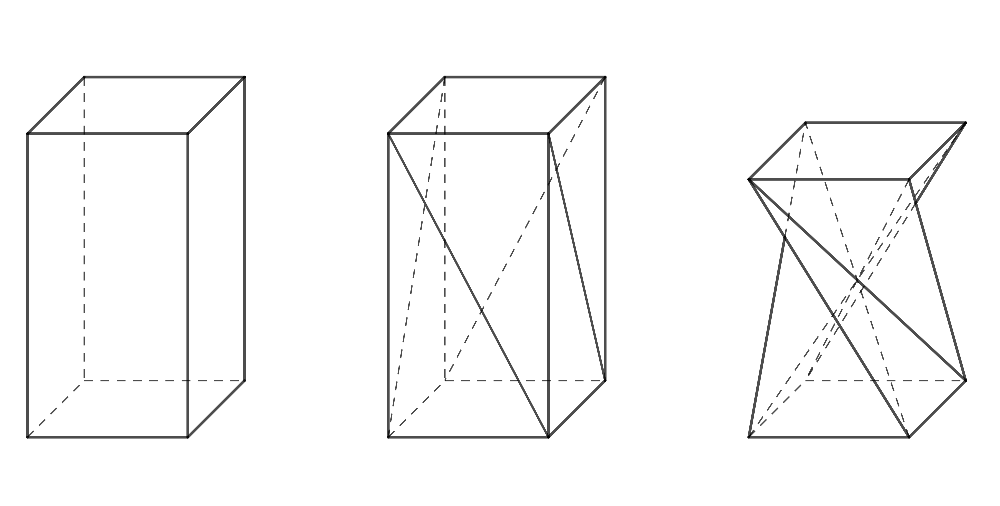
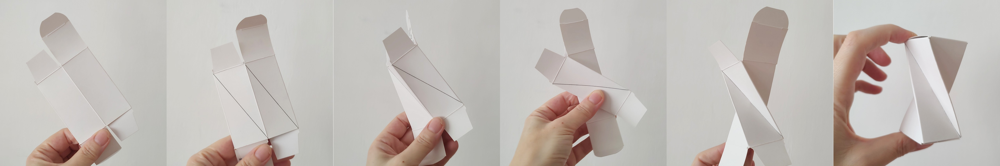
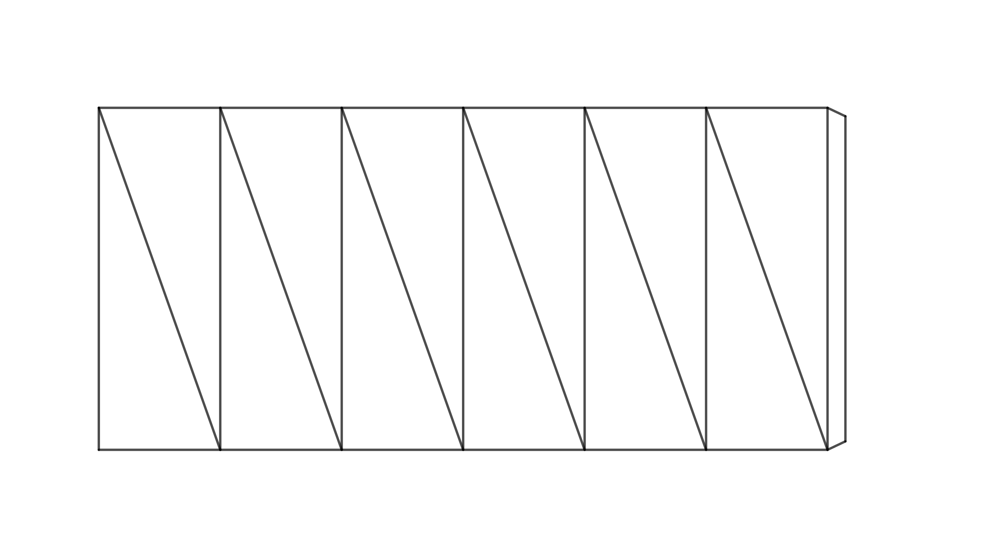
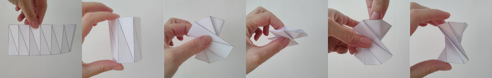
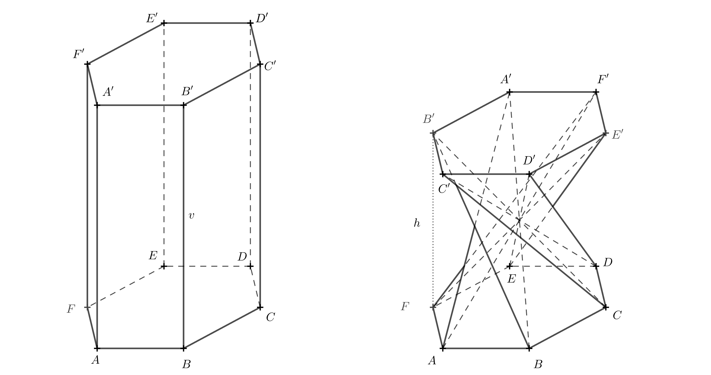
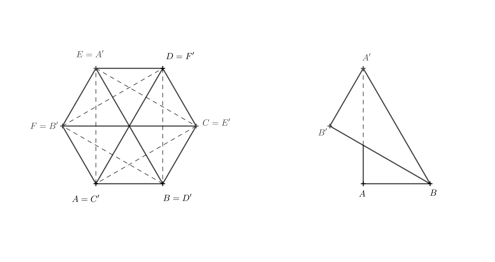
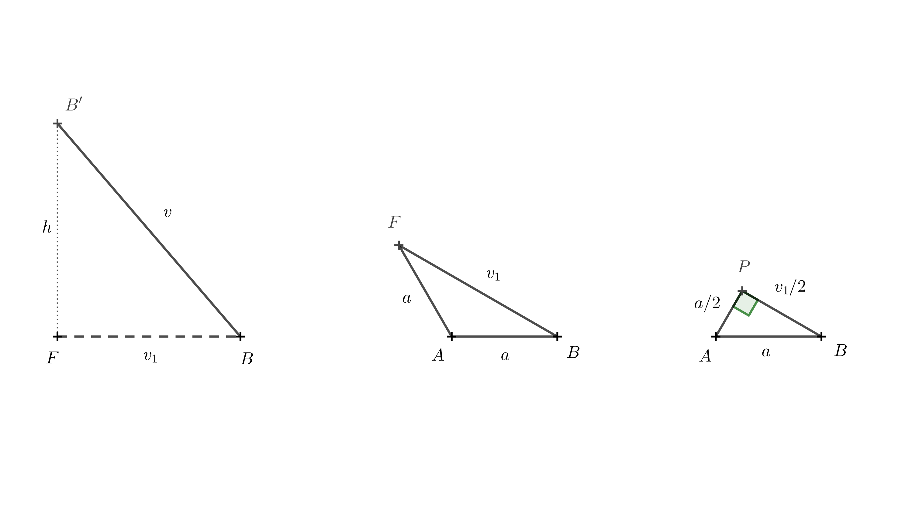
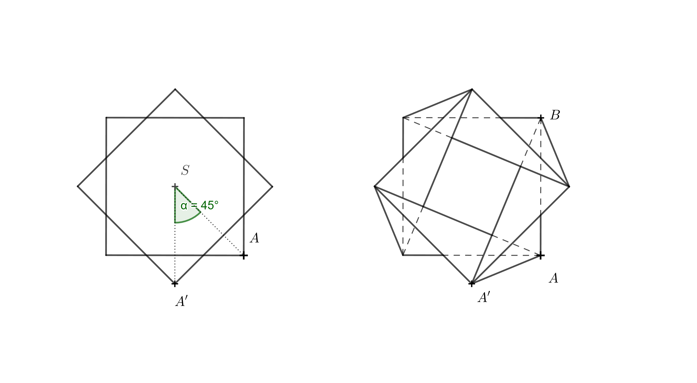

# Skrútený hranol

## Ako vytvoriť skrútený hranol z kolmého štvorbokého hranolu

V dizajne nábytku sa objavuje tvar, ktorý je zaujímavý aj z geometrického hľadiska.
Možno ho vytvoriť z pravidelného štvorbokého hranolu rozdelením
každej bočnej steny na dva trojuholníky pomocou jednej z uhlopriečok
a pootočením hornej podstavy o $90^\circ$ tak, ako je to znázornené na Obrázku 1.
Pri zachovaní dĺžok hrán a uhlopriečok súčasne dochádza k zmene výšky hranolu.
Výsledný tvar je špeciálnym prípadom tzv. *skrúteného hranolu* (v angličtine twisted prism).

 

Skúsme si tento tvar vytvoriť napríklad z krabičky od detského sirupu alebo očných kvapiek.
Aby všetko fungovalo, je nutné, aby viečka krabičky (horná a dolná podstava hranolu) boli štvorcové a dali sa nejakým spôsobom odklopiť alebo rozložiť.
Na zostrojenie skrúteného hranola je potrebná určitá prax a zručnosť, pretože pootočiť podstavu presne o $90^\circ$ voči druhej podstave nie je v praxi jednoduché.

Môžeme použiť nasledujúci postup.

* Odklopíme viečka krabičky a krabičku zložíme do roviny (dve bočné steny navrchu, dve bočné steny dole).
* Všetky bočné steny rozdelíme uhlopriečkami v jednom smere tak, ako je to na obrázku. Snažíme sa v papieri vytvoriť ryhy, v ktorých sa bude papier dať prehnúť.
* Všetky vzniknuté uhlopriečky zlomíme mierne smerom dovnútra.
* Vykonáme prekríženie. Spodnú časť pridržíme ľahko jednou rukou,
vrchnú časť vezmeme, nadvihneme a presunieme smerom doľava.
* Teraz z roviny rozložíme krabičku do priestoru. Tento krok chce trochu cviku. Môžeme to urobiť tak, že v mieste, kde ležia všetky označené uhlopriečky nad sebou, pritlačíme krabičku dvoma prstami proti sebe.
Súčasne sa snažíme druhou rukou rozložiť hornú alebo dolnú časť krabičky do priestoru.
* Ak sa vám predchádzajúci krok podaril, zostáva už len zavrieť viečka krabičky a máte hotovo. Gratulujem!

   

> **Úloha 1.** Chceme vytvoriť stoličku v tvare skrúteného hranolu
> a máme k dispozícii niekoľko vhodných kartónových krabíc.
> Tieto krabice majú rovnaké štvorcové podstavy s dĺžkou hrany $40\,\text{cm}$, ale rôzne výšky.
> Na sedenie máme odskúšané, že nám vyhovuje výška stoličky $50\,\text{cm}$.
> Aká výška krabice je ideálna na výrobu stoličky v tvare
> štvorbokého skrúteného hranolu s výškou $50\,\text{cm}$?
> Dĺžka hrany podstavy je $a=40\,\text{cm}$.

\iffalse

*Riešenie.* Pôvodná bočná hrana hranolu s dĺžkou $v$, 
výška stoličky $h$ a hrana dolnej podstavy $a$ tvoria pravouhlý trojuholník.
Hrana $a$ je kolmým priemetom hrany $v$ do roviny dolnej podstavy (pozri obrázok).

Podľa Pytagorovej vety teda platí 

$$
v = \sqrt{h^2 + a^2} = \sqrt{50^2 + 40^2} \doteq 64\,\text{cm}. 
$$ 

Kartónová krabica by v ideálnom prípade mala byť vysoká približne $64\,\text{cm}$.

\fi

## Ďalšie varianty skrútených hranolov

Šlo by obdobný tvar vytvoriť aj z kolmých hranolov,
ktorých podstava by bol iný pravidelný $n$-uholník?
Odpoveď znie áno. Postup uvedený vyššie (na tvorbu skrúteného hranolu z papiera) je však možné aplikovať len pre párne $n$.

V nasledujúcej úlohe sa budeme zaoberať tvorbou šesťbokého skrúteného hranolu.
Rozmyslite si najprv, o koľko stupňov sa v tomto prípade horná podstava pootočí.
Ak priestorová predstavivosť zlyháva, vytvorte si model.
Pre jednoduchosť stačí pracovať so sieťou plášťa hranolu.
Na obrázku nižšie je taká sieť už pripravená na zlepenie (ideálny je tvrdší papier).

Pred zlepením vytvorte ohyby v hranách a uhlopriečkach.
V hranách smerom nahor, v uhlopriečkach smerom dole.
Po zlepení postupujte podľa obrázka.

> **Úloha 2.** 
Ako závisí výška $h$ šesťbokého skrúteného hranolu
> (ktorý vznikne z pravidelného šesťbokého hranolu) od výšky pôvodného
> hranolu $v$ a od dĺžky hrany dolnej podstavy $a$?

\iffalse

*Riešenie.* Na výpočet je potrebné poznať uhol, o ktorý sa jedna podstava
pootočí vzhľadom k druhej. Ten možno určiť z modelu popísaného vyššie.
Nasledujúci priestorový obrázok uhol rotácie prezrádza.

Ak je pre niekoho trojrozmerný obrázok neprehľadný,
môže si predstaviť, ako teleso vyzerá pri pohľade zhora.
Hornú podstavu budeme brať teraz ako priehľadnú.
Úsečky, ktoré boli uhlopriečkami v stenách pôvodného hranolu,
sa pretínajú v jednom bode a pri pohľade zhora delia šesťuholník 
$A'B'C'D'E'F'$ na šesť rovnostranných trojuholníkov.
Zameriame sa na úsečku $A'B$, ktorá bola uhlopriečkou v stene $ABB'A'$. 

Aby táto úsečka prechádzala stredom,
musí byť $A'=E$, pretože bod $E$ je oproti bodu $B$. 
Ostatné vrcholy doplníme postupne podľa abecedy v rovnakom smere,
v akom sú body označené v dolnej podstave, t. j. proti smeru hodinových ručičiek.

Teraz je už jasné, že sa horná podstava pootočila vzhľadom k spodnej podstave o $120^\circ$.
Vďaka tomu vieme, že hrana $BF$ 
a úsečka $BF$ je kolmým priemetom úsečky $BB'$.

Dĺžka hrany $BB'$ je $v$, dĺžku $BF$ označme $v_1$. 
Výška telesa $h$ je rovná dĺžke úsečky $B'F$.
Body $F$, $B$ a $B'$  tvoria pravouhlý trojuholník.
Pomocou Pytagorovej vety dostávame pre výšku vzťah

$$
h = \sqrt{v^2 - v_1^2}.
$$

Zostáva určiť $v_1$. Na to použijeme trojuholník $ABF$. 

Postupovať môžeme opäť pomocou Pytagorovej vety. Na vytvorenie
pravouhlého trojuholníka stačí bodom $A$ viesť výšku na stranu $AF$.
Pätu tejto výšky označíme $P$. Dĺžka tejto výšky je $\frac a2$, 
pretože trojuholník $ABP$ je polovica rovnostranného trojuholníka so stranou $a$. 
Platí

$$
\frac{v_1}{2} = \sqrt{a^2 - \left(\frac{a}{2}\right)^2} = \sqrt{\frac{3}{4}a^2} = \frac{a}{2}\sqrt{3}
$$

a odtiaľ

$$
v_1 = a\sqrt{3}.
$$

Toto vyjadrenie teraz môžeme dosadiť do vzťahu pre $h$. Tým dostávame

$$
h = \sqrt{v^2 - (a\sqrt{3})^2} = \sqrt{v^2 - 3a^2},
$$

čo je hľadané vyjadrenie výšky šesťbokého skrúteného hranolu pomocou $v$ a $a$.

\fi

> **Úloha 3.** Aká je obmedzujúca podmienka pre vznik modelov z predchádzajúcich dvoch úloh?

\iffalse

*Riešenie.* V Úlohe 1 musí byť $v$ väčšie ako $a$. Ak by platila rovnosť $v=a$, potom by v pravouhlom trojuholníku bola prepona rovnako dlhá ako odvesna
a zvyšná odvesna by mala nulovú dĺžku.
Výška skrúteného hranolu by teda bola nulová a hranol by sa zložil do roviny.
Uhlopriečky pôvodného hranolu by sa stále pretínali v jednom bode.

V Úlohe 2 by obdobne muselo platiť $v > |AE|$, teda $v > \sqrt{3}a$. 
Pre $v=\sqrt{3}a$ by skrútený hranol mal opäť nulovú výšku a zložil by sa do roviny.

## Postup pre nepárne $n$

Už bolo spomenuté, že pre nepárne $n$ sa nedá postupovať tak, ako bolo uvedené vyššie.
Rozdiel je ale len v tom, že po vytvorení siete plášťa nie je vhodné
lepiť spoj v bočnej hrane predtým ako vytvoríme požadovaný tvar.
Najprv sieť upravíme do tvaru skrúteného hranolu a až potom zlepíme bočnú hranu.

## Postup pre iný uhol otočenia

Čo keby sme chceli vyrobiť tvar podobný tomu z prvého príkladu,
ale použiť ho ako vázičku na suché kvety alebo stojan na ceruzky?
Nevyhovuje nám v takom prípade, že sa 4 hrany skrúteného hranolu (bývalé
uhlopriečky stien pravidelného štvorbokého hranolu) v strede hranolu pretínajú.
Chceme, aby vo vnútri vznikol voľný priestor.
Preto potrebujeme zmenšiť uhol rotácie jednej podstavy vzhľadom k druhej.

\fi

> **Úloha 4.** Zostrojte sieť vázy v tvare skrúteného hranolu, ak je daná výška vázy $h=110\,\text{mm}$,
> dĺžka hrany štvorcovej podstavy $a=65\,\text{mm}$ a uhol rotácie hornej hrany vázy oproti dolnej podstave je $\alpha=45^\circ$.
> Tentoraz úlohu riešte konštrukčne, teda pomocou pravítka a kružidla.

\iffalse

*Nápoveda.* Na obrázku vľavo je pohľad zhora na dolnú podstavu a na hornú podstavu pootočenú o $45^\circ$. 
Vpravo sú znázornené aj všetky hrany vzniknutého objektu.
Kresliť všetky hrany nie je treba, na konštrukciu je dôležitá spojnica $AA'$ a $BA'$. 
Treba si tiež uvedomiť, že pri pohľade zhora pre kolmý priemet $A_1$ bodu $A'$ do roviny dolnej podstavy platí $A_1=A'$.

Zo zadania naviac vieme, že výška vázy je $110\,\text{mm}$, tedy $|AA_1|=110\,\text{mm}$.
Z pravouhlého trojuholníka $A_1AA'$ môžeme určiť skutočnú dĺžku hrany $AA'$.
Obdobne môžeme určiť dĺžku hrany $BA'$ pomocou konštrukcie pravouhlého trojuholníka $A_1BA'$.
Potom poznáme všetky dĺžky hrán potrebné na nakreslenie siete vázy.

\fi
