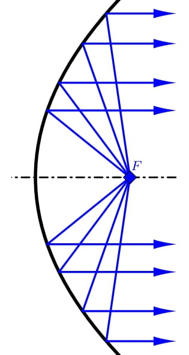

---
keywords:
- analytická geometrie
- kuželosečky
- rovnice paraboly
is_finished: True
difficulty: 2
time: 20
---

# Parabolická anténa

Kvalitní anténa je jedním z nejdůležitějších prvků každého radaru. Jedním 
typem antény je tzv. parabolická anténa. Tato anténa má tvar rotačního 
paraboloidu (to znamená, že vznikla rotací části paraboly kolem její osy) 
a slouží nejen k radiolokaci, ale například i k příjmu satelitního 
televizního vysílání. 

Parabolický tvar přijímací antény zajišťuje, že přicházející signály z 
určitého směru se po odrazu od antény soustřeďují do jednoho bodu, a to 
do ohniska paraboly, jejíž rotací anténa vznikla. V tomto bodě proto bývá 
přijímač antény. Pokud je naopak v ohnisku umístěn výstup z 
vysokofrekvenčního generátoru (zářič), funguje anténa jako vysílací. 
Energie ze zářiče se po odrazu od paraboloidu soustředí do úzkého proudu 
mikrovln s rovnoběžnými paprsky.

Osovým řezem antény je část paraboly. Ta je charakterizovaná dvěma parametry.
Jsou to průměr $d$ antény a hloubka $h$ 
antény, viz obrázek. Tyto dva údaje jsou určující pro 
polohu ohniska $F$. Vzdálenost ohniska od vrcholu 
paraboly označíme $f$. Poslední důležitou 
charakteristikou antény je její úhel otevření,
který vyjadřuje pod jakým úhlem jsou vidět okraje 
části paraboly z ohniska. Jeho hodnotu označujeme 
$2\varphi$.

Při výpočtu polohy ohniska je výhodné předpokládat 
umístění vrcholu paraboly v počátku, kdy osa $x$ je 
zároveň tečnou této paraboly v jejím vrcholu. 
Vrcholová rovnice paraboly je pak $$x^2=2py,$$ kde $p$ 
je parametr paraboly, tedy vzdálenost ohniska od řídící přímky paraboly. 
Pro parametr $p$ platí $p=2f$.

## Zadání

> **Úloha 1.** Máme k dispozici parabolickou anténu s průměrem 
> $d=120\,\text{cm}$ a hloubkou $h=20{,}3\,\text{cm}$. 
> Takováto anténa je vhodná pro využití v 
> radioamatérském pásmu $5{,}76\,\text{GHz}$ 
> (vlnová délka $5{,}2\,\text{cm}$). Vypočítejte, kam je nutné umístit 
> přijímač. 

\iffalse

*Řešení.* Aby anténa správně fungovala, musí přijímač ležet v ohnisku 
parabolické antény. Máme tedy určit polohu ohniska.
Vzhledem k umístění paraboly mají krajní 
body její části souřadnice $\left[-\frac{d}{2},h\right]$ 
a $\left[\frac{d}{2},h\right]$. Navíc oba tyto body 
musí splňovat vrcholovou rovnici paraboly $x^2=2py,$ 
kde parametr $p$ určuje polohu ohniska, přičemž při 
našem označení platí $f=\frac{p}{2}$. 

Dosaďme pravý krajní bod do této rovnice a určeme $p$:
$$60^2=2p\cdot 20{,}3.$$
Odtud tedy $p \doteq  88{,}7\,\text{cm}$. Ohnisko leží na ose $y$ ve vzdálenosti $f=\frac{p}{2}\doteq44{,}3\,\text{cm}$ od vrcholu paraboly. 

\fi

> **Úloha 2.** Určete předpis kvadratické funkce (v 
> explicitním tvaru) vyjadřující zakřivení parabolické 
> antény a znázorněte ji (např. v GeoGebře).

\iffalse

*Řešení.* Z vrcholové rovnice paraboly $x^2=2\cdot 88{,}7 y$ 
je nutné vyjádřit souřadnici $y$. Pro kvadratickou 
funkci platí 
$$
y=\frac{1}{177{,}4}x^2.
$$ 
Graf kvadratická funkce bude správně zachycovat zakřivení parabolické antény, pokud bude platit, že na obou osách je stejné měřítko.

\fi

> **Úloha 3.** Vypočítejte úhel otevření paraboly $2\varphi$.

\iffalse

*Řešení.* Pro výpočet otevření paraboly využijeme pravoúhlého trojúhelníka s odvěsnami délky $f-h$ a $\frac{d}{2}$. 

Pro polovinu úhlu otevření platí 
$$\mathrm{tg}\,\varphi=\frac{\frac{d}{2}}{f-h}=\frac{60}{44{,}3-20{,}3}\quad\Longrightarrow\quad \varphi\doteq 68{,}2^{\circ}.$$
Úhel otevření paraboly $2\varphi$ je $136{,}4^{\circ}$.

\fi

## Literatura

* Střihavka, František. *Parabolické antény [1994]* [online]. Dostupné z https://www.ok2kkw.com/next/ok1ca_1994dish.htm [cit. 30.\,10.\,2023]
* Kusala, Jaroslav. *Radarové antény* [online]. Dostupné z https://www.army.cz/images/id_8001_9000/8753/radar/k25.htm [cit. 30.\,10.\,2023].
* Interactive mathematics. *The Parabola* [online]. Dostupné z https://www.intmath.com/plane-analytic-geometry/4-parabola.php [cit. 30.\,10.\,2023].
