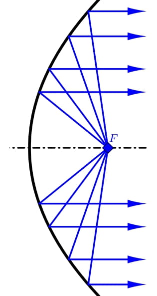
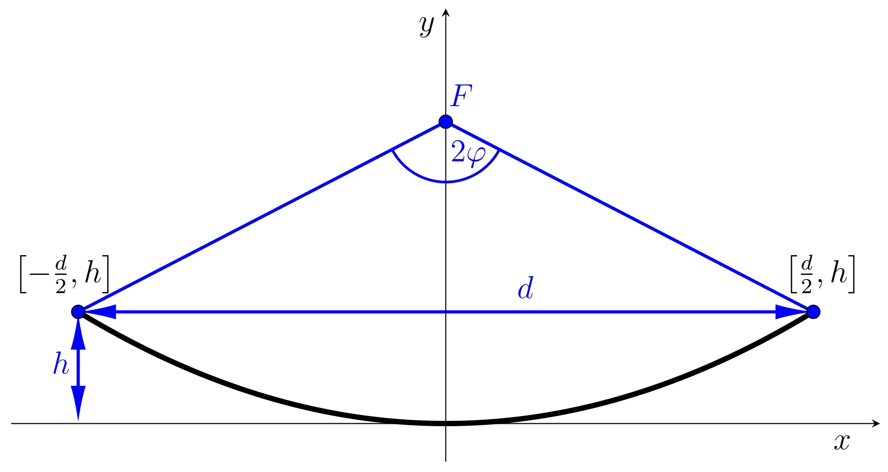
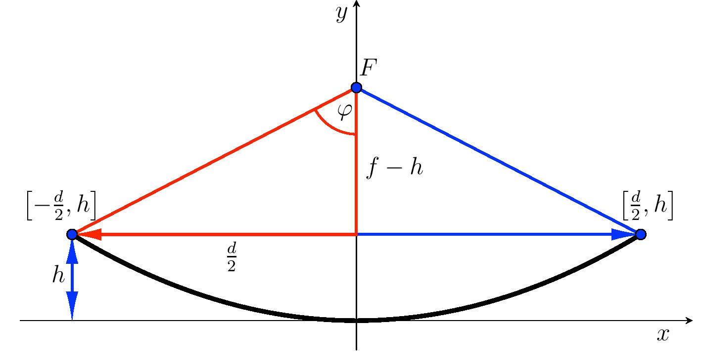

# Parabolic antenna

A quality antenna is one of the most important elements of any radar. 
One type of antenna is the so-called parabolic antenna. 
This antenna has the shape of a rotating paraboloid 
(that means it was created by rotating a part of the parabola around its axis) 
and is used not only for radiolocation but also, 
for example, for receiving satellite television broadcasts.

The parabolic shape of the receiving antenna ensures that the incoming signals from a certain direction are concentrated in one point after reflection from the antenna. Namely in the focal point of the parabola, the rotation of which created the antenna. The antenna's receiver is therefore located at this point. On the other hand, if the output of a high-frequency generator (emitter) is located at the focal point, the antenna acts as a transmitter. After reflection from the paraboloid, the energy from the emitter is concentrated into a narrow stream of microwaves with parallel beams.

The axial section of the antenna is a part of the parabola. 
It is characterized by two parameters. They are the diameter $d$ of the antenna 
and the depth $h$ of the antenna, see the figure. 
These two parameters determine the position of the focus $F$. 
We denote the distance of the focus from the vertex of the parabola by $f$. 
The last important characteristic of the antenna is its opening angle, 
which expresses the angle at which the edges of the part of the parabola 
are visible from the focal point. We denote its value by $2\varphi$.

When calculating the position of the focus point, it is advantageous to assume that
the location of the vertex of the parabola is at the origin of the coordinate system,
and the $x$ axis is the tangent to the parabola at its vertex. 
The standard equation of the parabola is then $$x^2=2py,$$ 
where $p$ is a parameter of the parabola (semi-latus rectum), i.e. the distance of the focus 
from the directrix of the parabola. For the parameter $p$, $p=2f$ holds.

## Assignment

> **Exercise 1.** We have a parabolic antenna with a diameter of $d=120\,\text{cm}$
> and a depth of $h=20{.}3\,\text{cm}$. 
> Such an antenna is suitable for use in amateur radio band $5{.}76\,\text{GHz}$ 
> (wavelength $5{.}2\,\text{cm}$). Determine the optimal location for the receiver.

\iffalse

*Solution.* For the antenna to function optimally, 
the receiver must be located at the focal point of the parabolic antenna. 
Therefore, we have to determine the coordinates of the focal point. 
Given the placement of the parabola, its endpoints have coordinates 
$\left[-\frac{d}{2},h\right]$ and $\left[\frac{d}{2},h\right]$. 
Moreover, both of these points must satisfy the standard equation of the parabola $x^2=2py,$ 
where the parameter $p$ determines the position of the focus, 
while $f=\frac{p}{2}$ applies in our notation.

Let's substitute the right endpoint into this equation and determine $p$:
$$
60^2=2p\cdot 20{.}3.
$$ 
Hence $p \doteq  88{.}7\,\text{cm}$. 
The focus lies on the $y$-axis at a distance $f=\frac{p}{2}\doteq44{.}3\,\text{cm}$ 
from the vertex of the parabola.

\fi

> **Exercise 2.** Determine the quadratic function (in explicit form)
> expressing the curvature of a parabolic antenna and graph it (e.g. in GeoGebra).

\iffalse

*Solution.* From the standard equation of the parabola $x^2=2\cdot 88{.}7 y$ 
it is necessary to express the $y$ coordinate. For the quadratic function applies 
$$
y=\frac{1}{177{.}4}x^2.
$$  
The graph of the quadratic function correctly captures the curvature 
of the parabolic antenna if both axes have the same scale.

\fi

> **Exercise 3.** Calculate the opening angle $2\varphi$  of the parabola.

\iffalse

*Solution.* To calculate the opening of the parabola, 
we use a right triangle with legs of lengths  $f-h$ and $\frac{d}{2}$. 

For half the opening angle we get
$$\mathrm{tg}\,\varphi=\frac{\frac{d}{2}}{f-h}=\frac{60}{44{.}3-20{.}3}\quad\Longrightarrow\quad \varphi\doteq 68{.}2^{\circ}.$$
The opening angle of the parabola $2\varphi$ is $136{.}4^{\circ}$.

\fi

## Literature

* Střihavka, František. *Parabolické antény [1994]* [online]. Dostupné z https://www.ok2kkw.com/next/ok1ca_1994dish.htm [cit. 30.\,10.\,2023]
* Kusala, Jaroslav. *Radarové antény* [online]. Dostupné z https://www.army.cz/images/id_8001_9000/8753/radar/k25.htm [cit. 30.\,10.\,2023].
* Interactive mathematics. *The Parabola* [online]. Dostupné z https://www.intmath.com/plane-analytic-geometry/4-parabola.php [cit. 30.\,10.\,2023].
