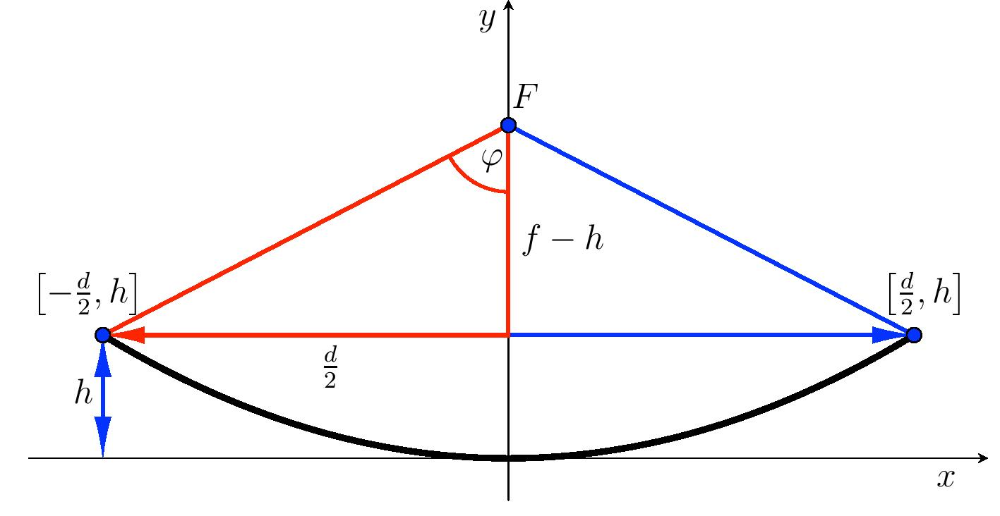

---
keywords:
- geometría analítica
- cónicas
- ecuaciones de parábola
is_finished: true
---

# Antena parabólica

Una antena de calidad es uno de los elementos más importantes de cualquier radar. 
Un tipo de antena de es la llamada antena parabólica. Esta antena tiene forma de 
paraboloide giratorio (es decir, se forma girando una parte de la parábola alrededor de su eje) 
y se utiliza no sólo para radares sino también, por ejemplo, para recibir emisiones  
de televisión por satélite. 

La forma parabólica de la antena receptora garantiza que las señales entrantes procedentes de 
una dirección determinada se concentren en un punto tras reflejarse en la antena, a saber, 
l foco de la parábola cuya rotación creó la antena. Por tanto, el receptor de la antena está situado en este punto. 
Si, por el contrario, la salida del generador de alta frecuencia 
(radiador) está situada en el punto focal, la antena funciona como emisor. 
La energía del radiador, tras reflejarse en el paraboloide, se concentra en una estrecha corriente de microondas 
con haces paralelos.

La sección axial de la antena es una parte del plato. Se caracteriza por dos parámetros.
Estos son el diámetro $d$ de la antena y la profundidad $h$ 
de la antena, ver figura. Estos dos datos determinan la posición 
del foco polohu $F$. Denotamos la distancia del punto focal desde la parte superior de la parábola 
por $f$. La última característica importante 
de la antena es su ángulo de apertura,
que expresa el ángulo en el que los bordes 
de la parábola pueden verse desde el foco. Su valor se denota por 
$2\varphi$.

Al calcular la posición del foco, es conveniente suponer 
la situación del vértice de la parábola en el origen, donde el eje $x$ es 
también la tangente de esta parábola en su vértice. 
La ecuación del vértice de la parábola es entonces $$x^2=2py,$$ donde $p$ 
es un parámetro de la parábola, es decir, la distancia del foco a la línea de control de la parábola. 
Para el parámetro $p$ platí $p=2f$.

## Tarea

> **Tarea 1.** Tenemos una antena parabólica de diámetro 
> $d=120\,\text{cm}$ y profundidad $h=20{,}3\,\text{cm}$. 
> Una antena de este tipo es adecuada para su uso en 
> la banda de radioaficionados $5{,}76\,\text{GHz}$ 
> (longitud de onda $5{,}2\,\text{cm}$). Calcule dónde tiene que colocar 
> el receptor. 

\iffalse

*Solución.* Para que la antena funcione correctamente, 
el receptor debe estar en el foco de la antena parabólica.
Así que tenemos que determinar la posición del foco.
Dada la situación de la parábola, los puntos extremos 
de la parábola tienen las coordenadas $\left[-\frac{d}{2},h\right]$ 
a $\left[\frac{d}{2},h\right]$. Además, estos dos puntos 
deben satisfacer la ecuación de la cúspide de la parábola $x^2=2py,$ 
donde el parámetro $p$ determina la posición del punto focal, donde 
nuestra expresión es $f=\frac{p}{2}$. 

Lleguemos al punto extremo derecho de esta ecuación y determinemos $p$:
$$60^2=2p\cdot 20{,}3.$$
Por tanto $p \doteq  88{,}7\,\text{cm}$. El foco está en el eje $y$ a una distancia $f=\frac{p}{2}\doteq44{,}3\,\text{cm}$ del vértice de la parábola. 

\fi

> **Tarea 2.** Determinar la prescripción de la función cuadrática (en 
> forma explícita) que expresa la curvatura de una antena parabólica 
> y representarla (por ejemplo, en GeoGebra).

\iffalse

*Solución.* A partir de la ecuación del vértice de la parábola $x^2=2\cdot 88{,}7 y$ 
hay que expresar la coordenada $y$. Para la función cuadrática 
$$
y=\frac{1}{177{,}4}x^2.
$$ 
La gráfica de la función cuadrática capturará correctamente la curvatura de la antena parabólica si es cierto que existe la misma escala en ambos ejes.

\fi

> **Tarea 3.** Calcular el ángulo de apertura de la parábola. $2\varphi$.

\iffalse

*Solución.* Para calcular la abertura de la parábola, utilice un triángulo rectángulo con longitudes de rama $f-h$ a $\frac{d}{2}$. 

Para la mitad del ángulo de apertura 
$$\mathrm{tg}\,\varphi=\frac{\frac{d}{2}}{f-h}=\frac{60}{44{,}3-20{,}3}\quad\Longrightarrow\quad \varphi\doteq 68{,}2^{\circ}.$$
Ángulo de apertura de la parábola $2\varphi$ es de $136{,}4^{\circ}$.

\fi

## Bibliografía

* Střihavka, František. *Parabolické antény [1994]* [online]. Dostupné z https://www.ok2kkw.com/next/ok1ca_1994dish.htm [cit. 30.\,10.\,2023]
* Kusala, Jaroslav. *Radarové antény* [online]. Dostupné z https://www.army.cz/images/id_8001_9000/8753/radar/k25.htm [cit. 30.\,10.\,2023].
* Interactive mathematics. *The Parabola* [online]. Dostupné z https://www.intmath.com/plane-analytic-geometry/4-parabola.php [cit. 30.\,10.\,2023].

---
---

