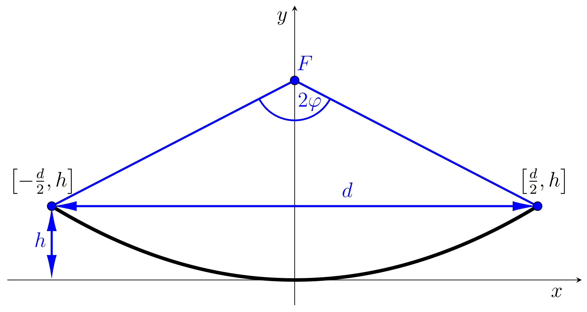

# Antena paraboliczna

Wysokiej jakości antena jest jednym z najważniejszych elementów każdego radaru.
Jednym z typów anten jest tak zwana antena paraboliczna.
Antena ta ma kształt obracającej się paraboloidy
(co oznacza, że została stworzona poprzez obracanie części paraboli wokół jej osi)
i jest używana nie tylko do radiolokacji, ale także
na przykład do odbioru programów telewizji satelitarnej.

Paraboliczny kształt anteny odbiorczej zapewnia, że sygnały przychodzące z określonego kierunku są skoncentrowane w jednym punkcie po odbiciu od anteny. Mianowicie w ognisku paraboli, której obrót utworzył antenę. Odbiornik anteny znajduje się zatem w tym punkcie. Z drugiej strony, jeśli wyjście generatora wysokiej częstotliwości (emitera) znajduje się w punkcie centralnym, antena działa jak nadajnik. Po odbiciu od paraboloidy energia z emitera jest koncentrowana w wąski strumień mikrofal o równoległych wiązkach.

Przekrój osiowy anteny jest częścią paraboli.
Charakteryzuje się on dwoma parametrami. Są to średnica $d$ anteny
i głębokość $h$ anteny, patrz rysunek.
Te dwa parametry określają położenie ogniska $F$.
Odległość ogniska od wierzchołka paraboli oznaczamy przez $f$.
Ostatnią ważną cechą anteny jest jej kąt rozwarcia,
który wyraża kąt, przy którym krawędzie części paraboli
są widoczne z punktu centralnego. Oznaczamy jego wartość przez $2\varphi$.

Przy obliczaniu położenia punktu ogniskowania korzystne jest założenie, że
położenie wierzchołka paraboli znajduje się w punkcie początkowym układu współrzędnych,
a oś $x$ jest styczną do paraboli w jej wierzchołku.
Standardowe równanie paraboli to zatem $$x^2=2py,$$
gdzie $p$ jest parametrem paraboli (semi-latus rectum), tj. odległością ogniska
od direktora paraboli. Dla parametru $p$, $p=2f$ posiada.

## Przydział

> **Ćwiczenie 1.** Mamy antenę paraboliczną o średnicy $d=120\,\text{cm}$
> i głębokość $h=20{,}3\,\text{cm}$.
> Taka antena nadaje się do użytku w amatorskim paśmie radiowym $5{,}76\,\text{GHz}$
> (długość fali $5{,}2\,\text{cm}$). Określenie optymalnej lokalizacji odbiornika.

\iffalse

*Rozwiązanie.* Aby antena działała optymalnie,
odbiornik musi znajdować się w ognisku anteny parabolicznej.
Dlatego musimy określić współrzędne punktu ogniskowego.
Biorąc pod uwagę położenie paraboli, jej punkty końcowe mają współrzędne

$\left[-\frac{d}{2},h\right]$ i $\left[\frac{d}{2},h\right]$.

Co więcej, oba te punkty muszą spełniać standardowe równanie paraboli $x^2=2py,$
gdzie parametr $p$ określa pozycję fokusa,
podczas gdy $f=\frac{p}{2}$ ma zastosowanie w naszej notacji.

Podstawmy prawy punkt końcowy do tego równania i określmy $p$:
$$
60^2=2p\cdot 20{.}3.
$$ 
Stąd $p \doteq 88{,}7\,\text{cm}$.
Ostrość leży na osi $y$ w odległości $f=\frac{p}{2}\doteq44{,}3\,\text{cm}$
od wierzchołka paraboli.

\fi

> **Ćwiczenie 2.** Wyznacz funkcję kwadratową (w jawnej postaci)
> wyrażającą krzywiznę anteny parabolicznej i sporządz jej wykres (np. w programie GeoGebra).

\iffalse

*Rozwiązanie.* Ze standardowego równania paraboli $x^2=2\cdot 88{,}7 y$
konieczne jest wyrażenie współrzędnej $y$. Dla funkcji kwadratowej stosuje się

$$
y=\frac{1}{177{,}4}x^2.
$$

Wykres funkcji kwadratowej poprawnie oddaje krzywiznę anteny parabolicznej, jeśli obie osie mają tę samą skalę.

\fi

> **Ćwiczenie 3.** Oblicz kąt rozwarcia $2\varphi$ paraboli.

\iffalse

*Rozwiązanie.* Aby obliczyć rozwarcie paraboli,
użyjemy trójkąta prostokątnego o nogach długości $f-h$ i $\frac{d}{2}$.

Dla połowy kąta otwarcia otrzymujemy

$$\mathrm{tg}\,\varphi=\frac{\frac{d}{2}}{f-h}=\frac{60}{44{,}3-20{,}3}\quad\Longrightarrow\quad \varphi\doteq 68{,}2^{\circ}.$$

Kąt rozwarcia paraboli $2\varphi$ jest $136{,}4^{\circ}$.

\fi
