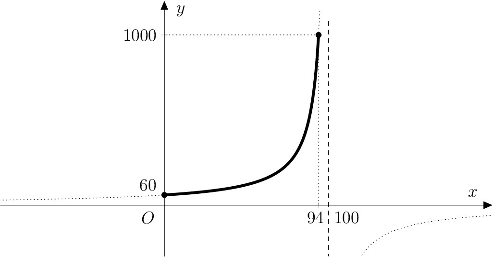

---
keywords:
- procenta
- nepřímá úměra
- lineární lomená funkce
is_finished: True
difficulty: 3
time: 35 
---

# Sušení rajčat

Sušení je považováno za jeden z nejstarších a zároveň z nejzdravějších způsobů dlouhodobého uchovávání potravin, 
který prodlouží jejich trvanlivost až na jeden rok. Je to způsob, jak uchovat chuť, vůni i barvu potravin.
Výhodou je také, že usušené potraviny zabírají o hodně méně místa.

Jedná se o jednu z nejběžněji používaných konzervačních metod jak v domácnostech, tak ve
zpracovatelském průmyslu. V domácnostech se ovoce, zelenina nebo houby suší volně na slunci, 
v troubě nebo v sušičce.  Komerční sušení ovoce pak probíhá ve specializovaných sušárnách.

Při sušení je důležité, aby každý kus byl vystaven stálému proudění teplého
vzduchu, čímž se odpařuje voda a klesá vlhkost. Vlhkost by měla klesnout na 
maximálně $30\,\%$. Při této vlhkosti je zabráněno množení mikroorganizmů a plísní 
bez ohledu na obalový materiál a teplotu skladování. 

## Zadání

Jedním z typických druhů zeleniny, který se suší jsou rajčata. Ta někteří milovníci 
italské kuchyně považují za malý červený zázrak. Z hlediska sušení přitom rajčata patří 
mezi nejnáročnější, jelikož jsou tvořena z $94\,\%$ vodou. 

Všechna procenta v následujících úlohách jsou 
hmotnostní, tedy číselně představují počet gramů složky ve $100\,\text{g}$ hmoty.

> **Úloha 1.** Jestliže dojde v jednom kilogramu 
> čerstvých rajčat po sušení k úbytku vody o jeden 
> procentní bod, kolik gramů budou rajčata vážit? 
> Pro zajímavost zkuste výsledek nejprve odhadnout.

\iffalse

*Řešení.* Jeden kilogram čerstvých rajčat je dle 
zadání tvořen $940\,\text{g}$ vody a $60\,\text{g}$ 
zbylých látek (tzv. sušiny). Po usušení na podíl vody 
$93\,\%$ označme neznámou hmotnost rajčat $x$ (v 
gramech). Protože sušina v rajčatech zůstává, váží v 
nich nyní voda $x-60\,\text{g}$, tedy
$$
\frac{x-60}{x} = \frac{93}{100},
$$
jelikož podíl hmotnosti vody a celkové hmotnosti musí 
být právě $93/100$. Řešením této rovnice je hmotnost 
rajčat 
$$x=\frac{6000}{7}\doteq 857{,}14\,\text{g}.$$

\fi

> **Úloha 2.** Určete předpis a definiční obor funkce, 
> která při sušení jednoho kilogramu čerstvých rajčat 
> popisuje závislost aktuální hmotnosti rajčat na 
> procentuálním podílu vody v nich obsažené. Načrtněte 
> graf této funkce.

\iffalse

*Řešení.* Ze zadání víme, že nezávislá proměnná (označíme si ji jako obvykle $x$) je 
procentuálním podílem vody v rajčatech a závislá 
proměnná (označíme $y$) je aktuální hmotností rajčat (v gramech). 
Tedy platí
$$
\frac{y-60}{y}=\frac{x}{100}. \tag{1}
$$
Odtud vyjádřením $y$ dostáváme předpis hledané funkce $f$:
$$
f\colon y= -\frac{6000}{x-100}.
$$

Definičním oborem této funkce je uzavřený interval 
$\left\langle 0; 94 \right\rangle$, kde krajní hodnoty 
odpovídají rajčatům zcela zbaveným vody a čerstvým 
rajčatům s $94\%$ obsahem vody. Graf funkce $f$ leží 
na hyperbole, která je posunutým grafem funkce 
$f_0\colon y = -\frac{6000}{x}$ o 100 jednotek ve 
směru kladné poloosy $x$.

\fi

> **Úloha 3.** Jak se předpis funkce z předchozí úlohy 
> změní, budeme-li sušit obecně $m$ gramů čerstvých 
> rajčat?

\iffalse

*Řešení.* Vycházíme ze vztahu $(1)$ v řešení 2. úlohy, 
kde nahradíme číslo $60$ (tj. hmotnost sušiny v 
gramech) obecným vyjádřením $\frac{6}{100}m$, neboť 
sušina tvoří $6\,\%$ hmotnosti čerstvých rajčat. 
Vyjádřením proměnné $y$ pak dostáváme předpis funkce 
$g$ (s parametrem $m$) jako

$$
g\colon y = -\frac{6m}{x-100}. \tag{2}
$$

\fi

> **Úloha 4.** Z kolika kilogramů čerstvých rajčat 
> připravíme
>
> a. jeden kilogram sušených rajčat s $10\%$ obsahem vody;
> b. $500\,\text{g}$ sušených rajčat s $20\%$ obsahem vody;
> c. $250\,\text{g}$ sušených rajčat s $40\%$ obsahem vody?

\iffalse

*Řešení.* Odkážeme-li se na funkci $g$ z řešení 3. 
úlohy, ptáme se, pro které $m$ prochází graf funkce 
$g$ bodem o souřadnicích $[10;1000]$ (v případě a), 
resp. bodem se souřadnicemi $[20;500]$ (v případě b), 
resp. bodem $[40;250]$ (v případě c). 

Postupným dosazením souřadnic tří zmíněných bodů 
za $x$ a $y$ v předpisu $(2)$ a vyřešením získaných lineárních 
rovnic dostáváme kořeny $m_1=15\,000$, $m_2=\frac{20\,000}{3}$ 
a $m_3=2500$. Výsledky tedy jsou $15\,\text{kg}$ (pro případ a), 
$\frac{20}{3}\doteq 6{,}67\,\text{kg}$ (pro případ b) a $2{,}5\,\text{kg}$ (pro případ c).

\fi

## Literatura

* Richtrmocová, Barbora. *Zdravotní a nutriční aspekty sušeného ovoce.* Bakalářská práce. Masarykova univerzita, 2018. 

