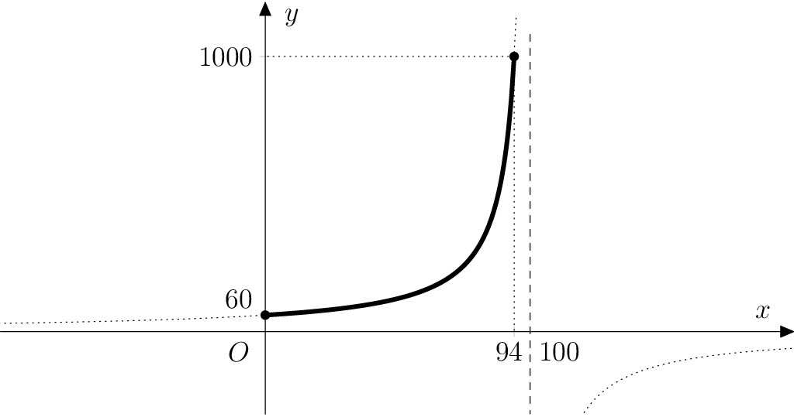

# Tomates secos

El secado se considera una de las formas más antiguas y saludables de conservar los alimentos durante mucho tiempo, 
prolongando su vida útil hasta un año. Es una forma de preservar el sabor, el aroma y el color de los alimentos.
También tiene la ventaja de que los alimentos secos ocupan mucho menos espacio.

Es uno de los métodos de conservación más utilizados tanto en el hogar como
en la industria de transformación. En el hogar, las frutas, verduras o setas se secan libremente al sol, 
en el horno o en un deshidratador.  El secado comercial de la fruta se realiza en secaderos especializados.

Durante el secado, es importante que cada pieza esté expuesta a un flujo constante de aire caliente
que evapora el agua y reduce la humedad. La humedad debe bajar a 
un máximo de $30\,\%$. Con esta humedad, se impide el crecimiento de microorganismos y moho 
independientemente del material de envasado y de la temperatura de almacenamiento. 

## Instrucciones

Una de las verduras típicas que más se secan son los tomates. Algunos amantes 
de la cocina italiana los consideran un pequeño milagro rojo. En términos de secado, los tomates están 
entre los más exigentes, ya que se componen de $94\,\%$ de agua. 

Todos los porcentajes de los siguientes problemas son 
de peso, es decir, representan numéricamente el número de gramos de un componente en $100\,\text{g}$ de masa.

> **Problema 1.** Si un kilogramo de 
> tomates frescos tiene una pérdida de agua de un 
> punto porcentual después del secado, ¿cuántos gramos pesarán los tomates? 
> Por curiosidad, intenta predecir primero el resultado.

\iffalse

*Solución.* Un kilogramo de tomates frescos está  
formado por $940\,\text{g}$ de agua y de $60\,\text{g}$ 
sustancias restantes (llamadas materia seca). Después de secarse hasta un contenido de agua de 
$93\,\%$ vamos a señalar la masa desconocida del tomate $x$ (en 
gramos). Como la materia seca permanece en los tomates, el agua en 
ellos pesa ahora $x-60\,\text{g}$, por lo que
$$
\frac{x-60}{x} = \frac{93}{100},
$$
ya que la relación entre el peso del agua y el peso total debe 
ser justo $93/100$. La solución de esta ecuación es la masa de 
tomates 
$$x=\frac{6000}{7}\doteq 857{,}14\,\text{g}.$$

\fi

> **Problema 2.** Debes calcular la regla y el dominio de definición de la función, 
> que, al secar un kilogramo de tomates frescos, 
> describe la dependencia del peso real de los tomates con 
> el porcentaje de agua que contienen. Dibujar 
> la gráfica de esta función.

\iffalse

*Solución.* Del problema sabemos que la variable independiente (indicada como siempre por $x$) es el 
porcentaje de agua en los tomates y la variable dependiente 
(indicada por $y$) es el peso real de los tomates (en gramos). 
De modo que
$$
\frac{y-60}{y}=\frac{x}{100}. \tag{1}
$$
A partir de aquí, expresando $y$ obtenemos la formulación de la función de búsqueda $f$:
$$
f\colon y= -\frac{6000}{x-100}.
$$

El dominio definitorio de esta función es el intervalo cerrado 
$\left\langle 0; 94 \right\rangle$, donde los valores extremos 
corresponden a tomates completamente desprovistos de agua y tomates frescos 
con un contenido en agua de $94\,\%$ La gráfica de la función $f$ se encuentra 
en la hipérbola, que es la gráfica desplazada de la función 
$f_0\colon y = -\frac{6000}{x}$ en 100 unidades en 
la dirección 
del semieje positivo de $x$.

\fi

> **Problema 3.** ¿Cómo cambia la especificación del problema anterior 
> si secamos generalmente $m$ gramos de 
> tomates frescos?

\iffalse

*Solución.* Partiendo de la relación $(1)$ de la solución del problema 2, 
sustituimos el número $60$ (es decir, el peso seco en 
gramos) por la expresión general $\frac{6}{100}m$, ya que 
el peso en seco es $6\,\%$ del peso del tomate fresco. 
Expresando la variable $y$ obtenemos entonces la formulación de la función 
$g$ (con parámetro $m$) como

$$
g\colon y = -\frac{6m}{x-100}. \tag{2}
$$

\fi

> **Problema 4.** ¿A partir de cuántos kilogramos de tomates frescos 
> podemos preparar
>
> a. un kilogramo de tomates secos con un contenido de agua de $10\%$;
> b. $500\,\text{g}$ de tomates secos con un contenido de agua de $20\%$;
> c. $250\,\text{g}$ de tomates secos con un contenido de agua de $40\%$?

\iffalse

*Solución.* Refiriéndonos a la función $g$ de la solución del tercer 
problema, preguntamos para qué $m$ la gráfica de la función 
$g$ pasa por el punto de coordenadas $[10;1000]$ (en el caso a), 
o bien el punto de coordenadas $[20;500]$ (en el caso b), 
o bien el punto $[40;250]$ (en el caso c). 

Sustituyendo sucesivamente las coordenadas de los tres puntos mencionados 
por $x$ y $y$ en la fórmula $(2)$ y resolviendo las ecuaciones lineales 
calculadas, se obtienen las raíces $m_1=15\,000$, $m_2=\frac{20\,000}{3}$ 
y $m_3=2500$. De modo que los resultados son $15\,\text{kg}$ (para el caso a), 
$\frac{20}{3}\doteq 6{,}67\,\text{kg}$ (para el caso b) a $2{,}5\,\text{kg}$ (para el caso c).

\fi

## Bibliografía

* Richtrmocová, Barbora. *Zdravotní a nutriční aspekty sušeného ovoce.* Bakalářská práce. Masarykova univerzita, 2018. 

