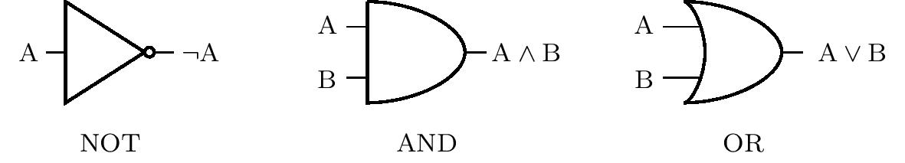
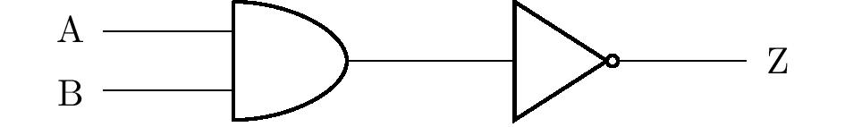
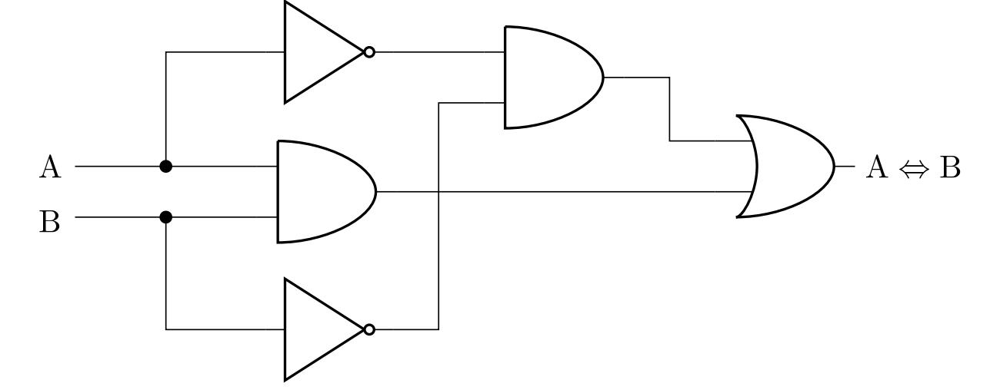

---
keywords:
- základní poznatky
- výroky
- matematická logika
is_finished: true
difficulty: 2
time: 35
---

# Logické obvody

Které kouzlo dokáže v přetíženém výtahu rozsvítit 
správnou kontrolku, stiskem tlačítka automatu 
připravit pomerančovou sodovku, po pár minutách 
zhasnout rozsvícená světla v chodbě domu nebo 
pohybovat s postavou na obrazovce počítače? O tyto a 
celou řadu dalších činností v reálném životě se 
starají logické obvody, které podrobněji prozkoumáme v 
následující sérii úloh.

Logické obvody se skládají z tzv. logických členů, 
které realizují logické operace. V úlohách budeme 
pracovat pouze se třemi základními logickými členy NOT 
(negace), AND (konjunkce) a OR (disjunkce). Na obrázku 
jsou vidět jejich příslušné symboly (dle americké 
normy ANSI/MIL) v logických obvodech. Jsou  orientovány tak, aby směr vstupu byl zleva. Vstupy chápeme jako výroky, výstupy jsou pak výroky složené.

Pravdivostní hodnoty jsou v logických obvodech 
realizovány napětím, nízké napětí značí pravdivostní 
hondotu 0, vysoká úroveň napětí značí hodnotu 1. Pokud 
je např. u členu AND na vstupu A nízká úroveň napětí a 
na vstupu B vysoká úroveň, je na výstupu nízká úroveň 
napětí. Konkrétní hodnoty úrovní se liší dle 
konkrétního využití obvodu. Běžná je třeba nízká 
úroveň přibližně 0V, vysoká přibližně 5V.

Na dalším obrázku vidíme znázornění jednoho 
složitějšího logického obvodu. Pro názornost je v 
obrázku také vyznačeno postupné skládání výroků, což 
odpovídá vstupům nebo výstupům jednotlivých členů. 
Černý puntík označuje uzel, ve kterém se logický obvod 
větví. Výstup jednoho členu tak může být přiveden na 
více vstupů zároveň.

V následujících úlohách mohou být před vstupy zařazeny 
spínače nebo tlačítka, za výstupy logického obvodu pak 
mohou být zařazeny žárovky. 
Dohodněme se, že na vstupu je logická hodnota rovna 1 právě tehdy, když je spínač sepnut nebo tlačítko stisknuto. Podobně žárovka svítí právě tehdy, když je na příslušném výstupu logická hodnota 1.

> **Úloha 1.** V obvodu na předchozím obrázku jsou 
> před vstupy A, B a C spínače a na výstupu je 
> zapojena žárovka. Jestliže spínač C není sepnut, v 
> jaké poloze musí být spínače A a B, aby žárovka 
> svítila?

\iffalse

*Řešení.* Označme $p(\mathrm{X})$ pravdivostní hodnotu 
výroku $\mathrm{X}$. Ze zadání víme, že $p(\mathrm{C})=0$, 
a ptáme se na hodnoty $p(\mathrm{A})$ a $p(\mathrm{B})$ takové, 
že $p\left[ \left(\mathrm{C}\wedge \left(\mathrm{A}\vee\mathrm{B}\right)\right)\vee \left( \neg\left(\mathrm{A}\vee\mathrm{B}\right)\right) \right]=1$. 
Úlohu vyřešíme úvahou.

Jestliže platí $p(\mathrm{C})=0$, pak nutně i 
$p(\mathrm{C}\wedge \left(\mathrm{A}\vee\mathrm{B}\right))=0$. 
Proto musí být pravdivý výrok $\neg ( \mathrm{A}\vee \mathrm{B})$, a tedy $p(\mathrm{A}\vee \mathrm{B})=0$. 
To je však možné tehdy a jen tehdy, když jsou výroky $\mathrm{A}$ i $\mathrm{B}$ nepravdivé. 
Ani jeden spínač tak nesmí být sepnut.

\fi

> **Úloha 2.** Je dán logický obvod na obrázku níže, 
> na jehož vstupech A, B a C jsou spínače a na jehož 
> výstupu Z je zapojena žárovka. Které spínače musíme 
> sepnout, aby se žárovka rozsvítila? Nalezněte 
> všechna řešení úlohy. Kříží-li se v diagramu vodiče 
> bez znázorněného uzlu, předpokládá se, že ve 
> skutečnosti ke styku vodičů nedochází.

\iffalse

*Řešení.* Úlohu budeme řešit užitím tabulky pravdivostních hodnot. Z diagramu v zadání nejprve odvodíme výrok složený z výroků $\mathrm{A}$, $\mathrm{B}$ a $\mathrm{C}$, který bude ekvivalentní výroku  $\mathrm{Z}$, viz obrázek.

Pro složený výrok $\left( \star \right)$ nyní vytvoříme tabulku pravdivostních hodnot:

| $\mathrm{A}$ |$\mathrm{B}$| $\mathrm{C}$  | $\mathrm{A}\wedge\neg\mathrm{B}$ | $\mathrm{A}\vee\mathrm{C}$ | $\left( \mathrm{A}\wedge\neg\mathrm{B}\right) \wedge \left( \mathrm{A}\vee\mathrm{C} \right)$|
| --- | --- | --- | ---- | ---- | ----- |
| $1$| $1$| $1$  | $\quad0$ | $\quad1$ | $\qquad\qquad0$ |
| $1$| $1$ | $0$  | $\quad0$ | $\quad1$ | $\qquad\qquad0$ |
| $1$| $0$ |$1$  | $\quad1$ | $\quad1$ | $\qquad\qquad1$ |
| $1$ |$0$ |$0$  | $\quad1$ | $\quad1$ | $\qquad\qquad1$ |
| $0$| $1$| $1$  | $\quad0$ | $\quad1$ | $\qquad\qquad0$ |
| $0$ |$1$| $0$  | $\quad0$ | $\quad0$ | $\qquad\qquad0$ |
| $0$| $0$| $1$  | $\quad0$ | $\quad1$ | $\qquad\qquad0$ |
| $0$| $0$| $0$  | $\quad0$ | $\quad0$ | $\qquad\qquad0$ |

Z tabulky vyplývá, že žárovka bude svítit, jestliže 
bude sepnutý spínač A a zároveň nebude sepnutý spínač 
B. Na sepnutí spínače C přitom nezáleží.

Úlohu lze řešit také ekvivalentními úpravami výroku 
$\left(\star \right)$. Nejprve použijeme distributivní 
zákon, následně tzv. zákon idempotence $\mathrm{A}\wedge \mathrm{A}\Leftrightarrow \mathrm{A}$:

$$
\begin{alignat*}{3}
&&&\left( \mathrm{A}\wedge\neg\mathrm{B}\right) \wedge \left( \mathrm{A}\vee\mathrm{C} \right)
&&\quad\Leftrightarrow\\
&\Leftrightarrow\quad &&\left( \mathrm{A}\wedge\neg\mathrm{B}\wedge\mathrm{A}\right) \vee \left( \mathrm{A}\wedge\neg\mathrm{B}\wedge\mathrm{C}\right)
&&\quad\Leftrightarrow\\
&\Leftrightarrow\quad &&\left( \mathrm{A}\wedge\neg\mathrm{B}\right) \vee \left( \mathrm{A}\wedge\neg\mathrm{B}\wedge\mathrm{C}\right). && \tag{$\star\star$}
\end{alignat*}
$$

Složený výrok $\left( \star\star \right)$ je však 
pravdivý právě tehdy, když je pravdivá konjunkce 
$\mathrm{A}\wedge\neg\mathrm{B}$, tedy když je $\mathrm{A}$ 
pravdivý výrok a $\mathrm{B}$ nepravdivý výrok. Z toho 
vyplývá o poloze spínačů stejný závěr, který jsme 
učinili pomocí tabulky.

\fi

> **Úloha 3.** Navrhněte logický obvod, který v 
> případě poruchy některého ze dvou vodních čerpadel 
> (příp. obou) rozsvítí výstražnou žárovku na výstupu 
> obvodu. Dokud přitom čerpadlo funguje, vysílá signál 
> odpovídající logické jedničce na jeden ze dvou 
> vstupů obvodu.

\iffalse

*Řešení.* Označme $\mathrm{A}$ a $\mathrm{B}$ výroky 
představující stav prvního a druhého čerpadla. Hledáme 
výrok $\mathrm{Z}$ složený z $\mathrm{A}$ a 
$\mathrm{B}$, jehož tabulku pravdivostních hodnot 
známe:

| $\mathrm{A}$ | $\mathrm{B}$ | $\mathrm{Z}$ |
| --- | --- | --- |
| $1$|$1$|$0$|
| $1$|$0$|$1$|
| $0$|$1$|$1$|
| $0$|$0$|$1$|

Z tabulky jde poznat, že ekvivalentním výrokem je 
např. $\neg\left( \mathrm{A} \wedge \mathrm{B}\right)$, 
kterému odpovídá diagram výsledného obvodu na obrázku:

Úloha má více řešení. Například užitím de Morganova 
zákona dostáváme z předchozího výsledku ekvivalentní 
výrok $\neg\mathrm{A}\vee\neg\mathrm{B}$. Tomuto výroku by odpovídal jiný, ale také správný, obvod (diagram).

\fi

> **Úloha 4.** Modifikujte výstražné zařízení z 
> předchozí úlohy. Na dvou výstupech nyní bude 
> zapojeno červené a zelené světlo. Fungují-li obě 
> čerpadla, svítí zelené světlo a červené je zhasnuté. 
> Při poruše jednoho z čerpadel se navíc rozsvítí i 
> červené světlo a při poruše obou čerpadel bude 
> svítit pouze červené světlo. Navrhněte odpovídající 
> logický obvod.

\iffalse

*Řešení.* Podobně jako v předchozí úloze označme 
$\mathrm{A}$ a $\mathrm{B}$ výroky představující 
stav prvního a druhého čerpadla. Dostaneme tak 
tabulku pravdivostních hodnot neznámých složených 
výroků $\mathrm{Č}$ (červené světlo) a $\mathrm{Z}$ 
(zelené světlo):  

| $\mathrm{A}$ | $\mathrm{B}$ | $\mathrm{Č}$ | $\mathrm{Z}$ |
| --- | --- | --- |--- |
| $1$|$1$|$0$|$1$|
| $1$|$0$|$1$|$1$|
| $0$|$1$|$1$|$1$|
| $0$|$0$|$1$|$0$|

Je vidět, že sloupec pro výrok $\mathrm{Č}$ je totožný 
s výrokem $\mathrm{Z}$ v předchozí úloze (a tedy 
můžeme převzít její řešení), a sloupec pro 
výrok $\mathrm{Z}$ odpovídá disjunkci $\mathrm{A}\vee \mathrm{B}$. 
Využitím uzlů a rozvětvením obvodu tak můžeme 
zakreslit diagram odpovídajícího logického obvodu:

Podobně jako předchozí úloha má i tato více řešení, 
jejichž správnost je možné ověřit vždy pomocí tabulky 
pravdivostních hodnot. Blíže se však vyjádříme ještě k 
jednomu řešení.

Žáky může napadnout, že místo členu OR je možné vodiče spojit prostým uzlem, jak je znázorněno na obrázku:

Jestliže bude na $\mathrm{A}$ nebo $\mathrm{B}$ (popř. 
na obou) hodnota $1$, může tato hodnota volně protéct 
i na výstup $\mathrm{Z}\,$? Skutečnost je taková, že 
nikoliv. V úvodním odstavci jsme si řekli, že 
pravdivostní hodnota $1$ se realizuje vysokou úrovní 
napětí a hodnota $0$ jeho nízkou úrovní. Bude-li tak 
např. na vstupu $\mathrm{A}$ vysoké a na vstupu 
$\mathrm{B}$ nízké napětí, dojde v obvodu ke zkratu, 
neboť jsou vodičem spojeny body s různým napětím. 
Proto obecně nemůžeme v logických obvodech spojit 
výstupy různých členů uzly.

\fi

> **Úloha 5.** Navrhněte logický obvod se dvěma vstupy 
> a jedním výstupem, který simuluje operaci logické 
> ekvivalence.

\iffalse

*Řešení.* Abychom mohli obvod sestrojit, potřebujeme 
nalézt k ekvivalenci $\mathrm{A}\Leftrightarrow\mathrm{B}$ 
složený výrok se stejnou tabulkou pravdivostních 
hodnot, který obsahuje pouze konjunkce, disjunkce nebo 
negace. Z definice pro ekvivalenci plyne, že je 
pravdivá právě tehdy, jsou-li výroky $\mathrm{A}$ a 
$\mathrm{B}$ oba pravdivé nebo oba nepravdivé. To 
znamená, že je pravdivá právě tehdy, když je pravdivá 
konjunkce $\mathrm{A}\wedge\mathrm{B}$ nebo je 
pravdivá konjunkce $\neg\mathrm{A}\wedge\neg\mathrm{B}$. 
Tak dostáváme ekvivalenci
$$
\left( \mathrm{A}\Leftrightarrow\mathrm{B} \right)
\quad \Leftrightarrow \quad
\left( \mathrm{A}\wedge\mathrm{B} \right) \vee \left( \neg\mathrm{A}\wedge\neg\mathrm{B} \right),
$$
jejíž pravá strana je výrok obsahující pouze 
konjunkce, disjunkci a negace. Můžeme proto sestavit 
odpovídající diagram: 

Jedno z dalších možných řešení můžeme dostat využitím 
de Morganových zákonů a ekvivalentní úpravou 
předchozího výsledku na výrok 
$\left( \mathrm{A}\wedge\mathrm{B} \right) \vee \neg \left( \mathrm{A}\vee\mathrm{B} \right)$. 
Technickou výhodou tohoto tvaru je menší počet 
potřebných logických členů při realizaci obvodu.

\fi

> **Úloha 6.** Kávový automat po stisku příslušného 
> tlačítka umí připravit tři typy nápojů: lungo, 
> macchiato a kakao. Nápoje se připravují mícháním 
> čtyř ingrediencí (horké vody, mléka, kávového a 
> kakaového koncentrátu), kde každá ingredience má 
> svoji trysku. Navrhněte logický obvod se třemi 
> vstupy (pro každý nápoj jeden) a čtyřmi výstupy (pro 
> ventil každé trysky jeden), jestliže se lungo
> připravuje z vody a kávového koncentrátu, macchiato 
> z vody, mléka a kávového koncentrátu a kakao z vody 
> a kakaového koncentrátu.
> 
> Pro jednoduchost předpokládejme, že nikoho nenapadne 
> zmáčknout více tlačítek najednou, tedy se těmito 
> případy nemusíte zabývat. Ingredience je do kelímku 
> uvolněna právě tehdy, když je na příslušném výstupu 
> logická jednička.

\iffalse

*Řešení.* Označme $\mathrm{C}$ (kakao, angl. cocoa), $\mathrm{L}$ 
(lungo) a $\mathrm{M}$ (macchiato) výroky 
představující stav stisknutí příslušného tlačítka a 
dále označme $\mathrm{COC}$ (kakaový koncentrát, angl. cocoa concentrate), 
$\mathrm{WA}$ (voda, angl. water), $\mathrm{COF}$ (kávový 
koncentrát, angl. coffee concentrate) a $\mathrm{ML}$ (mléko, angl. milk) výroky 
představující stav otevření příslušné trysky. Z 
informací v zadání pak sestavme tabulku pravdivostních 
hodnot: 

| $\mathrm{C}$ |$\mathrm{L}$| $\mathrm{M}$  | $\mathrm{COC}$ | $\mathrm{WA}$ | $\mathrm{COF}$ | $\mathrm{ML}$|
|--|--|--|---|---|---|---|
|$1$ |$0$ |$0$ |$1$ |$1$ |$0$ |$0$|
|$0$ |$1$ |$0$ |$0$ |$1$ |$1$ |$0$|
|$0$ |$0$ |$1$ |$0$ |$1$ |$1$ |$1$|
|$0$ |$0$ |$0$ |$0$ |$0$ |$0$ |$0$|

Řádky, pro něž je v prvních třech sloupcích více než jedna jednička, nebereme v potaz, protože je možné zmáčknout vždy jen jedno tlačítko.

Z tabulky plyne, že ekvivalentní dvojicí výroků je 
$\mathrm{COC}$ a $\mathrm{C}$ a další ekvivalentní 
dvojicí jsou výroky $\mathrm{ML}$ a $\mathrm{M}$. 
Výrok $\mathrm{COF}$ je pravdivý právě tehdy, když je 
pravdivý některý z výroků $\mathrm{L}$ nebo $\mathrm{M}$, 
tedy je ekvivalentní s disjunkcí $\mathrm{L}\vee\mathrm{M}$. 
A konečně výrok $\mathrm{WA}$ je pravdivý právě tehdy, 
když je některý z trojice výroků $\mathrm{C}$, 
$\mathrm{L}$, $\mathrm{M}$ pravdivý, tedy je $\mathrm{WA}$ 
ekvivalentní s disjunkcí $\mathrm{C}\vee\mathrm{L}\vee\mathrm{M}$.

Na následujícím obrázku je znázorněn diagram 
příslušného obvodu - disjunkce $\mathrm{C}\vee\mathrm{L}\vee\mathrm{M}$ 
je v něm přitom realizována vnořením dvou členů OR, 
tj. jako $\mathrm{C}\vee\left( \mathrm{L}\vee\mathrm{M}\right)$.

Všechny uvedené úlohy je možné názorně ilustrovat na různých simulátorech logických obvodů, např. online simulátoru CircuitVerse. Na posledním obrázku je v tomto simulátoru modelován obvod z Úlohy 2. K ilustraci je také možné využít specializovaných elektronických stavebnic.

\fi

## Literatura

* Perrin J. P., Denouette M., Daclin E. *Logické systémy, díl I. Kombinační logické obvody. Úvod do sekvenčních obvodů*. Praha: SNTL. 1972
* *Online simulátor CircuitVerse*, https://circuitverse.org/simulator
