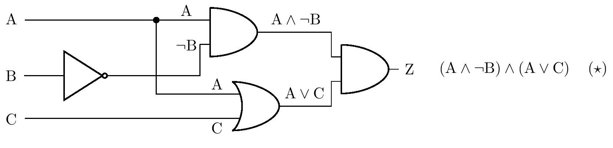

---
keywords:
- statements
- mathematical logic
is_finished: True
---

# Logic circuits

Which spell can turn on the correct indicator light in an overloaded elevator, 
prepare an orange soda by pressing the button on a vending machine, 
turn off the lights in the hallway of a house after a few minutes, 
or move a character on a computer screen? 
These and many other real-life activities are handled by logic circuits, 
which we will explore in more detail in the following series of problems.

Logic circuits consist of so-called logic gates that implement logic operations. 
We will work only with three basic logic gates, namely NOT (negation), 
AND (conjunction) and OR (disjunction), in the exercises. 
The figure shows their respective symbols 
(according to the American ANSI/MIL standard) in logic circuits. 
They are oriented so that the input direction is from the left. 
Inputs are understood as statements, while outputs are compound statements.

The truth values are implemented in logic circuits by voltage. 
Low voltage indicates a truth value of 0, while a high voltage level indicates a value of 1. 
For example, if the AND gate has a low voltage level at input A and 
a high voltage level at input B, the output is a low voltage level. 
The specific values of the levels vary according to the specific use of the circuit. 
A low level of approximately 0 V and a high level of approximately 5 V are common.

In the next figure we see a representation of a more complex logic circuit. 
For clarity, the figure also shows the sequential compounding of statements,
which correspond to the inputs or outputs of the individual gates. 
The black dot indicates the node at which the logic circuit branches.
Thus, the output of one gate can be fed to multiple inputs at the same time.

In the following exercises, switches or buttons can be placed in front of the inputs, 
and light bulbs can be placed behind the outputs of the logic circuit. 
Let's agree that the logic value at the input is equal to 1 
if and only if the switch is on or the button is pressed. 
Similarly, a light bulb lights if and only if there is a logic value of 1 at the corresponding output.

> **Exercise 1.** In the circuit in the previous figure, there are switches
> in front of inputs A, B and C, and a light bulb is connected to the output.
> If switch C is not on, in what position must switches A and B be
> in order for the bulb to light?

\iffalse

*Solution.* Let $p(\mathrm{X})$ denote the truth value of the statement $\mathrm{X}$. 
We know from the assignment that $p(\mathrm{C})=0$, and we ask for the values ​​of 
$p(\mathrm{A})$ and $p(\mathrm{B})$ such that 
$p\left[ \left(\mathrm{C}\wedge \left(\mathrm{A}\vee\mathrm{B}\right)\right)\vee \left( \neg\left(\mathrm{A}\vee\mathrm{B}\right)\right) \right]=1$. 
We will solve the exercise by reasoning.

If $p(\mathrm{C})=0$ holds, then necessarily 
$p(\mathrm{C}\wedge \left(\mathrm{A}\vee\mathrm{B}\right))=0$. Therefore the statement 
$\neg ( \mathrm{A}\vee \mathrm{B})$ must be true, and therefore $p(\mathrm{A}\vee \mathrm{B})=0$. 
However, this is possible if and only if the statements $\mathrm{A}$ and 
$\mathrm{B}$ are both false. Therefore, both switches must remain closed.

\fi

> **Exercise 2.** The logic circuit shown in the figure below is given with switches at inputs A, B and C
> and a light bulb at output Z. Which switches must be turned on for the bulb to light?
> Find all solutions to the problem. If the wires cross in the diagram without a node shown,
> it is assumed that there is no actual contact between the wires.

\iffalse

*Solution.* We will solve the problem by using the truth table. 
From the diagram in the assignment, we first derive a statement 
consisting of the statements $\mathrm{A}$, $\mathrm{B}$ and $\mathrm{C}$, 
which will be equivalent to the statement $\mathrm{Z}$, see figure.

For the compound statement $\left( \star \right)$ we now create a truth table:

| $\mathrm{A}$ |$\mathrm{B}$| $\mathrm{C}$  | $\mathrm{A}\wedge\neg\mathrm{B}$ | $\mathrm{A}\vee\mathrm{C}$ | $\left( \mathrm{A}\wedge\neg\mathrm{B}\right) \wedge \left( \mathrm{A}\vee\mathrm{C} \right)$|
| --- | --- | --- | ---- | ---- | ----- |
| $1$| $1$| $1$  | $\quad0$ | $\quad1$ | $\qquad\qquad0$ |
| $1$| $1$ | $0$  | $\quad0$ | $\quad1$ | $\qquad\qquad0$ |
| $1$| $0$ |$1$  | $\quad1$ | $\quad1$ | $\qquad\qquad1$ |
| $1$ |$0$ |$0$  | $\quad1$ | $\quad1$ | $\qquad\qquad1$ |
| $0$| $1$| $1$  | $\quad0$ | $\quad1$ | $\qquad\qquad0$ |
| $0$ |$1$| $0$  | $\quad0$ | $\quad0$ | $\qquad\qquad0$ |
| $0$| $0$| $1$  | $\quad0$ | $\quad1$ | $\qquad\qquad0$ |
| $0$| $0$| $0$  | $\quad0$ | $\quad0$ | $\qquad\qquad0$ |

The table shows that the bulb lights if switch 
A is closed and switch B is not closed at the same time.
The position of switch C does not matter.

The problem can also be solved by equivalent modifications of the statement 
$\left(\star \right)$. First, we use the distributive law, then the so-called idempotent law 
$\mathrm{A}\wedge \mathrm{A}\Leftrightarrow \mathrm{A}$:

$$
\begin{alignat*}{3}
&&&\left( \mathrm{A}\wedge\neg\mathrm{B}\right) \wedge \left( \mathrm{A}\vee\mathrm{C} \right)
&&\quad\Leftrightarrow\\
&\Leftrightarrow\quad &&\left( \mathrm{A}\wedge\neg\mathrm{B}\wedge\mathrm{A}\right) \vee \left( \mathrm{A}\wedge\neg\mathrm{B}\wedge\mathrm{C}\right)
&&\quad\Leftrightarrow\\
&\Leftrightarrow\quad &&\left( \mathrm{A}\wedge\neg\mathrm{B}\right) \vee \left( \mathrm{A}\wedge\neg\mathrm{B}\wedge\mathrm{C}\right). && \tag{$\star\star$}
\end{alignat*}
$$

However, the compound statement $\left( \star\star \right)$ 
is true if and only if the conjunction $\mathrm{A}\wedge\neg\mathrm{B}$ is true, 
i.e. if $\mathrm{A}$ is a true statement and $\mathrm{B}$ is a false statement. 
This implies the same conclusion about the position of the switches that we made using the table.

\fi

> **Exercise 3.** Design a logic circuit that, in the event of a failure of one of
> the two water pumps (or both), lights up a warning lamp at the output of the circuit.
> As long as the pump is working, it sends a signal corresponding
> to a logic one to one of the two inputs of the circuit.

\iffalse

*Solution.* Let us denote $\mathrm{A}$ and $\mathrm{B}$ the statements 
representing the state of the first and second pumps. 
We are looking for the statement $\mathrm{Z}$ composed 
of $\mathrm{A}$ and $\mathrm{B}$, whose truth table we know:

| $\mathrm{A}$ | $\mathrm{B}$ | $\mathrm{Z}$ |
| --- | --- | --- |
| $1$|$1$|$0$|
| $1$|$0$|$1$|
| $0$|$1$|$1$|
| $0$|$0$|$1$|

The table shows that the equivalent statement is 
$\neg\left( \mathrm{A} \wedge \mathrm{B}\right)$, 
which corresponds to the diagram of the resulting circuit in the figure:

The problem has more solutions. For example, using de Morgan's laws, 
we get from the previous result the equivalent statement $\neg\mathrm{A}\vee\neg\mathrm{B}$. 
This statement could be represented by a different, but equally correct, circuit diagram.

\fi

> **Exercise 4.** Modify the warning device from the previous exercise.
> Red and green lights will now be connected to the two outputs.
> If both pumps work, the green light is on and the red light is off.
> If one of the pumps fails, the red light also lights up, and if both pumps fail,
> only the red light lights up. Design the corresponding logic circuit.

\iffalse

*Solution.* Similar to the previous problem, let us denote by $\mathrm{A}$ 
and $\mathrm{B}$ the statements representing the state of the first and second pumps. 
Thus we get a truth table of the values ​​of the unknown compound statements 
$\mathrm{R}$ (red light) and $\mathrm{G}$ (green light):

| $\mathrm{A}$ | $\mathrm{B}$ | $\mathrm{R}$ | $\mathrm{G}$ |
| --- | --- | --- |--- |
| $1$|$1$|$0$|$1$|
| $1$|$0$|$1$|$1$|
| $0$|$1$|$1$|$1$|
| $0$|$0$|$1$|$0$|

We can see that the column for the statement $\mathrm{R}$ is identical to the 
statement $\mathrm{Z}$ in the previous exercise (and thus we can adopt its solution), 
and the column for the statement $\mathrm{G}$ corresponds to the disjunction 
$\mathrm{A}\vee \mathrm{B}$. By using nodes and branching the circuit, 
we can draw a diagram of the corresponding logic circuit:

Similar to the previous problem, this one also has multiple solutions, 
the correctness of which can always be verified using the truth table. 
However, we will discuss one of the solutions in more detail.

Students may think that instead of an OR gate, the wires
can be connected with a simple node as shown in the figure:

If there is a value of $1$ on $\mathrm{A}$ or $\mathrm{B}$ (or both), 
can this value flow freely to the output $\mathrm{G}\,$? 
The reality is that it can't. In the opening paragraph, 
we noted that the truth value $1$ is realized by a high voltage level and the value $0$ by its low level. 
Thus, for example, if there is a high voltage at the input $\mathrm{A}$ 
and a low voltage at the input $\mathrm{B}$, a short circuit will occur in the circuit, 
because points with different voltages are connected by a wire. 
Therefore, in general, we cannot connect the outputs of different gates by nodes in logic circuits.

\fi

> **Exercise 5.** Design a two-input, one-output logic circuit
> that performs logical equivalence.

\iffalse

*Solution.* In order to construct the circuit, we need to find a 
compound statement equivalent to $\mathrm{A}\Leftrightarrow\mathrm{B}$  
with the same truth table that contains only conjunctions, disjunctions, or negations. 
The definition for equivalence implies that it is true if and only if statements 
$\mathrm{A}$ and $\mathrm{B}$ are both true or both false. 
That is, it is true if and only if the conjunction $\mathrm{A}\wedge\mathrm{B}$ 
is true or the conjunction \neg\mathrm{A}\wedge\neg\mathrm{B}$ is true. 
Thus we get the equivalence
$$
\left( \mathrm{A}\Leftrightarrow\mathrm{B} \right)
\quad \Leftrightarrow \quad
\left( \mathrm{A}\wedge\mathrm{B} \right) \vee \left( \neg\mathrm{A}\wedge\neg\mathrm{B} \right),
$$
whose right-hand side is a statement containing only conjunctions, disjunctions 
and negations. We can therefore construct the corresponding diagram:

One of the other possible solutions can be obtained by using de Morgan's laws 
and by equivalent modifications of the previous result to statement 
$\left( \mathrm{A}\wedge\mathrm{B} \right) \vee \neg \left( \mathrm{A}\vee\mathrm{B} \right)$. 
The technical advantage of this form is the smaller number of necessary logic gates
when implementing the circuit.

\fi

> **Exercise 6.** After pressing the appropriate button,
> the coffee machine can prepare three types of drinks: lungo, macchiato and cocoa.
> Drinks are prepared by mixing four ingredients (hot water, milk, coffee and cocoa concentrate).
> Each ingredient has its own nozzle. Design a logic circuit with three inputs
> (one for each drink) and four outputs (one for each nozzle valve)
> given that lungo is prepared from water and coffee concentrate, macchiato from water,
> milk and coffee concentrate, and cocoa from water and cocoa concentrate.
> 
> For the sake of simplicity, let's assume that no one thinks of pressing multiple buttons at the same time,
> so you don't need to deal with these cases. The ingredient is released into the cup
> exactly when there is a logic one at the corresponding output.

\iffalse

*Solution.* Let us denote by $\mathrm{C}$ (cocoa), $\mathrm{L}$ (lungo) 
and $\mathrm{M}$ (macchiato) statements representing the state of pressing the corresponding button, 
and further denote $\mathrm{COC}$ (cocoa concentrate), $\mathrm{WA}$ (water), 
$\mathrm{COF}$ (coffee concentrate) and $\mathrm{ML}$ (milk) 
statements representing the opening status of the respective nozzle. 
From the information in the assignment, let's create a truth table:

| $\mathrm{C}$ |$\mathrm{L}$| $\mathrm{M}$  | $\mathrm{COC}$ | $\mathrm{WA}$ | $\mathrm{COF}$ | $\mathrm{ML}$|
|--|--|--|---|---|---|---|
|$1$ |$0$ |$0$ |$1$ |$1$ |$0$ |$0$|
|$0$ |$1$ |$0$ |$0$ |$1$ |$1$ |$0$|
|$0$ |$0$ |$1$ |$0$ |$1$ |$1$ |$1$|
|$0$ |$0$ |$0$ |$0$ |$0$ |$0$ |$0$|

Rows with more than one 1 in the first three columns are not taken into account, 
since only one button can be pressed at a time.

The table shows that the equivalent pair of statements is $\mathrm{COC}$ 
and $\mathrm{C}$ and another equivalent pair is the statements $\mathrm{ML}$ and $\mathrm{M}$. 
The statement $\mathrm{COF}$ is true if and only if one of the statements $\mathrm{L}$ 
or $\mathrm{M}$ is true, i.e. it is equivalent to the disjunction $\mathrm{L}\vee\mathrm {M}$. 
And finally, the statement $\mathrm{WA}$ is true if and only if any of the three statements $\mathrm{C}$,
$\mathrm{L}$, $\mathrm{M}$ is true, that is $\mathrm{WA}$ 
is equivalent to the disjunction $\mathrm{C}\vee\mathrm{L}\vee\mathrm{M}$.

The following figure shows a diagram of the corresponding circuit - the disjunction 
$\mathrm{C}\vee\mathrm{L}\vee\mathrm{M}$ is implemented by inserting two OR terms, 
i.e. as $\mathrm{C}\vee\left( \mathrm{L}\vee\mathrm{M}\right)$.

\fi

All the mentioned exercises can be illustrated on various logic circuit simulators, 
e.g. CircuitVerse online simulator. In the last figure, the circuit from Exercise 2 is modeled using this simulator. 
It is also possible to use specialized electronic kits for illustration.

## Literature

* Perrin J. P., Denouette M., Daclin E. *Logické systémy, díl I. Kombinační logické obvody. Úvod do sekvenčních obvodů*. Praha: SNTL. 1972
* *Online simulátor CircuitVerse*, https://circuitverse.org/simulator
