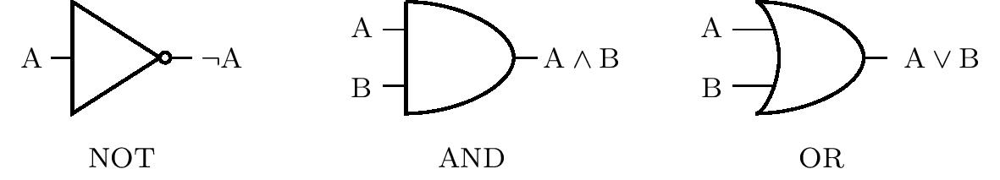
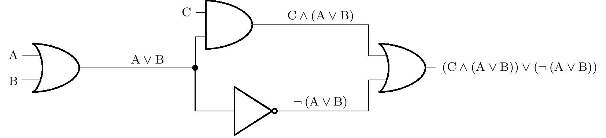
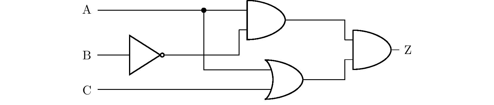
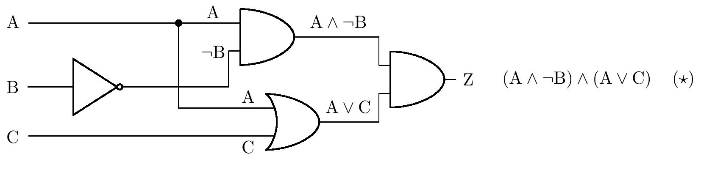
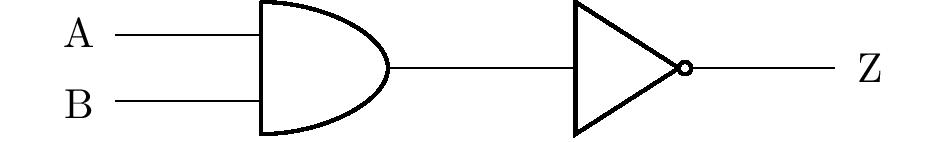
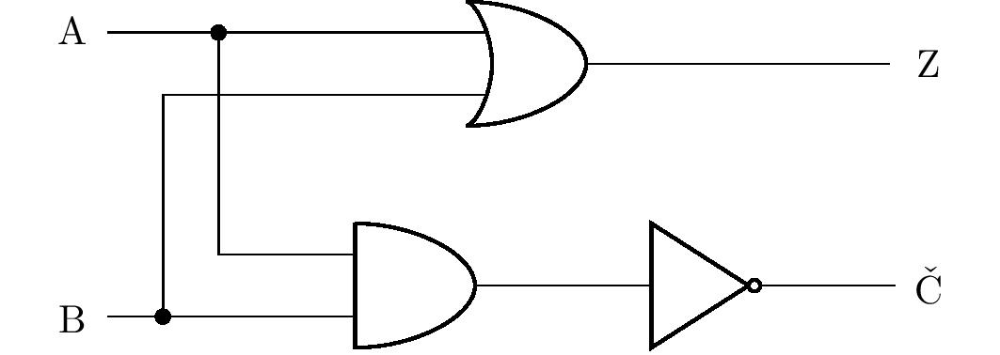
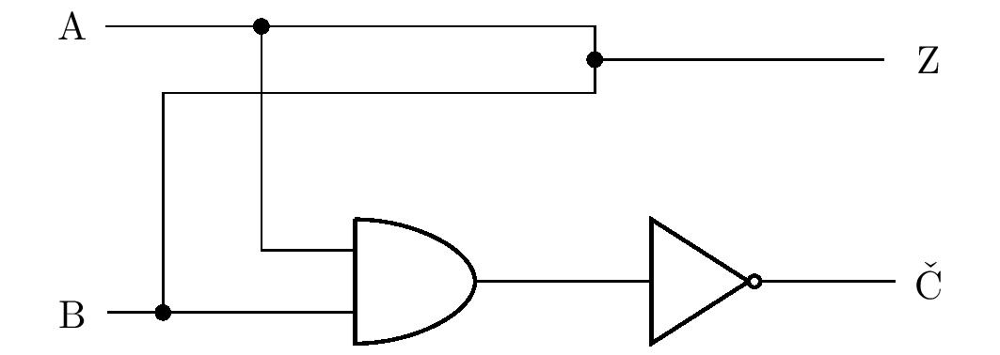
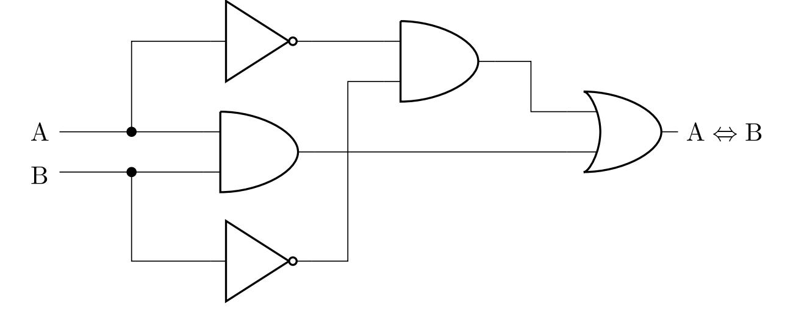
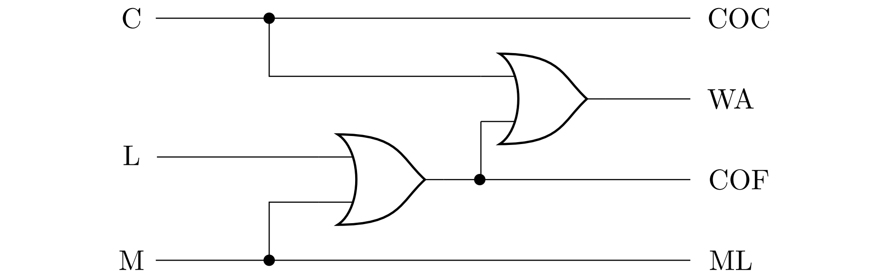
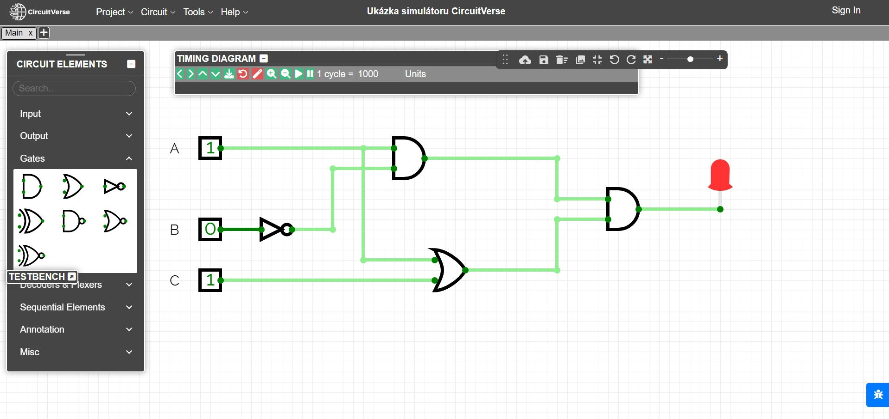

---
keywords:
- podstawy matematyki
- twierdzenia
- logika
is_finished: true
---

# Obwody logiczne

Które zaklęcie może włączyć właściwy wskaźnik świetlny w przeciążonej windzie,
przygotować pomarańczowy napój gazowany poprzez naciśnięcie przycisku na automacie,
wyłączyć światła w korytarzu domu po kilku minutach,
lub przesunąć postać na ekranie komputera?
Te i wiele innych rzeczywistych czynności jest obsługiwanych przez układy logiczne,
które omówimy bardziej szczegółowo w poniższej serii problemów.

Obwody logiczne składają się z tak zwanych bramek logicznych, które implementują operacje logiczne.
W ćwiczeniach będziemy pracować tylko z trzema podstawowymi bramkami logicznymi, a mianowicie NOT (negacja),
AND (koniunkcja) i OR (dysjunkcja).
Rysunek przedstawia ich odpowiednie symbole
(zgodnie z amerykańskim standardem ANSI/MIL) w obwodach logicznych.
Są one zorientowane tak, że kierunek wejścia jest z lewej strony.
Wejścia są rozumiane jako instrukcje, podczas gdy wyjścia są instrukcjami złożonymi.

Wartości prawdy są implementowane w obwodach logicznych za pomocą napięcia.
Niskie napięcie wskazuje wartość prawdy 0, podczas gdy wysoki poziom napięcia wskazuje wartość 1.
Na przykład, jeśli bramka AND ma niski poziom napięcia na wejściu A i
wysoki poziom napięcia na wejściu B, wyjściem jest poziom niskiego napięcia.
Konkretne wartości poziomów różnią się w zależności od konkretnego zastosowania obwodu.
Niski poziom około 0 V i wysoki poziom około 5 V są powszechne.

Na kolejnym rysunku widzimy reprezentację bardziej złożonego obwodu logicznego.
Dla przejrzystości, rysunek pokazuje również sekwencyjne łączenie instrukcji,
które odpowiadają wejściom lub wyjściom poszczególnych bramek.
Czarna kropka wskazuje węzeł, w którym obwód logiczny rozgałęzia się.
W ten sposób wyjście jednej bramki może być doprowadzone do wielu wejść w tym samym czasie.

W poniższych ćwiczeniach przełączniki lub przyciski można umieścić przed wejściami,
a żarówki mogą być umieszczone za wyjściami obwodu logicznego.
Przyjmijmy, że wartość logiczna na wejściu jest równa 1
wtedy i tylko wtedy, gdy przełącznik jest włączony lub przycisk jest naciśnięty.
Podobnie, żarówka zapala się wtedy i tylko wtedy, gdy na odpowiednim wyjściu jest wartość logiczna 1.

> **Zadanie 1.** W obwodzie przedstawionym na poprzednim rysunku przed wejściami A, B i C znajdują się przełączniki, a do wyjścia podłączona jest żarówka.
> Jeśli przełącznik C nie jest włączony, w jakiej pozycji muszą znajdować się przełączniki A i B, aby żarówka się zaświeciła?

\iffalse

*Rozwiązanie.* Niech $p(\mathrm{X})$ oznacza wartość prawdziwą stwierdzenia $\mathrm{X}$.
Z przypisania wiemy, że $p(\mathrm{C})=0$ i pytamy o wartości
$p(\mathrm{A})$ i $p(\mathrm{B})$ takich, że
$p\left[ \left(\mathrm{C}\wedge \left(\mathrm{A}\vee\mathrm{B}\right)\right)\vee \left( \neg\left(\mathrm{A}\vee\mathrm{B}\right)\right) \right]=1$. 
Rozwiążemy zadanie poprzez rozumowanie.

Jeśli $p(\mathrm{C})=0$ zachodzi, to koniecznie
$p(\mathrm{C}\wedge \left(\mathrm{A}\vee\mathrm{B}\right))=0$.Dlatego stwierdzenie
$\neg ( \mathrm{A}\vee \mathrm{B})$ musi być prawdziwe, a zatem $p(\mathrm{A}\vee \mathrm{B})=0$.
Jest to jednak możliwe wtedy i tylko wtedy, gdy stwierdzenia $\mathrm{A}$ i
$\mathrm{B}$ są fałszywe. Dlatego oba przełączniki muszą pozostać zamknięte.

\fi

> **Zadanie 2.** Obwód logiczny pokazany na poniższym rysunku ma przełączniki na wejściach A, B i C oraz żarówkę na wyjściu Z. Które przełączniki muszą być włączone, aby żarówka się zaświeciła?
>Znajdź wszystkie rozwiązania zadania. Jeśli przewody przecinają się na schemacie bez pokazania węzła, zakłada się, że nie ma rzeczywistego kontaktu między przewodami.

\iffalse

*Rozwiązanie.* Rozwiążemy ten problem za pomocą tablicy prawdy.
Z diagramu w zadaniu najpierw wyprowadzamy twierdzenie
składające się ze stwierdzeń $\mathrm{A}$, $\mathrm{B}$ i $\mathrm{C}$,
które będą równoważne stwierdzeniu $\mathrm{Z}$, patrz rysunek.

Dla instrukcji złożonej $\left( \star \right)$ tworzymy teraz tabelę prawdy:

| $\mathrm{A}$ |$\mathrm{B}$| $\mathrm{C}$  | $\mathrm{A}\wedge\neg\mathrm{B}$ | $\mathrm{A}\vee\mathrm{C}$ | $\left( \mathrm{A}\wedge\neg\mathrm{B}\right) \wedge \left( \mathrm{A}\vee\mathrm{C} \right)$|
| --- | --- | --- | ---- | ---- | ----- |
| $1$| $1$| $1$  | $\quad0$ | $\quad1$ | $\qquad\qquad0$ |
| $1$| $1$ | $0$  | $\quad0$ | $\quad1$ | $\qquad\qquad0$ |
| $1$| $0$ |$1$  | $\quad1$ | $\quad1$ | $\qquad\qquad1$ |
| $1$ |$0$ |$0$  | $\quad1$ | $\quad1$ | $\qquad\qquad1$ |
| $0$| $1$| $1$  | $\quad0$ | $\quad1$ | $\qquad\qquad0$ |
| $0$ |$1$| $0$  | $\quad0$ | $\quad0$ | $\qquad\qquad0$ |
| $0$| $0$| $1$  | $\quad0$ | $\quad1$ | $\qquad\qquad0$ |
| $0$| $0$| $0$  | $\quad0$ | $\quad0$ | $\qquad\qquad0$ |

Tabela pokazuje, że żarówka świeci, jeśli przełącznik
A jest zamknięty, a przełącznik B nie jest zamknięty w tym samym czasie.
Pozycja przełącznika C nie ma znaczenia.
Problem ten można również rozwiązać za pomocą równoważnych modyfikacji stwierdzenia
$\left(\star \right)$. Najpierw używamy prawa rozdzielności, a następnie tak zwanego prawa idempotentnego
$\mathrm{A}\wedge \mathrm{A}\Leftrightarrow \mathrm{A}$:

$$
\begin{alignat*}{3}
&&&\left( \mathrm{A}\wedge\neg\mathrm{B}\right) \wedge \left( \mathrm{A}\vee\mathrm{C} \right)
&&\quad\Leftrightarrow\\
&\Leftrightarrow\quad &&\left( \mathrm{A}\wedge\neg\mathrm{B}\wedge\mathrm{A}\right) \vee \left( \mathrm{A}\wedge\neg\mathrm{B}\wedge\mathrm{C}\right)
&&\quad\Leftrightarrow\\
&\Leftrightarrow\quad &&\left( \mathrm{A}\wedge\neg\mathrm{B}\right) \vee \left( \mathrm{A}\wedge\neg\mathrm{B}\wedge\mathrm{C}\right). && \tag{$\star\star$}
\end{alignat*}
$$

Jednak złożone stwierdzenie $\left( \star\star \right) $ jest prawdziwe wtedy i tylko wtedy, gdy koniunkcja $\mathrm{A}\wedge\neg\mathrm{B}$
jest prawdziwe wtedy i tylko wtedy, gdy koniunkcja $\mathrm{A}\wedge\neg\mathrm{B}$ jest prawdziwa,
tzn. jeśli $\mathrm{A}$ jest prawdziwym stwierdzeniem, a $\mathrm{B}$ jest fałszywym stwierdzeniem.
Nasuwa to ten sam wniosek dotyczący pozycji przełączników, który wyciągnęliśmy za pomocą tabeli.

\fi

> **Zadanie 3.** Zaprojektuj obwód logiczny, który w przypadku awarii jednej z dwóch pomp wodnych (lub obu) zapali lampkę ostrzegawczą na wyjściu obwodu.
> Dopóki pompa działa, wysyła sygnał odpowiadający logicznej jedynce do jednego z dwóch wejść obwodu.

\iffalse

*Rozwiązanie.* Oznaczmy $\mathrm{A}$ i $\mathrm{B}$ jako stwierdzenia
reprezentujące stan pierwszej i drugiej pompy.
Szukamy stwierdzenia $\mathrm{Z}$ złożonego z $\mathrm{A}$ i $\mathrm{B}$, którego tabelę prawdy znamy
z $\mathrm{A}$ i $\mathrm{B}$, którego tablicę prawdy znamy:

| $\mathrm{A}$ | $\mathrm{B}$ | $\mathrm{Z}$ |
| --- | --- | --- |
| $1$|$1$|$0$|
| $1$|$0$|$1$|
| $0$|$1$|$1$|
| $0$|$0$|$1$|

Tabela pokazuje, że równoważnym stwierdzeniem jest
$\neg\left( \mathrm{A} \wedge \mathrm{B}\right)$,
co odpowiada schematowi obwodu wynikowego na rysunku:

Zadanie ma więcej rozwiązań. Na przykład, korzystając z prawa de Morgana,
z poprzedniego wyniku otrzymujemy równoważne stwierdzenie $\neg\mathrm{A}\vee\neg\mathrm{B}$.
Stwierdzenie to można przedstawić za pomocą innego, ale równie poprawnego schematu obwodu.

\fi

> **Zadanie 4.** Zmodyfikuj urządzenie ostrzegawcze z poprzedniego ćwiczenia.
> Czerwone i zielone światła zostaną teraz podłączone do dwóch wyjść.
> Jeśli obie pompy działają, świeci się zielona kontrolka, a czerwona kontrolka jest wyłączona.
> Jeśli jedna z pomp ulegnie awarii, zapali się również czerwona lampka, a jeśli obie pompy ulegną awarii,
>świeci się tylko czerwona dioda. Zaprojektuj odpowiedni obwód logiczny.

\iffalse

*Rozwiązanie.* Podobnie jak w poprzednim zadaniu, oznaczmy $\mathrm{A}$ i $\mathrm{B}$ przez $\mathrm{A}$.
i $\mathrm{B}$ stwierdzenia reprezentujące stan pierwszej i drugiej pompy.
W ten sposób otrzymujemy tabelę prawdy wartości nieznanych stwierdzeń złożonych
$\mathrm{R}$ (światło czerwone) i $\mathrm{G}$ (światło zielone):

| $\mathrm{A}$ | $\mathrm{B}$ | $\mathrm{R}$ | $\mathrm{G}$ |
| --- | --- | --- |--- |
| $1$|$1$|$0$|$1$|
| $1$|$0$|$1$|$1$|
| $0$|$1$|$1$|$1$|
| $0$|$0$|$1$|$0$|

Widzimy, że kolumna dla wyrażenia $\mathrm{R}$ jest identyczna z kolumną dla wyrażenia $\mathrm{Z}$ z poprzedniego zadania (a zatem możemy przyjąć jego rozwiązanie), 
a kolumna dla stwierdzenia $\mathrm{G}$ odpowiada dysjunkcji
$\mathrm{A}\vee \mathrm{B}$. Używając węzłów i rozgałęziając obwód,
możemy narysować schemat odpowiedniego obwodu logicznego:

Podobnie jak poprzednie zadanie, to również ma wiele rozwiązań,
których poprawność zawsze można zweryfikować za pomocą tabeli prawdy.
Omówimy jednak jedno z rozwiązań bardziej szczegółowo.

Uczniowie mogą pomyśleć, że zamiast bramki OR, przewody
można połączyć prostym węzłem, jak pokazano na rysunku:

Jeśli na $\mathrm{A}$ lub $\mathrm{B}$ (lub na obu) znajduje się wartość $1$,
czy ta wartość może swobodnie przepływać do wyjścia $\mathrm{G}\,$?
W rzeczywistości tak nie jest. W pierwszym akapicie,
zauważyliśmy, że wartość prawdy $1$ jest realizowana przez wysoki poziom napięcia, a wartość $0$ przez jego niski poziom. 
Na przykład, jeśli na wejściu $\mathrm{A}$ występuje wysokie napięcie, a na wejściu $\mathrm{B}$ niskie napięcie.
i niskie napięcie na wejściu $\mathrm{B}$, w obwodzie wystąpi zwarcie,
ponieważ punkty o różnych napięciach są połączone przewodem.
Dlatego też, ogólnie rzecz biorąc, nie możemy łączyć wyjść różnych bramek za pomocą węzłów w obwodach logicznych.

\fi

> **Zadanie 5.** Zaprojektuj obwód logiczny z dwoma wejściami i jednym wyjściem, który wykonuje równoważność logiczną.
Rozwiązanie.* Aby skonstruować obwód, musimy znaleźć
równoważne $\mathrm{A}\Leftrightarrow\mathrm{B}$ z tą samą tabelą prawdy, która zawiera tylko spójniki lub negacje.

\iffalse

*Rozwiązanie.* Z definicji równoważności wynika, że jest ona prawdziwa wtedy i tylko wtedy, gdy stwierdzenia
$\mathrm{A}$ i $\mathrm{B}$ są prawdziwe lub fałszywe.
Czyli jest prawdziwe wtedy i tylko wtedy, gdy koniunkcja $\mathrm{A}\wedge\mathrm{B}$ jest prawdziwa lub koniunkcja $\neg\mathrm{A}\wedge\neg\mathrm{B}$ jest prawdziwa.

W ten sposób otrzymujemy równoważność
$$
\left( \mathrm{A}\Leftrightarrow\mathrm{B} \right)
\quad \Leftrightarrow \quad
\left( \mathrm{A}\wedge\mathrm{B} \right) \vee \left( \neg\mathrm{A}\wedge\neg\mathrm{B} \right),
$$
którego prawa strona jest stwierdzeniem zawierającym tylko spójniki, dysjunkcje i negacje. Możemy zatem skonstruować odpowiedni diagram:

Jedno z innych możliwych rozwiązań można uzyskać, stosując prawa de Morgana i równoważne modyfikacje poprzedniego wyniku do stwierdzenia
$\left( \mathrm{A}\wedge\mathrm{B} \right) \vee \neg \left( \mathrm{A}\vee\mathrm{B} \right)$. 
Techniczną zaletą tej formy jest mniejsza liczba niezbędnych bramek logicznych podczas implementacji obwodu.

\fi

> **Zadanie 6.** Po naciśnięciu odpowiedniego przycisku ekspres może przygotować trzy rodzaje napojów: lungo, macchiato i kakao.
>Napoje przygotowywane są poprzez zmieszanie czterech składników (gorącej wody, mleka, kawy i koncentratu kakaowego).
> Każdy składnik ma własną dyszę. Zaprojektuj obwód logiczny z trzema wejściami (po jednym dla każdego napoju) i czterema wyjściami (po jednym dla każdego zaworu dyszy), biorąc pod uwagę, że lungo jest przygotowywane z wody i koncentratu kawy, macchiato z wody, mleka i koncentratu kawy, a kakao z wody i koncentratu kakao.
> 
> Dla uproszczenia załóżmy, że nikt nie myśli o naciskaniu wielu przycisków w tym samym czasie, więc nie trzeba zajmować się takimi przypadkami. Składnik jest uwalniany do kubka dokładnie wtedy, gdy na odpowiednim wyjściu pojawi się logiczna jedynka.

\iffalse

*Rozwiązanie.* Oznaczmy przez $\mathrm{C}$ (kakao), $\mathrm{L}$ (lungo) i $\mathrm{M}$ (macchiato) instrukcje reprezentujące stan naciśnięcia odpowiedniego przycisku, a następnie oznaczmy $\mathrm{COC}$ (koncentrat kakaowy), $\mathrm{WA}$ (woda),
$\mathrm{COF}$ (koncentrat kawy) i $\mathrm{ML}$ (mleko) reprezentujące stan otwarcia odpowiedniej dyszy.
Na podstawie informacji zawartych w zadaniu utwórzmy tabelę prawdy:

| $\mathrm{C}$ |$\mathrm{L}$| $\mathrm{M}$  | $\mathrm{COC}$ | $\mathrm{WA}$ | $\mathrm{COF}$ | $\mathrm{ML}$|
|--|--|--|---|---|---|---|
|$1$ |$0$ |$0$ |$1$ |$1$ |$0$ |$0$|
|$0$ |$1$ |$0$ |$0$ |$1$ |$1$ |$0$|
|$0$ |$0$ |$1$ |$0$ |$1$ |$1$ |$1$|
|$0$ |$0$ |$0$ |$0$ |$0$ |$0$ |$0$|

Wiersze z więcej niż jedną cyfrą 1 w pierwszych trzech kolumnach nie są brane pod uwagę, ponieważ tylko jeden przycisk może być naciśnięty w danym momencie.

Tabela pokazuje, że równoważną parą stwierdzeń są $\mathrm{COC}$ i $\mathrm{C}$.
i $\mathrm{C}$, a inną równoważną parą są stwierdzenia $\mathrm{ML}$ i $\mathrm{M}$.
Stwierdzenie $\mathrm{COF}$ jest prawdziwe wtedy i tylko wtedy, gdy jedno ze stwierdzeń $\mathrm{L}$ 
lub $\mathrm{M}$ jest prawdziwe, tj. jest równoważne dysjunkcji $\mathrm{L}\vee\mathrm {M}$. 
Wreszcie, stwierdzenie $\mathrm{WA}$ jest prawdziwe wtedy i tylko wtedy, gdy którekolwiek z trzech stwierdzeń $\mathrm{C}$,
$\mathrm{L}$, $\mathrm{M}$ jest prawdziwe, to znaczy $\mathrm{WA}$ 
jest równoważne dysjunkcji $\mathrm{C}\vee\mathrm{L}\vee\mathrm{M}$.

Poniższy rysunek przedstawia schemat odpowiedniego obwodu - dysjunkcja
$\mathrm{C}\vee\mathrm{L}\vee\mathrm{M}$ jest realizowane przez wstawienie dwóch wyrażeń OR,
tj. jako $\mathrm{C}\vee\left( \mathrm{L}\vee\mathrm{M}\right)$.

\fi

Wszystkie wspomniane ćwiczenia można zilustrować na różnych symulatorach obwodów logicznych,
np. symulatorze online CircuitVerse. Na ostatnim rysunku obwód z ćwiczenia 2 jest modelowany za pomocą tego symulatora.
Możliwe jest również użycie specjalistycznych zestawów elektronicznych do ilustracji.

## Literatura

* Perrin J. P., Denouette M., Daclin E. *Logické systémy, díl I. Kombinační logické obvody. Úvod do sekvenčních obvodů*. Praha: SNTL. 1972
* *Online simulátor CircuitVerse*, https://circuitverse.org/simulator

