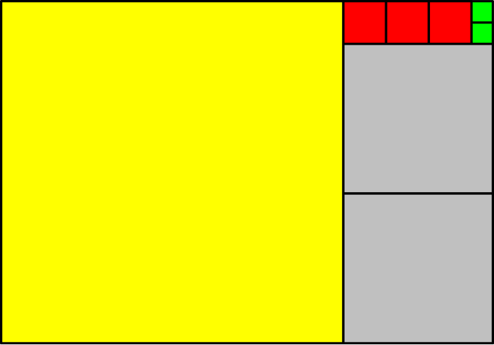
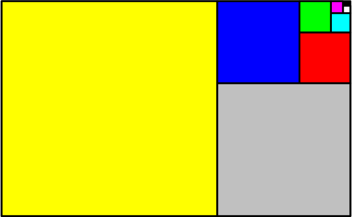

# Zlatý řez, řetězový zlomek a Fibonacciho posloupnost 

## Zlatý řez 

Dříve, než si objasníme, co přesně zlatý řez je, uveďme,  kde všude se s ním můžeme setkat. Pěkným příkladem je využití v umění. Zlatý řez totiž napomáhá dosáhnout esteticky působivých a harmonických kompozic, které jsou pro lidské oko přirozeně přitažlivé. Umělci a fotografové často využívají zlatý řez při rozvržení obrazu či fotografie, aby umístili klíčové prvky do bodů, které působí přirozeně vyváženě a dynamicky. Malíři, jako byl Leonardo da Vinci nebo Sandro Botticelli, jej záměrně používali ve svých dílech, například v Moně Lise nebo Zrození Venuše. Architekti pak integrují poměr zlatého řezu do návrhů budov a konstrukcí, aby docílili harmonických proporcí - příkladem může být Parthenon v Athénách nebo moderní stavby, které tento princip využívají pro dosažení vizuální rovnováhy a elegance.
Tento poměr se ale objevuje i v přírodě - například ve tvaru lastur, květů nebo uspořádání listů na stonku.  

**Definice zlatého řezu.** Mějme úsečku $AB$ a na ní bod $C$. Řekneme, že bod $C$ dělí úsečku $AB$ v poměru zlatého řezu (viz obrázek 1), 
jestliže pro délky uvažovaných úseček platí vztah
$$\frac{|AB|}{|AC|}=\frac{|AC|}{|CB|}.$$
Tento poměr (podíl $\frac{|AB|}{|AC|}$, který je stejný jako $\frac{|AC|}{|CB|}$) se často značí řeckým písmenem $\varphi$. 

> **Úloha 1.**
> Vypočtěte hodnotu poměru zlatého řezu $\varphi$.

\iffalse

*Řešení.* 
Předpokládejme, že úsečka $AB$ má délku $1$. Tuto úsečku rozdělíme bodem $C$ v poměru zlatého řezu. Potom platí

$$
 \varphi=\frac{|AB|}{|AC|}=\frac{|AC|}{|CB|}.
$$

Označme $x=|AC|$. Potom pro délku úsečky $CB$ platí $|CB|=1-x$ a tím získáme vztah

$$
\frac{1}{x} = \frac{x}{1-x},\tag{1}
$$

který má smysl pro $x\neq0 \text{ a } x\neq1$. 
Úpravou (1) dostaneme kvadratickou rovnici

$$
x^2 + x - 1 = 0,
$$

jejíž kořeny jsou

$$
x_{1,2} = \frac{-1 \pm \sqrt{5}}{2}.
$$

V našem případě záporná hodnota $x$ nemá smysl, neboť $x$ je délka úsečky a délka nemůže být záporná. Máme tedy jediné vyhovující řešení rovnice (1), a to 

$$
x = \frac{-1 + \sqrt{5}}{2}.
$$

Nyní můžeme vypočítat hodnotu zlatého řezu $\varphi$:

$$\varphi=\frac{|AB|}{|AC|}=\frac{1}{x} = \frac{1}{\frac{-1 + \sqrt{5}}{2}}=\frac{2}{\sqrt{5}-1}
$$

Usměrněním zlomku pak dostaneme
$$\varphi=\frac{\sqrt{5}+1}{2}\doteq1{,}618.$$

**Poznámka.** Mohli bychom postupovat i jinak. Vyjdeme z rovnosti $\frac{a+b}{a}=\frac{a}{b}$ (viz obrázek 1). Víme přitom, že $\frac{a}{b}=\varphi$, odkud jednoduchou úpravou získáme rovnici 

$$
\tag{2}
 1+\frac{1}{\varphi}=\varphi, 
$$

která vede na kvadratickou rovnici 

$$
 \varphi^2 - \varphi - 1 = 0. 
$$

Tato rovnice má dvě řešení 

$$
 \varphi_{1,2}=\frac{1 \pm \sqrt{5}}{2}. 
$$

Nás však zajímá pouze kladné řešení. Tím se dostáváme k tomu, že $\varphi=\frac{1+\sqrt{5}}{2}$.

\fi

## Řetězový zlomek

Řetězový zlomek je výraz typu

$$
 x = a_0 + \cfrac{1}{a_1 + \cfrac{1}{a_2 + \cfrac{1}{a_3 + \ddots}}},
$$

kde $a_0$ je celé číslo a $a_1, a_2, \dots\,$ jsou čísla přirozená. Řetězový 
zlomek může být konečný (někdy říkáme ukončený) i nekonečný (někdy říkáme neukončený). Je to podobné jako u desetinného rozvoje - ten také může být ukončený nebo neukončený.  

Lze ukázat, že zlatý řez je možné  vyjádřit nekonečným řetězovým zlomkem
$$\varphi = 1 + \cfrac{1}{1 + \cfrac{1}{1 + \cfrac{1}{1 + \ddots}}}.$$

> **Úloha 2.**
> Vypočítejte přibližné hodnoty zlatého řezu pomocí následujících konečných řetězových zlomků:
>
> 1. $$1 + \cfrac{1}{1 + \cfrac{1}{1 + \cfrac{1}{1}}}\$$
> 2. $$1 + \cfrac{1}{1 + \cfrac{1}{1 + \cfrac{1}{1 + \cfrac{1}{1}}}}$$

\iffalse

*Řešení.* 

1. $$1 + \cfrac{1}{1 + \cfrac{1}{1 + \cfrac{1}{1}}}= 1 + \cfrac{1}{1 + \cfrac{1}{2}}= 1 + \cfrac{1}{\frac{3}{2}}=\frac{5}{3}\doteq1{,}67$$
2. $$1 + \cfrac{1}{1 + \cfrac{1}{1 + \cfrac{1}{1 + \cfrac{1}{1}}}}=1 + \cfrac{1}{1 + \cfrac{1}{1 + \cfrac{1}{2}}}=1 + \cfrac{1}{1 + \cfrac{1}{\frac{3}{2}}}=1 + \cfrac{1}{\frac{5}{3}}=\frac{8}{5}=1{,}6$$

Dostali jsme relativně dobré racionální aproximace zlatého řezu $\varphi$. Zároveň si můžeme všimnout, že vypočtená racionální čísla $\frac{5}{3}$ a $\frac{8}{5}$  jsou podíly po sobě jdoucích členů Fibonacciho posloupnosti. Přitom již víme, že posloupnost takovýchto podílů konverguje právě ke zlatému řezu $\varphi$. 

\fi

> **Úloha 3.**
> Ukažte, že poměr zlatého řezu $\varphi$ splňuje následující rovnost: 
>
> $$
 \varphi = 1 + \cfrac{1}{1 + \cfrac{1}{1 + \cfrac{1}{\varphi}}}
>$$
>
\iffalse

*Řešení.* Jednou z možností, jak se přesvědčit, že $\varphi$ splňuje zadanou rovnost, je vyřešit rovnici 

$$
\tag{3}
 x = 1 + \cfrac{1}{1 + \cfrac{1}{1 + \cfrac{1}{x}}}  
$$

a ukázat, že $\varphi$ je jejím řešením.  

Rovnici postupně zjednodušíme: 

$$
\begin{aligned}
x &= 1 + \cfrac{1}{1 + \cfrac{1}{\frac{x+1}{x}}} \\ %\qquad\text{pro }x\neq0\\
x &= 1 + \cfrac{1}{1 + \cfrac{x}{x+1}} \\ %\qquad\text{pro }x\neq-1\\
x &= 1 + \cfrac{1}{\frac{x+1+x}{x+1}}\\
x &= 1 + \frac{x+1}{2x+1}\\
x &= \frac{3x+2}{2x+1}\\
\end{aligned}
$$
 
Celou rovnici přenásobíme výrazem ve jmenovateli a po úpravě získáme kvadratickou rovnici 

$$
 x^2 - x - 1 = 0.
$$

Její kořeny jsou
$$x_{1,2} = \frac{1 \pm \sqrt{5}}{2}.$$

Všimněme si, že výraz na pravé straně zadané rovnice i následně provedené úpravy mají smysl právě pro všechna $x \in \mathbb{R} \setminus \{0,-1,-\frac{1}{2}\}$, a tedy oba nalezené kořeny jsou řešením původní rovnice. 
Vidíme, že jedním z řešení je poměr zlatého řezu $\varphi$.

**Poznámka.** Ve skutečnosti bychom vůbec nemuseli rovnici $(3)$ řešit. Stačí pouze provést zkoušku pro $x=\varphi=\frac{1+\sqrt{5}}{2}$. Abychom se vyhnuli práci s odmocninami, můžeme postupovat ještě šikovněji. Z $(2)$ víme, že $1+\frac{1}{\varphi}=\varphi$. Odtud 

$$
 1+\cfrac{1}{1+\cfrac{1}{\varphi}}=1+\frac{1}{\varphi}=\varphi, 
$$

a proto 

$$
 1+\cfrac{1}{1+\cfrac{1}{1+\cfrac{1}{\varphi}}}=1+\frac{1}{\varphi}=\varphi. 
$$

\fi

### Geometrická interpretace řetězového zlomku

Lze ukázat, že každé číslo $x \in \mathbb{R}$ je možné vyjádřit řetězovým zlomkem. Navíc, pokud je číslo $x$ racionální, je tento řetězový zlomek konečný (ukončený), zatímco pro iracionální $x$ je řetězový zlomek nekonečný (neukončený).  

Uvažujme kladné racionální číslo $x$ a jeho vyjádření (konečným) řetězovým zlomkem 

$$
x = a_0 + \cfrac{1}{a_1 + \cfrac{1}{a_2 + \cfrac{1}{{\ddots+ \cfrac{1}{a_n}}}}}.
$$

Na příkladě si ukážeme geometrický význam čísel $a_0, a_1, a_2, \dots, a_n$. 

Uvažujme například zlomek $\frac{23}{16}$. Není těžké si rozmyslet, že tento zlomek lze psát ve tvaru řetězového zlomku následovně: 

$$
 \frac{23}{16}=1 + \cfrac{1}{2 + \cfrac{1}{3 + \cfrac{1}{2}}}
$$

Čísla $a_0=1$, $a_1=2$, $a_2=3$ a $a_3=2$ mají pěkný geometrický význam. 

Uvažujme obdélník se stranami $23$ a $16$, do kterého vepíšeme co největší čtverec, tj. čtverec o straně $16$ (na obrázku 2 níže je tento čtverec znázorněn žlutě). Tento čtverec se do našeho obdélníku vejde pouze jeden, tj. $a_0=1$. Poté nám zbyde obdélník o stranách $16$ a $7$. Do tohoto obdélníku opět vepíšeme co možná největší čtverec, tj. čtverec o straně $7$. Tyto čtverce (na obrázku 2 je vidíme znázorněné šedou barvou) se tam ale vejdou dva, tj. $a_1=2$. Nyní si snadno rozmyslíme, že dosud nemáme pokrytý obdélník o stranách $7$ a $2$. Do tohoto obdélníku vepíšeme čtverec o straně $2$ (větší se tam nevejde). Tyto čtverce se tam ale vejdou tři (červená barva), tj. $a_2=3$. Nakonec nám zbyde malý obdélník o stranách $2$ a $1$, který jsme schopni (již beze zbytku) vyplnit dvěma čtverci (zelené, o straně 1), tzn. $a_3=2$. 

>**Úloha 4.** Jak by to dopadlo, kdybychom výše popsaným způsobem chtěli pomocí čtverců vyplnit zlatý obdélník, tj. obdélník, který má poměr délek stran roven zlatému řezu $\varphi$?  Připomeňme, že 
>
>$$
 \varphi = 1 + \cfrac{1}{1 + \cfrac{1}{1 + \cfrac{1}{1 + \ddots}}}.
>$$

\iffalse

*Řešení.* 
Vyjádření zlatého řezu řetězovým zlomkem obsahuje samé jedničky, a proto při pokrývání zlatého obdélníku je použit vždy jeden čtverec dané velikosti (barvy), viz obrázek 3. Vzhledem k tomu, že je tento řetězový zlomek nekonečný, nelze zlatý obdélník výše popsaným způsobem pokrýt konečně mnoha čtverci. 

\fi

>**Úloha 5.** Formát papíru A (A0, A1, A2, $\dots$) má jednu pěknou vlastnost: Přeložíme-li papír na polovinu (překládáme delší stranu), dostaneme menší formát se stejným poměrem stran jako měl původní papír. Vypočtěte poměr stran tohoto papíru. 

\iffalse 

*Řešení.* Označme si delší stranu jako $x$ a kratší jako $y$. Po přeložení na polovinu dostaneme obdélník s rozměry $y$ a $\frac{x}{2}$. Protože přeložený papír má mít stejný poměr stran jako papír původní, obdržíme rovnici 

$$
 \frac{x}{y} = \frac{y}{\frac{x}{2}}, 
$$

ze které po úpravě dostaneme 

$$
 x^2=2y^2. 
$$

Proto pro poměr stran (jedná se o kladná čísla) původního papíru musí platit 

$$
 \frac{x}{y}= \sqrt{2}. 
$$

\fi

>**Úloha 6.** Zkuste podobným způsobem (pomocí čtverců) vyplnit list papíru formátu A. 
Pokud jste předchozí úlohu (úloha 5) nevyřešili, prozradíme, že poměr stran papíru formátu A je $\sqrt{2}$. Dále uveďme, že číslo $\sqrt{2}$ se dá řetězovým zlomkem vyjádřit takto:  
>
>$$
 \sqrt{2}=1 + \cfrac{1}{2 + \cfrac{1}{2 + \cfrac{1}{2 + \ddots}}}.
>$$

\iffalse

*Řešení.* 
Není těžké si promyslet, že při postupném pokrývání obdélníku s poměrem stran $\sqrt{2}$ nejprve umístíme jeden velký čtverec (v obrázku 4 je znázorněn žlutě) a poté použijeme vždy dva stejně velké čtverce (šedé, červené, modré, zelené, atd.) - viz obrázek 4 níže. 

Ve skutečnosti vše souvisí s tím, že vyjádření čísla $\sqrt{2}$ řetězovým zlomkem obsahuje jednu jedničku a poté samé dvojky. 
 
\fi

<!-- ZAPOZNÁMKOVÁNO 

Pěkným příkladem využití zlatého řezu v běžném životě je platební karta. Ta má přibližně tvar tzv. zlatého 
obdélníku (délky stran zlatého obdélníku jsou v poměru zlatého řezu). Zlatý obdélník je oblíbený tvar díky jeho 
vyváženému vzhledu; není ani příliš dlouhý, ani příliš široký.

KONEC ZAPOZNÁMKOVÁNÍ -->

## Fibonacciho posloupnost 

Zlatý řez úzce souvisí s Fibonacciho posloupností. Členy Fibonacciho posloupnosti jsou čísla 
$1$, $1$, $2$, $3$, $5$, $8$, $13$, $21$, $34$, $55$, $\dots$, kde každý další člen posloupnosti 
získáme součtem předchozích dvou členů. Jednotlivé prvky této posloupnosti označujeme také jako 
Fibonacciho čísla. A jaká je souvislost mezi Fibonacciho posloupností a zlatým řezem? Platí, že 
limita poměrů dvou po sobě jdoucích členů této posloupnosti je rovna právě zlatému řezu $\varphi$. 
Pro zajímavost uveďme, že $\frac{1}{1}=1$, $\frac{2}{1}=2$, $\frac{3}{2}=1{,}5$, $\frac{5}{3} \doteq 1{,}6667$, $\frac{8}{5} = 1{,}6$, $\frac{13}{8} = 1{,}625$, $\frac{21}{13} \doteq 1{,}6154$, $\frac{34}{21} \doteq 1{,}6190$, $\frac{55}{34} \doteq 1{,}6176$, atd. 

Pokud sestrojíme čtverce, jejichž délky stran odpovídají právě Fibonacciho číslům, je možné je 
pěkně uspořádat vedle sebe do tvaru obdélníku tak, jak je vidět na obrázku 5. Tento obdélník je blízký zlatému obdélníku, protože délky jeho stran jsou rovny dvěma po sobě jdoucím členům Fibonacciho posloupnosti. Do každého 
čtverce navíc můžeme vepsat čtvrtkružnici (viz obrázek 5) a dostat tak tzv. Fibonacciho spirálu. 

V přírodě se zlatý řez objevuje právě ve formě Fibonacciho posloupnosti. Můžeme ho najít v 
uspořádání listů na stoncích. Listy vyrůstají nad sebou tak, aby si navzájem nestínily, přechod od 
jednoho listu k dalšímu má charakter šroubovitého výstupu kolem stonku. Podobné uspořádání můžeme 
najít u šupin borové šišky, semen slunečnice nebo u kůry ananasu. Fibonacciho spirálu najdeme 
také ve schránkách měkkýšů či ve svinutém lístku kapradiny. Tento tvar dále mají tornáda, cyklóny i 
galaxie.

## Literatura

* Wikipedia. *Golden ratio* [online]. Dostupné z https://en.wikipedia.org/wiki/Golden_ratio [cit. 10.\,11.\,2023].
* Wikipedia. *Řetězový zlomek* [online]. Dostupné z https://cs.wikipedia.org/wiki/Řetězový_zlomek [cit. 10.\,11.\,2023].
* Czech Digital Mathematics Library. *Řetězové zlomky* [online]. Dostupné z  https://www.dml.cz/handle/10338.dmlcz/404015
