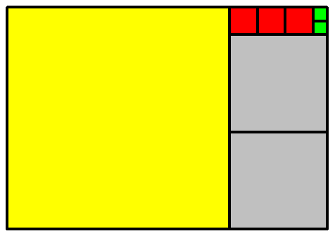

---
keywords:
- rovnice a nerovnice
- řetězový zlomek
- kvadratická rovnice
is_finished: true
difficulty: 1
time: 40
---

# Zlatý řez a řetězový zlomek

Mějme úsečku $AB$ a na ní bod $C$. Řekneme, že bod $C$ dělí úsečku $AB$ v poměru zlatého řezu, 
jestliže pro délky uvažovaných úseček platí vztah
$$\frac{|AB|}{|AC|}=\frac{|AC|}{|CB|}.$$
Tento poměr se často značí řeckým písmenem $\varphi$ a má hodnotu přibližně $1{,}618$. 

Pěkným příkladem využití zlatého řezu v běžném životě je platební karta. Ta má tvar tzv. zlatého 
obdélníka, jehož strany splňují poměr zlatého řezu. Zlatý obdélník je oblíbený tvar díky jeho 
vyváženému vzhledu; není ani příliš dlouhý, ani příliš široký.

Zlatý řez úzce souvisí s Fibonacciho posloupností. Členy Fibonacciho posloupnosti jsou čísla 
$1$, $1$, $2$, $3$, $5$, $8$, $13$, $21$, $34$, $55$, ..., kde každý další člen posloupnosti 
získáme součtem předchozích dvou členů. Jednotlivé prvky této posloupnosti označujeme také jako 
Fibonacciho čísla. A jaká je souvislost mezi Fibonacciho posloupností a zlatým řezem? Platí, že 
limita poměrů dvou po sobě jdoucích členů této posloupnosti je rovna právě zlatému řezu $\varphi$.

Pokud sestrojíme čtverce, jejichž délky stran odpovídají právě Fibonacciho číslům, je možné je 
pěkně uspořádat vedle sebe do tvaru zlatého obdélníka tak, jak je vidět na obrázku. Do každého 
čtverce pak můžeme vepsat čtvrtkružnici a dostáváme tzv. zlatou spirálu. Zlatá spirála je 
speciálním případem logaritmické spirály.

V přírodě se zlatý řez objevuje právě ve formě Fibonacciho posloupnosti. Můžeme ho najít v 
uspořádání listů na stoncích. Listy vyrůstají nad sebou tak, aby si navzájem nestínily, přechod od 
jednoho listu k dalšímu má charakter šroubovitého výstupu kolem stonku. Podobné uspořádání můžeme 
najít u šupin borové šišky, semen slunečnice nebo u kůry ananasu. Logaritmickou spirálu najdeme 
také ve schránkách měkkýšů či ve svinutém lístku kapradiny. Tento tvar dále mají tornáda, cyklóny i 
galaxie.

Zlatý řez je hojně využíván v umění pro dosažení esteticky působivých a harmonických kompozic. 
Malíři a fotografové používají tento poměr k určení umístění klíčových prvků ve svých obrazech. 
Architekti často integrují poměr zlatého řez do návrhů budov.

## Nekonečný řetězový zlomek

Nekonečný řetězový zlomek je výraz typu
$$x = a_0 + \cfrac{1}{a_1 + \cfrac{1}{a_2 + \cfrac{1}{a_3 + \ddots}}},$$
kde $a_0$ je celé číslo a čísla $a_i$ jsou kladná přirozená čísla pro $i\in\mathbb{N}$. Řetězový 
zlomek může být i v konečném tvaru.

Zlatý řez lze vyjádřit nekonečným řetězovým zlomkem
$$\varphi = 1 + \cfrac{1}{1 + \cfrac{1}{1 + \cfrac{1}{1 + \ddots}}}.$$

> **Úloha 1.**
> Vypočítejte přibližné hodnoty zlatého řezu pomocí následujících konečných řetězových zlomků
>
> 1. $$1 + \cfrac{1}{1 + \cfrac{1}{1 + \cfrac{1}{1}}}\,,$$
> 2. $$1 + \cfrac{1}{1 + \cfrac{1}{1 + \cfrac{1}{1 + \cfrac{1}{1}}}}\,.$$

\iffalse

*Řešení.* 

1. $$1 + \cfrac{1}{1 + \cfrac{1}{1 + \cfrac{1}{1}}}= 1 + \cfrac{1}{1 + \cfrac{1}{2}}= 1 + \cfrac{1}{\frac{3}{2}}=\frac{5}{3}\doteq1{,}67$$
2. $$1 + \cfrac{1}{1 + \cfrac{1}{1 + \cfrac{1}{1 + \cfrac{1}{1}}}}=1 + \cfrac{1}{1 + \cfrac{1}{1 + \cfrac{1}{2}}}=1 + \cfrac{1}{1 + \cfrac{1}{\frac{3}{2}}}=1 + \cfrac{1}{\frac{5}{3}}=\frac{8}{5}=1{,}6$$

\fi

> **Úloha 2.**
> Vypočtěte přesnou hodnotu zlatého poměru $\varphi$.

\iffalse

*Řešení.* 
Předpokládejme, že úsečka $AB$ má délku $1$. Tuto úsečku rozdělíme bodem $C$ v poměru zlatého řezu. Potom platí
$$\varphi=\frac{|AB|}{|AC|}=\frac{|AC|}{|CB|}.$$
Označme $x=|AC|$, tedy $x$ bude délka delšího úseku úsečky $AB$. Potom pro délku úsečky $BC$ platí $|BC|=1-x$ a tím získáme vztah
$$\frac{1}{x} = \frac{x}{1-x},\tag{1}$$
který má smysl pro $x\neq0 \text{ a } x\neq1$. Tyto krajní hodnoty však nemusíme vyšetřovat, protože poměr zlatého řezu zcela jistě nesplňují.
Úpravou (1) dostaneme kvadratickou rovnici
$$x^2 + x - 1 = 0,$$
jejíž kořeny jsou
$$x_{1,2} = \frac{-1 \pm \sqrt{5}}{2}.$$
V našem případě $x$ je délka úsečky, proto záporná hodnota $x$ nemá smysl. Máme tedy jediné vyhovující řešení rovnice (1)
$$x_1 = \frac{-1 + \sqrt{5}}{2}.$$
Nyní můžeme vypočítat hodnotu zlatého řezu $\varphi$:
$$\varphi=\frac{|AB|}{|AC|}=\frac{1}{x} = \frac{1}{\frac{-1 + \sqrt{5}}{2}}=\frac{2}{\sqrt{5}-1}.$$
Usměrněním zlomku pak dostaneme
$$\varphi=\frac{\sqrt{5}+1}{2}\doteq1{,}618.$$

\fi

> **Úloha 3.**
> Řešte rovnici inspirovanou zlatým řezem v konečném řetězovém zlomku
> $$ x = 1 + \cfrac{1}{1 + \cfrac{1}{1 + \cfrac{1}{x}}}. $$

\iffalse

*Řešení.* Nejprve rovnici postupně zjednodušíme.
$$
\begin{aligned}
x &= 1 + \cfrac{1}{1 + \cfrac{1}{\frac{x+1}{x}}}\qquad\text{pro }x\neq0\\
x &= 1 + \cfrac{1}{1 + \cfrac{x}{x+1}}\qquad\text{pro }x\neq-1\\
x &= 1 + \cfrac{1}{\frac{x+1+x}{x+1}}\\
x &= 1 + \frac{x+1}{2x+1}\\
x &= \frac{3x+2}{2x+1}\\
\end{aligned}
$$

Za podmínky $x\neq -\frac12$ odsud úpravou získáme kvadratickou rovnici 
$$2x^2 - 2x - 2 = 0.$$
Její kořeny jsou
$$x_{1,2} = \frac{1 \pm \sqrt{5}}{2}.$$
Všimněte si, že jedním z řešení je opět zlatý řez.

\fi

### Doplňující informace k řetězovým zlomkům

>**Vyjádření reálného čísla řetězovým zlomkem.** Lze ukázat, že každé číslo $x \in \mathbb{R}$ je možné vyjádřit řetězovým zlomkem. Navíc, pokud je číslo $x$ racionální, je tento řetězový zlomek konečný (ukončený), zatímco pro iracionální $x$ je řetězový zlomek nekonečný (neukončený).  

>**Geometrická interpretace řetězového zlomku.** Uvažujme kladné racionální číslo $x$ a jeho vyjádření (konečným) řetězovým zlomkem 
>
>$$
x = a_0 + \cfrac{1}{a_1 + \cfrac{1}{a_2 + \cfrac{1}{{\ddots+ \cfrac{1}{a_n}}}}}.
>$$
>
>Na příkladě si ukážeme geometrický význam čísel $a_0, a_1, a_2, \dots, a_n$. 
>
>Uvažujme například zlomek $\frac{23}{16}$. Není těžké si rozmyslet, že tento zlomek lze psát ve tvaru řetězového zlomku následovně: 
>
>$$
 \frac{23}{16}=1 + \cfrac{1}{2 + \cfrac{1}{3 + \cfrac{1}{2}}}
>$$
>
>Čísla $a_0=1$, $a_1=2$, $a_2=3$ a $a_3=2$ mají pěkný geometrický význam. 
>
>Uvažujme obdélník se stranami $23$ a $16$, do kterého vepíšeme co největší čtverec, tj. čtverec o straně $16$ (na obrázku níže je tento čtverec znázorněn žlutě). Tento čtverec se do našeho obdélníku vejde pouze jeden, tj. $a_0=1$. Poté nám zbyde obdélník o stranách $16$ a $7$. Do tohoto obdélníku opět vepíšeme co možná největší čtverec, tj. čtverec o straně $7$. Tyto čtverce (na obrázku je vidíme znázozněné šedou barvou) se tam ale vejdou dva, tj. $a_1=2$. Nyní si snadno rozmyslíme, že dosud nemáme pokrytý obdélník o stranách $7$ a $2$. Do tohoto obdélníku vepíšeme čtverec o straně $2$ (větší se tam nevejde). Tyto čtverce se tam ale vejdou tři (červená barva), tj. $a_2=3$. Nakonec nám zbyde malý obdélník o stranách $2$ a $1$, který jsme schopni (již beze zbytku) vyplnit dvěma čtverci (zelené, o straně 1), tzn. $a_3=2$. 
>
>
>

## Literatura

* Wikipedia. *Golden ratio* [online]. Dostupné z https://en.wikipedia.org/wiki/Golden_ratio [cit. 10.\,11.\,2023].
* Wikipedia. *Řetězový zlomek* [online]. Dostupné z https://cs.wikipedia.org/wiki/Řetězový_zlomek [cit. 10.\,11.\,2023].
