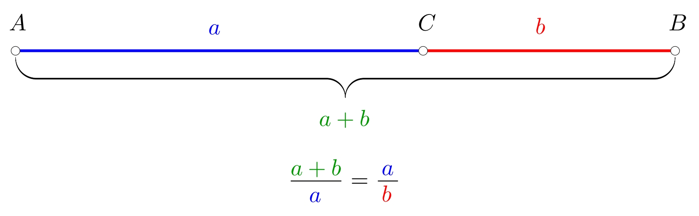
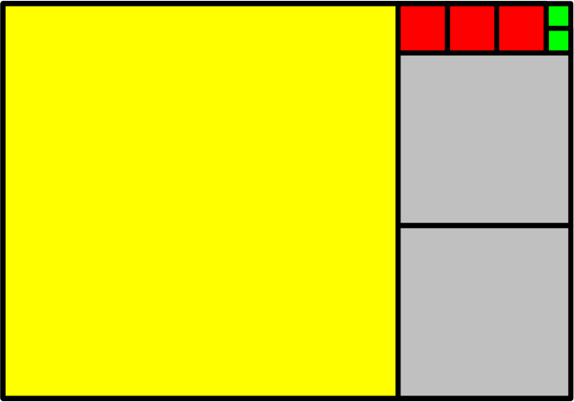
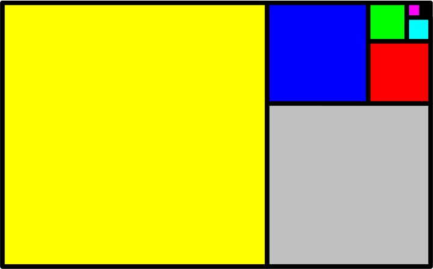
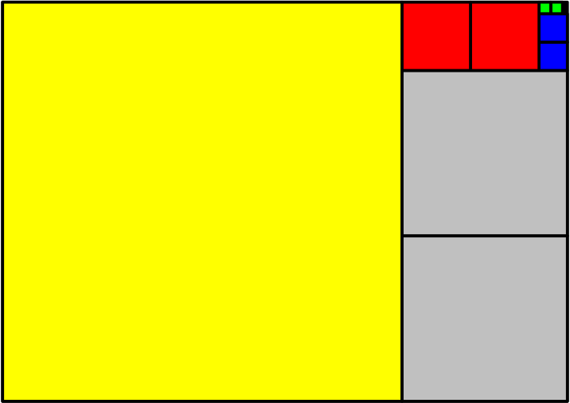
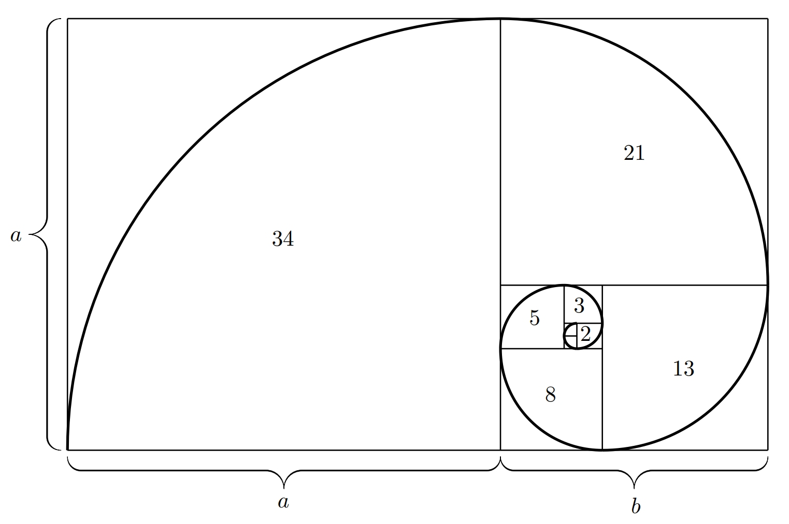

# The Golden Ratio, Continued Fraction, and the Fibonacci Sequence 

Before we explain exactly what the golden ratio means, let's see where we can encounter it. A beautiful example of its use is in the field of art. The golden ratio helps create aesthetically pleasing and harmonious compositions that are naturally attractive to the human eye. Artists and photographers often use it when arranging a painting or photograph so that key elements are placed in positions that look balanced and dynamic. Painters such as Leonardo da Vinci or Sandro Botticelli consciously applied this principle in their works—for example, in the *Mona Lisa* or *The Birth of Venus*. Architects also incorporate the golden ratio into building designs to achieve harmonious proportions. Examples include the Parthenon in Athens or modern buildings that use this principle to achieve visual balance and elegance. However, this ratio is not found only in human creations—it also appears in nature, for example in the shapes of shells, flowers, or the spiral arrangement of leaves on a stem.

## The Golden Ratio

**Definition of the golden ratio.** Let $AB$ be a line segment with a point $C$ on it. We say that $C$ divides $AB$ in the golden ratio (see Figure 1) if the lengths of the segments satisfy:

$$\frac{|AB|}{|AC|}=\frac{|AC|}{|CB|}.$$

This proportion (the ratio $\frac{|AB|}{|AC|}$, which is the same as $\frac{|AC|}{|CB|}$) is often denoted by the Greek letter $\varphi$. 

> **Task 1.**  
> Compute the value of the golden ratio $\varphi$.

*Solution.* Without loss of generality, we can assume that segment $AB$ has length $1$. We divide this segment with point $C$ in the golden ratio. Then we have:

$$
 \varphi = \frac{|AB|}{|AC|} = \frac{|AC|}{|CB|}.
$$

Let $x = |AC|$. Then the length of $CB$ is $|CB| = 1 - x$, giving the relation:

$$
\frac{1}{x} = \frac{x}{1-x}, \tag{1}
$$

which makes sense for $x \neq 0$ and $x \neq 1$. Rearranging (1), we get the quadratic equation

$$
x^2 + x - 1 = 0,
$$

whose roots are

$$
x_{1,2} = \frac{-1 \pm \sqrt{5}}{2}.
$$

The negative value does not make sense because $x$ is a segment length and cannot be negative. So we have only one valid solution:

$$
x = \frac{-1 + \sqrt{5}}{2}.
$$

Now we can calculate the value of the golden ratio $\varphi$:

$$
\varphi = \frac{|AB|}{|AC|} = \frac{1}{x} = \frac{1}{\frac{-1 + \sqrt{5}}{2}} = \frac{2}{\sqrt{5} - 1}.
$$

Rationalizing the denominator, we obtain:

$$
\varphi = \frac{\sqrt{5}+1}{2} \approx 1.618.
$$

**Note on the solution of Task 1.** Let us consider another approach, which is to start from the equality $\frac{a+b}{a} = \frac{a}{b}$ (see Figure 1). Since $\frac{a}{b} = \varphi$, a simple rearrangement gives:

$$
\tag{2}
1 + \frac{1}{\varphi} = \varphi.
$$

To find the value of $\varphi$, we solve this equation. Multiplying both sides by $\varphi$ and rearranging all terms to one side, we get the quadratic equation:

$$
\varphi^2 - \varphi - 1 = 0.
$$

This equation has two solutions:

$$
\varphi_{1,2} = \frac{1 \pm \sqrt{5}}{2}.
$$

We are only interested in the positive solution, so $\varphi = \frac{1+\sqrt{5}}{2}$.

In the introduction, we mentioned that the golden ratio can be found, for example, in the arrangement of leaves on a stem. Leaves grow in spirals around the stem to avoid shading each other and to receive as much light as possible. It turns out that the angle between two neighboring leaves is about $137.5^\circ$, which corresponds to the so-called *golden angle*, defined as follows:
If we divide a circle (full angle $360^\circ$) into two angles such that the ratio of the larger angle to the smaller angle equals the ratio of the full angle to the larger angle, then the smaller of these angles is called the golden angle. For the golden angle $\alpha$ (in degrees), we have:

$$
\frac{360 - \alpha}{\alpha} = \frac{360}{360 - \alpha},
$$

giving $\alpha \approx 137.5^\circ$. Compare this relation for the golden angle with the definition of the golden ratio.

## Continued Fraction

A continued fraction is an expression of the type:

$$
a_0 + \cfrac{1}{a_1 + \cfrac{1}{a_2 + \cfrac{1}{a_3 + \ddots}}},
$$

where $a_0$ is an integer and $a_1, a_2, \dots$ are natural numbers. A continued fraction may be finite (terminated) or infinite (non-terminated). This is similar to decimal expansions—they can also be finite (terminated) or infinite (non-terminated).

It can be shown that the value of the golden ratio $\varphi$ can be expressed as an infinite continued fraction:

$$
\varphi = 1 + \cfrac{1}{1 + \cfrac{1}{1 + \cfrac{1}{1 + \ddots}}}.
$$

> **Task 2.**  
> Compute approximate values of the Golden Ratio using the following finite continued fractions:
>
> 1. $$1 + \cfrac{1}{1 + \cfrac{1}{1 + \cfrac{1}{1}}}$$
> 2. $$1 + \cfrac{1}{1 + \cfrac{1}{1 + \cfrac{1}{1 + \cfrac{1}{1}}}}$$

*Solution.*

1. $$1 + \cfrac{1}{1 + \cfrac{1}{1 + \cfrac{1}{1}}} = 1 + \cfrac{1}{1 + \cfrac{1}{2}} = 1 + \cfrac{1}{\frac{3}{2}} = \frac{5}{3} \approx 1.67$$
2. $$1 + \cfrac{1}{1 + \cfrac{1}{1 + \cfrac{1}{1 + \cfrac{1}{1}}}} = 1 + \cfrac{1}{1 + \cfrac{1}{1 + \cfrac{1}{2}}} = 1 + \cfrac{1}{1 + \cfrac{1}{\frac{3}{2}}} = 1 + \cfrac{1}{\frac{5}{3}} = \frac{8}{5} = 1.6$$

These provide relatively good rational approximations of the golden ratio $\varphi$. More on rational approximations of $\varphi$ will be discussed in the section on the Fibonacci sequence.

> **Task 3.**  
> Show that the value of the golden gatio $\varphi$ satisfies:

$$
\varphi = 1 + \cfrac{1}{1 + \cfrac{1}{1 + \cfrac{1}{\varphi}}}.
$$

*Solution.* One way to show that $\varphi$ satisfies the given equality   is to solve the following equation

$$
x = 1 + \cfrac{1}{1 + \cfrac{1}{1 + \cfrac{1}{x}}}
$$

and check that $\varphi$ is a solution.  
 Simplify the equation step by step:

$$
\begin{aligned}
x &= 1 + \cfrac{1}{1 + \cfrac{1}{\frac{x+1}{x}}} \\
x &= 1 + \cfrac{1}{1 + \cfrac{x}{x+1}} \\
x &= 1 + \cfrac{1}{\frac{2x+1}{x+1}} \\
x &= 1 + \frac{x+1}{2x+1} \\
x &= \frac{3x+2}{2x+1} 
\end{aligned}
$$

Then, multiply both sides by the expression in the denominator and rearrange to get the quadratic equation:

$$
x^2 - x - 1 = 0.
$$

Its roots are:

$$
x_{1,2} = \frac{1 \pm \sqrt{5}}{2}.
$$

Všimněme si, že výraz na pravé straně rovnice $(3)$ i následně provedené úpravy mají smysl právě pro všechna $x \in \mathbb{R} \setminus \{0,-1,-\frac{1}{2}\}$, a tedy oba nalezené kořeny jsou řešením rovnice $(3)$. 
Vidíme, že jedním z řešení je poměr zlatého řezu $\varphi$.
Note that the expression on the right side of the equation $(3)$ and all the  next performed simplifications are valid for all $x \in \mathbb{R} \setminus \{0,-1,-\frac{1}{2}\}$.  Therefore, both  found  roots are valid solutions of the equation $(3)$.
One of these solutions is the golden ratio $\varphi$.

**Note on Task 3.** Another approach to prove the given equality holds is to use relation (2): $1 + \frac{1}{\varphi} = \varphi$.  Using that relation results in

$$
1 + \cfrac{1}{1 + \cfrac{1}{\varphi}} = 1 + \frac{1}{\varphi} = \varphi,
$$

and therefore:

$$
1 + \cfrac{1}{1 + \cfrac{1}{1 + \cfrac{1}{\varphi}}} = \varphi.
$$

### Geometric Interpretation of a Continued Fraction

It is possible to show that every real number $x \in \mathbb{R}$ can be represented as a continued fraction. Moreover, rational numbers give finite (terminating) continued fractions, while irrational numbers give infinite (non-terminating) continued fractions.  

Consider a positive rational number $x$ and its (finite) continued fraction representation:

$$
x = a_0 + \cfrac{1}{a_1 + \cfrac{1}{a_2 + \cfrac{1}{\ddots + \cfrac{1}{a_n}}}}
$$

Let's see the geometric meaning of $a_0, a_1, \dots, a_n$.

Take the fraction $\frac{23}{16}$. It is not difficult to realize that it can be written as the following continued fraction:

$$
\frac{23}{16} = 1 + \cfrac{1}{2 + \cfrac{1}{3 + \cfrac{1}{2}}}
$$

Numbers $a_0 = 1$, $a_1 = 2$, $a_2 = 3$, $a_3 = 2$ have a nice geometric meaning.  

Consider a rectangle of sides $23$ and $16$, and inscribe the largest possible square, meaning a square of side $16$, (see the square colored in yellow in Figure 2). Only one such square fits into our rectangle, so $a_0 = 1$. Remaining empty rectangle has sides $16 $ and $7$. Again, inscribe largest possible square.  In this case a square  of side $7$.Two such squares fit (grey in Figure 2), so $a_1 = 2$. Remaining rectangle has sides $7$ and  $2$ so the largest square that fits is of side  $2$. Three of such squares fit (red color), so $a_2 = 3$. Remaining rectangle has sides $2$  and $1$ and is filled with two unit squares (green color), $a_3 = 2$.

> **Task 4.** How would this work if we tried to fill a golden rectangle, meaning the rectangle with sides whose proportion is golden ratio $\varphi$,. using squares as above? Recall:

$$
\varphi = 1 + \cfrac{1}{1 + \cfrac{1}{1 + \cfrac{1}{1 + \ddots}}}.
$$

*Solution.* The continued fraction of $\varphi$ contains only ones. So when filling a golden rectangle, we always use one square of each size (one square of each color, as seen in Figure 3). Since the fraction is infinite (non-terminating), the rectangle cannot be completely covered in the manner described above with a finite number of squares.

> **Task 5.** A-format paper (A0, A1, A2, …) has a certain nice property: folding it in half along the longer side produces a smaller format with the same side ratio as the original. Compute the side ratio of this paper.

*Solution.* Let the longer side be $x$ and the shorter $y$. After folding, the dimensions of the paper are $y \times x/2$. The fact that the folded paper has the same side ratio as the original paper yields equation

$$
\frac{x}{y} = \frac{y}{x/2}, 
$$

which simplified gives
$$
 x^2 = 2y^2. \implies \frac{x}{y} = \sqrt{2}.
$$
Therefore, the side ratio (positive values) of the original paper is

$$
 \frac{x}{y} = \sqrt{2}.
$$

>**Problem 6.** Try to fill a sheet of A-format paper using squares in a similar way.  
If you did not solve the previous problem (Problem 5), we reveal that the side ratio of A-format paper is $\sqrt{2}$. Let us also mention that the number $\sqrt{2}$ can be expressed as an infinite continued fraction as follows:  
>
>$$
 \sqrt{2}=1 + \cfrac{1}{2 + \cfrac{1}{2 + \cfrac{1}{2 + \ddots}}}
>$$

\iffalse

*Solution.*  
The continued fraction contains one “1” and then only “2”s. Therefore, when covering a rectangle with side ratio $\sqrt{2}$ step by step, we first place one large square (shown in yellow in Figure 4), and then we always use two squares of the same size (gray, red, blue, green, etc.)—see Figure 4 below.

Since the continued fraction is infinite, the sheet cannot be covered by a finite number of such squares.  

\fi

<!-- COMMENTED OUT 

A nice example of using the golden ratio in everyday life is a payment card. Its shape is approximately that of a so-called golden rectangle (the side lengths of a golden rectangle are in the ratio of the golden ratio). The golden rectangle is a popular shape because of its balanced appearance; it is neither too long nor too wide.

END OF COMMENT -->

## The Fibonacci Sequence

The golden ratio is closely related to the Fibonacci sequence. The terms of the Fibonacci sequence are the numbers

$$
1, 1, 2, 3, 5, 8, 13, 21, 34, 55, \dots,
$$

where each new term is obtained by adding the two previous terms.  
Individual terms of this sequence are also called Fibonacci numbers.

And what is the connection between the Fibonacci sequence and the golden ratio?  
For better understanding, consider the sequence of ratios of two consecutive Fibonacci numbers, and write down the first several terms of this new sequence:

$$
\begin{gathered}
\frac{1}{1}=1, \quad \frac{2}{1}=2, \quad \frac{3}{2}=1{.}5, \quad \frac{5}{3} \doteq 1{.}6667, \quad \frac{8}{5} = 1{.}6, \quad \frac{13}{8} = 1{.}625, \\[3mm] 
\frac{21}{13} \doteq 1{.}6154, \quad \frac{34}{21} \doteq 1{.}6190, \quad \frac{55}{34} \doteq 1{.}6176, \; \dots
\end{gathered}
$$ 

It can be shown that the limit of this sequence is exactly the golden ratio $\varphi=\frac{1+\sqrt{5}}{2} \doteq 1{.}6180$.

In nature, the golden ratio often appears together with the Fibonacci sequence (the ratios of two consecutive terms of this sequence approach the golden ratio).  
Examples include the arrangement of seeds in sunflowers or the scales of pine cones. The number of spirals that go in one direction and the number of spirals that go in the opposite direction are always two consecutive Fibonacci numbers. For instance, you may count $8$ spirals clockwise and $13$ spirals counterclockwise on a pine cone (the numbers $8$ and $13$ are consecutive Fibonacci numbers). In sunflowers the spirals may be in ratios such as $34\!:\!55$ or $55\!:\!89$. This kind of arrangement allows for optimal use of space so that each seed or scale has enough room and maximum access to light.

Finally, let us describe the construction of the so-called Fibonacci spiral, which also often appears in nature. If we construct squares whose side lengths correspond to Fibonacci numbers, we can arrange them neatly next to each other to form a rectangle, as shown in Figure 5. This rectangle is close to a golden rectangle because its side lengths are equal to two consecutive Fibonacci numbers. Now draw a quarter-circle inside each square (see Figure 5). In this way, we obtain the Fibonacci spiral.

We can find the Fibonacci spiral in some mollusk shells or in the curled fronds of ferns. All these spirals represent efficient and harmonious growth patterns that preserve their proportions and shape. Even large natural phenomena, such as tornadoes, cyclones, or spiral galaxies, show a similar shape.

## References
* Wikipedia. *Golden ratio* [online]. Available from https://en.wikipedia.org/wiki/Golden_ratio [accessed 10 Nov 2023].  
* Wikipedia. *Řetězový zlomek (Continued fraction)* (Czech: Řetězový zlomek) [online]. Available from https://cs.wikipedia.org/wiki/Řetězový_zlomek [accessed 10 Nov 2023].  
* Czech Digital Mathematics Library. *Řetězové zlomky (Continued Fractions)* (Czech: Řetězové zlomky) [online].  
Available from https://www.dml.cz/handle/10338.dmlcz/404015

