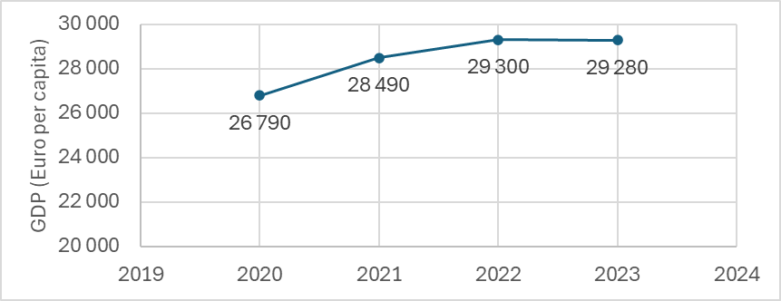

---
keywords:
- arithmetic mean
- geometric mean
- statistics
is_finished: False
---

# Description of GDP Trends

Gross Domestic Product (GDP) represents the monetary value of all goods and services newly produced within a specific area during a given period. In macroeconomics, GDP is used as an indicator to assess the performance of national economies. For example, it can be used to compare the economic performance of European Union member states in 2023 (see Figure 1).

Another way to use GDP is to track a country's performance over time. For example, we can examine the GDP per person for the European Union from 2020 to 2023 when the EU had 27 member states (see Figure 2). The time series illustrating this trend is shown in Figure 2. *(Data source: [2])*

A time series showing GDP trends is referred to as an interval-based time series. The data in such a series depend on the length of the analyzed interval (in this case, on the length of the given year).

Let the values $y_1,\,y_2,\,\ldots\,y_n$ of the time series correspond to the time points  $t_1,\,t_2,\,\ldots\,t_n$. 

The primary characteristic used to describe this time series is its mean.

The **Mean of an Interval-Based Time Series ($\bar{y}$)**
is calculated as a simple arithmetic mean:

$$
\bar{y} = \frac{y_1 + y_2 + \dots + y_n}{n}. \tag{1}
$$  

Besides the mean, we are often interested in the basic measures of time series dynamics, which help characterize the fundamental features of their behavior.

The **Absolute Change ($\Delta y_t$)**
is the simplest measure of change in a time series, which tells us "by how much" the series changed between time points:

$$
\Delta y_t = y_t - y_{t-1}, \quad t = 2,3, \dots, n.\tag{2}
$$  

The **Average Absolute Change ($\bar{\Delta}$)**
indicates the average change between two measurements during the observed period.

The sum of absolute changes represents the total change in the time series over observed period (“by how much” the time series changed from $t_1$ to $t_n$):
$$
\Delta y_2 + \Delta y_3 + \dots + \Delta y_n = (y_2 - y_1) + (y_3 - y_2) + \dots + (y_n - y_{n-1}) = y_n - y_1.
$$

Therefore, the average absolute change is calculated as the arithmetic mean of absolute changes: 

$$
\bar{\Delta} = \frac{\Delta y_2 + \Delta y_3 + \dots + \Delta y_n}{n-1} = \frac{y_n - y_1}{n-1}.\tag{3]}
$$

Notice, this calculation only requires the initial value $y_1$, the final value $y_n$, and the number
of values $n$.

 **Growth Coefficients (Growth Rates, $k_t$)** indicate "how many times" the series changed between time points:

$$
k_t = \frac{y_t}{y_{t-1}}, \quad t = 2,3, \dots, n.\tag{4}
$$  

The **Average Growth Coefficient ($\bar{k}$)**
indicates the average factor by which the series changed between measurements during the observed period.

In this case, the overall growth coefficient (“how many times” the time series changed between times $t_1$ a $t_n$) is calculated not as the sum but as the product of the individual growth coefficients:

$$
k_2 \cdot k_3 \cdot \dots \cdot k_n = \frac{y_2}{y_1} \cdot \frac{y_3}{y_2} \cdot \dots \cdot \frac{y_n}{y_{n-1}} = \frac{y_n}{y_1},
$$

Therefore, the average growth coefficient is determined as the geometric mean of the individual growth coefficients:

$$
\bar{k} =\sqrt[n-1]{k_2 \cdot k_3 \cdot \dots \cdot k_n} =\sqrt[n-1]{\frac{y_n}{y_1}}.\tag{5}
$$  

As with the average absolute change, only the initial value $y_1$, final value $y_n$, and the number of values $n$  are needed for this calculation.

The **Relative Change ($\delta_t$)**:
If we want to know 'by what percentage' the time series changed between individual time points, we use relative changes, which can easily be determined using growth coefficients:

$$
\delta_t = \frac{\Delta y_t}{y_{t-1}} \cdot 100 = \frac{y_t - y_{t-1}}{y_{t-1}} \cdot 100 = \left(\frac{y_t}{y_{t-1}} - 1\right) \cdot 100 = (k_t - 1) \cdot 100, \quad t = 2,3, \dots, n \tag{6}
$$

For example, if the price of a product increases by a factor of $1.5$, the percentage increase is $50\% (=(1.5-1)\cdot100)$.

The **Average Relative Change ($\bar{\delta}$)**

It indicates "by what percentage" the time series changed on average during the period between two measurements within the observed time period can then be easily calculated using the average growth coefficient:

$$
\bar{\delta} = (\bar{k} - 1) \times 100.\tag{7}
$$  

*Note* The sum (or product) of individual relative changes is not equal to the total relative change ("by what percentage" the time series changed between times $t_1$ and $t_n$). Therefore, the arithmetic or geometric mean of individual relative changes cannot be used to calculate the average relative change.

Now, let us attempt a basic description of the time series representing GDP trends (in euros per person), as shown in Figure 2.

> **Exercise 1.** Determine the average annual GDP (in euros per person) of the European Union for the years 2020 to 2023.

\iffalse

*Solution.* As stated in equation (1), the average annual GDP is calculated as the simple arithmetic mean of the analyzed time series:

$$
\bar{y} = \frac{y_1 + y_2 + y_3 + y_4}{4} = \frac{26\,790 + 28\,490 + 29\,300 + 29\,280}{4} \approx 28\,465.
$$

From 2020 to 2023, the average annual GDP of the European Union was approximately €$28\,465$ per person.

\fi

> **Exercise 2.** Determine the annual GDP changes (in euros per person) of the European Union from 2020 to 2023 and the corresponding average annual GDP change for this period.

\iffalse

*Solution.*  Annual GDP changes indicate "by how much" the GDP changed year over year. These   changes are determined as absolute changes according to equation (2), as shown in 
Table 1.

| Year  | GDP (Euro/person) | Annual GDP Change (Euro/person) |
|-------|------------------|---------------------------------|
| 2020  | 26 790          | ---                             |
| 2021  | 28 490          | 28 490 - 26 790 = 1 700                           |
| 2022  | 29 300          | 29 300 - 28 490 = 810                             |
| 2023  | 29 280          | 28 280 - 29 300 = -20                             |
| **Average** | **28 465** | **830** |

-	 In 2021, the annual GDP per person in the European Union increased by €1 700.
-	 In 2022, the annual GDP increase was €810 per person.
-	 In 2023, there was a slight decrease in annual GDP of €20 per person.

Now, we can determine the average annual GDP change using equation (3), either by calculating the arithmetic mean of the annual changes or by using only the initial and final values of the analyzed time series:

$$
\bar{\Delta} = \frac{\Delta y_2 + \Delta y_3 + \Delta y_4}{4-1} = \frac{1,700 + 810 + (-20)}{3} = 830
$$
or  
$$
\bar{\Delta} = \frac{y_4 - y_1}{4-1} = \frac{29,280 - 26,790}{3} = 830.
$$

From 2020 to 2023, the GDP in the European Union increased by an average of €830 per person per year.

The average change can also be interpreted as follows: If the GDP had increased by exactly €830 per person every year from the initial value in 2020, the GDP in 2023 would have reached the observed final value.

Suppose we know that the average annual GDP increase from 2020 to 2023 was €830 per person, and in 2020, the GDP per person was €26,790. Since there were three annual changes in this period, we can conclude that in 2023, the GDP per person was:
$$
26\, 790+3\cdot830=29\, 280 \,\text{(Euro per person}).
$$

\fi

> **Exercise 3.** Determine the annual GDP growth rates of the European Union from 2020 to 2023 and the corresponding average GDP growth rate for this period.

\iffalse

*Solution.* Annual GDP growth rates indicate "by how much" the GDP changed year over year. These rates are calculated as growth coefficients according to equation (4), as shown in Table 2.

| Year      | GDP (Euro/person)    | Annual GDP Change (Euro/person) | Growth Rate (-)                                  |
|-----------|----------------------|---------------------------------|--------------------------------------------------|
| 2020      |  26 790           |  ---                        |  ---                                        |
| 2021      |  28 490           |  1700                      | $\frac{28\,490}{26\,790} \approx 1.063$        |
| 2022      |  29 300           |  810                        |  $\frac{29\,300}{28\,490} \approx 1.028$        |
| 2023      |  29 280           |  -20                       | $\frac{29\,280}{29,300} \approx 0.999$        |
| **Average** | **28 465** | **830**              |  ---                                         |

-	 In 2021, the GDP in the European Union increased approximately 1.063 times, meaning a 6.3% annual growth.
-	 In 2022, the GDP increased approximately 1.028 times, meaning a 2.8% annual growth.
-	 In 2023, the GDP increased approximately 0.999 times, indicating a 0.1% annual decrease.

Now, we can determine the average annual GDP growth rate using equation (5), either by computing the geometric mean of the individual annual growth rates or by using only the initial and final values of the analyzed time series:

$$
\bar{k} = \sqrt[n-1]{k_2 \cdot k_3 \cdot k_4} = \sqrt[3]{1.063 \cdot 1.028 \cdot 0.999} \approx 1.030
$$

or

$$
\bar{k} = \sqrt[n-1]{\frac{y_4}{y_1}} = \sqrt[3]{\frac{29,280}{26,790}} \approx 1.030
$$

From 2020 to 2023, the average annual GDP growth rate (in euros per person) in the European Union was 1.030, meaning that GDP grew on average by 3.0% per year.

*Note.* If we compute the average growth rate as the geometric mean of the individual growth coefficients in Table 2, we introduce rounding errors. Therefore, it is recommended to use only the initial and final values of the analyzed time series for this calculation.

The average growth rate can also be interpreted as follows: If the GDP had increased by exactly 1.030 times each year from the initial value in 2020, the GDP in 2023 would have reached the observed final value.

Suppose we know that the average GDP growth rate from 2020 to 2023 was approximately 1.030, and in 2020, the GDP per person was €26,790. Since there were three annual changes in this period, we can conclude that in 2023, the GDP per person was approximately:
$$
26\, 790\cdot 1.030^3≈29\, 274 \, \text{(Euro per person)}.
$$

Since we used a rounded value for the average growth rate in our calculation, this introduces a small error. Given that we know the actual GDP in 2023 (€29,280 per person), we can determine the error introduced. In this case, we underestimated the actual GDP by €6 per person, or about 0.02%.

\fi

> **Exercise 4.** Determine the annual relative GDP growth rates of the European Union from 2020 to 2023 and the corresponding average relative GDP growth rate for this period.

\iffalse

*Solution.* This task has already been solved in the interpretation of the growth rates determined in Task 3. If we state that GDP increased 1.063 times in 2021, this is equivalent to saying that GDP grew by 6.3% in that year. 

Equations (6) and (7) also express how the relative growth rate in percentage terms (or the average relative growth rate) is related to the growth rate (or the average growth rate).
The results are summarized in Table 3.

| Year      | GDP (Euro/person)    | Annual GDP Change (Euro/person) | Growth Rate (-)  | Relative Growth Rate (%) |
|-----------|----------------------|---------------------------------|------------------|--------------------------|
| 2020      | 26 790               | ---                             | ---              | ---                      |
| 2021      | 28 490               | 1,700                           | 1.063            | 6.3                      |
| 2022      | 29 300               | 810                             | 1.028            | 2.8                      |
| 2023      | 29 280               | -20                             | 0.999            | -0.1                     |
| **Average** | **28 465**           | **830**                         | **1.030**        | **3.0**                  |

\fi

## Literature
* *Real GDP per Capita* [online], Eurostat, 2024, Available at: https://ec.europa.eu/eurostat/databrowser/view/sdg_08_10/default/table. [Accessed: 2024-12-18].
*  *Hrubý domácí produkt (HDP) - metodika,* [online], Český statistický úřad, 2024, Available at: https://www.czso.cz/csu/czso/hruby_domaci_produkt_-hdp- [Accessed: 2024-12-18]

