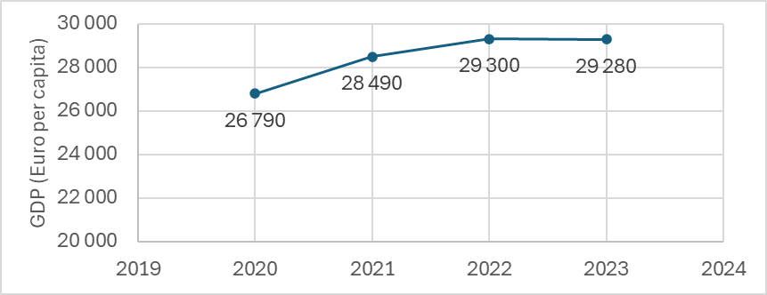

---
keywords:
- combinatoria, probabilidad y estadística
- media aritmética
- media geométrica
- estadística
is_finished: true
---

# Descripción de la evolución del PIB

El Producto Interior Bruto (PIB) es una expresión monetaria del valor total de los bienes y servicios de nueva creación en un periodo dado en un territorio determinado. En macroeconomía, el PIB se utiliza como indicador para determinar el rendimiento de la economía de un país. Así, puede utilizarse, por ejemplo, para comparar los resultados de los distintos países de la Unión Europea en 2023 (véase el gráfico 1).

Otro uso es el seguimiento de los resultados de los países a lo largo del tiempo. Veamos ahora, por ejemplo, cómo evolucionó el PIB per cápita de la Unión Europea entre 2020 y 2023, cuando la Unión Europea contaba con 27 Estados miembros. La serie temporal que ilustra esta evolución puede verse en la Figura 2.

La serie temporal representada por la evolución del PIB es una **serie temporal de intervalo**, es decir, una serie temporal cuyos datos dependen de la duración del intervalo seguido (en este caso, la duración del año en cuestión). 

Sean las marcas de tiempo $t_1,\,t_2,\,\ldots\,t_n$ correspondientes a los valores de la serie temporal $y_1,\,y_2,\,\ldots\,y_n$.

La característica básica que utilizamos para describir esta serie temporal es su media. 

**Media de series temporales de intervalos** ($\bar{y}$)
Se calcula como la media aritmética simple
$$\bar{y} = \frac{y_1 + y_2 + \dots + y_n}{n}. \tag{1}$$  
Además de la media, a menudo nos interesan medidas básicas de la dinámica de las series temporales que nos permitan caracterizar los rasgos básicos de su "comportamiento".

**Incrementos absolutos** ($\Delta y_t$) son la medida más sencilla de la dinámica. Nos dice «cuánto» ha cambiado la serie temporal entre cada momento.
$$\Delta y_t = y_t - y_{t-1}, \quad t = 2,\,3, \,\dots,\, n.\tag{2}$$  

**Incremento medio absoluto** ($\bar{\Delta}$) indica "cuánto" ha cambiado por término medio la serie temporal entre dos mediciones durante el período de observación. 

La suma de los incrementos absolutos representa el cambio total de la serie temporal a lo largo del período de interés ("cuánto" ha cambiado la serie temporal entre los momentos $t_1$ a $t_n$):
$$
\Delta y_2 + \Delta y_3 + \dots + \Delta y_n = (y_2 - y_1) + (y_3 - y_2) + \dots + (y_n - y_{n-1}) = y_n - y_1.
$$

Por lo tanto, el incremento medio absoluto se determina como la media aritmética de los incrementos absolutos: 

$$
\bar{\Delta} = \frac{\Delta y_2 + \Delta y_3 + \dots + \Delta y_n}{n-1} = \frac{y_n - y_1}{n-1}.\tag{3}
$$

Nótese que para el cálculo basta con conocer el valor inicial de $y_1$, el valor final de $y_n$ y el número de valores de $n$.

**Coeficientes de crecimiento** (**tasas de crecimiento**, $k_t$) son otra medida de la dinámica de las series temporales. Indican "cuántas veces" ha cambiado la serie temporal entre los puntos temporales

$$
k_t = \frac{y_t}{y_{t-1}}, \quad t = 2,\,3,\, \dots,\, n.\tag{4}
$$  

**Coeficiente medio de crecimiento** ($\bar{k}$)
nos dice "cuántas veces" ha cambiado **de media** la serie temporal entre dos mediciones durante el periodo de interés. 

En este caso, el coeficiente de crecimiento global ("cuántas veces" cambió la serie temporal entre los tiempos  $t_1$ a $t_n$) no es la suma sino el producto de los coeficientes de crecimiento parciales
$$
k_2 \cdot k_3 \cdot \ldots \cdot k_n = \frac{y_2}{y_1} \cdot \frac{y_3}{y_2} \cdot \ldots \cdot \frac{y_n}{y_{n-1}} = \frac{y_n}{y_1}.
$$
El coeficiente de crecimiento medio se determina entonces como la media geométrica de los coeficientes de crecimiento parciales
$$
\bar{k} =\sqrt[n-1]{k_2 \cdot k_3 \cdot \ldots \cdot k_n} =\sqrt[n-1]{\frac{y_n}{y_1}}.\tag{5}
$$  

De forma similar al cálculo del incremento medio absoluto, en este caso basta con conocer el valor inicial de $y_1$, el valor final de $y_n$ y el número de valores de $n$.

**Incrementos relativos** ($\delta_t$) que utilizamos si queremos 
 saber "en qué porcentaje" ha cambiado la serie temporal entre cada momento. Los incrementos relativos se determinan fácilmente utilizando factores de crecimiento:

$$
\delta_t = \frac{\Delta y_t}{y_{t-1}} \cdot 100 = \frac{y_t - y_{t-1}}{y_{t-1}} \cdot 100 = \left(\frac{y_t}{y_{t-1}} - 1\right) \cdot 100 = (k_t - 1) \cdot 100, \quad t = 2,\,3,\, \dots,\, n. \tag{6}
$$

Basta con observar que si sabemos, por ejemplo, que el precio de los productos ha subido $1{,}5$ veces, sabemos que ha subido $50\% \,(=(1{,}5-1)\cdot100\%)$.

**Incremento medio relativo** ($\bar{\delta}$)
indica el cambio porcentual medio de la serie temporal entre dos mediciones durante el periodo de interés. Se calcula utilizando la tasa media de crecimiento:
$$
\bar{\delta} = (\bar{k} - 1) \cdot 100.\tag{7}
$$  

*Nota.* La suma (producto) de los incrementos relativos parciales no es igual al incremento relativo total ("en qué porcentaje" cambió la serie temporal entre los tiempos $t_1$ a $t_n$), por lo que no se puede utilizar ni la media aritmética ni la media geométrica de los incrementos relativos parciales para calcular el incremento relativo medio.

A continuación, intentaremos hacer una descripción básica de la serie temporal que presenta la evolución del PIB (en euros per cápita), que puede verse en la Figura 2.

> **Tarea 1.** Determinar el PIB medio anual (en euros per cápita) de la Unión Europea entre 2020 y 2023.

\iffalse

*Solución.* Como se indica en la relación (1), determinamos el PIB medio anual como la media aritmética simple de las series temporales analizadas

$$
\bar{y} = \frac{y_1 + y_2 + y_3 + y_4}{4} = \frac{26\,790 + 28\,490 + 29\,300 + 29\,280}{4} \approx 28\,465.
$$

Entre 2023 y 2024, el PIB medio anual de la Unión Europea fue de $28\,465$ euros por persona.

\fi

> **Tarea 2.** Determine las tasas anuales de crecimiento del PIB (en euros per cápita) de la Unión Europea entre 2020 y 2023 y la correspondiente tasa media anual de crecimiento del PIB durante este periodo.

\iffalse

*Solución.*  Las tasas de crecimiento interanual del PIB nos indican "cuánto" ha variado el PIB de un año a otro, por lo que las determinamos como tasas de crecimiento absolutas según la relación (2) y las introducimos en la tabla.

| año  | PIB (euros/persona) | Crecimiento anual del PIB (euros/persona) |
|-------|:----------------:|--------------|
| 2020  | $26\,790$ | ---  |                         
| 2021  | $28\,490$ | $28\,490 - 26\,790 = 1\,700$ |
| 2022  | $29\,300$ | $29\,300 - 28\,490 = 810$   |
| 2023  | $29\,280$ | $29\,280 - 29\,300 = -20$   | 
| **media** | $28\,465$ | $830$ |

* En 2021, el PIB de los países de la Unión Europea aumentó en $1\,700$ euros por persona en tasa interanual.	 
* En 2022, el crecimiento anual del PIB fue de $810$ euros por persona.
* En 2023, se produce un descenso anual del PIB de $20$ euros por persona.

La tasa media de crecimiento anual puede determinarse ahora según la relación (3) como la media aritmética de las tasas de crecimiento anual o utilizando únicamente los valores inicial y final de las series temporales analizadas:

$$
\bar{\Delta} = \frac{\Delta y_2 + \Delta y_3 + \Delta y_4}{4-1} = \frac{1\,700 + 810 + (-20)}{3} = 830
$$
o  
$$
\bar{\Delta} = \frac{y_4 - y_1}{4-1} = \frac{29\,280 - 26\,790}{3} = 830.
$$

Entre 2020 y 2023, el PIB de la Unión Europea creció una media de $830$ euros por persona y año.

\fi

> **Tarea 3.** Determine las tasas anuales de crecimiento del PIB de la Unión Europea entre 2020 y 2023 y la correspondiente tasa media de crecimiento del PIB durante este período.

\iffalse

*Solución.* Las tasas anuales de crecimiento del PIB nos indican "cuántas veces" ha variado el PIB de un año a otro. Por tanto, las determinamos como tasas de crecimiento según la relación (4), y para mayor claridad las escribimos de nuevo en la tabla.

| año     | PIB (euros/persona) | Crecimiento anual del PIB (euros/persona) | Tasa de crecimiento (-) |
|-----------|:----------------------:|:---------------------------------:|:--------------------------------------------------:|
| 2020    |  $26\,790$   |  ---   |  ---                                        |
| 2021    |  $28\,490$   |  $1\,700$  | $\frac{28\,490}{26\,790} \approx 1{,}063$        |
| 2022    |  $29\,300$   |  $810$      | $\frac{29\,300}{28\,490} \approx 1{,}028$        |
| 2023    |  $29\,280$   |  $-20$      | $\frac{29\,280}{29\,300} \approx 0{,}999$        |
| **media** | $28\,465$ | $830$      |  ---                                         |

* En 2021, el PIB de los países de la Unión Europea se multiplicó por $1{,}063$ es decir, creció alrededor de un $6{,}3\%$ interanual.
* En 2022, el PIB de los países de la Unión Europea se multiplicó por $1{,}028$ es decir, creció alrededor de un $2{,}8\%$ interanual.
* En 2023, el PIB de los países de la Unión Europea creció aproximadamente $0{,}999$ veces, es decir, se produjo un descenso anual de aproximadamente $0{,}1\%$.

La tasa media de crecimiento anual puede determinarse ahora como la media geométrica de las tasas de crecimiento anual según la relación (5) o simplemente utilizando los valores inicial y final de la serie temporal analizada:

$$
\bar{k} = \sqrt[n-1]{k_2 \cdot k_3 \cdot k_4} = \sqrt[3]{1{,}063 \cdot 1{,}028 \cdot 0{,}999} \approx 1{,}030
$$

o

$$
\bar{k} = \sqrt[n-1]{\frac{y_4}{y_1}} = \sqrt[3]{\frac{29\,280}{26\,790}} \approx 1{,}030
$$

Entre 2020 y 2023, la tasa media de crecimiento anual del PIB (Euros per cápita) en la Unión Europea fue de $1{,}030$, es decir, el PIB (Euros per cápita) creció una media de  $3{,}0\%$ al año.

*Nota.* Si calculamos la tasa media de crecimiento como la media geométrica de los coeficientes parciales de crecimiento que figuran en la tabla para la solución del problema 3, trabajaremos con datos redondeados e introduciremos así un error relacionado en el cálculo. Por lo tanto, recomendamos utilizar para el cálculo únicamente los valores inicial y final de la serie temporal analizada.

\fi

> **Tarea 4.** Determinar las tasas anuales de crecimiento relativo del PIB de la Unión Europea entre 2020 y 2023 y el correspondiente crecimiento medio relativo del PIB durante este periodo.

\iffalse

*Solución.* Ya hemos resuelto este problema en la interpretación de las tasas de crecimiento encontradas en el Problema 3. Decir que el PIB creció $1{,}063$ veces en un año en 2021 es lo mismo que decir que el PIB creció $6{,}3\%$ en 2021.

Así lo demuestran las relaciones (6) y (7), que muestran cómo están relacionados el crecimiento porcentual relativo (o el crecimiento porcentual relativo medio) y la tasa de crecimiento (o la tasa de crecimiento media). 

Los resultados figuran en el cuadro siguiente.

| año     | PIB (euros/persona) | Crecimiento anual del PIB (euros/persona) | Tasa de crecimiento (-) | Incremento relativo (%) |
|-----------|:----------------------:|:---------------------------------:|:------------------:|--------------------------:|
| 2020 | $26\,790$ | --- | --- | --- |
| 2021 | $28\,490$ | $1\,700$ | $1{,}063$ | $6{,}3$ |
| 2022 | $29\,300$ | $810$ | $1{,}028$ | $2{,}8$ |
| 2023 | $29\,280$ | $-20$ | $0{,}999$ | $-0{,}1$ |
| **media** | $28\,465$ | $830$ | $1{,}030$ | $3{,}0$ |

\fi

## Bibliografía
* Hrubý domácí produkt (HDP) - Metodika. Online. Český statistický úřad. 2024. Dostupné z: https://csu.gov.cz/hruby_domaci_produkt_-hdp-. [cit. 2024-12-18].

* Real GDP per capita. Online. Eurostat. 2024. Dostupné z: https://ec.europa.eu/eurostat/databrowser/view/sdg_08_10/default/table. [cit. 2024-12-18].

---
---

