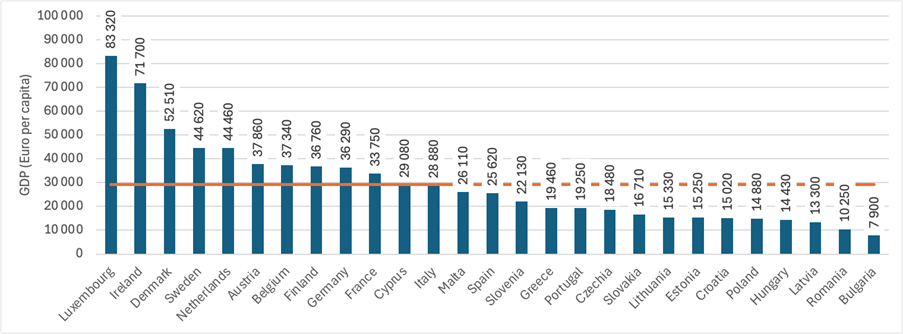

---
keywords:
- średnia arytmetyczna
- średnia geometryczna
- statystyki
is_finished: True
---

# Opis trendów PKB

Produkt Krajowy Brutto (PKB) reprezentuje wartość pieniężną wszystkich towarów i usług nowo wyprodukowanych na określonym obszarze w danym okresie. W makroekonomii PKB jest wykorzystywany jako wskaźnik do oceny wyników gospodarek krajowych. Na przykład można go wykorzystać do porównania wyników gospodarczych państw członkowskich Unii Europejskiej w 2023 r. (patrz rysunek 1).

Innym sposobem wykorzystania PKB jest śledzenie wyników danego kraju w czasie. Na przykład możemy zbadać PKB na osobę dla Unii Europejskiej w latach 2020-2023, kiedy UE liczyła 27 państw członkowskich. Szereg czasowy ilustrujący ten trend pokazano na wykresie 2.

Szereg czasowy pokazujący trendy PKB jest określany jako szereg czasowy oparty na interwałach. Dane w takim szeregu zależą od długości analizowanego przedziału (w tym przypadku od długości danego roku).

Niech wartości $y_1,\,y_2,\,\ldots\,y_n$ szeregu czasowego odpowiadają punktom czasowym $t_1,\,t_2,\,\ldots\,t_n$.

Podstawową cechą opisującą ten szereg czasowy jest jego średnia.

Średnia **szeregu czasowego opartego na interwałach** ($\bar{y}$)
jest obliczana jako prosta średnia arytmetyczna:

$$
\bar{y} = \frac{y_1 + y_2 + \dots + y_n}{n}. \tag{1}
$$  

Oprócz średniej, często interesują nas podstawowe miary dynamiki szeregów czasowych, które pomagają scharakteryzować podstawowe cechy ich zachowania.

Zmiana bezwzględna ($\Delta y_t$)
to najprostsza miara zmiany w szeregu czasowym, która mówi nam "o ile" szereg zmienił się między punktami czasowymi:

$$
\Delta y_t = y_t - y_{t-1}, \quad t = 2,\,3, \,\dots,\, n.\tag{2}
$$  

**Średnia zmiana bezwzględna** ($\bar{\Delta}$)
wskazuje średnią zmianę między dwoma pomiarami w obserwowanym okresie.

Suma zmian bezwzględnych reprezentuje całkowitą zmianę szeregu czasowego w obserwowanym okresie ("o ile" szereg czasowy zmienił się od $t_1$ do $t_n$):
$$
\Delta y_2 + \Delta y_3 + \dots + \Delta y_n = (y_2 - y_1) + (y_3 - y_2) + \dots + (y_n - y_{n-1}) = y_n - y_1.
$$

Dlatego średnia zmiana bezwzględna jest obliczana jako średnia arytmetyczna zmian bezwzględnych:
$$
\bar{\Delta} = \frac{\Delta y_2 + \Delta y_3 + \dots + \Delta y_n}{n-1} = \frac{y_n - y_1}{n-1}.\tag{3}
$$

Zauważmy, że obliczenia te wymagają jedynie wartości początkowej $y_1$, wartości końcowej $y_n$ oraz liczby
wartości $n$.

**Współczynniki wzrostu** (stopy wzrostu, $k_t$) wskazują "ile razy" seria zmieniła się między punktami czasowymi:

$$
k_t = \frac{y_t}{y_{t-1}}, \quad t = 2,\,3,\, \dots,\, n.\tag{4}
$$  

**Średni współczynnik wzrostu** ($\bar{k}$)
wskazuje średni współczynnik, o jaki seria zmieniała się między pomiarami w obserwowanym okresie.

W tym przypadku ogólny współczynnik wzrostu ("ile razy" szereg czasowy zmienił się między czasami $t_1$ a $t_n$) jest obliczany nie jako suma, ale jako iloczyn poszczególnych współczynników wzrostu

$$
k_2 \cdot k_3 \cdot \ldots \cdot k_n = \frac{y_2}{y_1} \cdot \frac{y_3}{y_2} \cdot \ldots \cdot \frac{y_n}{y_{n-1}} = \frac{y_n}{y_1}.
$$

Dlatego średni współczynnik wzrostu jest określany jako średnia geometryczna poszczególnych współczynników wzrostu

$$
\bar{k} =\sqrt[n-1]{k_2 \cdot k_3 \cdot \ldots \cdot k_n} =\sqrt[n-1]{\frac{y_n}{y_1}}.\tag{5}
$$  

Podobnie jak w przypadku średniej zmiany bezwzględnej, do tego obliczenia potrzebne są tylko wartość początkowa $y_1$, wartość końcowa $y_n$ i liczba wartości $n$.

**Zmiana względna** ($\delta_t$) :
Jeśli chcemy wiedzieć "o jaki procent" szereg czasowy zmienił się między poszczególnymi punktami czasowymi, używamy zmian względnych, które można łatwo określić za pomocą współczynników wzrostu:

$$
\delta_t = \frac{\Delta y_t}{y_{t-1}} \cdot 100 = \frac{y_t - y_{t-1}}{y_{t-1}} \cdot 100 = \left(\frac{y_t}{y_{t-1}} - 1\right) \cdot 100 = (k_t - 1) \cdot 100, \quad t = 2,\,3,\, \dots,\, n \tag{6}
$$

Na przykład, jeśli cena produktu wzrośnie o współczynnik 1,5 USD, wzrost procentowy wynosi $50\% \,(=(1{,}5-1)\cdot100)$.

**Średnia zmiana względna** ($\bar{\delta}$)
Wskazuje on "o jaki procent" szereg czasowy zmienił się średnio w okresie między dwoma pomiarami w obserwowanym okresie czasu, który można następnie łatwo obliczyć za pomocą średniego współczynnika wzrostu:

$$
\bar{\delta} = (\bar{k} - 1) \times 100.\tag{7}
$$  

*Uwaga:* Suma (lub iloczyn) indywidualnych zmian względnych nie jest równa całkowitej zmianie względnej ("o jaki procent" szereg czasowy zmienił się między czasami $t_1$ i $t_n$). Dlatego średnia arytmetyczna lub geometryczna poszczególnych zmian względnych nie może być wykorzystana do obliczenia średniej zmiany względnej.

Spróbujmy teraz dokonać podstawowego opisu szeregu czasowego przedstawiającego trendy PKB (w euro na osobę), jak pokazano na wykresie 2.

> **Ćwiczenie 1.** Określ średni roczny PKB (w euro na osobę) Unii Europejskiej w latach 2020-2023.

\iffalse

*Rozwiązanie.* Jak podano w równaniu (1), średni roczny PKB jest obliczany jako prosta średnia arytmetyczna analizowanych szeregów czasowych:
  
$$
\bar{y} = \frac{y_1 + y_2 + y_3 + y_4}{4} = \frac{26{\,}790 + 28{\,}490 + 29{\,}300 + 29{\,}280}{4} \approx 28{\,}465.
$$

W latach 2020-2023 średni roczny PKB Unii Europejskiej wynosił około $\text{€}28{\,}465$ na osobę.

\fi

> **Ćwiczenie 2.** Określ roczne zmiany PKB (w euro na osobę) Unii Europejskiej w latach 2020-2023 i odpowiadającą im średnią roczną zmianę PKB w tym okresie.

\iffalse

*Rozwiązanie.* Roczne zmiany PKB wskazują "o ile" PKB zmienił się z roku na rok. Zmiany te są określane jako zmiany bezwzględne zgodnie z równaniem (2), jak pokazano w tabeli.

| Year  | GDP (Euro/person) | Annual GDP Change (Euro/person) |
|-------|:----------------:|--------------|
| 2020  | $26{\,}790$ | ---  |                         
| 2021  | $28{\,}490$ | $28{\,}490 - 26{\,}790 = 1{\,}700$ |
| 2022  | $29{\,}300$ | $29{\,}300 - 28{\,}490 = 810$   |
| 2023  | $29{\,}280$ | $28{\,}280 - 29{\,}300 = -20$   | 
| **Average** | $28{\,}465$ | $830$ |

*	W 2021 r. roczny PKB na osobę w Unii Europejskiej wzrósł o $\text{€}1{\,}700$.
* W 2022 r. roczny wzrost PKB wyniósł 810 USD na osobę.
* W2023 r. nastąpił niewielki spadek rocznego PKB o 20 USD na osobę.

Teraz możemy określić średnią roczną zmianę PKB za pomocą równania (3), obliczając średnią arytmetyczną rocznych zmian lub wykorzystując tylko początkowe i końcowe wartości analizowanych szeregów czasowych:

$$
\bar{\Delta} = \frac{\Delta y_2 + \Delta y_3 + \Delta y_4}{4-1} = \frac{1{\,}700 + 810 + (-20)}{3} = 830
$$
lub 
$$
\bar{\Delta} = \frac{y_4 - y_1}{4-1} = \frac{29{\,}280 - 26{\,}790}{3} = 830.
$$

W latach 2020-2023 PKB w Unii Europejskiej wzrósł średnio o 830 USD na osobę rocznie.

\fi

> **Ćwiczenie 3.** Określ roczne stopy wzrostu PKB Unii Europejskiej w latach 2020-2023 i odpowiadającą im średnią stopę wzrostu PKB w tym okresie.

\iffalse

*Rozwiązanie.* Roczne stopy wzrostu PKB wskazują "o ile" PKB zmienił się z roku na rok. Wskaźniki te są obliczane jako współczynniki wzrostu zgodnie z równaniem (4), jak pokazano w tabeli.

| Rok | PKB ( euro/osoba ) | Roczna zmiana PKB (euro/osoba) | Stopa wzrostu (-)              |
|-----------|:----------------------:|:---------------------------------:|:--------------------------------------------------:|
| 2020    |  $26{\,}790$   |  ---   |  ---                                        |
| 2021    |  $28{\,}490$   |  $1{\,}700$  | $\frac{28{\,}490}{26{\,}790} \approx 1{,}063$        |
| 2022    |  $29{\,}300$   |  $810$      | $\frac{29{\,}300}{28{\,}490} \approx 1{,}028$        |
| 2023    |  $29{\,}280$   |  $-20$      | $\frac{29{\,}280}{29{\,}300} \approx 0{,}999$        |
|**Średnia** | $28{\,}465$ | $830$      |  ---                                         |

-	W 2021 r. PKB w Unii Europejskiej wzrósł około 1,063 razy, co oznacza roczny wzrost o 6,3%.
- W2022 r. PKB wzrósł około 1,028 USD razy, co oznacza roczny wzrost o 2,8 USD.
- W2023 r. PKB wzrósł około 0,999 USD razy, co oznacza roczny spadek o 0,1 USD.

Teraz możemy określić średnią roczną stopę wzrostu PKB za pomocą równania (5), obliczając średnią geometryczną poszczególnych rocznych stóp wzrostu lub wykorzystując tylko początkowe i końcowe wartości analizowanych szeregów czasowych:

$$
\bar{k} = \sqrt[n-1]{k_2 \cdot k_3 \cdot k_4} = \sqrt[3]{1{,}063 \cdot 1{,}028 \cdot 0{,}999} \approx 1{,}030
$$

lub

$$
\bar{k} = \sqrt[n-1]{\frac{y_4}{y_1}} = \sqrt[3]{\frac{29{\,}280}{26{\,}790}} \approx 1{,}030.
$$

W latach 2020-2023 średnia roczna stopa wzrostu PKB (w euro na osobę) w Unii Europejskiej wyniosła 1,030 USD, co oznacza, że PKB rósł średnio o 3,0\% USD rocznie.

*Uwaga:* Jeśli obliczymy średnią stopę wzrostu jako średnią geometryczną poszczególnych współczynników wzrostu w tabeli w rozwiązaniu ćwiczenia 3, wprowadzimy błędy zaokrąglenia. Dlatego zaleca się, aby do tych obliczeń używać tylko początkowych i końcowych wartości analizowanych szeregów czasowych.

\fi

>**Ćwiczenie 4.** Określ roczne względne stopy wzrostu PKB Unii Europejskiej w latach 2020-2023 i odpowiadającą im średnią względną stopę wzrostu PKB w tym okresie.

\iffalse

*Rozwiązanie.* Zadanie to zostało już rozwiązane w ramach interpretacji stóp wzrostu wyznaczonych w Zadaniu 3. Jeśli stwierdzimy, że PKB wzrósł 1,063 USD razy w 2021 r., jest to równoznaczne ze stwierdzeniem, że PKB wzrósł o 6,3 \% USD w tym roku.

Równania (6) i (7) wyrażają również, w jaki sposób względna stopa wzrostu w ujęciu procentowym (lub średnia względna stopa wzrostu) jest powiązana ze stopą wzrostu (lub średnią stopą wzrostu).
Wyniki zostały podsumowane w tabeli.

| Rok | PKB (euro/osobę) | Roczna zmiana PKB (euro/osobę) | Stopa wzrostu (-) | Względna stopa wzrostu (%) |
|-----------|:----------------------:|:---------------------------------:|:------------------:|--------------------------:|
| 2020 | $26{\,}790$ | --- | --- | --- |
| 2021 | $28{\,}490$ | $1{\,}700$ | $1{,}063$ | $6{,}3$ |
| 2022 | $29{\,}300$ | $810$ | $1{,}028$ | $2{,}8$ |
| 2023 | $29{\,}280$ | $-20$ | $0{,}999$ | $-0{,}1$ |
| **Średnia** | $28{\,}465$ | $830$ | $1{,}030$ | $3{,}0$ |

\fi

## Literatura
* *Realny PKB na mieszkańca* [online], Eurostat, 2024, Dostępny pod adresem: https://ec.europa.eu/eurostat/databrowser/view/sdg_08_10/default/table. [Dostęp: 2024-12-18].
* *Produkt Krajowy Brutto (PKB) - metodologia,* [online], Czeski Urząd Statystyczny, 2024, Dostępny w: https://www.czso.cz/csu/czso/hruby_domaci_produkt_-hdp- [Dostęp: 2024-12-18].

