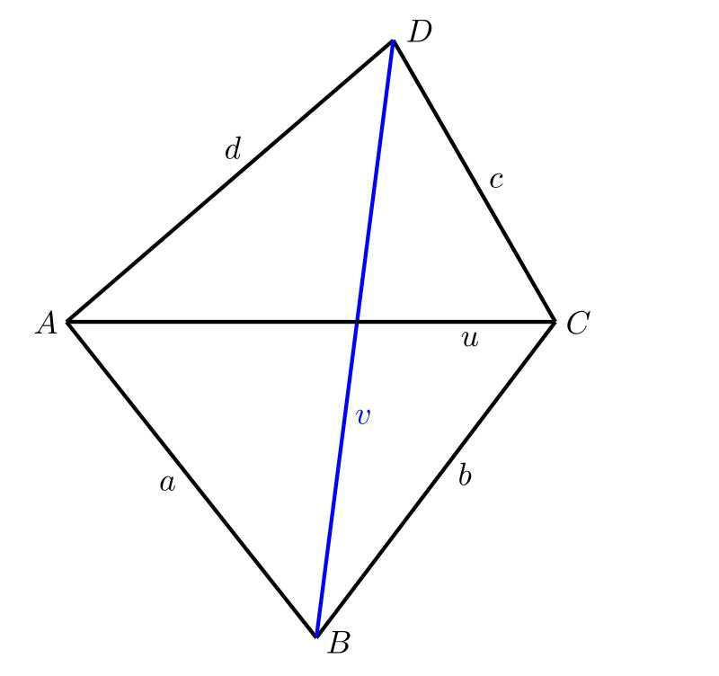

---
keywords:
- geometría analítica
- planimetría
- cuadrilátero
is_finished: true
---

# Tomografía de árbol

Es importante conocer la salud del árbol, por ejemplo en los 
parques urbanos para la seguridad del público. Se revisan 
sobre todo los árboles viejos, que tienen más probabilidades de no 
estar sanos.  El tronco de un árbol dañado o enfermo 
puede quebrarse con los fuertes vientos y 
causar lesiones o daños materiales a alguien. Del mismo modo, los propietarios 
de propiedades más pequeñas suelen tener un árbol viejo cerca de su casa y no quieren arriesgarse 
a que al caer dañe, por ejemplo, el tejado.

La salud del árbol puede ser evaluada por un arboricultor que 
comprueba si el árbol está prosperando o empieza a marchitarse. 
Busca hongos destructores de la madera alrededor de la circunferencia del árbol, 
así como lugares en los que esté visiblemente dañado. Puede complementar su observación con una tomografía del árbol 
o una prueba de tracción. A continuación, puede sugerir diversas medidas 
para mejorar la seguridad. Por ejemplo, podar las ramas de la copa 
del árbol para que no ejerzan demasiada tensión sobre el tronco en caso de  
vientos fuertes, etc. 

Los métodos más utilizados para la evaluación no invasiva de la 
salud de los árboles son las pruebas de tracción y la tomografía acústica 
mediante un tomógrafo de árboles.

## Prueba de tracción

Esta prueba consiste en medir la respuesta del árbol a 
la desviación de su tronco. En la práctica, se ata una cuerda 
a cierta altura del tronco y se tira de ella. En la base del tronco se colocan sensores 
que miden la respuesta resultante. El arboricultor dispone de 
muchos modelos de cómo debería comportarse un árbol, y 
los resultados de las mediciones se utilizan para comparar un caso concreto con el modelo que mejor 
se ajuste. El resultado es determinar en qué 
estado se encuentra el sistema radicular del árbol y si éste puede 
romperse por el tronco. Este método es bastante caro. Se tarda 
un tiempo relativamente largo en medirlo y requiere un trepador de árboles que 
suba al árbol y le ate una cuerda, y luego lo baje de nuevo cuando se haya completado 
la medición . Por lo tanto, últimamente este método 
ya no se utiliza mucho, en su lugar es mejor utilizar un tomógrafo 
de árboles. 

## Tomógrafo de árboles

El tomógrafo de árboles funciona según el principio de transmisión del sonido 
Los sensores se colocan a cierta altura a lo largo de la circunferencia del tronco del árbol en 
clavos. Las púas atraviesan la corteza del árbol hasta llegar a la madera. 
Se colocan siempre en el tejido vegetal activo. Aquí 
el árbol puede regenerarse muy rápidamente, por lo que 
estos clavos no lo dañarán en modo alguno.

A continuación, el arboricultor golpea uno a uno los sensores individuales 
con un martillo. Al hacerlo, se mide la velocidad a la que la señal sonora 
llega a los demás sensores. El sonido viaja rápidamente a través de la madera sana, 
mientras que en el caso de defectos internos su transmisión se ralentiza.
Comparando el valor medido con un valor de referencia, es posible detectar, por ejemplo, una cavidad en 
la madera en una fase temprana de su desarrollo.

A partir de las velocidades de transmisión del sonido medidas, 
puede construirse el denominado gráfico de velocidad (véase la figura 3). El color de las líneas que conectan 
los puntos individuales es importante. Indica 
la velocidad a la que la señal sonora ha viajado de un punto a 
otro. A continuación, el programa informático utiliza las velocidades medidas 
para construir el tomograma resultante. Se trata de una imagen bidimensional, 
que muestra zonas con diferentes características de transmisión del sonido.

Para evaluar el estado de un árbol, el arboricultor no examina sólo un corte transversal, sino varios, 
centrándose en las zonas visiblemente dañadas del tronco. A partir de toda 
la información obtenida en, se hace una idea general de 
la salud del árbol.

Si se encuentra una cavidad en el tronco, es posible que 
aún no sea un problema importante si la circunferencia exterior del tronco 
está sana. Es imposible decir con exactitud cuánta madera sana debe haber 
alrededor de la circunferencia. Esto depende de la especie de madera, la edad del árbol y 
su diámetro. El principio es el mismo que para el tubo de acero. 
También es fuerte, incluso si la varilla es hueca y el material es sólo 
la circunferencia. Aquí hay algunas reglas. Una de ellas dice, 
que está bien si un tercio sano de la sección transversal del tronco 
del árbol. Otra regla dice que para árboles muy viejos 
es suficiente si sólo hay una capa de tres centímetros 
de madera sana alrededor de la circunferencia.

El tomógrafo de árboles puede utilizarse para determinar con bastante precisión el estado
del sistema radicular. Las mediciones se realizan a ras de suelo y después 
se pueden consultar a varias alturas. Si los resultados del programa 
muestran que la podredumbre se está extendiendo por el tronco de abajo arriba, es 
probable que las raíces tampoco estén en buen estado.

Incluso el tomógrafo tiene sus limitaciones. Las mediciones no se realizan en invierno 
cuando hace mucho frío, porque el sonido se propaga de forma diferente a través de la linfa congelada y 
el resultado podría estar distorsionado.

Para construir un tomograma, es necesario conocer las distancias entre 
todos los sensores utilizados. Esta distancia puede medirse 
utilizando una escala móvil. Sin embargo, en el caso de los árboles muy viejos 
y macizos, el calibre puede ser un problema: 
simplemente no tiene el alcance necesario. Entonces, ¿qué hacer si 
no puede medir todas las distancias necesarias entre sensores? 
Para simplificar, limitamos el problema a las distancias entre los 4 
sensores.

> **Tarea 1.**
> Consideremos el cuadrilátero genérico $ABCD$. En este 
> cuadrilátero conocemos las longitudes de los 4 lados $a$, $b$, $c$, 
> $d$ y la longitud $u$ de una diagonal $AC$.
> La longitud $v$ de la diagonal $BD$ ya es demasiado grande y no se puede medir  
> con nuestra regla. ¿Cómo podríamos obtener esta longitud?

\iffalse

*Solución.* La solución planimétrica es, por supuesto, la más sencilla. 
Primero dibujamos el segmento de recta $AC$. Como conocemos 
las longitudes de los lados de los cuadriláteros $AB$ y $BC$ podemos 
sobre la diagonal $AC$ crear el triángulo $ABC$. Del mismo modo 
construimos el triángulo $ADC$ y entonces sólo tenemos que medir 
la longitud de la diagonal $BD$. En la práctica, por supuesto, se procede en la escala adecuada.

Una solución hecha a lápiz sobre papel no será demasiado 
precisa. Sin embargo, si dibujamos lo mismo en un programa de dibujo 
en el ordenador (podemos utilizar GeoGebra, por ejemplo), la precisión 
del resultado será suficiente.

El problema es si el arboricultor tiene que hacer este cálculo no 
una vez, sino muchas veces. Entonces la solución planimétrica 
llevaría mucho tiempo y sería desventajosa. Sería mejor disponer 
de un programa, bastaría con una hoja de cálculo Excel, donde se introducirían 
los valores medidos y el ordenador calcularía la longitud que falta.

\fi

> **Tarea 2.** 
> Resolver analíticamente el problema de la Tarea 1.

\iffalse

*Solución.* Partimos de una elección adecuada del sistema de coordenadas. 
Situamos el origen del sistema de coordenadas en el punto $A$, y elegimos el eje $x$ 
de forma que el punto $C$. quede sobre él. Para nuestra elección de 
las coordenadas de los vértices del cuadrilátero
$$A[0, 0],\; C[u, 0],\; B[b_1, b_2],\; D[d_1, d_2].$$

Necesitamos determinar las coordenadas $b_1$, $b_2$, $d_1$ y $d_2$, 
entonces será fácil calcular la longitud de la diagonal $v$ 
como la longitud del vector $\overrightarrow{BD}$.

Primero trabajaremos con el triángulo $\bigtriangleup ACD$, 
para obtener las coordenadas del punto $D$. Determinamos los vectores $\overrightarrow{AD}$ y $\overrightarrow{CD}$

$$
\begin{aligned}
& \overrightarrow{AD} = D-A = (d_1,d_2),\\
& \overrightarrow{CD} = D-C = (d_1-u,d_2)
\end{aligned}
$$
y calculamos sus longitudes
$$
\begin{aligned}
& \|\overrightarrow{AD}\| = \sqrt{d_1^2+d_2^2} = d,\\
& \|\overrightarrow{CD}\| = \sqrt{(d_1-u)^2+d_2^2} = c.
\end{aligned}
$$
Por multiplicación obtenemos un sistema de dos ecuaciones con dos incógnitas $d_1$ y $d_2$
$$
\begin{aligned}
& d_1^2+d_2^2 = d^2,\\
& (d_1-u)^2+d_2^2 = c^2.
\end{aligned}
$$
El sistema puede resolverse, por ejemplo, por el método de la suma. Después de multiplicar 
la segunda ecuación por $-1$ y sumar las dos ecuaciones, obtenemos
$$2d_1u-u^2=d^2-c^2.$$
A partir de esta ecuación expresamos
$$d_1=\frac{1}{2u}(d^2-c^2+u^2).$$
Sustituyendo $d_1$ en la primera ecuación se obtiene
$$d_2^2=d^2-d_1^2,$$
y restando calculamos 
$$d_2=\sqrt{d^2-d_1^2}.$$

Análogamente, a partir del triángulo $\bigtriangleup ABC$ 
calculamos las coordenadas del punto $B$. Utilizaremos los vectores 
$\overrightarrow{AB}$ a $\overrightarrow{CB}$. 
Los vectores 
$$
\begin{aligned}
& \overrightarrow{AB} = B-A = (b_1,b_2),\\
& \overrightarrow{CB} = B-C = (b_1-u,b_2)
\end{aligned}
$$
tienen longitudes
$$
\begin{aligned}
& \|\overrightarrow{AB}\| = \sqrt{b_1^2+b_2^2} = a,\\
& \|\overrightarrow{CB}\| = \sqrt{(b_1-u)^2+b_2^2} = b.
\end{aligned}
$$
Por multiplicación obtenemos un sistema de dos ecuaciones para dos incógnitas $b_1$ a $b_2$
$$
\begin{aligned}
& b_1^2+b_2^2 = a^2,\\
& (b_1-u)^2+b_2^2 = b^2.
\end{aligned}
$$
A partir de aquí calculamos
$$b_1=\frac{1}{2u}(a^2-b^2+u^2).$$
A partir de la primera ecuación tenemos
$$b_2^2=a^2-b_1^2$$
y restando obtenemos
$$b_2=-\sqrt{a^2-b_1^2}.$$
El signo negativo en la última ecuación se debe a que el punto 
$B$ tiene una coordenada $y$ negativa (los puntos $B$ y $D$ se encuentran 
en semiplanos opuestos definidos por la recta $AC$).

Ahora podemos calcular la longitud de la diagonal $v$ 
como la longitud del vector $\overrightarrow{BD}$ utilizando la relación
$$
v=\|\overrightarrow{BD}\| = D-B = \sqrt{(d_1-b_1)^2+(d_2-b_2)^2}.
$$ 

\fi

> **Tarea 3.** 
> ¿Cómo se complica la situación si añadimos otro sensor $Z$? De nuevo, conocemos
> las distancias $m$, $n$ del sensor $Z$ a los sensores $A$ y $D$ y queremos determinar la distancia del punto $Z$ al punto $B$, es decir, 
> la longitud de la diagonal adicional que no es mensurable.

\iffalse

*Solución.* El procedimiento será el mismo que en la tarea 2, pero utilizaremos el cuadrilátero $ABDZ$.En este cuadrilátero conocemos las longitudes de todos los lados (indicamos la longitud del lado $DZ$ por $n$, la longitud del lado $ZA$ por $m$) y la longitud de la diagonal $AD$. El problema es determinar la longitud de la segunda diagonal, marquémosla como $w$.

De nuevo, es ventajoso elegir bien el sistema de coordenadas. Elegimos el origen en el punto $A$ y la parte positiva del eje $x$ contendrá el punto $D$. Las coordenadas de los vértices del cuadrilátero en este sistema de coordenadas serán
$$A[0,0],\;B[b_1,b_2,\;D[d,0],\;Z[z_1,z_2].$$

Obtenido de
$$
\begin{aligned}
& z_1 = \frac{1}{2d}(m^2-n^2+d^2),\\
& z_2 = \sqrt{m^2-z_1^2},\\
& b_1 = \frac{1}{2d}(a^2-v^2+d^2),\\
& b_2 = -\sqrt{a^2-b_1^2}.
\end{aligned}
$$
A partir de aquí es posible calcular el tamaño de la diagonal $w$ como la longitud del vector $\overrightarrow{BZ}$
$$w=\|\overrightarrow{BZ}\|=\sqrt{(z_1-b_1)^2+(z_2-b_2)^2}.$$

\fi

## Referencias y bibliografía

### Biblliografía

* iDNES.cz. *Speciální tomograf odhalí nemocný strom. Nejtěžší je vyhodnotit výsledky* [online]. Dostupné z https://www.idnes.cz/hobby/zahrada/stromovy-tomograf-mereni-zdravi-stromu.A190226_103850_hobby-zahrada_bma [cit. 21.\,6.\,2024].
* Thinktrees. *Interpreting Arbotom sonic tomography results – Example no.1* [online]. Dostupné z https://thinktrees.co.uk/interpreting-arbotom-sonic-tomography-results-example-no-1/ [cit. 21.\,6.\,2024].

### Fuente de las imágenes

* Projekt DYNATREE – Tree Dynamics: Understanding of Mechanical Response to Loading, <https://starfos.tacr.cz/cs/projekty/LL1909>.

