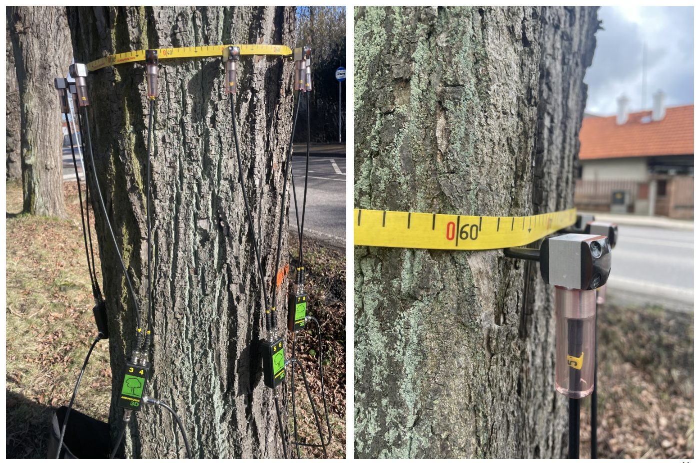
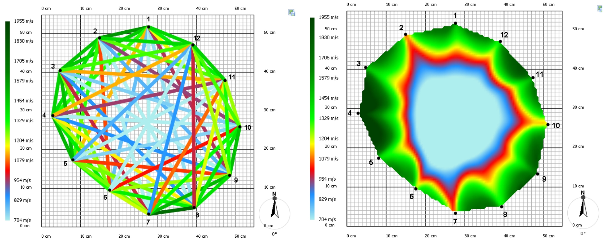
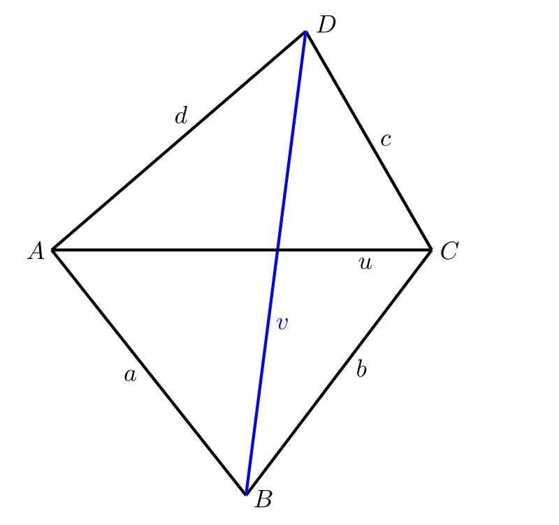
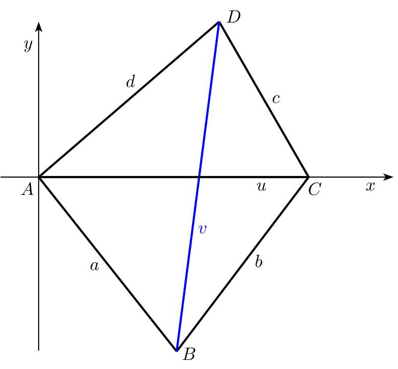
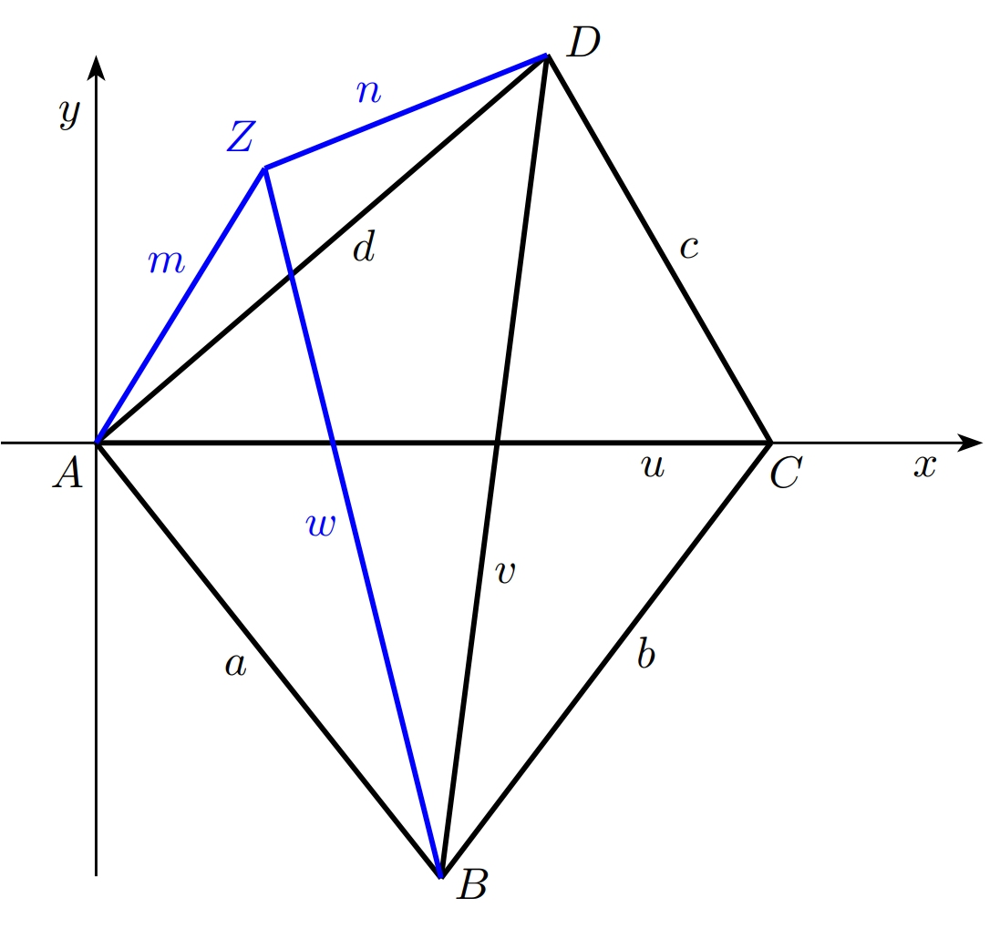

---
keywords:
- geometria analityczna
- geometria płaszczyzny
- czworokąt
is_finished: true
---

# Tomografia drzew

Znajomość stanu zdrowotnego drzewa jest ważna, na przykład w parkach miejskich, gdzie bezpieczeństwo publiczne ma znaczenie. Inspekcje koncentrują się głównie na starszych drzewach, ponieważ istnieje większe prawdopodobieństwo, że są one niezdrowe. Pień uszkodzonego lub chorego drzewa może złamać się przy silnym wietrze, powodując obrażenia lub szkody materialne. Podobnie właściciele mniejszych nieruchomości mogą mieć stare drzewo w pobliżu swojego domu i nie chcą ryzykować jego upadku i uszkodzenia, na przykład dachu.

Stan zdrowia drzewa może zostać oceniony przez arborystę, który sprawdza, czy drzewo dobrze się rozwija, czy też zaczyna usychać. Arborysta szuka grzybów rozkładających drewno wokół pnia, a także obszarów, które są widocznie uszkodzone. Jego obserwacje mogą być poparte użyciem tomografu drzewa lub testu ciągnięcia. Na podstawie ustaleń arborysta może zasugerować różne środki bezpieczeństwa takie jak przycinanie gałęzi w koronie, aby zmniejszyć obciążenie pnia podczas silnych wiatrów.

Typowe nieinwazyjne metody oceny stanu drzewa obejmują test ciągnięcia i tomografię akustyczną przy użyciu tomografu. Stan zdrowia drzewa może zostać oceniony przez arborystę, który sprawdza, czy drzewo dobrze się rozwija, czy też zaczyna usychać. 

## Test ciągnięcia

Test ten polega na pomiarze reakcji drzewa, gdy jego pień jest lekko przechylony. W praktyce lina jest przywiązywana do pnia na pewnej wysokości i ciągnięta. 
Czujniki umieszczone u podstawy pnia rejestrują wynikową reakcję. Arborysta porównuje wyniki ze znanymi wzorcami reakcji dla różnych gatunków drzew, aby ocenić konkretny przypadek. Celem jest określenie stanu systemu korzeniowego drzewa i określenie, czy pień jest zagrożony złamaniem. Metoda ta jest stosunkowo kosztowna. 
Pomiar trwa dość długo, a także wymaga od wspinacza przywiązania liny do drzewa, a następnie jej usunięcia. Z tych powodów metoda ta jest obecnie rzadziej stosowana 
i została w dużej mierze zastąpiona przez tomografię drzew.

## Tomografia drzew

Tomograf drzewa działa na zasadzie transmisji dźwięku. Czujniki z małymi są umieszczone wokół pnia na pewnej wysokości. Kolce są delikatnie wbijane przez korę do drewna. Są one zawsze wprowadzane do aktywnej tkanki drzewa, gdzie regeneracja jest szybka. W ten sposób drzewo nie jest uszkadzane przez procedurę.

Następnie arborysta delikatnie uderza w każdy czujnik małym młotkiem. W tym czasie system mierzy, jak szybko sygnał dźwiękowy przemieszcza się do innych czujników. 
Dźwięk przemieszcza się szybko przez zdrowe drewno, ale zwalnia, gdy przechodzi przez wewnętrzne wady. 
Porównując zmierzone wartości z danymi referencyjnymi, możliwe jest wczesne wykrycie problemów, takich jak ubytki wewnątrz drzewa.

Zmierzone prędkości transmisji dźwięku można wykorzystać do utworzenia tak zwanego wykresu prędkości (patrz rysunek 3). Kolor odcinków linii łączących poszczególne punkty 
jest ważny - wskazuje prędkość, z jaką sygnał dźwiękowy przemieszczał się z jednego punktu do drugiego. Następnie program komputerowy wykorzystuje te zmierzone prędkości do wygenerowania wyniku zwanego tomogramem. Jest to dwuwymiarowy obraz przedstawiający strefy o różnych właściwościach transmisji dźwięku.

Aby ocenić stan drzewa, arborysta nie mierzy tylko jednego przekroju, ale kilka - koncentrując się na widocznie uszkodzonych obszarach pnia. Na podstawie wszystkich zebranych informacji, arborysta tworzy przegląd ogólnego stanu zdrowia drzewa.

Obecność ubytku w pniu nie musi oznaczać poważnego problemu, o ile zewnętrzna część pnia pozostaje zdrowa. Nie jest możliwe dokładne określenie ile zdrowego drewna musi otaczać ubytek - zależy to od rodzaju drewna, wieku drzewa i średnicy pnia. Zasada jest podobna do stalowej rury, która pozostaje mocna, nawet jeśli jest pusta, o ile materiał jest nienaruszony wokół zewnętrznej krawędzi. Istnieje kilka wytycznych. Jedna z nich mówi, że jest to dopuszczalne, jeśli jedna trzecia przekroju poprzecznego pnia jest zdrowa. Inna sugeruje, że w przypadku bardzo starych drzew, nawet 3-centymetrowy pierścień zdrowego drewna wokół obwodu może być wystarczający.

Tomograf drzewa może być wykorzystany do dość dokładnej oceny stanu systemu korzeniowego. Pomiary są wykonywane bezpośrednio na poziomie gruntu, a następnie w kilku wyższych punktach wzdłuż pnia. Jeśli wyniki pokazują, że zgnilizna rozprzestrzenia się w górę od podstawy pnia, prawdopodobnie korzenie są również uszkodzone.

Nawet tomograf ma swoje ograniczenia. Pomiary nie są wykonywane zimą , gdy temperatury spadają poniżej zera, ponieważ zamarznięty sok zmienia sposób, w jaki dźwięk przemieszcza się przez drewno, co może zniekształcić wyniki.

Aby skonstruować tomogram, należy znać odległości między wszystkimi używanymi czujnikami. 
Odległości te można zazwyczaj zmierzyć za pomocą suwmiarki. Jednak w przypadku bardzo starych i masywnych drzew użycie suwmiarki może być problematyczne - narzędzie może po prostu nie być wystarczająco długie. 
Co więc można zrobić, gdy nie jest możliwe zmierzenie wszystkich wymaganych odległości między czujnikami? Dla uproszczenia ograniczymy teraz problem do odległości między 
tylko czterema czujnikami.

> **Ćwiczenie 1.**
> Rozważmy czworokąt foremny $ABCD$. W tym czworokącie,
> znamy długości wszystkich czterech boków $a$, $b$, $c$ i $d$,
> jak również długość $u$ jednej z przekątnych $AC$.
> Długość $v$ drugiej przekątnej $BD$ jest zbyt duża, aby można ją było zmierzyć
> za pomocą naszego urządzenia pomiarowego. Jak moglibyśmy skonstruować tę długość?

\iffalse

*Rozwiązanie.* Rozwiązanie geometryczne jest oczywiście najprostsze. 
Najpierw rysujemy odcinek $AC$. Ponieważ znamy długości boków $AB$ i $BC$, możemy skonstruować trójkąt $ABC$ na przekątnej $AC$. W ten sam sposób, 
konstruujemy trójkąt $ADC$, a następnie musimy tylko zmierzyć długość przekątnej $BD$. 
W praktyce odbywa się to przy użyciu odpowiedniej skali.

Rozwiązanie narysowane ręcznie na papierze nie będzie zbyt dokładne. 
Jeśli jednak skonstruujemy tę samą figurę za pomocą programu do rysowania geometrycznego na komputerze (na przykład GeoGebra), precyzja wyniku będzie wystarczająca.

Problem pojawia się, gdy arborysta musi wykonać te obliczenia nie tylko raz, ale wiele razy. W takim przypadku rozwiązanie geometryczne stałoby się czasochłonne 
i nieefektywne. Lepiej byłoby mieć program - wystarczy arkusz kalkulacyjny Excel - w którym można by wprowadzić zmierzone wartości, a brakująca długość zostałaby obliczona przez komputer.

\fi

> **Ćwiczenie 2.** 
> Rozwiąż analitycznie problem z Ćwiczenia 1.

\iffalse

*Rozwiązanie.* Zaczynamy od wybrania odpowiedniego układu współrzędnych. 
Umieszczamy początek w punkcie $A$ i wybieramy oś $x$ tak, aby leżał na niej punkt $C$. 
W tym układzie współrzędne wierzchołków czworokąta wynoszą:

$$A[0, 0],\; C[u, 0],\; B[b_1, b_2],\; D[d_1, d_2].$$

Musimy określić współrzędne $b_1$, $b_2$, $d_1$, and $d_2$. 
Następnie łatwo będzie obliczyć żądaną długość przekątnej $v$ jako wielkość wektora $\overrightarrow{BD}$.

Najpierw będziemy pracować z trójkątem $\bigtriangleup ACD$ aby określić współrzędne punktu $D$. Znajdziemy wektory $\overrightarrow{AD}$ i $\overrightarrow{CD}$.

$$
\begin{aligned}
& \overrightarrow{AD} = D-A = (d_1,d_2),\\
& \overrightarrow{CD} = D-C = (d_1-u,d_2)
\end{aligned}
$$

i obliczymy ich wielkości

$$
\begin{aligned}
& \|\overrightarrow{AD}\| = \sqrt{d_1^2+d_2^2} = d,\\
& \|\overrightarrow{CD}\| = \sqrt{(d_1-u)^2+d_2^2} = c
\end{aligned}
$$

Podnosząc wyrażenia do kwadratu, otrzymujemy układ dwóch równań z dwiema niewiadomymi, $d_1$ and $d_2$

$$
\begin{aligned}
& d_1^2+d_2^2 = d^2,\\
& (d_1-u)^2+d_2^2 = c^2.
\end{aligned}
$$

Układ możemy rozwiązać na przykład metodą dodawania. 
Mnożąc drugie równanie przezUkład możemy rozwiązać na przykład metodą dodawania. 
Mnożąc drugie równanie przez $-1$ i dodając oba równania, otrzymujemy

$$2d_1u-u^2=d^2-c^2.$$

Na podstawie tego równania wyrażamy:

$$d_1=\frac{1}{2u}(d^2-c^2+u^2).$$

Podstawiając $d_1$ do pierwszego równania otrzymujemy:

$$d_2^2=d^2-d_1^2,$$

i biorąc pierwiastek kwadratowy, otrzymujemy:

$$d_2=\sqrt{d^2-d_1^2}.$$

W podobny sposób używamy trójkąta $\bigtriangleup ABC$ do obliczenia współrzędnych punktu $B$. Pracujemy z wektorami 

$\overrightarrow{AB}$ a $\overrightarrow{CB}$. 

Wektory

$$
\begin{aligned}
& \overrightarrow{AB} = B-A = (b_1,b_2),\\
& \overrightarrow{CB} = B-C = (b_1-u,b_2)
\end{aligned}
$$

mają wielkości

$$
\begin{aligned}
& \|\overrightarrow{AB}\| = \sqrt{b_1^2+b_2^2} = a,\\
& \|\overrightarrow{CB}\| = \sqrt{(b_1-u)^2+b_2^2} = b.
\end{aligned}
$$

Podnosząc wyrażenia do kwadratu, otrzymujemy układ dwóch równań dla dwóch niewiadomych $b_1$ and $b_2$.

$$
\begin{aligned}
& b_1^2+b_2^2 = a^2,\\
& (b_1-u)^2+b_2^2 = b^2.
\end{aligned}
$$

Z tego wynika, że:

$$b_1=\frac{1}{2u}(a^2-b^2+u^2).$$

Z pierwszego równania otrzymujemy:

$$b_2^2=a^2-b_1^2$$

i biorąc pierwiastek kwadratowy:

$$b_2=-\sqrt{a^2-b_1^2}.$$

Ujemny znak w ostatnim równaniu wynika z faktu, że punkt $B$ ma ujemną współrzędną $y$ (punkty $B$ i $D$ leżą w przeciwległych półpłaszczyznach wyznaczonych przez prostą $AC$).

Możemy teraz obliczyć pożądaną długość przekątnej $v$ jako wielkość wektora. Możemy teraz obliczyć pożądaną długość przekątnej $v$ jako wielkość wektora $\overrightarrow{BD}$ przy użyciu wzoru

$$
v=\|\overrightarrow{BD}\| = D-B = \sqrt{(d_1-b_1)^2+(d_2-b_2)^2}.
$$ 

\fi

> **Ćwiczenie 3.** 
> Jakie komplikacje pojawiają się po dodaniu czujnika $Z$ do konfiguracji? 
> Ponownie, znamy odległości $m$ i $n$ od czujnika $Z$ do czujników $A$ i $D$, 
> i chcemy określić odległość od punktu $Z$ do punktu $B$ - czyli długość kolejnej niemierzalnej przekątnej.
> 

\iffalse

*Rozwiązanie.* Procedura jest taka sama jak w ćwiczeniu 2, ale tym razem pracujemy z czworokątem $ABDZ$. 
Znamy długości wszystkich boków tego czworokąta (niech $n$ będzie długością boku $DZ$, a $m$ długość boku $ZA$), jak również długość przekątnej $AD$. 
Naszym celem jest określenie długości drugiej przekątnej, oznaczonej przez $w$.
Po raz kolejny pomocne jest wybranie dogodnego układu współrzędnych. Umieszczamy początek w punkcie $A$, a dodatnia oś $x$ przechodzi przez punkt $D$. 
W tym układzie współrzędnych wierzchołki czworokąta mają następujące współrzędne:

$$A[0,0],\;B[b_1,b_2,\;D[d,0],\;Z[z_1,z_2].$$

Otrzymujemy

$$
\begin{aligned}
& z_1 = \frac{1}{2d}(m^2-n^2+d^2),\\
& z_2 = \sqrt{m^2-z_1^2},\\
& b_1 = \frac{1}{2d}(a^2-v^2+d^2),\\
& b_2 = -\sqrt{a^2-b_1^2}.
\end{aligned}
$$

Stąd możemy obliczyć długość przekątnej $w$ jako wielkość wektora $\overrightarrow{BZ}$

$$w=\|\overrightarrow{BZ}\|=\sqrt{(z_1-b_1)^2+(z_2-b_2)^2}.$$

\fi

## Linki i literatura

### Literatura

* iDNES.cz. *Speciální tomograf odhalí nemocný strom. Nejtěžší je vyhodnotit výsledky* [online]. Dostupné z https://www.idnes.cz/hobby/zahrada/stromovy-tomograf-mereni-zdravi-stromu.A190226_103850_hobby-zahrada_bma [cit. 21.\,6.\,2024].
* Thinktrees. *Interpreting Arbotom sonic tomography results – Example no.1* [online]. Dostępne na https://thinktrees.co.uk/interpreting-arbotom-sonic-tomography-results-example-no-1/ [cit. 21.\,6.\,2024].

### Źródło zdjęć

* Projekt DYNATREE - Dynamika drzew: Zrozumienie mechanicznej odpowiedzi na obciążenieŹródło zdjęć

* Projekt DYNATREE - Dynamika drzew: Zrozumienie mechanicznej odpowiedzi na obciążenie, <https://starfos.tacr.cz/cs/projekty/LL1909>.

