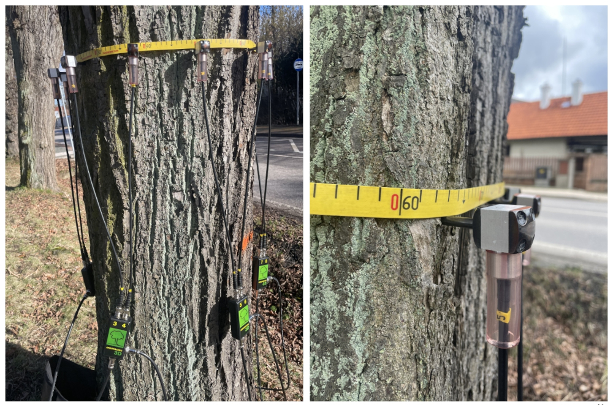
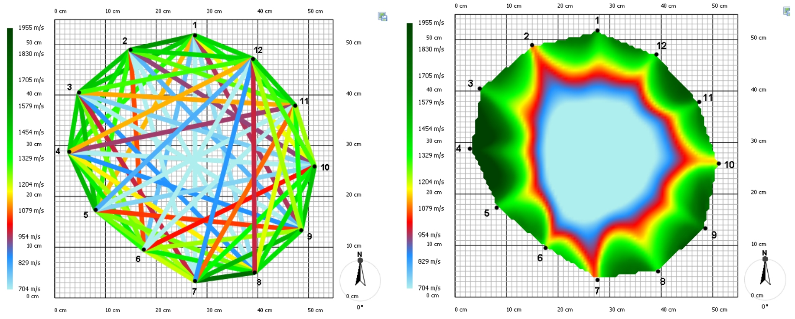

## Stromový tomograf
Zdravotný stav stromu je dôležité poznať napríklad v mestských parkoch kvôli bezpečnosti obyvateľov. Kontrolujú sa hlavne staré stromy, u ktorých je pravdepodobnejšie, že by nemuseli byť zdravé. Kmeň poškodeného či chorého stromu sa môže pri zvýšenej intenzite vetra zlomiť a spôsobiť niekomu zranenie alebo hmotné škody. Podobne aj majitelia menších nehnuteľností často majú v blízkosti domu starý strom a nechcú riskovať, že by pri páde poškodil napríklad strechu.
Zdravie stromu je schopný posúdiť arborista, ktorý kontroluje, či strom prospiera alebo začína schnúť. Po obvode stromu hľadá drevokazné huby a tiež miesta, ktoré sú viditeľne poškodené. Svoje pozorovanie môže doplniť meraním stromovým tomografom alebo ťahovou skúškou. Potom môže navrhnúť rôzne opatrenia zvyšujúce bezpečnosť. Napríklad prerezanie vetiev v korune stromu, aby v prípade veľkého vetra príliš nezaťažovala kmeň a pod.
Často používanými metódami neinvazívneho posudzovania zdravotného stavu stromov sú ťahová skúška a akustická tomografia pomocou stromového tomografu.

## Ťahová skúška
Táto skúška spočíva v tom, že sa meria reakcia stromu na vychýlenie jeho kmeňa. V praxi sa do určitej výšky kmeňa priviaže lano a ťahá sa zaň. K päte kmeňa sú umiestnené čidlá, ktoré merajú výslednú odozvu. Arborista má k dispozícii mnoho vzorov, ako sa má ktorá drevina správať, a podľa výsledkov merania sa porovnáva konkrétny prípad s najlepšie zodpovedajúcim vzorom. Výsledkom je zistenie, v akom stave je koreňový systém stromu, a či sa strom môže zlomiť v kmeni. Táto metóda je pomerne drahá. Meranie trvá relatívne dlho a navyše je potrebný stromolezec, ktorý vyleze na strom a priviaže k nemu lano, a po ukončení merania ho zase odstráni. V poslednej dobe sa preto už táto metóda veľa nepoužíva a namiesto toho je lepšie využiť stromový tomograf.

## Stromový tomograf
Stromový tomograf funguje na princípe prenosu zvuku. Po obvode kmeňa stromu sa v určitej výške umiestnia senzory na klincoch. Klince sa zatĺkajú cez kôru stromu až k drevu. Umiestňujú sa vždy do aktívneho rastlinného pletiva. Tu totiž strom dokáže veľmi rýchlo regenerovať, a tak ho tieto klince nijako nepoškodia.

Arborista potom postupne klope kladívkom na jednotlivé senzory. Pritom sa meria rýchlosť, za ktorú zvukový signál dorazí k ostatným senzorom. Zvuk prechádza zdravým drevom rýchlo, zatiaľ čo v prípade vnútorných vád sa jeho prenos spomaľuje. Porovnaním nameranej a referenčnej hodnoty sa preto dá nájsť trebárs dutina v dreve už v ranej fáze jej vývoja.
Z nameraných rýchlostí prenosu zvuku sa dá zostaviť tzv. rýchlostný graf (pozri Obrázok 3). Pri úsečkách, ktoré spájajú jednotlivé body je dôležitá ich farba. Tá udáva rýchlosť, akou zvukový signál prešiel od jedného bodu k druhému. Počítačový program potom z nameraných rýchlostí zostaví výsledný tzv. tomogram. Ide o dvojrozmerný obraz, ktorý znázorňuje zóny s rôznymi vlastnosťami prenosu zvuku.

K posúdeniu stavu stromu arborista nepremeriava iba jeden prierez, ale niekoľko, pričom sa zameriava na viditeľne poškodené miesta na kmeni. Zo všetkých získaných informácií si potom utvorí prehľad o celkovom zdraví stromu.
Keď je v kmeni zistená nejaká dutina, nemusí to ešte znamenať významný problém, pokiaľ je vonkajší obvod kmeňa zdravý. Nie je možné presne povedať, koľko zdravého dreva musí po obvode byť. To záleží na druhu dreva, veku stromu a na jeho priemere. Princíp je rovnaký ako u oceľovej trubky. Tá je tiež pevná, aj keď je tyč dutá a materiál je len po obvode. Existuje tu niekoľko pravidiel. Jedno z nich hovorí, že je v poriadku, keď je zdravá tretina prierezu kmeňa stromu. Iné pravidlo tvrdí, že u veľmi starých stromov postačí, keď je po obvode len trojcentimetrová vrstva zdravého dreva.
Stromovým tomografom sa dá pomerne presne určiť stav koreňového systému. Vykoná sa meranie úplne pri zemi a potom v niekoľkých ďalších výškach. Pokiaľ je z výsledkov programu vidieť, že sa hnilobza šíri kmeňom zdola nahor, je pravdepodobné, že korene tiež nie sú v poriadku.
Aj tomograf má svoje obmedzenia. Meranie sa nevykonáva v zime keď mrzne, pretože zmrznutou miazgou sa zvuk šíri inak a výsledok by mohol byť skreslený.
K zostaveniu tomogramu je potrebné poznať vzdialenosti medzi všetkými použitými senzormi. Táto vzdialenosť sa dá zmeriť pomocou posuvného meradla. U veľmi starých a mohutných stromov však môže byť s posuvným meradlom problém - jednoducho nemá potrebný rozsah. Čo robiť, keď sa teda nedajú zmeriať všetky potrebné vzdialenosti medzi senzormi? Pre jednoduchosť problém obmedzíme na vzdialenosti medzi 4 senzormi.

> **Úloha 1.**
> Uvažujme všeobecný štvoruholník $ABCD$. V tomto 
> štvoruholníku poznáme dĺžky všetkých 4 strán $a$, $b$, $c$, 
> $d$ a dĺžku $u$ jednej uhlopriečky $AC$.
> Dĺžka $v$ uhlopriečky $BD$ už je príliš veľká a nedá sa zmerať 
> naším meradlom. Ako by sme mohli túto dĺžku zkonštruovať?

\iffalse

*Riešenie*. Planimetrické riešenie je samozrejme najjednoduchšie.
Najprv zostrojíme úsečku $AC$. Keďže poznáme dĺžky strán štvoruholníka $AB$ a $BC$, môžeme nad uhlopriečkou $AC$ zostrojiť trojuholník $ABC$. Podobne zostrojíme trojuholník $ADC$, a potom už stačí len zmerať dĺžku uhlopriečky $BD$. V praxi postupujeme prirodzene vo vhodnej mierke.

Riešenie vykonané ceruzkou na papier nebude príliš presné. Ak nakreslíme to isté v grafickom programe na počítači (môžeme použiť napríklad GeoGebru), presnosť výsledku už bude dostatočná.
Problém je, pokiaľ arborista tento výpočet musí vykonať nie jedenkrát, ale viackrát. Potom už by planimetrické riešenie bolo časovo náročné a nevýhodné. Lepšie by bolo mať program, stačila by tabuľka v Exceli, kam by sa zadali namerané hodnoty a chýbajúcu dĺžku by spočítal počítač.

\fi

> **Úloha 2.** 
> Problém z Úlohy 1 vyriešte analyticky.

\iffalse

*Riešenie*. Začneme voľbou vhodnej súradnicovej sústavy.
Počiatok súradnicovej sústavy umiestnime do bodu $A$, os $x$
zvolíme tak, aby na nej ležal bod $C$. Pre našu voľbu
potom budú súradnice vrcholov štvoruholníka
$$A[0, 0],\; C[u, 0],\; B[b_1, b_2],\; D[d_1, d_2].$$

Potrebujeme určiť súradnice bodov $b_1$, $b_2$, $d_1$ a $d_2$, 
potom bude jednoduché vypočítať hľadanú dĺžku uhlopriečky $v$ 
ako dĺžku vektora $\overrightarrow{BD}$.

Najprv budeme pracovať s trojuholníkom  $\bigtriangleup ACD$, 
aby sme získali súradnice bodu $D$. Určíme vektory $\overrightarrow{AD}$ a $\overrightarrow{CD}$

$$
\begin{aligned}
& \overrightarrow{AD} = D-A = (d_1,d_2),\\
& \overrightarrow{CD} = D-C = (d_1-u,d_2)
\end{aligned}
$$
a vypočítame ich dĺžky
$$
\begin{aligned}
& \|\overrightarrow{AD}\| = \sqrt{d_1^2+d_2^2} = d,\\
& \|\overrightarrow{CD}\| = \sqrt{(d_1-u)^2+d_2^2} = c.
\end{aligned}
$$
Umocnením získame sústavu dvoch rovníc o dvoch neznámych. $d_1$ a $d_2$
$$
\begin{aligned}
& d_1^2+d_2^2 = d^2,\\
& (d_1-u)^2+d_2^2 = c^2.
\end{aligned}
$$
Sústavu môžeme riešiť napríklad sčítacou metódou. Po vynásobení druhej rovnice číslom $-1$ a sčítaní oboch rovníc dostaneme
$$2d_1u-u^2=d^2-c^2.$$
Z tejto rovnice vyjadríme
$$d_1=\frac{1}{2u}(d^2-c^2+u^2).$$
Dosadením $d_1$ do prvej rovnice získáme
$$d_2^2=d^2-d_1^2,$$
a odmocnením vypočítame 
$$d_2=\sqrt{d^2-d_1^2}.$$

Podobným spôsobom z trojuholníka $\bigtriangleup ABC$ 
vypočítame súradnice bodu $B$. Využijeme vektory 
$\overrightarrow{AB}$ a $\overrightarrow{CB}$. 
Vektory 
$$
\begin{aligned}
& \overrightarrow{AB} = B-A = (b_1,b_2),\\
& \overrightarrow{CB} = B-C = (b_1-u,b_2)
\end{aligned}
$$
majú dĺžky
$$
\begin{aligned}
& \|\overrightarrow{AB}\| = \sqrt{b_1^2+b_2^2} = a,\\
& \|\overrightarrow{CB}\| = \sqrt{(b_1-u)^2+b_2^2} = b.
\end{aligned}
$$
Umocnením získame sústavu dvoch rovníc s dvomi neznámymi $b_1$ a $b_2$
$$
\begin{aligned}
& b_1^2+b_2^2 = a^2,\\
& (b_1-u)^2+b_2^2 = b^2.
\end{aligned}
$$
Odtiaľ vypočítame
$$b_1=\frac{1}{2u}(a^2-b^2+u^2).$$
Z prvej rovnice potom máme
$$b_2^2=a^2-b_1^2$$
a odmocnením dostaneme
$$b_2=-\sqrt{a^2-b_1^2}.$$

Záporné znamienko v poslednej rovnici je spôsobené tým, že bod
$B$ má $y$‑ovú súradnicu zápornú (body $B$ a $D$ ležia
v opačných polrovniach určených priamkou $AC$).
Teraz už môžeme vypočítať hľadanú dĺžku uhlopriečky $v$
ako dĺžku vektora $\overrightarrow{BD}$ pomocou vzťahu
$$
v=\|\overrightarrow{BD}\| = D-B = \sqrt{(d_1-b_1)^2+(d_2-b_2)^2}.
$$ 

\fi

> **Úloha 3.** 
> Situácia sa skomplikuje, ak pridáme ďalší senzor $Z$. Poznáme totiž vzdialenosti $m$, $n$ senzora $Z$ od senzorov $A$ a $D$, a chceme určiť vzdialenosť bodu $Z$ od bodu $B$, teda dĺžku ďalšej nezmerateľnej uhlopriečky.

\iffalse

*Riešenie*. Postup bude rovnaký ako v úlohe 2, avšak využijeme štvruholník $ABDZ$. V tomto štvoruholníku poznáme dĺžky všetkých strán (dĺžku strany $DZ$ označíme $n$, dĺžku strany $ZA$ označíme $m$) a dĺžku uhlopriečky $AD$. Úlohou je určiť dĺžku druhej uhlopriečky, označme ju $w$.
Opäť je výhodné správne zvoliť súradnicovú sústavu. Počiatočný bod zvolíme v bode $A$ a kladná časť osi $x$ bude obsahovať bod $D$. Súradnice vrcholov štvoruholníka v tejto súradnicovej sústave budú
$$A[0,0],\;B[b_1,b_2,\;D[d,0],\;Z[z_1,z_2].$$

Vychádzať bude
$$
\begin{aligned}
& z_1 = \frac{1}{2d}(m^2-n^2+d^2),\\
& z_2 = \sqrt{m^2-z_1^2},\\
& b_1 = \frac{1}{2d}(a^2-v^2+d^2),\\
& b_2 = -\sqrt{a^2-b_1^2}.
\end{aligned}
$$
Odtiaľ je možné vypočítať veľkosť uhlopriečky $w$ ako dĺžku vektora
$\overrightarrow{BZ}$
$$w=\|\overrightarrow{BZ}\|=\sqrt{(z_1-b_1)^2+(z_2-b_2)^2}.$$

\fi

## Odkazy a literatúra

### Literatúra

* iDNES.cz. *Speciální tomograf odhalí nemocný strom. Nejtěžší je vyhodnotit výsledky* [online]. Dostupné z https://www.idnes.cz/hobby/zahrada/stromovy-tomograf-mereni-zdravi-stromu.A190226_103850_hobby-zahrada_bma [cit. 21.\,6.\,2024].
* Thinktrees. *Interpreting Arbotom sonic tomography results – Example no.1* [online]. Dostupné z https://thinktrees.co.uk/interpreting-arbotom-sonic-tomography-results-example-no-1/ [cit. 21.\,6.\,2024].

### Zdroj obrázkov

* Projekt DYNATREE – Tree Dynamics: Understanding of Mechanical Response to Loading, <https://starfos.tacr.cz/cs/projekty/LL1909>.
