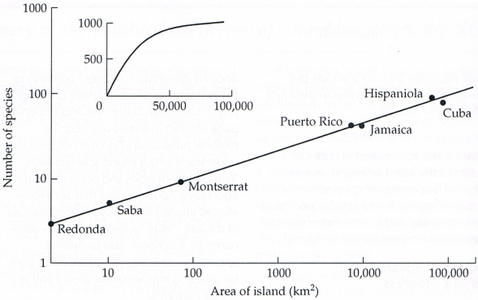

# Island Biodiversity

In this text, we will demonstrate the importance of logarithms in biological sciences.

Life in nature is a constant struggle for survival. Animals or plants must ensure the survival of their species. For animals, this includes abilities and strengths to escape predators, food access and nesting sites availability, reproduction, and offspring protection until they can live independently. To achieve this goal, sufficient living space is required. These requirements can be met in an area with enough resources (food, nesting sites, etc.). The amount of resources is closely related to the size of the area.

Biologists know the law that defines the relationship between the number of species permanently living in an ecosystem and the area of that ecosystem. This *species-area relationship* has the form

$$N=c A^k,\tag{1}$$

where $N$ is the number of species, $A$ is the area of the land, and $c$ and $k$ are constants. The constant $c$ depends on the units of area and indicates the theoretical number of species in an area of unit size. The constant $k$ typically ranges between $0.2$ and $0.35$ for islands and $0.12$ to $0.17$ for the mainland.

Relationship (1) was experimentally confirmed, for example, on mangrove islands near Florida. These small islands are essentially trees growing from the brackish water of the shallow sea. Given the small dimensions of the island, it was possible to study the response of the ecosystem to changes in the island's area. Researchers used a chainsaw to reduce the area and observed a corresponding decrease in the number of species. Additionally, experiments were conducted with the colonization of an uninhabited island. In such cases, the life on the islet was chemically eradicated similarly to how houses are disinfected. Researchers then observed that species richness spontaneously returned to its original state. Interestingly, the number of species remained the same, but specific species were replaced by others.

Since relationship (1) is a power function with a general non-integer exponent, the dependence between the ecosystem area and the number of species is not easily identifiable from measured or observed data. Nonetheless, knowing this functional relationship is important. It is useful, for example, in nature conservation and protection. Note that in the context of island biogeography the term island means in fact a generalized island. Under an island we do not understand just a land surrounded by sea, but any area placed within an area of another type. For example, an island can be a lake within land, a small forest in an agricultural landscape, or a protected landscape area surrounded by land with a normal regime. Knowing how the size of an area relates to species composition and diversity is an important factor in deciding whether to build one large natural reserve or several small ones for nature conservation.

A similar law to relationship (1) is encountered in biology very often in *allometric relationships*. These are relationships where the physical and physiological properties of organisms change depending on the size of the organism. For example, the relationship between the time required to reach maturity and body weight has a similar form, see Begon (1997). Another example is Kleiber's law, which relates the animal's weight and its basal metabolism.

In the following problems, we will solve tasks related to formula (1) and show how to use logarithms to work with it.

## Exercises

> **Exercise 1:** Take the logarithm of both sides of equation (1). Show that the resulting dependence is linear, i.e., if the logarithm of the area size is plotted as a function of the logarithm of the number of species the graph of this dependence is a straight line.

\iffalse

*Solution.* We start with relationship (1), i.e., $$N=c A^k.$$

Taking the logarithm we get

$$\log N= \log (c A^k).$$

Using the rules for logarithms of products and powers, we obtain

$$\log N= \log (c) + k\log A.$$

Substitutions $y=\log N$, $q = \log c$, $x=\log A$ transform the equation into

$$y=kx+q,$$

which is the equation of a line with slope $k$.

**Note:** Since it is not always convenient to calculate two logarithms for each value when plotting, logarithmic axes are used. The distance of a point $x$ from the point 1 on a logarithmic axis is $\log x$, and this scale is used for both the horizontal and vertical axes.

The attached image shows that the graph of a power function in logarithmic axes is a straight line. The graph includes the number of reptile and amphibian species on islands in the West Indies (Antilles and Bahamas). In a graph with logarithmic axes, the data align almost exactly in a straight line. This property is easily visible in the data and can also be easily confirmed through mathematical methods. The smaller picture shows how the dependence would look without using logarithmic axes. The data lie along a curve, and it is not immediately clear whether it is a power curve, an exponential curve, or some other dependence.

\fi

> **Exercise 2:** It is estimated that for a certain area, the value of the exponent $k$ is $0.15$. By how much will the number of species decrease if the area is reduced to one-tenth? (This exercise models, for example, extensive forest logging.)

\iffalse

*Solution.* Starting from the law $$N(A)=c A^k$$ and reducing the area to one-tenth, we get
$$N(0.1A) = c\cdot(0.1 A)^k = c A^k \cdot 0.1^k = N(A)\cdot 0.1^k$$
From here, for $k=0.15$, we get
$$\frac{N(0.1A)}{N(A)}=0.1^k = 0.71.$$
After reducing the area to one-tenth, the number of animal species decreases to 71 percent of the original state, i.e., it decreases by 29 percent.

\fi

> **Exercise 3:** It was observed that after reducing the area to one-fourth, the number of species decreased to seventy percent of the original state. Estimate the value of parameter $k$.

\iffalse

*Solution.* We denote the original values for area and number of species as $A_1$ and $N_1$. The new values will be $A_2$ and $N_2$. Both sets of data satisfy equation (1), therefore
$$N_1 = c A_1^k$$
and
$$N_2 = c A_2^k.$$
By dividing these equations, we get
$$\frac{N_1}{N_2} = \frac{c A_1^k}{ c A_2 ^k} =\left(\frac {A_1}{A_2}\right)^k.$$
According to the stated problem, $N_2=0.7N_1$ and $A_2=0.25A_1$, i.e.,
$$\frac{N_1}{0.7N_1}=\left(\frac{A_1}{0.25A_1}\right)^k$$
$$\frac{1}{0.7}=\left(\frac{1}{0.25}\right)^k.$$
Taking the logarithm of both sides, we obtain
$$\log\frac{1}{0.7}=k\cdot\log\frac{1}{0.25}.$$
and thus
$$k=\frac{\log \frac1{0.7}}{\log 4}\approx 0.257.$$

\fi

## Literature

* Theory of Island Biogeography, ENVI WIKI, <https://www.enviwiki.cz/w/index.php?title=Teorie_ostrovn%C3%AD_biogeografie>, October 3, 2023, (in Czech)
* What is Island Biogeography?, <https://zemepisec.cz/biogeografie/ostrovni/>, October 3, 2023, (in Czech)
* Species–area relationship, Wikipedia, <https://en.wikipedia.org/wiki/Species%E2%80%93area_relationship>, October 3, 2023
* Culek M., Biogeography, <https://is.muni.cz/el/1431/jaro2010/Z0005/18118868/index_book_3-1-1.html>, October 3, 2023, (in Czech)  
* Begon, M. et al. Ecology: Individuals, Populations, and Communities: [Investment in Education Development, reg.no.: CZ1.07/2.2.00/15.0084]. 1st ed. Olomouc: Palacký University Publishing, 1997. 949 p. ISBN 80-7067-695-7. (Czech translation of an English original)
