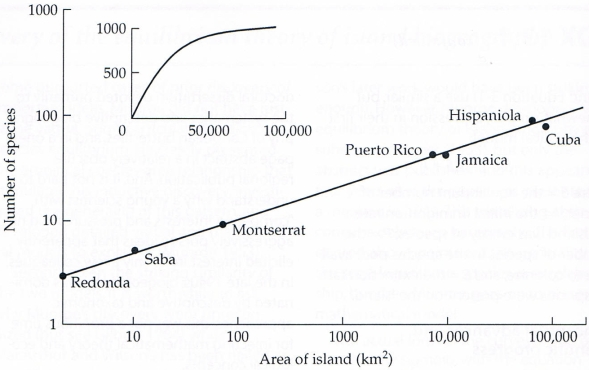

# Biodiversidad insular

En este texto, demostraremos la importancia de los logaritmos en las ciencias biológicas.

La vida en la naturaleza es una lucha constante por la supervivencia. Los animales o las plantas deben asegurar la continuidad de su especie.
Para los animales, esto incluye habilidades y fortalezas para escapar de los depredadores, el acceso a alimentos y la disponibilidad de sitios de anidación,
la reproducción y la protección de las crías hasta que puedan vivir de forma independiente.
Para alcanzar este objetivo, se requiere un espacio vital suficiente.
Estos requisitos pueden satisfacerse en una zona con suficientes recursos (alimentos, lugares para anidar, etc.).
La cantidad de recursos está estrechamente relacionada con el tamaño del área.

Los biólogos conocen la ley que define la relación entre el número de especies que habitan de forma permanente en un ecosistema y el área de dicho ecosistema. Esta *relación especie-área* tiene la forma:

$$N=c A^k,\tag{1}$$

donde $N$ es el número de especies, $A$ es el área del terreno, y $c$ y $k$ son constantes. La constante $c$ depende de las unidades del área e indica el número teórico de especies en un área de tamaño unitario.
La constante $k$ suele variar entre $0.2$ y $0.35$ para las islas y entre $0.12$ y $0.17$ para el continente.

La relación (1) fue confirmada experimentalmente, por ejemplo, en las islas de manglares cerca de Florida.
Estas pequeñas islas son esencialmente árboles que crecen desde el agua salobre del mar poco profundo.
Dadas las pequeñas dimensiones de las islas, fue posible estudiar la respuesta del ecosistema a los cambios en el área de la isla.
Los investigadores utilizaron una motosierra para reducir el área y observaron una disminución correspondiente en el número de especies.
Además, se realizaron experimentos sobre la colonización de una isla deshabitada.
En estos casos, la vida en el islote fue erradicada químicamente, de forma similar a cómo se desinfectan las casas.
Los investigadores observaron entonces que la riqueza de especies regresó espontáneamente a su estado original.
Curiosamente, el número de especies se mantuvo igual, pero ciertas especies fueron reemplazadas por otras.

Dado que la relación (1) es una función potencial con un exponente general no entero, la dependencia entre el área del ecosistema y el número de especies no es fácilmente identificable a partir de datos medidos u observados. No obstante, conocer esta relación funcional es importante.
Es útil, por ejemplo, en la conservación y protección de la naturaleza.
Cabe señalar que, en el contexto de la biogeografía insular, el término isla se entiende en un sentido generalizado.
Por isla no entendemos solo una porción de tierra rodeada por el mar,
sino cualquier área situada dentro de un área de otro tipo.
Por ejemplo, una isla puede ser un lago dentro de un territorio terrestre,
un pequeño bosque en un paisaje agrícola o un área natural protegida rodeada por tierra con un régimen normal.
Conocer cómo se relaciona el tamaño de un área con la composición y diversidad de especies
es un factor importante a la hora de decidir si es mejor construir una gran reserva natural o varias pequeñas para la conservación de la naturaleza.

Una ley similar a la relación (1) se encuentra muy a menudo en biología en las *relaciones alométricas*. Estas son relaciones en las que las propiedades físicas y fisiológicas de los organismos cambian en función del tamaño del organismo. Por ejemplo, la relación entre el tiempo necesario para alcanzar la madurez y el peso corporal tiene una forma similar, véase Begon (1997).
Otro ejemplo es la ley de Kleiber, que relaciona el peso del animal con su metabolismo basal.

En los siguientes ejercicios, resolveremos problemas relacionados con la fórmula (1) y mostraremos cómo utilizar logaritmos para trabajar con ella.

## Ejercicios

> **Ejercicio 1:** Aplica el logaritmo a ambos lados de la ecuación (1). Demuestra que la dependencia resultante es lineal, es decir, que si se representa el logaritmo del tamaño del área
en función del logaritmo del número de especies, el gráfico de esta dependencia es una línea recta.

\iffalse

*Solución.* Empezamos con la relación (1), es decir, $$N=c A^k.$$

Tomando el logaritmo obtenemos

$$\log N= \log (c A^k).$$

Utilizando las reglas para logaritmos de productos y potencias, obtenemos

$$\log N= \log (c) + k\log A.$$

Las sustituciones $y = \log N$, $q = \log c$, $x = \log A$ transforman la ecuación en:

$$y=kx+q,$$

que es la ecuación de una recta con pendiente $k$.

**Nota:** Dado que no siempre es conveniente calcular dos logaritmos para cada valor al representar gráficamente, se utilizan ejes logarítmicos.
La distancia de un punto $x$ desde el punto 1 en un eje logarítmico es $\log x$, y esta escala se utiliza tanto para el eje horizontal como para el vertical.

La imagen adjunta muestra que el gráfico de una función potencial en ejes logarítmicos es una línea recta. El gráfico incluye el número de especies de reptiles y anfibios en islas de las Antillas (Antillas y Bahamas). En un gráfico con ejes logarítmicos, los datos se alinean casi exactamente en una línea recta. Esta propiedad es fácilmente visible en los datos y también puede confirmarse fácilmente mediante métodos matemáticos. La imagen más pequeña muestra cómo se vería la dependencia sin utilizar ejes logarítmicos. Los datos se distribuyen a lo largo de una curva, y no está claro de inmediato si se trata de una curva potencial, exponencial u otro tipo de dependencia.

\fi

> **Ejercicio 2:** Se estima que, para una determinada área, el valor del exponente $k$ es $0.15$. ¿En cuánto disminuirá el número de especies si el área se reduce a una décima parte?
(Este ejercicio modela, por ejemplo, la tala extensiva de bosques.)

*Solución.* Partiendo de la ley $$N(A)=c A^k$$ y reduciendo el área a una décima parte, obtenemos
$$N(0.1A) = c\cdot(0.1 A)^k = c A^k \cdot 0.1^k = N(A)\cdot 0.1^k$$
De aquí, para $k=0.15$, obtenemos
$$\frac{N(0.1A)}{N(A)}=0.1^k = 0.71.$$
Después de reducir el área a una décima parte, el número de especies animales se reduce al 71 % del estado original, es decir, disminuye en un 29 %.

> **Ejercicio 3:** Se observó que, tras reducir la superficie a una cuarta parte, el número de especies disminuyó al setenta por ciento del estado original. Estimación del valor del parámetro $k$.

\iffalse

*Solución.* Denotamos los valores originales del área y del número de especies como $A_1$ y $N_1$. Los nuevos valores serán $A_2$ y $N_2$. Ambos conjuntos de datos satisfacen la ecuación (1), por lo tanto:
$$N_1 = c A_1^k$$
y
$$N_2 = c A_2^k.$$
Al dividir estas ecuaciones, obtenemos:
$$\frac{N_1}{N_2} = \frac{c A_1^k}{ c A_2 ^k} =\left(\frac {A_1}{A_2}\right)^k.$$
Según el enunciado del problema, $N_2=0.7N_1$ y $A_2=0.25A_1$, es decir,
$$\frac{N_1}{0.7N_1}=\left(\frac{A_1}{0.25A_1}\right)^k$$
$$\frac{1}{0.7}=\left(\frac{1}{0.25}\right)^k.$$
Aplicando el logaritmo a ambos lados, obtenemos:
$$\log\frac{1}{0.7}=k\cdot\log\frac{1}{0.25}.$$
y por tanto
$$k=\frac{\log \frac1{0.7}}{\log 4}\approx 0.257.$$

\fi

## Bibliografía

* Theory of Island Biogeography, ENVI WIKI, <https://www.enviwiki.cz/w/index.php?title=Teorie_ostrovn%C3%AD_biogeografie>, Octubre 3, 2023, (en checo)
* What is Island Biogeography?, <https://zemepisec.cz/biogeografie/ostrovni/>, Octubre 3, 2023, (en checo)
* Species–area relationship, Wikipedia, <https://en.wikipedia.org/wiki/Species%E2%80%93area_relationship>, Octubre 3, 2023
* Culek M., Biogeography, <https://is.muni.cz/el/1431/jaro2010/Z0005/18118868/index_book_3-1-1.html>, Octubre 3, 2023, (en checo)  
* Begon, M. et al. Ecology: Individuals, Populations, and Communities: [Investment in Education Development, reg.no.: CZ1.07/2.2.00/15.0084]. 1st ed. Olomouc: Palacký University Publishing, 1997. 949 p. ISBN 80-7067-695-7. (Traducción al checo de un original inglés)

