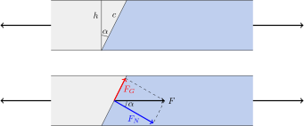

---
keywords:
- trigonometry
- trigonometric functions
- right triangle
is_finished: true
---

# Glued Joints

In this article, we demonstrate practical uses of trigonometric 
functions and the relationships between the lengths of the sides in a right triangle.

We focus on the topic of glued joints – connections made using adhesive materials. 
We show how to break down the force acting in a joint into components, distribute it across a larger area, and determine the resulting stress in the joint. We will calculate how stress changes in a slanted joint of a bar, if the bar is loaded by an axial force, compared to a perpendicular joint, as ilustrated in the figure.

## Types of Glued Joints and Their Stress

Everyone is familiar with joining materials by gluing. When the strength
of the resulting connection is not critical, gluing is one of the simplest ways
to join materials. In practice, however, we often need the joint to be both
durable and strong. This means the joint should not fail when subjected  to significant loading by forces. In engineering, glued joints are also referred to as bonded joints.

Adhesives (glues) typically guarantee resistance to normal stress (tensile forces) and shear stress (sliding forces), as long as stresses do not exceed the values specified by the adhesive’s manufacturer. 

Stress refers to mechanical pressure, defined as the ratio of the applied force to the area over which the force acts.
In the case of
normal stress, the force acts perpendicular to the surface. In the case of shear stress, the force acts parallel to the joint surface. The deformations caused by these forces 
are shown on the left: "Tensile" illustrates normal stress from perpendicular force, while "Shear" illustrates shear stress from parallel force.

The strength of a joint depends on the adhesive used and the materials being joined. Manufacturer data may look as follows:

* A joint glued with Loctite 421 (a superglue) has a strength of 18 MPa to 26 MPa on steel and 5 MPa to 20 MPa on polycarbonate.
* A wooden joint glued with Herkules (a dispersion adhesive) can withstand 8 MPa of shear stress.
* A joint glued with MAMUT Glue has tensile strength of 2.18 MPa and shear strength of 1.40 MPa.

Since stress in a joint is calculated as the ratio of the force to the area, one effective way to reduce
stresses is to decompose the force into multiple directions and spread it
over a larger area. 
On the right side of the previous picture, examples are shown.  In joint B, the front faces are subjected to normal stress, while additional faces are loaded by pure shear stress.

We will pay special attention to slanted joints, where the connection is subjected to both normal and shear stresses simultaneously.
In practice, slanted joints are often implemented differently than in Figure 1. A greater slant increases the joint strength but also takes up more space. That's why slanted joints are usually built with interruptions, rotated layers, and stacked alignment of glued segments. 

## Stress in a Slanted Joint

> **Task 1.**
> Consider a bar with height $h=3\mathrm{cm}$ and width $b=4\mathrm{cm}$, glued together from two pieces along a slanted joint as shown in the figure.
> The angle between the joint plane and the plane of a cross-section perpendicular to the axis of the bar is $\alpha=30^\circ$. The bar
> is subjected  to an axial force $F=1\ 000\ \mathrm{N}$. 
> Calculate the normal and shear stresses in the slanted joint and compare them with the normal stress in the cross-section perpendicular to the axis. 
>
> 

\iffalse

*Solution.*
In a plane perpendicular to the axis, the cross-section is a rectangle with sides $b$ and $h$.
The axial force $F$ causes only normal stress in this section:

$$\sigma = \frac{F}{bh}
= \frac{1\ 000\ \mathrm{N}}{(3\times 4) \ \mathrm {cm}^2} = 833\ 333\ \mathrm{Pa} = 0.833\ \mathrm{MPa}.$$ 

The normal stress in the slanted joint, $\sigma_N$, is given by:

$$\sigma_N = \frac{F_N}{A},$$

where $F_N$ is the component of the force normal to the joint and $A$ is the area
of the joint. Similarly, the shear stress in the slanted joint, $\sigma_G$, is given by:

$$\sigma_G = \frac{F_G}{A},$$ 

where $F_G$ is the component of the force parallel to the joint.

The axial force $F$ is decomposed into components of normal force, $F_N$, and shear force, $F_G$. These components form sides of the right triangle with hypotenuse $F$ and with the given angle $\alpha$ between one of the sides and hypotenuse (see the picture). From relationships between parameters of this triangle we calculate the magnitudes of the forces $F_N$ and $F_G$:

$$
\begin{aligned}
F_N&=F\cos \alpha,\\
F_G&=F\sin \alpha.
\end{aligned}
$$

The shape of the joint surface is a rectangle. One side of this rectangle equals to the width
of the bar, $b$, and the other side, $c$, is the hypotenuse of a right
triangle with side $h$ and the adjacent interior angle
$\alpha$.

Thus, we calculate the length of $c$ as:

$$c=\frac{h}{\cos\alpha},$$

and the area of the joint is:  

$$A=bc=\frac{bh}{\cos\alpha}.$$

Using the above computations, we obtain for the normal stress:

$$ \sigma_N = \frac{F_N}{A} = \frac{F\cos\alpha}{\frac{bh}{\cos \alpha}} = \frac{F}{bh}\cos^2\alpha = \sigma\cos^2\alpha,$$

and for the shear stress:

$$\sigma_G = \frac{F_G}{A} = \frac{F\sin\alpha}{\frac{bh}{\cos \alpha}} = 
\frac{F}{bh}\sin\alpha\cos\alpha = \sigma\sin\alpha\cos\alpha.$$

 
The values of the trigonometric functions, $\sin\alpha$ and $\cos\alpha$, determine in what ratio the stress in the joint is divided into normal and shear components. Since both these factors are less than one, both stresses, $\sigma_N$
and $\sigma_S$, are less than $\sigma$, which is the stress in the cross-section perpendicular to the bar axis. 
The graphs of the functions $\sin x\cos x$ and
$\cos^2x$ are shown in the figure below. For the angle $\alpha=30^\circ$, and the given
bar dimensions and axial force magnitude, we get:

$$\sigma_N=0.625\ \mathrm{MPa},$$

and

$$\sigma_G=0.361\ \mathrm{MPa}.$$

\fi

## Supplementary exercises

> **Problem 2.** Determine the angle of the slanted joint (as described in 
> Problem 1) for which the shear stress is maximal. Also determine the corresponding normal stress.

\iffalse

*Solution.*

In Problem 1, the formula for the shear stress was derived in the form: 

$$\sigma_G=\sigma\sin\alpha\cos\alpha.$$

Using the trigonometric identity, $\sin 2\alpha=2\sin\alpha\cos\alpha$, we obtain:

$$\sigma_G=\frac 12\sigma\sin(2\alpha).$$

This expression reaches its maximum when $\sin(2\alpha) = 1$  that is at $\alpha = 45^\circ$ (see also the figure in the solution of Problem 1). 
In that case, we have: 
$$
\sigma_G=\frac 12\sigma.
$$
For the normal stress, the derived formula is:
$$
\sigma_N=\sigma\cos^2\alpha.
$$
For $\alpha=45^\circ$, we get: 
$$
\sigma_N=\frac 12\sigma.
$$ 

At maximum shear stress, both the shear and normal stresses are equal and each is half the value of $\sigma$. This situation occurs when the joint is slanted at an angle of $45^\circ$.

\fi

> **Problem 3.** The adhesive guarantees that the joint can withstand a normal stress of
> $10\ \mathrm{MPa}$ and shear stress of $8\ \mathrm{MPa}$. What is then the 
> maximum force that can be applied to the slanted joint described in Problem 1? How would the answer to
> this question change if the joint was slanted at an angle of $45^{\circ}$?

\iffalse

*Solution.* In the problem 1 we derivace the relationships between the normal stress $\sigma_N$ and shear stress $\sigma_G$ in the joint and the axial force $F$ acting on the bar.
$$
\sigma _N=\frac{F}{bh}\cos^2 \alpha
$$
$$
\sigma _G=\frac{F}{bh}\sin \alpha \cos \alpha.
$$ 
From these relationships we can express the axial force $F$ in terms of the
stresses $\sigma_N$ and $\sigma_G$. Since the results will be used to determine
the maximum force that can be applied to the joint, we will denote by $F_{\max,
N}$ the force which produces critical value of normal stress and by $F_{\max,G}$
the force which yeilds the critical value for the shear stress. 
We get
$$
F_{\max, N}=\frac{bh\sigma_N}{\cos^2\alpha}
$$

and

$$
F_{\max, G}=\frac{bh\sigma_G}{\sin\alpha\cos\alpha}.
$$

For data from Problem 1 and for the values  $\sigma_N=10\,\mathrm{MPa}$ and
$\sigma_G=8\,\mathrm{MPa}$ we get

$$
F_{\max, N}=\frac{3\times 4 \,\mathrm{cm}^2 \times 10\,\mathrm{MPa}}{\cos^2
30^\circ}=16\,000\,\mathrm{N}
$$

and

$$
F_{\max, G}=\frac{3\times 4 \,\mathrm{cm}^2 \times 8\,\mathrm{MPa}}{\sin
30^\circ\cos 30^\circ}=22\,170\,\mathrm{N}.
$$

Neither of these values can be exceeded. Therefore, the maximum force that can be applied to this joint is $16\,000\,\mathrm{N}$, limited by the normal stress criterion.

For the angle $\alpha = 45^\circ$ we get 

$$F_{\max, N}=\frac{3\times 4 \,\mathrm{cm}^2 \times 10\,\mathrm{MPa}}{\cos^2 45^\circ}=24\,000\,\mathrm{N}$$

and

$$F_{\max, G}=\frac{3\times 4 \,\mathrm{cm}^2 \times 8\,\mathrm{MPa}}{\sin 45^\circ\cos 45^\circ}=19\,200\,\mathrm{N}.$$

Also in this case, neither of the values can be exceeded.

Therefore, the maximum force that can be applied to the joint is $19\,200\,\mathrm{N}$. 

This value is higher than for  $\alpha = 30^\circ$ indicating that a slant angle of $\alpha = 45^\circ$ allows a greater applied force due to the optimal distribution of stresses.

\fi

## Concluding remarks

### Stresses in the plane of the connection

We have studied the forces that try to break the joint by normal
stresses acting perpendicularly to the joint and shear stresses acting in the plane of the joint. In addition, the force
action can still stretch the joint as a whole in the plane of the joint. In
the above analysis, we were not interested in this component. However, it
can be obtained from the formula for the normal stress $\sigma_N$ by rotating by 90 degrees.

### Defect analysis

Stress decomposition into pre-selected directions is also used in other
engineering practice situations than bonding. For example, if there is an internal defect in a stressed material, knowledge of the stresses in various planes will allow
to assess the risk of further propagation of this defect. In this case it is natural
to transform the mechanical stresses into the direction of the defect in the same way that we
transformed into the direction of the joint.

### Mechanical modelling of composite materials

It is appropriate to transform the mechanical stresses into the predefined directions even when
studying the deformation of composite materials. This includes both artificial
composites or natural composites. Artificial composites include
fiber-reinforced materials. Natural composites include
the most widely used structural material, wood. These composites have different properties in different directions and when studying behavior of these materials under mechanical load it is easier to study
 separately the stresses in the directions related to the structure of this
composite. For example, the stresses in the direction of the stiffening fibers in artificial
composites, or stresses in the longitudinal direction for wood. In general, we study the stresses in the axes or planes of symmetry of the material and in directions perpendicular to these planes, in the, so called, principal directions. The response of the material to loads in the principal directions is known. The response to
loads in other directions can be determined by decomposing the stresses into
the individual principal directions, determine the corresponding deformations and transform this information back to obtain the final material response. Engineers know this technique as the so-called tensor transformation and have a number of
techniques to solve problems of this type quickly and efficiently.

## References

### References

* <https://www.lepidlatmely.cz/loctite-421-20-g-vterinove-lepidlo/>, online, 2024-04-28
* <https://www.druchema.cz/z1530-herkules-250g>, online, 2024-04-28
* <https://www.deko.ee/en/a/mamut-glue-25ml-25-ml>, online, 2024-04-29

### Image sources

* https://theepoxyexperts.com/general-bonding-design-guideline/
* https://homemade-furniture.com/woodworking-joints/finger-joint/
* https://commons.wikimedia.org/wiki/File:Glue_Bottle_-_The_Noun_Project.svg

