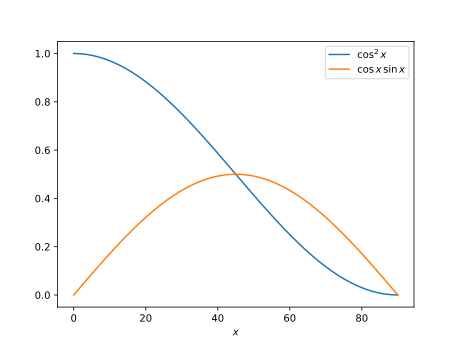

---
keywords:
- trigonometría
- funciones goniométricas
- triángulo rectángulo
is_finished: true
---

# Juntas pegadas

Veremos las posibles aplicaciones prácticas de las funciones goniométricas 
y las relaciones entre las longitudes de los lados de un triángulo rectángulo.

Trataremos el tema de las uniones pegadas. Mostraremos métodos para
distribuir la tensión de fuerza de una unión en más componentes y sobre un área mayor, y
cómo determinar las tensiones que surgen cuando se somete a tensión una unión de este tipo. Calcularemos cómo cambian los esfuerzos en una unión bajo carga axial de una barra o viga que no está pegada cara con cara, sino que 
la unión se realiza en diagonal como se muestra en la figura.

## Tipos de uniones pegadas y sus tensiones

Todo el mundo sabe unir materiales pegándolos. Si la resistencia
de la unión resultante no importa, el encolado es una de las formas más sencillas
de unir materiales. En la práctica, sin embargo, a menudo necesitamos que la unión sea
duradera y resistente. Es decir, debe ser capaz de soportar grandes cargas de fuerza.

Por lo general, los adhesivos garantizan una resistencia a las tensiones normales de tracción y de
corte que no supera los valores especificados por el fabricante
del adhesivo. La tensión mecánica que se produce cuando una junta está sometida a un esfuerzo fuerte es la relación 
entre la fuerza aplicada y la superficie sobre la que se aplica la fuerza. En el caso de
un esfuerzo normal se considera la fuerza perpendicular a la superficie, en el caso de un esfuerzo 
cortante la fuerza es paralela a la superficie. Las posibles deformaciones de la junta sometida a tensión  
se muestran en la figura de la izquierda, donde "Tensión" ilustra la tensión normal de tracción y "Cizalladura" ilustra la tensión de corte.

La durabilidad de la junta está relacionada con el adhesivo utilizado y los materiales unidos. Los datos pueden obtenerse de los fabricantes y pueden tener el siguiente aspecto, por ejemplo:

* Una junta unida con el adhesivo instantáneo Loctite 421 tiene una resistencia de $18\,\text{MPa}$ až $26\,\text{MPa}$
  en acero y de $5\,\text{MPa}$ až $20\,\text{MPa}$ en policarbonato.
* Una junta unida con adhesivo de dispersión Herkules tiene una resistencia al corte de unión a la madera de $8\,\text{MPa}$.
* Una junta unida con pegamento MAMUT tiene una resistencia a la tracción de  $2{,}18\,\text{MPa}$ y una resistencia al corte de $1{,}40\,\text{MPa}$.

Dado que la tensión en una articulación se determina como una relación entre la fuerza y el área, para reducirla
tratamos de repartir la acción de la fuerza en más direcciones y 
sobre un área mayor. Las uniones de la figura anterior de la derecha son un ejemplo. En la junta 
B las caras sometidas a esfuerzo normal se complementan con caras 
sometidas a un esfuerzo de corte puro. 

Para nosotros, la conexión con una junta inclinada será más interesante, porque en ella
la junta está sometida a esfuerzos tanto normales como 
cortantes. Obsérvese que, en la práctica, a menudo vemos la junta helicoidal implementada
de forma diferente a la imagen inicial. La razón es que es preferible tener la junta
más inclinada, pero una junta demasiado inclinada ocuparía demasiado espacio. Por lo tanto, en la práctica
dicha junta se realiza con roturas, con cada dos piezas giradas
y con las piezas alineadas una encima de la otra.

## Tensiones en la junta helicoidal

> **Tarea 1.**
> Consideremos un prisma de anchura $b=4\,\mathrm{cm}$ y altura $h=3\,\mathrm{cm}$, que está pegado en dos piezas por una junta oblicua como se muestra en la figura.
> La junta forma un ángulo de $\alpha=30^\circ$. con la cara del prisma. El prisma
> está tensado axialmente por una fuerza $F=1\,000\,\mathrm{N}$. 
> Calcular la tensión en la junta y comparar con la tensión en una sección perpendicular al eje. 
>
> 

\iffalse

*Solución.*
En un plano perpendicular al eje, la sección es un rectángulo de lados $b$ y $h$.
La fuerza $F$ induce un esfuerzo de tracción en este plano
$$
\sigma = \frac{F}{bh}
= \frac{1000\,\mathrm{N}}{3\times 4 \,\mathrm {cm}^2} = 833\,333\ \mathrm{Pa} = 0{,}833\, \mathrm{MPa}.
$$ 

La tensión normal $\sigma_N$ en el acoplamiento se calcula mediante la relación 
$$
\sigma_N = \frac{F_N}{S},
$$
donde $F_N$ es la magnitud de la fuerza normal y $S$ es el área
del acoplamiento. El esfuerzo cortante $\sigma_G$ se calcula de forma similar al normal
mediante la relación
$$
\sigma_G = \frac{F_G}{S},
$$ 
donde $F_G$ es la magnitud del esfuerzo cortante.

En un triángulo rectángulo con hipotenusa $F$ y catetos $F_N$ y $F_G$ (ver Figura 5), podemos determinar los ángulos interiores por las propiedades de los ángulos suplementarios y congruentes. A partir de este triángulo, obtenemos las magnitudes de las fuerzas $F_N$ a $F_G$:

$$
\begin{aligned}
F_N&=F\cos \alpha\\
F_G&=F\sin \alpha
\end{aligned}
$$

La junta será rectangular. Uno de sus lados será igual a la anchura
del prisma $b$. La longitud $c$ del otro lado es la longitud de la hipotenusa de un triángulo 
rectángulo, en el que conocemos la longitud de la hipotenusa $h$ y el tamaño del ángulo
$\alpha$ entre la hipotenusa y este lado.

Así que
$$
c=\frac{h}{\cos \alpha}
$$
y
$$S=bc=\frac{hb}{\cos\alpha}.$$

Utilizando las relaciones derivadas, obtenemos el valor de la tensión normal
$$
\sigma_N = \frac{F_N}{S} = \frac {F\cos\alpha}{\frac{hb}{\cos \alpha}} = 
\frac{F}{hb}\cos^2\alpha = \sigma \cos^2\alpha
$$
y el valor para la tensión cortante 
$$
\sigma_G = \frac{F_G}{S} = \frac {F\sin\alpha}{\frac{hb}{\cos \alpha}} = 
\frac{F}{hb}\sin\alpha\cos\alpha = \sigma \sin\alpha\cos\alpha.
$$

Los valores de los factores $\cos^2\alpha$ y $\sin\alpha \cos \alpha$ indican cuántas veces cambia la tensión normal o cortante en la junta en comparación con la tensión en la sección perpendicular. Dado que ambos factores son menores que uno para un ángulo distinto de cero, tanto $\sigma_N$
como $\sigma_G$ serán menores que $\sigma$. La progresión de las funciones $\sin x\cos x$ y
$\cos^2x$ pro $x$ en grados se muestra en la figura siguiente. Para el ángulo $\alpha=30^\circ$ y los parámetros
dados del prisma y la acción de la fuerza, obtenemos
$$
\sigma_N=0{,}625\,\mathrm{MPa}
$$
y 
$$
\sigma_G=0{,}361\,\mathrm{MPa}.
$$

\fi

## Tareas para el trabajo autónomo

> **Tarea 2.** Determina para qué ángulo será máxima la tensión cortante en la unión según la Tarea 1. Determina también la tensión normal correspondiente.

\iffalse

*Solución.*

En la Tarea 1, la fórmula para el esfuerzo cortante se obtuvo de la forma 

$$
\sigma_G=\sigma\sin\alpha\cos\alpha.
$$

Utilizando la fórmula del doble del ángulo, obtenemos

$$
\sigma_G=\frac 12\sigma\sin(2\alpha).
$$

La función $\sin 2\alpha$ tiene un máximo para el ángulo $\alpha = 45^\circ$, véase también la Figura 6 en la solución de la Tarea 1. De aquí vemos que el valor máximo del esfuerzo cortante es para el ángulo $\alpha=45^\circ$ y en este caso se cumplirá $\sigma_G=\frac 12\sigma$. 

Para la tensión normal hemos obtenido la fórmula 

$$\sigma_N=\sigma \cos^2\alpha$$

y para $\alpha=45^\circ$ obtenemos $\sigma_N=\frac 12\sigma.$ En el esfuerzo cortante máximo ambas tensiones (cortante y normal) serán iguales e iguales a la mitad de $\sigma$. Esta situación se da para una junta con un ángulo $45^\circ$.

\fi

> **Tarea 3.** El adhesivo garantiza que la junta pueda soportar las fuerzas que producen tensiones normales
> $10\,\mathrm{MPa}$ y tensiones cortantes de $8\,\mathrm{MPa}$. ¿Qué
> fuerza máxima puede aplicarse a la junta del problema 1? ¿Cómo cambiaría la respuesta a
> esta pregunta para una junta con un ángulo de $45^\circ$?

\iffalse

*Solución.* En la Tarea 1, se derivaron las relaciones entre las dos tensiones y la fuerza aplicada 
$$
\sigma _N=\frac{F}{bh}\cos^2 \alpha
$$
y 
$$
\sigma _G=\frac{F}{bh}\sin \alpha \cos \alpha.
$$ 
A partir de aquí expresamos la fuerza en función de las tensiones individuales. Dado que este será el valor crítico de la fuerza a la que falla la conexión, lo indicamos con $F_{\max,N}$ para la fuerza cuando se alcanza el valor crítico para la tensión normal y $F_{\max,G}$ para la fuerza cuando se alcanza el valor crítico para la tensión cortante. 
Se obtiene
$$
F_{\max, N}=\frac{bh\sigma_N}{\cos^2\alpha}
$$

y

$$
F_{\max, G}=\frac{bh\sigma_G}{\sin\alpha\cos\alpha}.
$$

Para las dimensiones de la Tarea 1 y para los $\sigma_N=10\,\mathrm{MPa}$ y $\sigma_G=8\,\mathrm{MPa}$ dados, calcular

$$
F_{\max, N}=\frac{3\times 4 \,\mathrm{cm}^2 \times 10\,\mathrm{MPa}}{\cos^2
30^\circ}=16\,000\,\mathrm{N}
$$

y

$$
F_{\max, G}=\frac{3\times 4 \,\mathrm{cm}^2 \times 8\,\mathrm{MPa}}{\sin
30^\circ\cos 30^\circ}=22\,170\,\mathrm{N}.
$$

No debe superarse ninguno de estos valores. Por lo tanto, la fuerza máxima que puede aplicarse a esta junta es $16\,000\,\mathrm{N}$.

Para el ángulo $\alpha = 45^\circ$ obtenemos análogamente los valores 

$$F_{\max, N}=\frac{3\times 4 \,\mathrm{cm}^2 \times 10\,\mathrm{MPa}}{\cos^2 45^\circ}=24\,000\,\mathrm{N}$$

y

$$F_{\max, G}=\frac{3\times 4 \,\mathrm{cm}^2 \times 8\,\mathrm{MPa}}{\sin 45^\circ\cos 45^\circ}=19\,200\,\mathrm{N}.$$

De nuevo, no se puede sobrepasar ninguno de estos valores.
De aquí se deduce que una articulación con un ángulo de $45^\circ$ puede cargarse con una fuerza de como máxim $19\,200\,\mathrm{N}.$

\fi

## Conclusiones

### Tensiones en el plano de la conexión

Estudiamos las fuerzas que intentan romper la unión mediante tensiones normales
perpendiculares a la unión y tensiones cortantes. Además, la fuerza
acción todavía puede estirar la articulación en su conjunto en el plano de la articulación.
Este componente no nos interesaba en el análisis presentado . Sin embargo, puede obtenerse
a partir de la fórmula de la tensión normal $\sigma_N$ girándola 90
grados.

### Análisis de defectos

La descomposición de esfuerzos en direcciones preseleccionadas también se utiliza en otras
situaciones prácticas de ingeniería distintas de la adhesión. Por ejemplo, si hay una grieta
en el interior de un material sometido a tensión, el conocimiento de la acción de la fuerza permitirá
evaluar los riesgos de propagación ulterior de este defecto. Es entonces natural
transformar la tensión mecánica en la dirección del defecto de forma similar a como
transformamos en la dirección de la unión.

### Modelización mecánica de materiales compuestos

También es conveniente transformar las tensiones mecánicas en las direcciones investigadas cuando
estudia la deformación de los materiales compuestos. Este puede ser el caso de los materiales compuestos artificiales
o también de los naturales. Los materiales compuestos artificiales son, por ejemplo,
los materiales reforzados con fibra. Los compuestos naturales incluyen
el material estructural más utilizado, la madera. Estos materiales compuestos tienen diferentes propiedades en diferentes direcciones 
debido a su estructura, y cuando se estudia
la acción mecánica sobre tales materiales, es más fácil estudiar
por separado las tensiones en las direcciones relacionadas con la estructura de este
material compuesto. Por ejemplo, las tensiones en la dirección de las fibras rigidizadoras en los compuestos
artificiales o las tensiones en la dirección longitudinal (después de los años) en la madera. En general
se trata de tensiones en los ejes o planos de simetría del material.  En
estas direcciones, se conoce la respuesta del material a la tensión. La respuesta a
tensiones en otras direcciones puede determinarse descomponiendo las tensiones en
direcciones individuales, determinando las deformaciones correspondientes y, de nuevo,
componiendo la información para obtener la respuesta global del material. Los ingenieros conocen este
como la llamada transformación tensorial y disponen de una gran variedad
de técnicas para resolver problemas de un tipo determinado de forma rápida y eficaz.

## Bibliografía y referencias

### Bibliografía

* <https://www.lepidlatmely.cz/loctite-421-20-g-vterinove-lepidlo/>, online, 2024-04-28
* <https://www.druchema.cz/z1530-herkules-250g>, online, 2024-04-28
* <https://www.deko.ee/en/a/mamut-glue-25ml-25-ml>, online, 2024-04-29

### Fuente de las imágenes

* https://theepoxyexperts.com/general-bonding-design-guideline/
* https://homemade-furniture.com/woodworking-joints/finger-joint/
* https://commons.wikimedia.org/wiki/File:Glue_Bottle_-_The_Noun_Project.svg

