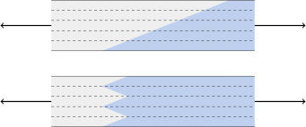
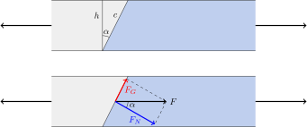
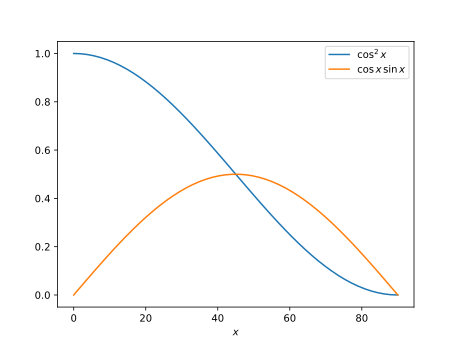

---
keywords:
- trygonometria
- funkcje trygonometryczne
- trójkąt prostokątny
is_finished: true
---

# Połączenia klejone

W tym artykule zademonstrujemy praktyczne zastosowania funkcji trygonometrycznych i zależności między długościami boków w trójkącie prostokątnym.

Skupiamy się na temacie połączeń klejonych - połączeń wykonanych przy użyciu materiałów klejących.
Pokażemy, jak rozłożyć siłę działającą w połączeniu na składowe, rozłożyć ją na większym obszarze i określić wynikające z tego naprężenia w połączeniu. Obliczymy, jak zmienia się naprężenie w ukośnym połączeniu pręta, jeśli pręt jest obciążony siłą osiową, w porównaniu do połączenia prostopadłego, jak pokazano na rysunku.

## Rodzaje połączeń klejonych i ich naprężenia

Każdy zna łączenie materiałów za pomocą klejenia. Gdy wytrzymałość połączenia nie jest krytyczna, klejenie jest jednym z najprostszych sposobów łączenia materiałów.
W praktyce jednak często potrzebujemy, aby połączenie było zarówno trwałe i mocne. Oznacza to, że połączenie nie powinno zawieść pod wpływem znacznego obciążenia siłami. W inżynierii połączenia klejone są również określane jako połączenia spajane.

Kleje zazwyczaj gwarantują odporność na naprężenia normalne (siły rozciągające) i naprężenia ścinające (siły ślizgowe), 
o ile naprężenia nie przekraczają wartości określonych przez producenta kleju.

Naprężenie odnosi się do nacisku mechanicznego, zdefiniowanego jako stosunek przyłożonej siły do powierzchni, na którą działa siła.
W przypadku naprężenia normalnego, siła działa prostopadle do powierzchni. W przypadku naprężeń ścinających siła działa równolegle do powierzchni złącza. Odkształcenia spowodowane przez te siły są pokazane po lewej stronie: "Rozciąganie" ilustruje naprężenie normalne od siły prostopadłej, podczas gdy "Ścinanie" ilustruje naprężenie ścinające od siły równoległej.

Wytrzymałość połączenia zależy od użytego kleju i łączonych materiałów. Dane producenta mogą wyglądać następująco:

* Połączenie klejone za pomocą Loctite 421 (superklej) ma wytrzymałość od 18 MPa do 26 MPa na stali i od 5 MPa do 20 MPa na poliwęglanie.
* Połączenie drewniane sklejone klejem Herkules (klej dyspersyjny) może wytrzymać naprężenia ścinające o wartości 8 MPa.
* Połączenie klejone klejem MAMUT Glue ma wytrzymałość na rozciąganie 2,18 MPa i ścinanie 1,40 MPa.
  
Ponieważ naprężenie w złączu jest obliczane jako stosunek siły do powierzchni, jednym ze skutecznych sposobów zmniejszenia
naprężeń jest rozłożenie siły na wiele kierunków i rozłożenie jej na większym obszarze.
Po prawej stronie poprzedniego rysunku pokazano przykłady. W połączeniu B powierzchnie czołowe są poddawane naprężeniom normalnym, podczas gdy dodatkowe powierzchnie są obciążone naprężeniami ścinającymi.

Zwrócimy szczególną uwagę na połączenia ukośne, w których połączenie jest poddawane jednocześnie naprężeniom normalnym i ścinającym.
W praktyce połączenia skośne są często wykonywane inaczej niż na rysunku 1. Większy skos zwiększa wytrzymałość połączenia, ale także zajmuje więcej miejsca. Dlatego połączenia skośne są zwykle budowane z przerwami, obróconymi warstwami i ułożeniem sklejonych segmentów.

## Naprężenia w złączu skośnym

> **Zadanie 1.**
> Rozważmy pręt o wysokości $h=3\mathrm{cm}$ i szerokość $b=4\mathrm{cm}$, sklejony z dwóch części wzdłuż ukośnego połączenia, jak pokazano na rysunku.
> Kąt między płaszczyzną połączenia a płaszczyzną przekroju prostopadłego do osi pręta wynosi $\alpha=30^\circ$. Pręt
> jest poddawany działaniu siły osiowej $F=1\ 000\ \mathrm{N}$. 
> Obliczyć naprężenia normalne i ścinające w połączeniu skośnym i porównać je z naprężeniami normalnymi w przekroju prostopadłym do osi.
>
> 

\iffalse

*Rozwiązanie.*
W płaszczyźnie prostopadłej do osi przekrój jest prostokątem o bokach $b$ i $h$.
Siła osiowa $F$ powoduje w tym przekroju tylko naprężenia normalne:

$$\sigma = \frac{F}{bh}
= \frac{1\ 000\ \mathrm{N}}{(3\times 4) \ \mathrm {cm}^2} = 833\ 333\ \mathrm{Pa} = 0{,}833\ \mathrm{MPa}.$$ 

Naprężenie normalne w połączeniu skośnym, $\sigma_N$, jest określone przez:
$$
\sigma_N = \frac{F_N}{A},
$$
gdzie $F_N$ jest składową siły normalnej do złącza, a $A$ jest powierzchnią połączenia. Podobnie, naprężenie ścinające w połączeniu skośnym, $\sigma_G$, jest podana przez:
$$
\sigma_G = \frac{F_G}{A},
$$ 
gdzie $F_G$ jest składową siły równoległej do złącza.

Siła osiowa $F$ jest rozkładana na składowe siły normalnej $F_N$ i siły tnącej $F_G$. Składowe te tworzą boki trójkąta prostokątnego o przeciwprostokątnej $F$ i danym kącie $\alpha$ pomiędzy jednym z boków a przeciwprostokątną (patrz rysunek). Na podstawie zależności między parametrami tego trójkąta obliczamy wielkości sił $F_N$ i $F_G$:

$$
\begin{aligned}
F_N&=F\cos \alpha,\\
F_G&=F\sin \alpha.
\end{aligned}
$$

Kształt powierzchni złącza to prostokąt. Jeden bok tego prostokąta jest równy szerokości pręta, $b$, a drugi bok, $c$, jest przeciwprostokątną trójkąta prostokątnego o boku trójkąta prostokątnego o boku $h$ i przyległym kącie wewnętrznym
$alfa$.

W ten sposób obliczamy długość $c$ jako:

$$c=\frac{h}{\cos\alpha},$$

a powierzchnia złącza wynosi:

$$A=bc=\frac{bh}{\cos\alpha}.$$

Korzystając z powyższych obliczeń, otrzymujemy naprężenie normalne:

$$ \sigma_N = \frac{F_N}{A} = \frac{F\cos\alpha}{\frac{bh}{\cos \alpha}} = \frac{F}{bh}\cos^2\alpha = \sigma\cos^2\alpha,$$

i dla naprężenia ścinającego:

$$\sigma_G = \frac{F_G}{A} = \frac{F\sin\alpha}{\frac{bh}{\cos \alpha}} = 
\frac{F}{bh}\sin\alpha\cos\alpha = \sigma\sin\alpha\cos\alpha.$$
 
Wartości funkcji trygonometrycznych, $\sin\alpha$ and $\cos\alpha$, określa, w jakim stosunku naprężenia w złączu dzielą się na składowe normalne i ścinające. Ponieważ oba te współczynniki są mniejsze niż jeden, oba naprężenia, $\sigma_N$
oraz $\sigma_S$, są mniejsze niż $\sigma$, która jest naprężeniem w przekroju prostopadłym do osi pręta.
Wykresy funkcji $\sin x\cos x$ oraz $\cos^2x$ są pokazane na poniższym rysunku. Dla kąta $\alpha=30^\circ$, i podane
wymiary pręta i wielkość siły osiowej:

$$\sigma_N=0{,}625\ \mathrm{MPa},$$

oraz

$$\sigma_G=0{,}361\ \mathrm{MPa}.$$

\fi

## Ćwiczenia uzupełniające

>**Zadanie 2.** Określić kąt nachylenia połączenia (jak opisano w  
> Problemie 1)  dla którego naprężenie ścinające jest maksymalne. 
> Określ również odpowiadające mu naprężenie normalne.

\iffalse

*Rozwiązanie.* W Problemie 1 wzór na naprężenie ścinające został wyprowadzony w postaci:

$$\sigma_G=\sigma\sin\alpha\cos\alpha.$$

Korzystając z tożsamości trygonometrycznej, $\sin 2\alpha=2\sin\alpha\cos\alpha$, otrzymujemy:

$$\sigma_G=\frac 12\sigma\sin(2\alpha).$$

Wyrażenie to osiąga maksimum, gdy $\sin(2\alpha) = 1$ który jest na $\alpha = 45^\circ$ (patrz również rysunek w rozwiązaniu Problemu 1).
W takim przypadku mamy:

$$\sigma_G=\frac 12\sigma.$$
 
Dla naprężenia normalnego wyprowadzony wzór jest następujący:

$$\sigma_N=\sigma\cos^2\alpha.$$

W przypadku $\alpha=45^\circ$ mamy
$$
\sigma_N=\frac 12\sigma.
$$ 
Przy maksymalnym naprężeniu ścinającym zarówno naprężenia ścinające, jak i normalne są równe i każde z nich stanowi połowę wartości $\sigma$. Sytuacja ta występuje, gdy połączenie jest nachylone pod kątem $45^\circ$.

\fi

>**Zadanie 3.** Klej gwarantuje, że połączenie może wytrzymać normalne naprężenie wynoszące $10\ \mathrm{MPa}$ i naprężenie ścinające $8\ \mathrm{MPa}$. Jaka jest zatem maksymalna siła, która może być przyłożona do skośnego połączenia opisanego w Problemie 1?
>Jak zmieniłaby się odpowiedź na to pytanie, gdyby złącze było nachylone pod kątem $45^{\circ}$?

\iffalse

*Rozwiązanie.* W zadaniu 1 wyprowadzono zależności pomiędzy naprężeniem normalnym $\sigma_N$ i naprężeniem ścinającym $\sigma_G$ w przegubie a siłą osiową $F$ działającą na pręt.

$$
\sigma _N=\frac{F}{bh}\cos^2 \alpha
$$

$$
\sigma _G=\frac{F}{bh}\sin \alpha \cos \alpha.
$$ 

Na podstawie tych zależności możemy wyrazić siłę osiową $F$ w kategoriach naprężenia $\sigma_N$ i $\sigma_G$. Ponieważ wyniki zostaną wykorzystane do określeniamaksymalnej siły, jaką można przyłożyć do złącza, oznaczymy przez $F_{\max, N}$ siła, która wytwarza krytyczną wartość naprężenia normalnego i przez $F_{\max,G}$ siła, która daje wartość krytyczną dla naprężenia ścinającego.

Otrzymujemy

$$
F_{\max, N}=\frac{bh\sigma_N}{\cos^2\alpha}
$$

i

$$
F_{\max, G}=\frac{bh\sigma_G}{\sin\alpha\cos\alpha}.
$$

Dla danych z Problemu 1 i dla wartości  $\sigma_N=10\,\mathrm{MPa}$ i $\sigma_G=8\,\mathrm{MPa}$ otrzymujemy

$$
F_{\max, N}=\frac{3\times 4 \,\mathrm{cm}^2 \times 10\,\mathrm{MPa}}{\cos^2
30^\circ}=16\,000\,\mathrm{N}
$$

i

$$
F_{\max, G}=\frac{3\times 4 \,\mathrm{cm}^2 \times 8\,\mathrm{MPa}}{\sin
30^\circ\cos 30^\circ}=22\,170\,\mathrm{N}.
$$

Żadna z tych wartości nie może zostać przekroczona. Dlatego maksymalna siła, jaką można przyłożyć do tego połączenia, wynosi $16\,000\,\mathrm{N}$, ograniczone przez kryterium naprężenia normalnego.

Dla kąta $\alpha = 45^\circ$ otrzymujemy

$$F_{\max, N}=\frac{3\times 4 \,\mathrm{cm}^2 \times 10\,\mathrm{MPa}}{\cos^2 45^\circ}=24\,000\,\mathrm{N}$$

i

$$F_{\max, G}=\frac{3\times 4 \,\mathrm{cm}^2 \times 8\,\mathrm{MPa}}{\sin 45^\circ\cos 45^\circ}=19\,200\,\mathrm{N}.$$

Również w tym przypadku żadna z wartości nie może zostać przekroczona.

Dlatego maksymalna siła, jaką można przyłożyć do złącza, wynosi $19\,200\,\mathrm{N}$. 

Wartość ta jest wyższa niż w przypadku  $\alpha = 30^\circ$ wskazując, że kąt nachylenia $\alpha = 45^\circ$ pozwala na przyłożenie większej siły dzięki optymalnemu rozkładowi naprężeń.

\fi

## Uwagi końcowe

### Naprężenia w płaszczyźnie połączenia

Przeanalizowaliśmy siły, które próbują przerwać połączenie poprzez normalne naprężenia działające prostopadle do złącza i naprężenia ścinające działające w płaszczyźnie złącza. Ponadto siła może nadal rozciągać staw jako całość w płaszczyźnie stawu. 
W powyższej analizie nie byliśmy zainteresowani tym komponentem. Jednakże można jednak uzyskać ze wzoru na naprężenie normalne $\sigma_N$, obracając go o 90 stopni.

### Analiza defektów

Rozkład naprężeń na wstępnie wybrane kierunki jest również wykorzystywany w innych sytuacjach w praktyce inżynierskiej. Na przykład, jeśli w materiale poddanym naprężeniom występuje wada wewnętrzna, znajomość naprężeń w różnych płaszczyznach pozwoli ocenić ryzyko dalszego rozprzestrzeniania się tej wady. W tym przypadku naturalne jest
przekształcenie naprężeń mechanicznych w kierunku defektu w taki sam sposób, w jaki w kierunku połączenia.

### Modelowanie mechaniczne materiałów kompozytowych

Właściwe jest przekształcanie naprężeń mechanicznych w predefiniowane kierunki nawet podczas badania odkształcenia materiałów kompozytowych. Obejmuje to zarówno sztuczne kompozyty lub kompozyty naturalne. Sztuczne kompozyty obejmują materiały wzmacniane włóknami. Naturalne kompozyty obejmują najczęściej stosowanym materiałem konstrukcyjnym jest drewno. Kompozyty te mają różne właściwości w różnych kierunkach, a podczas badania zachowania tych materiałów pod obciążeniem mechanicznym łatwiej jest badać ich właściwości oddzielnie naprężenia w kierunkach związanych ze strukturą tego kompozytu. 
Na przykład naprężenia w kierunku włókien usztywniających w sztucznych kompozytach lub naprężenia w kierunku wzdłużnym w przypadku drewna, kompozytach lub naprężenia w kierunku wzdłużnym dla drewna. Ogólnie rzecz biorąc, badamy naprężenia w osiach lub płaszczyznach symetrii materiału oraz w kierunkach prostopadłych do tych płaszczyzn, w tak zwanych kierunkach głównych. Reakcja materiału na obciążenia w kierunkach głównych jest znana. Reakcja naobciążenia w innych kierunkach można określić, rozkładając naprężenia na poszczególne kierunki główne, określić odpowiadające im odkształcenia i przekształcić te informacje z powrotem, aby uzyskać ostateczną odpowiedź materiału. Inżynierowie znają tę technikę jako tak zwaną transformację tensorową i dysponują wieloma technikmi szybkiego i efektywnego rozwiązywania tego typu problemów.

## Referencje

### Referencje

* <https://www.lepidlatmely.cz/loctite-421-20-g-vterinove-lepidlo/>, online, 2024-04-28
* <https://www.druchema.cz/z1530-herkules-250g>, online, 2024-04-28
* <https://www.deko.ee/en/a/mamut-glue-25ml-25-ml>, online, 2024-04-29

### Źródła obrazu

* https://theepoxyexperts.com/general-bonding-design-guideline/
* https://homemade-furniture.com/woodworking-joints/finger-joint/
* https://commons.wikimedia.org/wiki/File:Glue_Bottle_-_The_Noun_Project.svg

