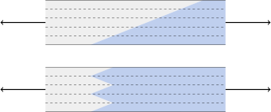

---
keywords:
- goniometria
- goniometrické funkcie
- pravouhlý trojuholník
is_finished: true
---

# Lepené spoje

Pozrieme sa na možné praktické využitie goniometrických funkcií a vzťahov medzi dĺžkami strán pravouhlého trojuholníka. Budeme sa zaoberať problematikou lepených spojov. Ukážeme si metódy, ako rozložiť silové namáhanie spoja na viac zložiek a na väčšiu plochu. Tiež ako určiť napätie, ktoré vzniká pri namáhaní takého spoja. Vypočítame, ako sa zmení napätie v spoji pri osovom namáhaní tyče alebo nosníka, ktorý nie je zlepený čelne, ale spoj je vedený šikmo, ako je vidieť na obrázku.

## Typy lepených spojov a ich namáhanie

Zo života každý pozná spájanie materiálov lepením. Pokiaľ na pevnosti výsledného spoja nezáleží, je lepenie jedným z najjednoduchších spôsobov spájania materiálov. V praxi však často potrebujeme, aby spoj bol trvanlivý a pevný. Potrebujeme, aby uniesol veľké silové zaťaženie.
Lepidlá garantujú spravidla odolnosť voči normálovému namáhaniu ťahom a voči namáhaniu šmykom (tangenciálne napätie), ktoré neprekročí hodnoty dané výrobcom lepidla. Mechanické napätie vznikajúce pri namáhaní spoja silou, je podielom pôsobiacej sily a plochy, na ktorú sila pôsobí. V prípade normálového napätia je uvažovaná sila kolmá na plochu, v prípade namáhania šmykom je sila rovnobežná s plochou. Možné deformácie namáhaného spoja sú na obrázku vľavo, pričom "Tensile" ilustruje normálové namáhanie ťahom a "Shear" šmykové namáhanie.

Odolnosť spoja súvisí s použitým lepidlom a s lepenými materiálmi. Údaje možno nájsť u výrobcov a môžu vyzerať napríklad takto:

* Spoj lepený sekundovým lepidlom Loctite 421 má pevnosť $18\,\text{MPa}$ až $26\,\text{MPa}$
  na oceli a $5\,\text{MPa}$ až $20\,\text{MPa}$ na polykarbonáte.
* Spoj lepený disperzným lepidlom Herkules má pevnosť v šmyku pri lepení dreva $8\,\text{MPa}$.
* Spoj lepený lepidlom MAMUT Glue má pevnosť v ťahu  $2{,}18\,\text{MPa}$ a v šmyku $1{,}40\,\text{MPa}$.

Pretože napätie v spoji sa určuje ako podiel sily a plochy, pre jeho zníženie sa snažíme rozložiť silové pôsobenie do viac smerov a na väčšiu plochu. Ukážkou sú spoje na predchádzajúcom obrázku vpravo. Pri spoji B sú čelné plochy namáhané normálovým napätím doplnené plochami namáhanými čisto šmykovým napätím.

Pre nás bude zaujímavejšie spojenie šikmým spojom, pretože pri ňom je spoj vystavený súčasne normálovému aj šmykovému namáhaniu. Poznamenajme, že v praxi šikmý spoj často vidíme realizovaný inak, než je na úvodnom obrázku. Dôvod je ten, že je výhodnejšie mať spoj viac naklonený, ale zase príliš šikmý spoj by zaberal veľký priestor. V praxi je preto taký spoj realizovaný s prerušeniami, s otočením každej druhej časti a so zarovnaním jednotlivých častí nad seba.

## Namáhanie šikmého spoja

> **Úloha 1.**
> Uvažujme hranol so šírkou $b=4\,\mathrm{cm}$ a výškou $h=3\,\mathrm{cm}$, ktorý je zlepený z dvoch častí šikmým spojom podľa obrázka. Spoj zviera s čelom hranolu uhol veľkosti $\alpha=30^\circ$. Hranol je namáhaný osovou silou $F=1\,000\,\mathrm{N}$. 
> Vypočítajte namáhanie spoja a porovnajte ho s namáhaním v reze kolmom na os hranolu.
>
> 

\iffalse

*Riešenie.*
V rovine kolmej na os, má rez tvar obdĺžnika so stranami $b$ a $h$.
Sila $F$ vyvolá v tejto rovine ťažné napätie.
$$
\sigma = \frac{F}{bh}
= \frac{1000\,\mathrm{N}}{3\times 4 \,\mathrm {cm}^2} = 833\,333\ \mathrm{Pa} = 0{,}833\, \mathrm{MPa}.
$$ 

Normálové napätie $\sigma_N$ v spoji vypočítame vzťahom 
$$\sigma_N = \frac{F_N}{S},$$
kde $F_N$ je veľkosť normálovej síly a $S$ je obsah plochy
spoja. Šmykové napätie $\sigma_G$ vypočítame podobne ako normálové
vzťahom
$$\sigma_G = \frac{F_G}{S},$$ 
kde $F_G$ je veľkosť šmykovej sily.

V pravouhlom trojuholníku s preponou $F$ a odvesnami $F_N$ a $F_G$ (viď Obrázok 5) môžeme určiť vnútorné uhly vďaka vlastnostiam doplnkových a zhodných uhlov. Z tohto trojuholníka potom získame veľkosti síl $F_N$ a $F_G$:

$$
\begin{aligned}
F_N&=F\cos \alpha\\
F_G&=F\sin \alpha
\end{aligned}
$$

Spoj bude mať tvar obdĺžnika. Jedna jeho strana bude rovná šírke hranola $b$. Dĺžku $c$ druhej strany určíme ako dĺžku prepony pravouhlého trojuholníka, v ktorom poznáme dĺžku odvesny $h$ a veľkosť uhla $\alpha$ medzi odvesnou a touto stranou.

Teda
$$
c=\frac{h}{\cos \alpha}
$$
a
$$S=bc=\frac{hb}{\cos\alpha}.$$

S využitím odvodených vzťahov dostávame pre normálové napätie hodnotu
$$
\sigma_N = \frac{F_N}{S} = \frac {F\cos\alpha}{\frac{hb}{\cos \alpha}} = 
\frac{F}{hb}\cos^2\alpha = \sigma \cos^2\alpha
$$
a pre šmykové napätie hodnotu 
$$
\sigma_G = \frac{F_G}{S} = \frac {F\sin\alpha}{\frac{hb}{\cos \alpha}} = 
\frac{F}{hb}\sin\alpha\cos\alpha = \sigma \sin\alpha\cos\alpha.
$$

Hodnoty faktorov $\cos^2\alpha$ a $\sin\alpha \cos \alpha$ udávajú, koľkokrát sa zmení normálové alebo šmykové napätie v spoji v porovnaní s napätím v kolmom reze. Pretože sú pre nenulový uhol oba faktory menšie ako jedna, budú obe hodnoty $\sigma_N$
i $\sigma_G$ menšie ako $\sigma$. Priebehy funkcií $\sin x\cos x$ a
$\cos^2x$ pre $x$ v stupňoch sú na obrázku nižšie. Pre uhol $\alpha=30^\circ$ a zadané parametre hranola a silového pôsobenia dostávame
$$
\sigma_N=0{,}625\,\mathrm{MPa}
$$
a 
$$
\sigma_G=0{,}361\,\mathrm{MPa}.
$$

\fi

## Úlohy pre samostatnú prácu

> **Úloha 2.** Určte, pre aký uhol bude šmykové napätie v spoji podľa Úlohy 1 maximálne. Určte aj zodpovedajúce normálové napätie.

\iffalse

*Riešenie.* V Úlohe 1 bol odvodený vzorec pre šmykové napätie v tvare

$$
\sigma_G=\sigma\sin\alpha\cos\alpha.
$$

Využitím vzorca pre dvojnásobný uhol dostávame

$$
\sigma_G=\frac 12\sigma\sin(2\alpha).
$$

Funkcia $\sin 2\alpha$ má maximum pre uhol  $\alpha = 45^\circ$, viď aj Obrázok 6 v riešení Úlohy 1. Odtiaľ vidíme, že maximálna hodnota šmykového napätia je pre uhol $\alpha=45^\circ$ a v tomto prípade bude platiť $\sigma_G=\frac 12\sigma$. 

Pre normálové napätie sme odvodili vzorec

$$\sigma_N=\sigma \cos^2\alpha$$

a pre $\alpha=45^\circ$ dostávame $\sigma_N=\frac 12\sigma.$ Pri maximálnom šmykovom napätí teda budú obe napätia (šmykové aj normálové) rovnaké a rovné polovici hodnoty  $\sigma$. Táto situácia nastane pre spoj pod uhlom $45^\circ$.

\fi

> **Úloha 3.** Lepidlo garantuje, že spoj odolá namáhaniu, pri ktorom vzniká normálové napätie
> $10\,\mathrm{MPa}$ a šmykové napätie $8\,\mathrm{MPa}$. Aká maximálna sila môže zaťažiť spoj z Úlohy 1? Ako by sa odpoveď na túto otázku zmenila pre spoj pod uhlom $45^\circ$?

\iffalse

*Riešenie.*
V Úlohe 1 boli odvodené vzťahy medzi oboma napätiami a pôsobiacou silou
$$
\sigma _N=\frac{F}{bh}\cos^2 \alpha
$$
a 
$$
\sigma _G=\frac{F}{bh}\sin \alpha \cos \alpha.
$$ 
Odtiaľ vyjadríme silu ako funkciu jednotlivých napätí. Pretože sa bude jednať o kritickú hodnotu sily, pri ktorej spoj zlyháva, označíme ju $F_{\max,N}$ pre silu, kedy kritickú hodnotu dosiahneme pre normálové napätie a $F_{\max,G}$ pre silu, kedy kritickú hodnotu dosiahneme pre šmykové napätie. 
Dostávame
$$
F_{\max, N}=\frac{bh\sigma_N}{\cos^2\alpha}
$$

a

$$
F_{\max, G}=\frac{bh\sigma_G}{\sin\alpha\cos\alpha}.
$$

Pre rozmery z Úlohy 1 a pre zadané $\sigma_N=10\,\mathrm{MPa}$ a $\sigma_G=8\,\mathrm{MPa}$ vypočítame

$$
F_{\max, N}=\frac{3\times 4 \,\mathrm{cm}^2 \times 10\,\mathrm{MPa}}{\cos^2
30^\circ}=16\,000\,\mathrm{N}
$$

a

$$
F_{\max, G}=\frac{3\times 4 \,\mathrm{cm}^2 \times 8\,\mathrm{MPa}}{\sin
30^\circ\cos 30^\circ}=22\,170\,\mathrm{N}.
$$

Ani jedna z týchto hodnôt nesmie byť prekročená. Maximálna sila, ktorá môže zaťažiť tento spoj je teda $16\,000\,\mathrm{N}$.

Pre uhol $\alpha = 45^\circ$ dostávame podobne hodnoty

$$F_{\max, N}=\frac{3\times 4 \,\mathrm{cm}^2 \times 10\,\mathrm{MPa}}{\cos^2 45^\circ}=24\,000\,\mathrm{N}$$

a

$$F_{\max, G}=\frac{3\times 4 \,\mathrm{cm}^2 \times 8\,\mathrm{MPa}}{\sin 45^\circ\cos 45^\circ}=19\,200\,\mathrm{N}.$$

Aj v tomto prípade nesmie byť prekročená ani jedna z uvedených hodnôt. Odtiaľ vidíme, že spoj pod uhlom $45^\circ$ môže byť zaťažený silou maximálne $19\,200\,\mathrm{N}.$

\fi

## Záverečné poznámky

### Namáhanie v rovine spoja

Študovali sme sily, ktoré sa snažia porušiť spoj normálovým namáhaním kolmo na spoj a šmykovým namáhaním. Okrem toho silové pôsobenie môže ešte v rovine spoja natiahnuť spoj ako celok. V uvedenej analýze nás táto možnosť nezaujímala. Je však možné ju obdržať zo vzorca pre normálové napätie $\sigma_N$ otočením o uhol 90 stupňov.

### Analýza defektov

Rozklad namáhania do vopred zvolených smerov sa používa aj v iných situáciách inžinierskej praxe, než je lepenie. Napríklad pokiaľ je vnútri namáhaného materiálu trhlina, znalosť silového pôsobenia umožní zhodnotiť riziká ďalšieho šírenia tohto defektu. Je potom prirodzené mechanické namáhanie transformovať do smeru defektu podobne, ako sme transformovali do smeru spoja.

### Mechanické modelovanie kompozitných materiálov

Mechanické namáhanie je vhodné transformovať do skúmaných smerov aj pri štúdiu deformácie kompozitných materiálov. Môže sa jednať o umelé kompozity alebo aj o kompozity prírodné. Umelé kompozity sú napríklad materiály vystužené vláknami. Medzi prírodné kompozity patrí aj najrozšírenejší konštrukčný materiál a to drevo. Tieto kompozity majú vďaka svojej štruktúre v rôznych smeroch rôzne vlastnosti a pri štúdiu mechanického pôsobenia na takéto materiály je jednoduchšie študovať oddelene namáhanie v smeroch, ktoré súvisia so štruktúrou tohto kompozitu. Napríklad namáhanie v smere stužujúcich vlákien u umelých kompozitov alebo namáhanie v pozdĺžnom smere (po letokruhoch) u dreva. Všeobecne sa jedná o namáhanie v osiach alebo rovinách symetrie materiálu.
V týchto smeroch je známa reakcia materiálu na namáhanie. Reakciu na namáhanie v iných smeroch môžeme určiť tak, že namáhanie rozložíme do jednotlivých smerov, určíme zodpovedajúce deformácie a informácie opäť zložíme, aby sme získali celkovú reakciu materiálu. Inžinieri túto problematiku poznajú ako tzv. transformáciu tenzorov a majú celý rad techník ako rýchlo a efektívne úlohy zadaného typu riešiť.

## Literatúra a odkazy

### Literatúra

* <https://www.lepidlatmely.cz/loctite-421-20-g-vterinove-lepidlo/>, online, 2024-04-28
* <https://www.druchema.cz/z1530-herkules-250g>, online, 2024-04-28
* <https://www.deko.ee/en/a/mamut-glue-25ml-25-ml>, online, 2024-04-29

### Zdroje obrázkov

* https://theepoxyexperts.com/general-bonding-design-guideline/
* https://homemade-furniture.com/woodworking-joints/finger-joint/
* https://commons.wikimedia.org/wiki/File:Glue_Bottle_-_The_Noun_Project.svg
