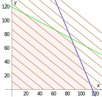

---
keywords:
- optimalizace
- analytická geometrie
- obecná rovnice přímky
- obecná rovnice roviny
is_finished: True
difficulty: 1
time: 30
---

# Optimalizace 

## Lineární programování

Lineární programování je matematická metoda používaná k nalezení 
nejlepšího řešení určitého problému. Jedná se o techniku, která se 
zaměřuje na maximalizaci nebo minimalizaci lineární funkce za určitých 
omezení, která jsou také vyjádřena jako lineární rovnice nebo nerovnice.

Tato oblast začala přitahovat pozornost matematiků až po první světové 
válce. Prvním z nich byl Lenoid Kantorovič, který však v důsledku 
tehdejších vládních represí (a posléze obav o svůj život) musel této práce
zanechat. Ono totiž v tehdejším Sovětském svazu s centrálně řízenou 
ekonomikou optimalizovat výrobní procesy nebyl zrovna dobrý nápad (v 
jedné továrně se mu např. podařilo zefektivnit výrobu na 94 %, jenže pak 
přišlo nařízení, že všechny závody musí navýšit svoji efektivitu stejným 
způsobem).

Skutečným zlomovým bodem v rozvoji lineárního programování bylo 
zveřejnění tzv. simplexového algoritmu pro řešení těchto úloh v roce 
1947. Jeho autorem je americký matematik George Dantzig, který se této 
oblasti začal věnovat v průběhu druhé světové války ve snaze 
zoptimalizovat některé procesy v americké armádě. Říkali tomu
*metody programovacího plánování pomocí stolních kalkulátorů*. Ve své 
první odborné přednášce na toto téma hovořil o *programování v lineární 
struktuře*, což se následně zkrátilo pouze na *lineární programování*.
Slůvko *programování* je pozůstatkem vojensky motivované terminologie, 
která odkazuje na plánování či rozvrhování tréninků, logistiky či 
rozmístění mužstva.

Principy si ukážeme na následujících jednoduchých příkladech.

## Optimalizace výroby v pražírně 

> **Úloha 1.**  Berenika a Petr si otevřeli novou kavárnu s pražírnou, kde 
> mimo jiné začali vyrábět dvě směsi kávy: letní a exotickou. Letní 
> směs je umíchána ze 40\,\% ze zrn sladké etiopské kávy a ze 60\,\% ze zrn 
> šťavnaté kávy z Peru. Exotická směs je vyrobena ze stejných kávových 
> zrn, ale v poměru 3:1 (tentokrát je více etiopské kávy). K dispozici je 
> $90\,\text{kg}$ etiopské kávy a $70\,\text{kg}$ peruánské kávy. Kilogram letní směsi se 
> prodává za 650 Kč a kilogram exotické směsi za 800 Kč. Kolik které 
> směsi by měli Berenika a Petr z dostupných kávových zrn namíchat, aby 
> maximalizovali svůj zisk?

\iffalse

*Řešení.* Nejdříve potřebujeme celý tento problém matematizovat. Začneme 
proto tím, že množství namíchané letní směsi označíme jako $x$ a množství 
exotické směsi jako $y$. Bez ohledu na to, kolik bude jednotlivých směsí 
vyrobeno, zisk $z$ z jejich prodeje můžeme vyjádřit pomocí výrazu
$$
z=650x+800y.
$$
Je jasné, že nelze vyrábět záporné množství, tj. určitě musí platit
$$
  x\geq0\quad \text{a zároveň}\quad y\geq0. \tag{1}
$$
Nyní musíme zohlednit to, že nemáme neomezené množství kávových zrn. Celkovou spotřebou etiopské kávy můžeme vzhledem k 
poměrům míchání vyjádřit jako
$$
  0{,}4x+0{,}75y 
$$
a v případě peruánské kávy to je
$$
  0{,}6x+0{,}25y.
$$
Dohromady s dostupným množstvím získáváme dvojici podmínek
$$
  0{,}4x+0{,}75y\leq90 \quad\text{a zároveň}\quad\quad 0{,}6x+0{,}25y\leq70. \tag{2}
$$
Množina bodů, které vyhovují podmínkám $(1)$ a $(2)$ je 
vyšrafována na obrázku níže, přičemž zelenou barvou je zakreslena 
hraniční přímka $0{,}4x+0{,}75y=90$ a modrou barvou přímka $0{,}6x+0{,}25y=70$.

Ve vyšrafované oblasti jsou tak všechny body, jejichž souřadnice $x$ 
a $y$ odpovídají možným řešením naší úlohy. Jak ale najdeme bod s 
maximálním ziskem, tj. bod ve kterém je hodnota výrazu $z=650x+800y$ maximální?

Můžeme si uvědomit, že tento výraz je rovnicí roviny v trojrozměrném prostoru. 
Uvažujeme-li z této roviny pouze tu část, která je nad vyšrafovanou oblastí, dostáváme v prostoru 
čtyřúhelník.

Místo toho, abychom kreslili prostorový obrázek, dokreslíme si do obrázku ještě tzv. *vrstevnice*. Jsou to přímky s rovnicemi
$$
650x+800y=c
$$
pro vhodná $c$. Význam těchto vrstevnic je podobný jako význam vrstevnic 
na mapě. Pouze místo bodů o stejné nadmořské výšce, spojují naše 
vrstevnice body, ve kterých dosáhneme stejného zisku.

Tímto postupem dostaneme obrázek s vrstevnicemi zakreslenými hnědou barvou.

Jak ale určíme vhodnou hodnotu $c$? Tu naštěstí nemusíme nijak složitě 
počítat, ale můžeme ji zjistit z našeho obrázku. Pro $c=0$ dostaneme 
přímku procházející počátkem, a jelikož se všechny vrstevnice liší pouze 
hodnotou $c$, musí být všechny hnědé přímky rovnoběžné. Odtud pak už jen 
vidíme, že maximum (vrstevnice se s rostoucí hodnotou $c$ posouvají 
severovýchodním směrem) bude v bodě, kde se protne modrá a 
zelená přímka. 

Souřadnice tohoto bodu tedy můžeme najít jako řešení soustavy lineárních rovnic o dvou neznámých
$$
\begin{align*}
0{,}4x+0{,}75y&=90 \\
0{,}6x+0{,}25y&=70.
\end{align*}
$$
Je jím bod o souřadnicích $\left[\frac{600}{7},\frac{520}{7}\right]$. 
Dosazením těchto hodnot do výrazu $z=650x+800y$ dostaneme hodnotu 
maximálního zisku přibližně $115\,143\,\text{Kč}$. Toho bude dosaženo, 
pokud Berenika s Petrem vyrobí $600/7\,\text{kg}$, tj. 
přibližně $85{,}71\,\text{kg}$ letní směsi a $520/7\,\text{kg}$, tj. 
přibližně $74{,}29\,\text{kg}$ exotické směsi. 

*Poznámka.* To, že řešení vyšlo v průsečíku dvou hraničních přímek, však 
není náhoda. U těchto úloh, kdy všechny funkce jsou pouze lineární, 
platí, že řešení je vždy v některém z vrcholů mnohoúhelníku (pokud 
existuje) vymezujícího všechny přípustné body. Toho lze využít i v 
případě úloh s mnohem větším počtem neznámých. 

Stačí najít všechny vrcholy a porovnat funkční hodnoty. Avšak toto 
použití tzv. hrubé síly má svá úskalí: může být výpočetně velmi 
náročné a vyžaduje mít zaručenu existenci řešení. Nicméně tato 
myšlenka stojí za prvním velmi efektivním (a dodnes používaným) 
algoritmem pro řešení těchto úloh. Při jeho použití jsou vrcholy 
procházeny systematicky (tj. ne nutně všechny).

\fi

## Nejlepší parkoviště

> **Úloha 2.** Místní developer se rozhodl zakoupit 
> továrnu na výrobu videokazet a magnetofonových pásků. 
> Továrna dnes již nemá žádné využití, a tak bude 
> zbourána, aby na jejím místě vyrostlo P+R parkoviště 
> pro osobní automobily a zároveň odstavné parkoviště 
> pro nákladní automobily. Developer však nyní řeší 
> problém, jakou nastavit kapacitu pro jednotlivé druhy 
> vozů. Celkový dostupný prostor bude $480\,\text{m}^2$. 
> Parkovací místo pro osobní automobil zabere $12\,\text{m}^2$, 
> zatímco pro nákladní auto to je $30\,\text{m}^2$. 
>
>Stavební úřad však zároveň požaduje, aby kapacita pro 
>osobní automobily byla alespoň dvakrát větší než pro 
>nákladní vozy, ale zároveň tam musí být nejméně 6 
>parkovacích míst pro nákladní automobily. 
>
>Stanovte optimální počet parkovacích míst pro osobní i 
>nákladní automobily, který bude splňovat všechny 
>uvedené podmínky a zároveň maximalizuje zisk z plného 
>parkoviště, pokud za každé parkovací místo pro osobní 
>automobily bude platba 100 Kč a pro nákladní vozy 400 Kč.

\iffalse

*Řešení.* Můžeme postupovat podobně jako v předchozím 
příkladě, avšak je potřeba mít na mysli, že tentokrát 
musí být počty parkovacích míst celočíselné. 
Označíme-li jako $x$ počty parkovacích míst pro osobní
automobily a jako $y$ počty parkovacích míst pro 
nákladní vozy, pak naším cílem je maximalizovat zisk 
$z$ daný vztahem 
$$
z=100x+400y.
$$
Navíc z uvedených podmínek plynou následující omezení.

| Podmínka  | Zdůvodnění | 
| ------------- | ------------- | 
| $y\geq 6$  | požadavek na minimální počet pro nákladní vozy  | 
| $2y\leq x$  | požadavek na druhy parkovacích míst  | 
| $12x+30y\leq480$ | dostupná kapacita pozemku  | 
| $x,y\in\mathbb{N}\cup\{0\}$  | počty musí být přirozená čísla nebo případně nula | 

Množina splňující všechny uvedené podmínky je 
vykreslena na obrázku níže. Vyznačeny jsou přímky 
$y=6$ (zelenou barvou), $2y=x$ (hnědou barvou), $12x+30y=480$ 
(modrou barvou) a vrstevnice $100x+400y=c$ pro různé 
hodnoty hodnoty $c$ (červenou barvou). Čím větší je $c$, tím více jsou vrstevnice "vpravo nahoře".

Růžovou barvou je vyšrafován mnohoúhelník, který 
vyhovuje všem uvedeným podmínkám kromě poslední. 
Černé body jsou pak všechny body, které splňují i tuto 
podmínku, tj. mají navíc jenom jako souřadnice 
přirozená čísla (nula nepřichází v dané oblasti v úvahu).

Z obrázku je patrné, že maximum bude v 
bodě, který je nejvíce vpravo nahoře. Jaké jsou ale 
jeho souřadnice? 

Vzhledem k tomu, že se jedná o průsečík modré a hnědé 
přímky, můžeme jeho souřadnice určit řešením soustavy 
rovnic
$$
\begin{align*}
2y&=x\\  
12x+30y&=480 
\end{align*}
$$
Jejím řešením je dvojice $[160/9,80/9]$, která ale
není celočíselná.

Podíváme-li se na obrázek pozorně a zvážíme-li směr 
vrstevnic, můžeme odhadnout, že hledané maximum dostaneme pro $y=8$. Současně vidíme, že 
černý bod s touto hodnotou leží na modré přímce. Tedy po dosazení 
$y=8$ do rovnice této přímky, dostaneme $x=20$. 

Maximálního zisku $5200$ Kč proto bude dosaženo v 
případě, kdy bude vybudováno $20$ parkovacích míst 
pro osobní automobily a $8$ parkovacích míst pro nákladní vozy. 

Jako kontrolu můžeme samozřejmě určit všechny 
celočíselné body splňující daná omezení a ověřit, že v 
žádném z nich není hodnota výrazu $100x+400y$ větší 
nebo rovna $5200$.

\fi
