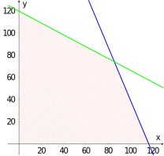
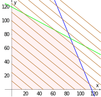
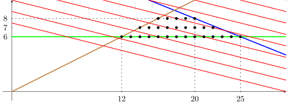

# Optimization

## Linear Programming

Linear programming is a mathematical method used to find the best solution to a particular problem. 
It is a technique that aims to maximize or minimize a linear function under certain constraints, 
which are also expressed as linear equations or inequations.

This field began to attract the attention of mathematicians only after the First World War. 
One of the first was Leonid Kantorovich, who was later forced to abandon his work due 
to the government repression at that time, and eventually out of fear for his life. 
It was not a good idea to optimize production processes in the Soviet Union, 
which had a centrally planned economy at the time 
(for example, in one factory he managed to increase production efficiency to 94\%, 
only to be told that all factories had to increase their efficiency in the same way).

The real turning point in the development of linear programming was the publication 
of the so-called simplex algorithm for solving these problems in 1947. 
Its author is the American mathematician George Dantzig, 
who began working in this field during the Second World War 
in an attempt to optimize certain processes in the US military. 
They called it *programming methods using desktop calculators*. 
In his first technical lecture on the subject, 
he talked about *programming in a linear structure*, 
which was subsequently shortened to just *linear programming*. 
The word *programming* is a relic of military terminology referring to the planning 
or scheduling of training, logistics, or team deployment.

We will illustrate the principles with the following simple examples.

## Optimizing Production in a Roasting Plant

> **Exercise 1.**  Berenika and Peter opened a new café with a roastery, where
> among other things they started to produce two blends of coffee: summer and exotic.
> The summer blend is made of 40\% sweet Ethiopian coffee beans and 60\% juicy coffee beans from Peru.
> The exotic blend is made from the same coffee beans, but in a 3:1 ratio (this time with more Ethiopian coffee beans).
> There are $90\,\text{kg}$ of Ethiopian coffee and $70\,\text{kg}$ of Peruvian coffee.
> A kilo of the summer blend sells for 650 CZK and a kilo of the exotic blend sells for 800 CZK.
> How much of which blend should Berenice and Peter mix from the available coffee beans to maximize their profit?

\iffalse

*Solution.* First, we need to mathematize this whole problem. Let's start, therefore, 
by denoting the amount of mixed summer mixture as $x$ and the amount of exotic mixture as $y$. 
Regardless of how many individual mixtures are produced, 
we can express the profit $z$ from their sale using the equation
$$
z=650x+800y.
$$
It is clear that a negative quantity cannot be produced, i.e. it must definitely hold that
$$
  x\geq0\quad \text{and}\quad y\geq0. \tag{1}
$$
Now we have to take into account that we do not have an unlimited amount of coffee beans. The total consumption of Ethiopian coffee, given the mixing ratios, can be expressed as
$$
  0{.}4x+0{.}75y 
$$
and in the case of Peruvian coffee it is
$$
  0{.}6x+0{.}25y.
$$
Together with the available quantity, we obtain a pair of conditions
$$
  0{.}4x+0{.}75y\leq90 \quad\text{and}\quad\quad 0{.}6x+0{.}25y\leq70. \tag{2}
$$
The set of points that satisfy conditions $(1)$ and $(2)$ is shaded in the figure below, 
with the boundary line $0{.}4x+0{.}75y=90$ drawn in green and the line $0{.}6x+0{.}25y=70$ drawn in blue.

The shaded area contains all points whose coordinates $x$ and $y$ represent possible solutions to our problem. 
But how do we find the point of maximum profit, i.e. the point at which the value of the expression $z=650x+800y$ is at its maximum?

We can notice that this expression is the equation of a plane in three-dimensional space. 
If we consider only the part of this plane that is above the shaded area, we get a quadrilateral in space.

Rather than drawing a three-dimensional picture, we will draw so-called *contour lines* into the diagram—straight lines given by equations
$$
650x+800y=c
$$
for appropriate $c$. The meaning of these contours is similar to the meaning of the contours on the map. Only instead of points of the same altitude, our contours connect points where we make the same profit.

Using this method, we obtain a diagram with contour lines drawn in brown.

But how do we determine the appropriate value of $c$? 
Fortunately, we don't have to calculate this in any complicated way. We can read it from our diagram. 
For $c=0$ we get a straight line passing through the origin, 
and since all contour lines differ only in the value of $c$, all the brown lines must be parallel. 
From here we can just see that the maximum (the contour lines shift northeastward with increasing value of $c$) 
is at the point where the blue and green lines intersect.

We can therefore find the coordinates of this point as a solution to a system of linear equations with two unknowns
$$
\begin{align*}
0{.}4x+0{.}75y&=90 \\
0{.}6x+0{.}25y&=70.
\end{align*}
$$The solution is the point $\left[\frac{600}{7},\frac{520}{7}\right]$. 
Substituting these values ​​into the expression $z=650x+800y$, 
we get the value of the maximum profit of approximately $115{,}143\,\text{Kč}$. 
This will be achieved if Berenika and Petr produce $600/7\,\text{kg}$, 
i.e. approximately $85{.}71\,\text{kg}$ of the summer mixture and $520/7\,\text{kg}$, 
i.e. approximately $74{.}29\,\text{kg}$ of the exotic mixture.

*Note.* The fact that the solution is at the intersection of two boundary lines is no coincidence. 
In problems like this one, where only linear functions occur, 
the solution (if it exists) always lies at one of the vertices of the polygon which represents the feasible region. 
This fact can be used even in problems with a much larger number of variables.

All you need to do is find all the vertices and compare their function values. 
However, this use of the so-called brute force has its pitfalls: 
it can be computationally very demanding and requires having a guaranteed existence of a solution. 
Nevertheless, this idea is behind the first very efficient algorithm (which is still used today) for solving these problems. 
When using it, the vertices are traversed systematically (i.e. not necessarily all of them).

\fi

## The Best Parking Lot

> **Exercise 2.** A local developer has decided to buy a factory that produced video cassettes
> and magnetophone tapes. The factory is no longer in use,
> so it will be demolished to make way for a P+R parking lot for cars and a truck park.
> However, the developer is now solving the problem of how to set the capacity for each type of vehicle.
> The total available space is $480\,\text{m}^2$.
> A parking space for a car takes up $12\,\text{m}^2$, while for a truck it is $30\,\text{m}^2$.
>
> However, the planning and building department also requires that the capacity
> for passenger cars be at least twice as large as for trucks.
> At the same time, there must be at least 6 parking spaces for trucks.
>
> Determine the optimal number of parking spaces for cars and trucks that will meet all of the conditions above
> and at the same time maximize the profit from a full parking lot
> if the payment for each parking space for cars is 100 CZK and for trucks is 400 CZK.

\iffalse

*Solution.* We can proceed in a similar way as in the previous example, 
but keep in mind that this time, the number of parking spaces must be an integer. 
If we denote as $x$ the number of parking spaces for cars 
and as $y$ the number of parking spaces for trucks, 
then our objective is to maximize the profit $z$ given by equation
$$
z=100x+400y.
$$
In addition, the following conditions arise from the given constraints.

| Condition  | Reasoning| 
| ------------- | ------------- | 
| $y\geq 6$  | required minimum parking spaces for trucks  | 
| $2y\leq x$  | requirement for types of parking spaces  | 
| $12x+30y\leq480$ | available capacity of the plot  | 
| $x,y\in\mathbb{N}\cup\{0\}$  | solutions must be natural numbers or zero | 

The set satisfying all the given conditions is shown in the diagram below. 
The lines $y=6$ (green), $2y=x$ (brown), $12x+30y=480$ (blue) 
and the contour lines $100x+400y=c$ for different values ​​of $c$ (red) are marked. 
The greater the value of $c$, the more the contour shift towards the "upper right".

The pink shaded polygon satisfies all the conditions except the last one. 
The black points are all the points that also satisfy the last condition, 
i.e. they only have natural numbers as coordinates (zero is not an option in the given area).

It is clear from the diagram that the maximum will be at the
point that is most to the upper right. But what are its coordinates? 

Since this is the intersection of the blue and brown lines, 
we can determine its coordinates by solving the following system of linear equations
$$
\begin{align*}
2y&=x\\  
12x+30y&=480. 
\end{align*}
$$
Its solution is the pair $[160/9,80/9]$, which, however, is not an integer pair.

If we look at the diagram carefully and consider the direction of the contour lines, 
we can estimate that we get the desired maximum for the value $y=8$. 
At the same time, we see that the black point with this value lies on the blue line. 
After substituting $y=8$ into the equation of this line, we get $x=20$.

The maximum profit of $5200$ CZK is achieved 
when $20$ parking spaces for cars and $8$ parking spaces for trucks are built.

As a verification, we can of course determine all integer points satisfying the restrictions 
and verify that none of them has a value of $100x+400y$ greater than or equal to $5200$.

\fi
