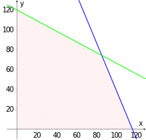

# Optymalizacja

## Programowanie liniowe

Programowanie liniowe jest metodą matematyczną wykorzystywaną do znalezienia najlepszego rozwiązania określonego problemu.
Jest to technika, której celem jest maksymalizacja lub minimalizacja funkcji liniowej przy pewnych ograniczeniach,
które są również wyrażone jako równania lub nierówności liniowe.

Dziedzina ta zaczęła przyciągać uwagę matematyków dopiero po I wojnie światowej.
Jednym z pierwszych był Leonid Kantorowicz, który później został zmuszony do porzucenia swojej pracy z powodu represji rządowych w tamtym czasie, a ostatecznie z obawy o swoje życie.
Optymalizacja procesów produkcyjnych w Związku Radzieckim, który w tamtym czasie miał gospodarkę centralnie planowaną, nie była dobrym pomysłem
(na przykład w jednej fabryce udało mu się zwiększyć wydajność produkcji do 94 proc,
tylko po to, by usłyszeć, że wszystkie fabryki muszą zwiększyć swoją wydajność w ten sam sposób).

Prawdziwym punktem zwrotnym w rozwoju programowania liniowego było opublikowanie w 1947 r. tzw. algorytmu simpleksowego do rozwiązywania tych problemów.
Jego autorem jest amerykański matematyk George Dantzig, który rozpoczął pracę w tej dziedzinie podczas II wojny światowej, próbując zoptymalizować niektóre procesy w amerykańskiej armii.
Nazwali to *metodami programowania przy użyciu kalkulatorów stacjonarnych*.
W swoim pierwszym wykładzie technicznym na ten temat mówił o *programowaniu w strukturze liniowej*, które następnie zostało skrócone do *programowania liniowego*. 
Słowo *programowanie* jest reliktem terminologii wojskowej odnoszącej się do planowania lub planowania szkoleń, logistyki lub rozmieszczenia zespołu.
Zilustrujemy te zasady następującymi prostymi przykładami.

## Optymalizacja produkcji w prażalni

> **Zadanie 1.** Berenika i Peter otworzyli nową kawiarnię z palarnią, gdzie między innymi zaczęli produkować dwie mieszanki kawy: letnią i egzotyczną.
> Letnia mieszanka składa się w 40% ze słodkich ziaren kawy z Etiopii i w 60% z soczystych ziaren kawy z Peru.
> Egzotyczna mieszanka składa się z tych samych ziaren kawy, ale w stosunku 3:1 (tym razem z większą ilością ziaren kawy z Etiopii).
> Kawa etiopska kosztuje 90 USD, a kawa peruwiańska 70 USD.
>Kilogram letniej mieszanki sprzedawany jest za 650 CZK, a kilogram mieszanki egzotycznej za 800 CZK.
>Jaką mieszankę powinni przygotować Berenice i Peter z dostępnych ziaren kawy, aby zmaksymalizować swój zysk?

\iffalse

*Rozwiązanie.* Po pierwsze, musimy zmatematyzować cały ten problem. Zacznijmy więc od oznaczenia ilości mieszanki letniej jako $x$ i ilości mieszanki egzotycznej jako $y$.
Niezależnie od tego, ile pojedynczych mieszanek zostanie wyprodukowanych, możemy wyrazić zysk $z$ z ich sprzedaży za pomocą równania
$$
z=650x+800y.
$$
Oczywiste jest, że ujemna ilość nie może zostać wyprodukowana, tj. zdecydowanie musi istnieć, że
$$
  x\geq0\quad \text{and}\quad y\geq0. \tag{1}
$$
Teraz musimy wziąć pod uwagę, że nie mamy nieograniczonej ilości ziaren kawy. Całkowite zużycie etiopskiej kawy, biorąc pod uwagę proporcje mieszania, można wyrazić jako
$$
  0{,}4x+0{,}75y 
$$
a w przypadku kawy peruwiańskiej jest to
$$
  0{,}6x+0{,}25y.
$$
Wraz z dostępną ilością otrzymujemy parę warunków
$$
  0{,}4x+0{,}75y\leq90 \quad\text{and}\quad\quad 0{,}6x+0{,}25y\leq70. \tag{2}
$$
Zbiór punktów spełniających warunki $(1)$ i $(2)$ jest zacieniowany na poniższym rysunku,
z linią graniczną $0{,}4x+0{,}75y=90$ narysowaną na zielono i linią $0{,}6x+0{,}25y=70$ narysowaną na niebiesko.

Zacieniowany obszar zawiera wszystkie punkty, których współrzędne $x$ i $y$ reprezentują możliwe rozwiązania naszego problemu.
Ale jak znaleźć punkt maksymalnego zysku, tj. punkt, w którym wartość wyrażenia $z=650x+800y$ jest maksymalna?

Można zauważyć, że wyrażenie to jest równaniem płaszczyzny w przestrzeni trójwymiarowej.
Jeśli weźmiemy pod uwagę tylko część tej płaszczyzny, która znajduje się powyżej zacienionego obszaru, otrzymamy czworokąt w przestrzeni.

Zamiast rysować trójwymiarowy obraz, narysujemy tak zwane *linie konturowe* na diagramie - proste linie określone równaniami
$$
650x+800y=c
$$
dla odpowiedniego $c$. Znaczenie tych konturów jest podobne do znaczenia konturów na mapie. Tylko zamiast punktów o tej samej wysokości, nasze kontury łączą punkty, w których osiągamy ten sam zysk.
Korzystając z tej metody, otrzymujemy diagram z liniami konturowymi narysowanymi w kolorze brązowym.

Jak jednak określić odpowiednią wartość $c$?
Na szczęście nie musimy tego obliczać w żaden skomplikowany sposób. Możemy to odczytać z naszego wykresu.
Dla $c=0$ otrzymujemy linię prostą przechodzącą przez punkt początkowy,
a ponieważ wszystkie linie konturowe różnią się tylko wartością $c$, wszystkie brązowe linie muszą być równoległe.
Stąd możemy po prostu zobaczyć, że maksimum (linie konturowe przesuwają się na północny wschód wraz ze wzrostem wartości $c$)
znajduje się w punkcie przecięcia linii niebieskiej i zielonej.

Możemy zatem znaleźć współrzędne tego punktu jako rozwiązanie układu równań liniowych z dwiema niewiadomymi
$$
\begin{align*}
0{,}4x+0{,}75y&=90 \\
0{,}6x+0{,}25y&=70.
\end{align*}
$$
Rozwiązaniem jest punkt $\left[\frac{600}{7},\frac{520}{7}\right]$.
Podstawiając te wartości do wyrażenia $z=650x+800y$,
otrzymamy wartość maksymalnego zysku wynoszącą około $115{,}143\,\text{Kč}$. 
Cel ten zostanie osiągnięty, jeśli Berenika i Petr wyprodukują $600/7\,\text{kg}$,
tj. około $85{,}71\,\text{kg}$ letniej mieszanki i $520/7\,\text{kg}$,
tj. około $74{,}29\,\text{kg}$ mieszanki egzotycznej.

*Uwaga.* Fakt, że rozwiązanie znajduje się na przecięciu dwóch linii granicznych, nie jest przypadkiem.
W problemach takich jak ten, gdzie występują tylko funkcje liniowe, rozwiązanie (jeśli istnieje) zawsze leży w jednym z wierzchołków wielokąta, który reprezentuje obszar wykonalny. 
Fakt ten można wykorzystać nawet w problemach z dużo większą liczbą zmiennych.

Wystarczy znaleźć wszystkie wierzchołki i porównać ich wartości funkcji.
Jednak to użycie tak zwanej brutalnej siły ma swoje pułapki:
Może to być bardzo wymagające obliczeniowo i wymaga zagwarantowania istnienia rozwiązania.
Niemniej jednak pomysł ten stoi za pierwszym bardzo wydajnym algorytmem (który jest nadal używany) do rozwiązywania tych problemów.
Podczas korzystania z niego wierzchołki są przemierzane systematycznie (tj. niekoniecznie wszystkie).

\fi

## Najlepszy parking

> **Zadanie 2.** Lokalny deweloper postanowił kupić fabrykę produkującą kasety wideo i taśmy magnetofonowe. Fabryka nie jest już używana,
> zostanie więc zburzona, aby zrobić miejsce dla parkingu P+R dla samochodów osobowych i parkingu dla ciężarówek.
>Jednak deweloper rozwiązuje teraz problem, jak ustawić pojemność dla każdego typu pojazdu.
>Całkowita dostępna przestrzeń wynosi $480\,\text{m}^2$.
> Miejsce parkingowe dla samochodu osobowego zajmuje $12\,\text{m}^2$, podczas gdy dla ciężarówki jest to $30\,\text{m}^2$.
>
> Jednak dział planowania i budownictwa wymaga również, aby pojemność dla samochodów osobowych była co najmniej dwa razy większa niż dla ciężarówek.
> Jednocześnie musi być co najmniej 6 miejsc parkingowych dla ciężarówek.
>
> Określ optymalną liczbę miejsc parkingowych dla samochodów osobowych i ciężarowych, która spełni wszystkie powyższe warunki i jednocześnie zmaksymalizuje zysk z pełnego parkingu, jeśli opłata za każde miejsce parkingowe dla samochodów osobowych wynosi 100 CZK, a dla samochodów ciężarowych 400 CZK.

\iffalse

*Rozwiązanie.* Możemy postępować w podobny sposób jak w poprzednim przykładzie, ale należy pamiętać, że tym razem liczba miejsc parkingowych musi być liczbą całkowitą.
Jeśli jako $x$ oznaczymy liczbę miejsc parkingowych dla samochodów osobowych, a jako $y$ liczbę miejsc parkingowych dla samochodów ciężarowych, to naszym celem jest maksymalizacja zysku $z$ określonego równaniem
$$
z=100x+400y.
$$
Ponadto z podanych ograniczeń wynikają następujące warunki.

| Warunek | Uzasadnienie| 
| ------------- | ------------- | 
| $y\geq 6$  |wymagane minimalne miejsca parkingowe dla samochodów ciężarowych  | 
| $2y\leq x$  | wymagania dotyczące rodzajów miejsc parkingowych  | 
| $12x+30y\leq480$ |dostępna pojemność działki  | 
| $x,y\in\mathbb{N}\cup\{0\}$  | rozwiązania muszą być liczbami naturalnymi lub zerem | 

Zbiór spełniający wszystkie podane warunki jest przedstawiony na poniższym diagramie.
Linie $y=6$ (zielona), $2y=x$ (brązowa), $12x+30y=480$ (niebieska)
oraz linie konturowe $100x+400y=c$ dla różnych wartości $c$ (czerwone).
Im większa wartość $c$, tym większe przesunięcie konturu w kierunku "prawego górnego rogu".

Zacieniony na różowo wielokąt spełnia wszystkie warunki z wyjątkiem ostatniego.
Czarne punkty to wszystkie punkty, które również spełniają ostatni warunek,
tzn. mają tylko liczby naturalne jako współrzędne (zero nie jest opcją w danym obszarze).

Z wykresu jasno wynika, że maksimum znajdzie się w punkcie,
który znajduje się najbardziej w prawym górnym rogu. Ale jakie są jego współrzędne?

Ponieważ jest to punkt przecięcia linii niebieskiej i brązowej,
możemy określić jego współrzędne rozwiązując następujący układ równań liniowych
$$
\begin{align*}
2y&=x\\  
12x+30y&=480. 
\end{align*}
$$
Jego rozwiązaniem jest para $[160/9,80/9]$, która jednak nie jest parą liczb całkowitych.

Jeśli przyjrzymy się uważnie wykresowi i weźmiemy pod uwagę kierunek linii konturowych,
możemy oszacować, że otrzymamy pożądane maksimum dla wartości $y=8$.
Jednocześnie widzimy, że czarny punkt o tej wartości leży na niebieskiej linii.
Po podstawieniu $y=8$ do równania tej linii, otrzymamy $x=20$.

Maksymalny zysk w wysokości 5200 CZK został osiągnięty
gdy wybudowanych zostanie $20$ miejsc parkingowych dla samochodów osobowych i $8$ miejsc parkingowych dla ciężarówek.

W ramach weryfikacji możemy oczywiście wyznaczyć wszystkie punkty całkowite spełniające ograniczenia
i zweryfikować, że żaden z nich nie ma wartości $100x+400y$ większej lub równej $5200$.

\fi

