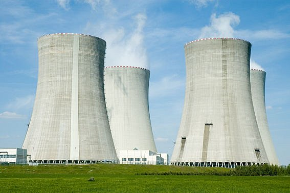
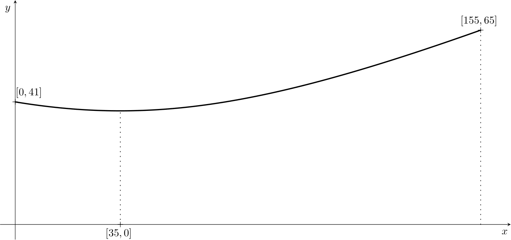
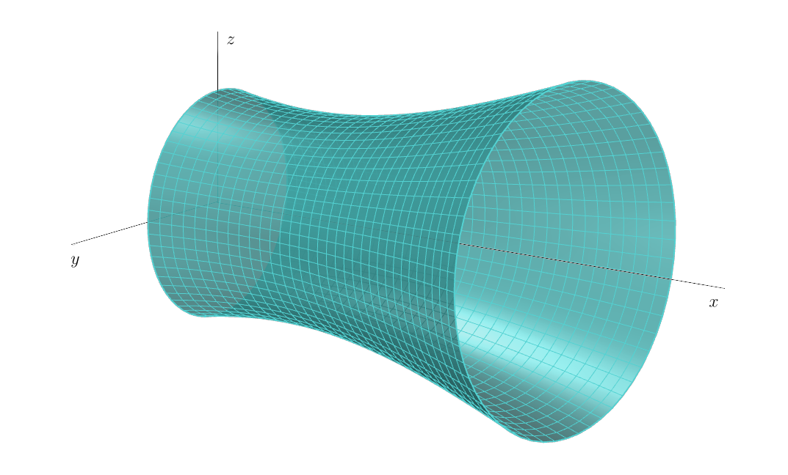

# Objem chladící věže jaderné elektrárny

Chladicí věže elektrárny jsou monumentální stavby z betonu, tyčící se k 
nebi a vypouštějící bílá oblaka vodní páry. Tyto železobetonové skořápky 
postavené na tenkých desetimetrových nožičkách jsou nedílnou součástí 
technologie elektrárny. Každá chladicí věž má tepelný výkon přes $1\,000\,
\text{MW,}$ což znamená, že každou hodinu se do ovzduší uvolní tolik 
tepla, kolik by stačilo k vytápění zhruba osmdesáti domácností po dobu 1 
roku.

Chladicí věž jaderné elektrárny Temelín je tvaru jednodílného rotačního 
hyperboloidu. Od výšky dvaceti metrů až po vrchol ve výšce $155\,\text{m}$ 
je uvnitř věže jen prázdný prostor. Tloušťka této železobetonovité skořepiny je 
v dolní části věže $90\,\text{cm}$, což je jen dvojnásobek tloušťky obvodové nosné zdi v
cihlovém rodinném domě. Směrem nahoru se postupně zmenšuje a u 
koruny je plášť široký jako kolo osobního auta (asi $18\,\text{cm}$). 
Celý plášť je postaven na asi stovce betonových noh, tvořících vstupní 
otvory pro nasávání vzduchu. Kruhový bazén pod věží má (stejně jako věž ve spodní
části)
průměr přibližně $130\,\text{m}$.

## Zadání

Naším úkolem bude určit objem chladící věže jaderné 
elektrárny Temelín. Na tento úkol půjdeme postupně. V 
první řadě najdeme funkci pomocí které budeme věž 
modelovat a následně určíme pomocí určitého integrálu 
její objem.

Pro zjednodušení výpočtů si skutečnou chladící věž mírně 
zidealizujeme (zaokrouhlíme některé rozměry). Budeme  
o ní předpokládat, že má tvar části hyperboloidu s výškou $155\,\text{m}$, poloměrem základny $65\,\text{m}$ 
a poloměrem koruny $41\,\text{m}$ .
Jeho nejužší místo je $35\,\text{m}$ pod korunou chladicí věže. 

Abychom mohli pracovat v souřadnicích, jak jsme zvyklí, umístíme osu rotačního 
hyperboloidu tak, aby splývala se souřadnou osou $x$. Navíc si jej umístíme tak, 
že řezem chladící věže vedeným jeho osou je část hyperboly, na které leží pata věže se 
souřadnicemi $[155, 65]$ a vrchol koruny $[0, 41]$. Jelikož nejužší místo věže je 
$35\,\text{m}$  pod korunou chladicí věže, má střed hyperboly souřadnice 
$[35, 0]$. Chladící věž vznikne rotací části této hyperboly kolem osy $x$. 

> **Úloha 1.** Napište obecnou rovnici hyperboly se středem $[35, 0]$ a s 
> ohnisky ležícími na ose rovnoběžné s osou $x$.

\iffalse

*Řešení.* Obecná rovnice hyperboly má tvar
$$\frac{y^2}{a^2} - \frac{(x - 35)^2}{b^2} = 1.$$

\fi

> **Úloha 2.** Určete obecnou rovnici hyperboly, jejíž částí je řez chladící 
> věže, jestliže na ní leží body $[155, 65]$ a $[0, 41]$. Do vztahu 
> dosaďte za $a^2$, $b^2$ hodnoty zaokrouhlené na jednotky.

\iffalse

*Řešení.* Po dosazení bodů $[155, 65]$, $[0, 41]$ ležících na hyperbole dostáváme soustavu rovnic
$$
\begin{align*}
\frac{65^2}{a^2} - \frac{(155-35)^2}{b^2} &= 1 \\
\frac{41^2}{a^2} - \frac{35^2}{b^2} &= 1 \\
\end{align*}
$$
Vyjádřením $\frac{1}{a^2}$ z první rovnice
$$\frac{1}{a^2}=\frac{1}{65^2}\left(1+\frac{120^2}{b^2}\right)$$
a dosazením do druhé rovnice získáme
 $$\frac{41^2}{65^2}\left(1+\frac{120^2}{b^2}\right)-\frac{35^2}{b^2} = 1.$$
Nyní vypočítáme $b^2$:
$$b^2 = \frac{41^2 \cdot 120^2 - 35^2 \cdot 65^2}{65^2-41^2} \;\dot{=}\; 7481.$$
Po zpětném dosazení získáme
$$a^2= \frac{41^2 \cdot 120^2 - 35^2 \cdot 65^2}{120^2-35^2} \;\dot{=}\; 1444.$$
Hyperbola modelující řez chladící věží má obecnou rovnici
$$\frac{y^2}{1444} - \frac{(x - 35)^2}{7481} = 1.$$

\fi

> **Úloha 3.** Vyjádřete z obecné rovnice hyperboly funkci, která 
> popisuje rameno hyperboly ležící nad osou $x$.

\iffalse

*Řešení.* Z obecné rovnice hyperboly 
$$\frac{y^2}{1444} - \frac{(x - 35)^2}{7481} = 1$$
vyjádříme $y$
$$y(x) = \pm\sqrt{1444 + \frac{1444}{7481} (x - 35)^2}.$$
Rameno hyperboly ležící nad osou $x$ popisuje funkce
$$y(x) = \sqrt{1444 + \frac{1444}{7481} (x - 35)^2}.$$

\fi

> **Úloha 4.** Vypočítejte objem rotačního tělesa vzniklého rotací části 
> ramena hyperboly modelující chladící věž v intervalu 
> $x\in\langle 0, 155\rangle$ kolem osy $x$.

\iffalse

*Řešení.* K výpočtu objemu použijeme určitý integrál vyjadřující objem 
rotačního tělesa
$$V = \pi \int_{0}^{155} \left(1444 + \frac{1444}{7481} (x - 35)^2\right) \,\mathrm{d}x= \pi \left[1444x + \frac{1444}{7481} \cdot \frac{1}{3}(x - 35)^3 \right]_{0}^{155}\doteq1\,052\,436\,\text{m}^3$$
Objem modelu chladící věže jaderné elektrárny Temelín je $1\,052\,436\,\text{m}^3$.

*Poznámka.* Porovnáme-li získaný objem $1\,052\,436\,\text{m}^3$ modelu 
chladící věže s objemem $1\,069\,700\,\text{m}^3$ skutečné chladící věže 
v Temelíně, vidíme, že náš výsledek je velmi realistický.

\fi

## Literatura

* Wikipedie. *Temelín -- technologie a zabezpečení* [online]. Dostupné z https://www.cez.cz/cs/o-cez/vyrobni-zdroje/jaderna-energetika/jaderna-energetika-v-ceske-republice/ete/technologie-a-zabezpeceni-1 [cit. 28.\,11.\,2023].
* ČEZ. *Chladící věž -- jak to funguje* [online]. Dostupné z https://www.svetenergie.cz/cz/energetika-zblizka/jaderne-elektrarny-pro-deti/co-vsechno-v-jaderne-elektrarne-najdeme/chladici-vez/jak-to-funguje [cit. 28.\,11.\,2023].
* Hochtief. *Chladící věž -- obrázek* [online]. Dostupné z https://www.hochtief.cz/nase-projekty/referencni-projekty/prumyslove/temelin-sekundarni-ochrana-vnejsiho-plaste-chladicich-vezi-na-jaderne-elektrarne-temelin [cit. 28.\,11.\,2023].
