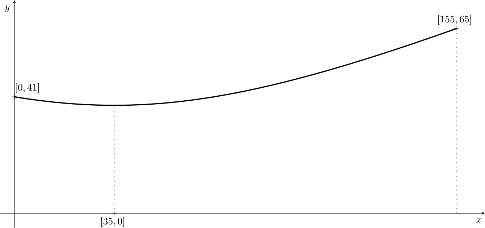

# Volume of a Nuclear Power Plant Cooling Tower

The power plant's cooling towers are monumental structures made of concrete, 
towering into the sky and emitting white clouds of water vapor. 
These reinforced concrete shells, built on thin ten-meter legs, 
are an integral part of the power plant's technology. 
Each cooling tower has a thermal output of over $1{,}000\,\text{MW,}$. 
This means that every hour, enough heat is released into the air to heat about eighty homes for an entire year.

The cooling tower of the Temelín nuclear power plant is in the shape of a one-sheeted rotational hyperboloid. 
From a height of twenty meters up to the top at $155\,\text{m}$, the inside of the tower is completely hollow. 
This reinforced concrete shell is $90\,\text{cm}$ thick in the lower part of the tower, 
only three times thicker than a concrete foundation slab of a family house. 
The thickness gradually decreases upwards and at the crown the shell is as wide as a car wheel (about $18\,\text{cm}$). 
The entire shell is built on about a hundred concrete legs, forming air inlets. 
The circular pool beneath the tower (like the tower itself) has a diameter of approximately $130\,\text{m}$.

## Assignment

Our task is to determine the volume of the cooling tower of the Temelín nuclear power plant. We will go about this task step by step. First, we find a function to model the tower, and then we determine its volume using a definite integral.

To simplify the calculations, we slightly idealize the real cooling tower (we round off some dimensions). Let's assume that the tower has the shape of a part of a hyperboloid of one sheet with a height of $155\,\text{m}$, a base radius of $65\,\text{m}$, and a crown radius of $41\,\text{m}$. Its narrowest point is $35\,\text{m}$ below the crown of the cooling tower.

In order to work with coordinates, as we are used to, we will place the axis of the rotational hyperboloid so that it coincides with the coordinate axis $x$. Moreover, we place it so that the cross-section of the cooling tower along its axis forms a part of a hyperbola, with the base of the tower located at the point $[155, 65]$ and the top (the crown) at $[0, 41]$. Since the narrowest part of the tower is $35\,\text{m}$ below the crown of the cooling tower, the center of the hyperbola has coordinates $[35, 0]$. The cooling tower can be created by rotating a part of this hyperbola around the $x$-axis.

> **Exercise 1.** Write the standard form of the equation of a hyperbola with center $[35, 0]$ and foci lying on an axis parallel to the $x$-axis.

\iffalse

*Solution.* The standard form of the equation of a hyperbola is
$$\frac{y^2}{a^2} - \frac{(x - 35)^2}{b^2} = 1.$$

\fi

> **Exercise 2.** Determine the standard form of the equation of the hyperbola,
> that the section of the colling tower is a part of, given that points $[155, 65]$ and $[0, 41]$ lie on it.
> Substitute the values ​​rounded to the nearest whole number for $a^2$, $b^2$ in the equation.

\iffalse

*Solution.* After substituting the points $[155, 65]$, $[0, 41]$ lying on the hyperbola, we obtain the system of equations
$$
\begin{align*}
\frac{65^2}{a^2} - \frac{(155-35)^2}{b^2} &= 1 \\
\frac{41^2}{a^2} - \frac{35^2}{b^2} &= 1 \\
\end{align*}
$$
Expressing $\frac{1}{a^2}$ from the first equation
$$\frac{1}{a^2}=\frac{1}{65^2}\left(1+\frac{120^2}{b^2}\right)$$
and substituting it into the second equation, we obtain
$$\frac{41^2}{65^2}\left(1+\frac{120^2}{b^2}\right)-\frac{35^2}{b^2} = 1.$$
Now we solve for $b^2$:
$$b^2 = \frac{41^2 \cdot 120^2 - 35^2 \cdot 65^2}{65^2-41^2} \;\dot{=}\; 7{,}481.$$
After substituting back, we get
$$a^2= \frac{41^2 \cdot 120^2 - 35^2 \cdot 65^2}{120^2-35^2} \;\dot{=}\; 1{,}444.$$
The hyperbola modeling the section of a cooling tower has the standard form of the equation
$$\frac{y^2}{1{,}444} - \frac{(x - 35)^2}{7{,}481} = 1.$$

\fi

> **Exercise 3.** From the standard form of the equation of the hyperbola,
> express the function that describes the branch of the hyperbola lying above the $x$-axis.

\iffalse

*Solution.* From the standard form of the equation of the hyperbola
$$\frac{y^2}{1{,}444} - \frac{(x - 35)^2}{7{,}481} = 1$$
we express $y$
$$y(x) = \pm\sqrt{1{,}444 + \frac{1{,}444}{7{,}481} (x - 35)^2}.$$
The branch of the hyperbola lying above the $x$-axis is described by the function
$$y(x) = \sqrt{1{,}444 + \frac{1{,}444}{7{,}481} (x - 35)^2}.$$

\fi

> **Exercise 4.** Calculate the volume of the solid of revolution formed by rotating a part of the branch of the hyperbola modeling the cooling tower on the interval
> $x\in\langle 0, 155\rangle$ around the $x$-axis.

\iffalse

*Solution.* To calculate the volume, we use a definite integral expressing the volume of a solid of revolution
$$V = \pi \int_{0}^{155} \left(1{,}444 + \frac{1{,}444}{7{,}481} (x - 35)^2\right) \,\mathrm{d}x= \pi \left[1{,}444x + \frac{1{,}444}{7{,}481} \cdot \frac{1}{3}(x - 35)^3 \right]_{0}^{155}\doteq1{,}052{,}436\,\text{m}^3$$
The volume of the model of the cooling tower of the Temelín nuclear power plant is $1{,}052{,}436\,\text{m}^3$.

*Note.* If we compare the obtained volume of $1{,}052{,}436\,\text{m}^3$ of the cooling tower model with the volume of $1{,}069{,}700\,\text{m}^3$ 
of the real cooling tower in Temelín, we see that our result is quite realistic.

\fi

## Literature

* Wikipedie. *Temelín -- technologie a zabezpečení* [online]. Available from https://www.cez.cz/cs/o-cez/vyrobni-zdroje/jaderna-energetika/jaderna-energetika-v-ceske-republice/ete/technologie-a-zabezpeceni-1 [cit. 28.\,11.\,2023].
* ČEZ. *Chladící věž -- jak to funguje* [online]. Available from https://www.svetenergie.cz/cz/energetika-zblizka/jaderne-elektrarny-pro-deti/co-vsechno-v-jaderne-elektrarne-najdeme/chladici-vez/jak-to-funguje [cit. 28.\,11.\,2023].
* Hochtief. *Chladící věž -- obrázek* [online]. Available from https://www.hochtief.cz/nase-projekty/referencni-projekty/prumyslove/temelin-sekundarni-ochrana-vnejsiho-plaste-chladicich-vezi-na-jaderne-elektrarne-temelin [cit. 28.\,11.\,2023].
