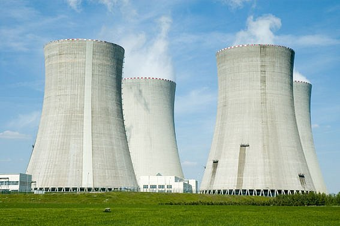

---
keywords:
- hiperbola
- geometria analityczna
- objetość
- rachunek całkowy
is_finished: true
---

# Objętość wieży chłodniczej elektrowni jądrowej

Wieże chłodnicze elektrowni to monumentalne konstrukcje wykonane z betonu, wznoszące się ku niebu i emitujące białe chmury pary wodnej.
Te żelbetowe skorupy, zbudowane na cienkich, dziesięciometrowych nogach, stanowią integralną część technologii elektrowni.
Każda wieża chłodnicza ma moc cieplną ponad $1{,}000\,\text{MW,}$.
Oznacza to, że co godzinę do powietrza uwalniana jest ilość ciepła wystarczająca do ogrzania około osiemdziesięciu domów przez cały rok.

Wieża chłodnicza elektrowni jądrowej Temelín ma kształt hiperboloidy obrotowej z jednym arkuszem.
Od wysokości dwudziestu metrów do szczytu na wysokości $155\,\text{m}$, wnętrze wieży jest całkowicie puste.
Ta żelbetowa skorupa ma grubość 90\,\text{cm}$ w dolnej części wieży, tylko trzy razy grubszą niż betonowa płyta fundamentowa domu jednorodzinnego.
Grubość stopniowo maleje w górę, a w koronie powłoka jest tak szeroka jak koło samochodu (około $18\,\text{cm}$).
Cała powłoka zbudowana jest na około stu betonowych nogach, tworzących wloty powietrza.
Okrągły basen pod wieżą (podobnie jak sama wieża) ma średnicę około $130\,\text{m}$.

## Zadanie

Naszym zadaniem jest określenie objętości chłodni kominowej elektrowni jądrowej Temelín. Zadanie to wykonamy krok po kroku. Najpierw znajdziemy funkcję modelującą wieżę, a następnie określimy jej objętość za pomocą całki oznaczonej.

Aby uprościć obliczenia, nieco idealizujemy rzeczywistą wieżę chłodniczą (zaokrąglamy niektóre wymiary). Załóżmy, że wieża ma kształt części hiperboloidy z jednego arkusza o wysokości $155\,\text{m}$, promieniu podstawy $65\,\text{m}$ i promieniu korony $41\,\text{m}$. Jego najwęższy punkt znajduje się 35\,\text{m}$ poniżej korony chłodni kominowej.
Aby pracować ze współrzędnymi, jak jesteśmy przyzwyczajeni, umieścimy oś hiperboloidy obrotowej tak, aby pokrywała się z osią współrzędnych $x$. Co więcej, umieścimy ją tak, aby przekrój wieży chłodniczej wzdłuż jej osi tworzył część hiperboli, z podstawą wieży znajdującą się w punkcie $[155, 65]$ i wierzchołkiem (koroną) w punkcie $[0, 41]$. Ponieważ najwęższa część wieży znajduje się $35\,\text{m}$ poniżej korony wieży chłodniczej, środek hiperboli ma współrzędne $[35, 0]$. Wieżę chłodniczą można utworzyć, obracając część tej hiperboli wokół osi $x$.

> **Zadanie 1.** Napisz w standardowej formie równanie hiperboli o środku $[35, 0]$ i ogniskach leżących na osi równoległej do osi $x$.

\iffalse

*Rozwiązanie.* Standardowa postać równania hiperboli to
$$\frac{y^2}{a^2} - \frac{(x - 35)^2}{b^2} = 1.$$

\fi

> **Zadanie 2.** Wyznacz standardową postać równania hiperboli, której częścią jest przekrój wieży, biorąc pod uwagę, że leżą na niej punkty $[155, 65]$ i $[0, 41]$.
> Zastąp wartości zaokrąglone do najbliższej liczby całkowitej dla $a^2$, $b^2$ w równaniu.

\iffalse

*Rozwiązanie.* Po podstawieniu punktów $[155, 65]$, $[0, 41]$ leżących na hiperboli otrzymujemy układ równań
$$
\begin{align*}
\frac{65^2}{a^2} - \frac{(155-35)^2}{b^2} &= 1 \\
\frac{41^2}{a^2} - \frac{35^2}{b^2} &= 1 \\
\end{align*}
$$
Wyrażenie $\frac{1}{a^2}$ z pierwszego równania
$$\frac{1}{a^2}=\frac{1}{65^2}\left(1+\frac{120^2}{b^2}\right)$$
i podstawiając ją do drugiego równania, otrzymujemy
$$\frac{41^2}{65^2}\left(1+\frac{120^2}{b^2}\right)-\frac{35^2}{b^2} = 1.$$
Teraz rozwiązujemy dla $b^2$:
$$b^2 = \frac{41^2 \cdot 120^2 - 35^2 \cdot 65^2}{65^2-41^2} \;\dot{=}\; 7{,}481.$$
Po podstawieniu z powrotem otrzymujemy
$$a^2= \frac{41^2 \cdot 120^2 - 35^2 \cdot 65^2}{120^2-35^2} \;\dot{=}\; 1{,}444.$$
Hiperbola modelująca przekrój wieży chłodniczej ma standardową postać równania
$$\frac{y^2}{1{,}444} - \frac{(x - 35)^2}{7{,}481} = 1.$$

\fi

> **Zadanie 3.** Na podstawie standardowej postaci równania hiperboli wyraź funkcję opisującą gałąź hiperboli leżącą nad osią $x$.

\iffalse

*Rozwiązanie.* Ze standardowej postaci równania hiperboli
$$
\frac{y^2}{1{,}444} - \frac{(x - 35)^2}{7{,}481} = 1
$$.
wyrażamy $y$
$$y(x) = \pm\sqrt{1{,}444 + \frac{1{,}444}{7{,}481} (x - 35)^2}.$$
Gałąź hiperboli leżąca powyżej osi $x$ jest opisana funkcją
$$y(x) = \sqrt{1{,}444 + \frac{1{,}444}{7{,}481} (x - 35)^2}.$$

\fi

> **Zadanie 4.** Obliczyć objętość bryły obrotowej powstałej przez obrót części gałęzi hiperboli modelującej chłodnię kominową w przedziale
> $x\in\langle 0, 155\rangle$ wokół osi $x$.

\iffalse

*Rozwiązanie.* Aby obliczyć objętość, używamy całki oznaczonej wyrażającej objętość bryły obrotowej
$$V = \pi \int_{0}^{155} \left(1{,}444 + \frac{1{,}444}{7{,}481} (x - 35)^2\right) \,\mathrm{d}x= \pi \left[1{,}444x + \frac{1{,}444}{7{,}481} \cdot \frac{1}{3}(x - 35)^3 \right]_{0}^{155}\doteq1{,}052{,}436\,\text{m}^3$$
Objętość modelu chłodni kominowej elektrowni jądrowej Temelín wynosi 1{,}052{,}436\,\text{m}^3$.

*Uwaga.* Jeśli porównamy uzyskaną objętość 1{,}052{,}436\,\text{m}^3$ modelu wieży chłodniczej z objętością 1{,}069{,}700\,\text{m}^3$ rzeczywistej wieży chłodniczej w Temelínie, zobaczymy, że nasz wynik jest całkiem realistyczny.

\fi

## Literatura

* Wikipedia. *Temelín -- technologie a zabezpečení* [online]. Dostępne na https://www.cez.cz/cs/o-cez/vyrobni-zdroje/jaderna-energetika/jaderna-energetika-v-ceske-republice/ete/technologie-a-zabezpeceni-1 [cit. 28.\,11.\,2023].
* ČEZ. *Chladící věž -- jak to funguje* [online]. Dostępne na https://www.svetenergie.cz/cz/energetika-zblizka/jaderne-elektrarny-pro-deti/co-vsechno-v-jaderne-elektrarne-najdeme/chladici-vez/jak-to-funguje [cit. 28.\,11.\,2023].
* Hochtief. *Chladící věž -- obrázek* [online]. Dostępne na https://www.hochtief.cz/nase-projekty/referencni-projekty/prumyslove/temelin-sekundarni-ochrana-vnejsiho-plaste-chladicich-vezi-na-jaderne-elektrarne-temelin [cit. 28.\,11.\,2023].

