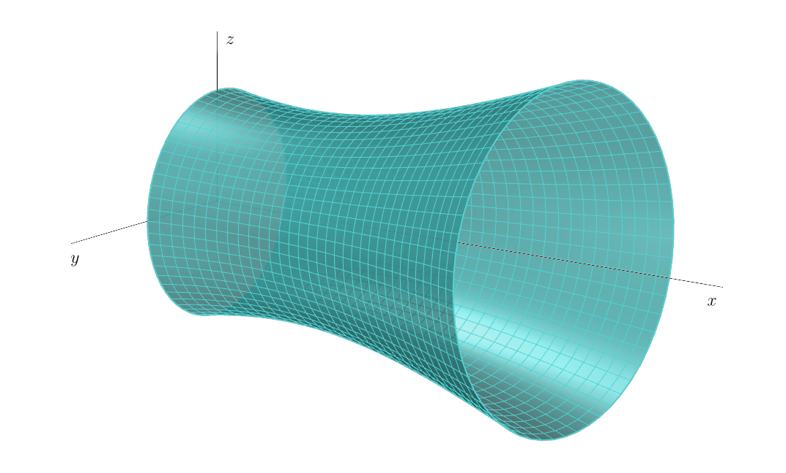

# Objem chladiacej veže jadrovej elektrárne

Chladiace veže elektrárne sú monumentálne betónové stavby,
týčiace sa do neba a vypúšťajúce biele oblaky vodnej pary.
Tieto železobetónové škrupiny, postavené na tenkých desaťmetrových nohách,
sú neoddeliteľnou súčasťou technológie elektrárne.
Každá chladiaca veža má tepelný výkon viac ako $1\,000\text{MW}$.
To znamená, že každú hodinu sa do vzduchu uvoľní dostatok tepla na vykurovanie približne osemdesiatich domov po celý rok.

Chladiaca veža jadrovej elektrárne Temelín má tvar jednodielneho rotačného hyperboloidu.
Od výšky dvadsať metrov až po vrchol vo výške $155\,\text{m}$ je vnútro veže úplne duté.
Táto železobetónová škrupina je v spodnej časti veže hrubá $90\,\text{cm}$, čo je len dvojnásobok hrúbky obvodovej nosnej steny tehlového rodinného domu.
Hrúbka sa postupne zmenšuje smerom nahor a v korune je škrupina široká ako koleso auta (približne $18\,\text{cm}$).
Celá škrupina je postavená na približne sto betónových nohách, ktoré tvoria vstupné otvory pre nasávanie vzduchu.
Kruhový bazén pod vežou (rovnako ako samotná veža v spodnej časti) má priemer približne $130\,\text{m}$.

## Zadanie

Našou úlohou je určiť objem chladiacej veže jadrovej elektrárne Temelín. K tejto úlohe pristúpime postupne. Najprv nájdeme funkciu, pomocou ktorej budeme vežu modelovať a potom určíme jej objem pomocou určitého integrálu.
Pre zjednodušenie výpočtov mierne idealizujeme skutočnú chladiacu vežu (zaokrúhlime niektoré rozmery). Predpokladajme, že veža má tvar časti hyperboloidu s výškou $155\,\text{m}$, polomerom základne $65\,\text{m}$ a polomerom koruny $41\,\text{m}$. Jej najužšie miesto sa nachádza $35\,\text{m}$ pod korunou chladiacej veže.
Aby sme mohli pracovať so súradnicami, ako sme zvyknutí, umiestnime os rotačného hyperboloidu tak, aby sa zhodovala so súradnicovou osou $x$. Navyše ju umiestnime tak, aby prierez chladiacej veže pozdĺž jej osi tvoril časť hyperboly, pričom základňa veže sa nachádza v bode $[155, 65]$ a vrchol (koruna) v bode $[0, 41]$. Keďže najužšia časť veže je $35\,\text{m}$ pod korunou chladiacej veže tak stred hyperboly má súradnice $[35, 0]$. Chladiacu vežu možno vytvoriť rotáciou časti tejto hyperboly okolo osi $x$.

> **Úloha 1.** Napíšte všeobecný tvar rovnice hyperboly so stredom $[35, 0]$ a ohniskami ležiacimi na osi rovnobežnej s osou $x$.

\iffalse

*Riešenie.* Všeobecná rovnica hyperboly má tvar
$$\frac{y^2}{a^2} - \frac{(x - 35)^2}{b^2} = 1.$$

\fi

> **Úloha 2.** Určte všeobecný tvar rovnice hyperboly,
ktorej časťou je prierez chladiacej veže, ak na nej ležia body $[155, 65]$ a $[0, 41]$.
Do rovnice dosiaďte za $a^2$, $b^2$ hodnoty zaokrúhlené na jednotky.

\iffalse

*Riešenie.* Po dosadení bodov $[155, 65]$, $[0, 41]$ ležiacich na hyperbole získame sústavu rovníc
$$
\begin{align*}
\frac{65^2}{a^2} - \frac{(155-35)^2}{b^2} &= 1 \\
\frac{41^2}{a^2} - \frac{35^2}{b^2} &= 1 \\
\end{align*}
$$
Vyjadrením $\frac{1}{a^2}$ z prvej rovnice
$$\frac{1}{a^2}=\frac{1}{65^2}\left(1+\frac{120^2}{b^2}\right)$$
a jej dosadením do druhej rovnice získame
 $$\frac{41^2}{65^2}\left(1+\frac{120^2}{b^2}\right)-\frac{35^2}{b^2} = 1.$$
Teraz vyriešime pre $b^2$:
$$b^2 = \frac{41^2 \cdot 120^2 - 35^2 \cdot 65^2}{65^2-41^2} \;\dot{=}\; 7481.$$
Po spätnom dosadení dostávame
$$a^2= \frac{41^2 \cdot 120^2 - 35^2 \cdot 65^2}{120^2-35^2} \;\dot{=}\; 1444.$$
Hyperbola modelujúca prierez chladiacej veže má všeobecný tvar rovnice
$$\frac{y^2}{1444} - \frac{(x - 35)^2}{7481} = 1.$$

\fi

> **Úloha 3.** Zo všeobecného tvaru rovnice hyperboly vyjadrite funkciu, ktorá opisuje vetvu hyperboly ležiacu nad osou $x$.

\iffalse

*Riešenie.* Zo všeobecnej rovnice hyperboly 
$$\frac{y^2}{1444} - \frac{(x - 35)^2}{7481} = 1$$
vyjadríme $y$
$$y(x) = \pm\sqrt{1444 + \frac{1444}{7481} (x - 35)^2}.$$
Vetvu hyperboly ležiacu nad osou $x$ popisuje funkcia
$$y(x) = \sqrt{1444 + \frac{1444}{7481} (x - 35)^2}.$$

\fi

> **Úloha 4.** Vypočítajte objem rotačného telesa vzniknutého rotáciou časti vetvy hyperboly modelujúcej chladiacu vežu na intervale
$x\in\langle 0, 155\rangle$ okolo osi $x$.

\iffalse

*Riešenie.* Na výpočet objemu použijeme určitý integrál vyjadrujúci objem rotačného telesa
$$V = \pi \int_{0}^{155} \left(1444 + \frac{1444}{7481} (x - 35)^2\right) \,\mathrm{d}x= \pi \left[1444x + \frac{1444}{7481} \cdot \frac{1}{3}(x - 35)^3 \right]_{0}^{155}\doteq1\,052\,436\,\text{m}^3$$
Objem modelu chladiacej veže jadrovej elektrárne Temelín je $1\,052\,436\,\text{m}^3$.

*Poznámka.* Ak porovnáme získaný objem $1\,052\,436\,\text{m}^3$ modelu chladiacej veže s objemom $1\,069\,700\,\text{m}^3$
skutočnej chladiacej veže v Temelíne, vidíme, že náš výsledok je celkom realistický.

\fi

## Literatúra

* Wikipedie. *Temelín -- technologie a zabezpečení* [online]. Dostupné z https://www.cez.cz/cs/o-cez/vyrobni-zdroje/jaderna-energetika/jaderna-energetika-v-ceske-republice/ete/technologie-a-zabezpeceni-1 [cit. 28.\,11.\,2023].
* ČEZ. *Chladící věž -- jak to funguje* [online]. Dostupné z https://www.svetenergie.cz/cz/energetika-zblizka/jaderne-elektrarny-pro-deti/co-vsechno-v-jaderne-elektrarne-najdeme/chladici-vez/jak-to-funguje [cit. 28.\,11.\,2023].
* Hochtief. *Chladící věž -- obrázek* [online]. Dostupné z https://www.hochtief.cz/nase-projekty/referencni-projekty/prumyslove/temelin-sekundarni-ochrana-vnejsiho-plaste-chladicich-vezi-na-jaderne-elektrarne-temelin [cit. 28.\,11.\,2023].
