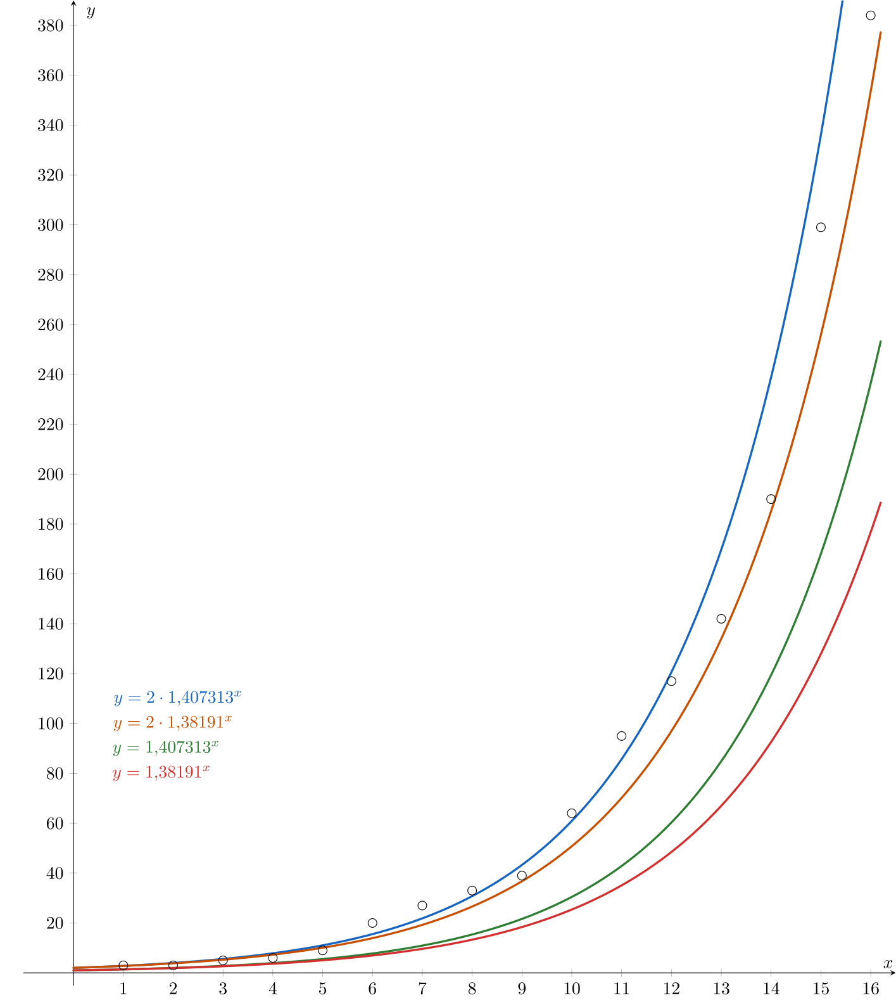
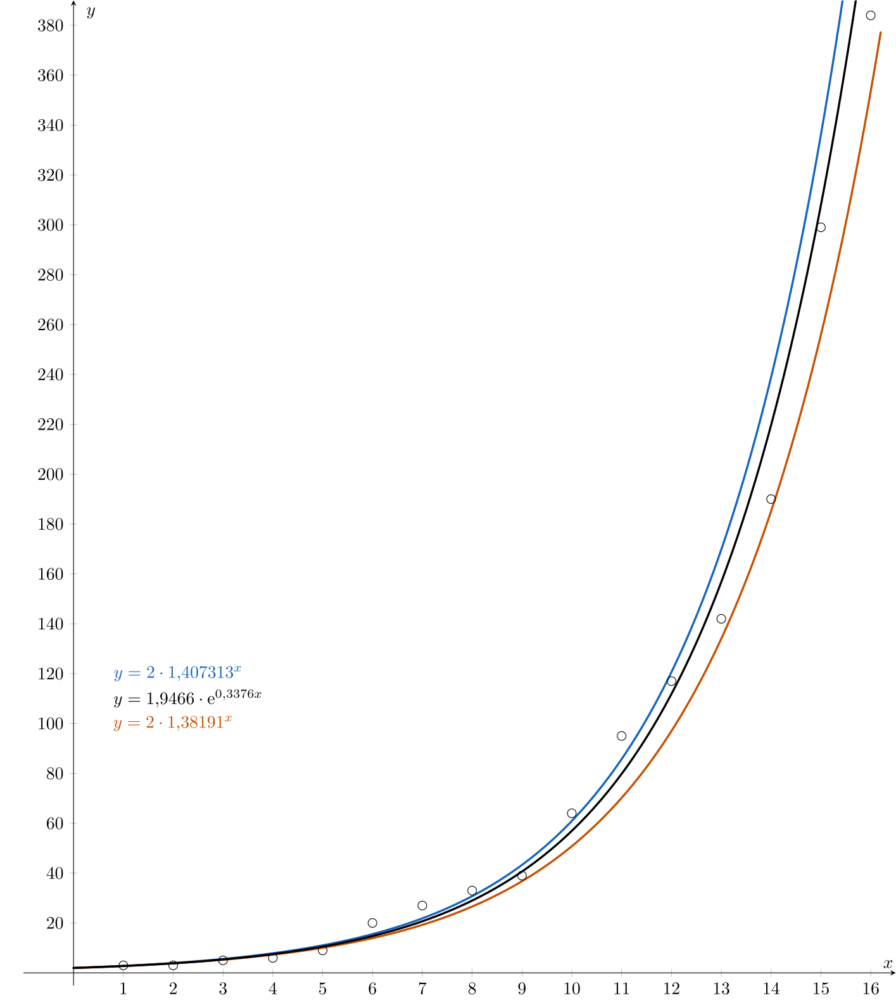

---
keywords:
- statistics
- data processing
- arithmetic mean
- geometric mean
- regression analysis
- GeoGebra
is_finished: True
---

# Initial Spread of the Epidemic

The most well-known recent epidemic is the COVID-19 pandemic, a viral disease caused by the SARS-CoV-2 coronavirus, 
which broke out in December 2019 in the city of Wuhan in Hubei province in central China.

The beginning of the COVID-19 epidemic in Europe dates back to January 2020. 
The first confirmed cases were reported in France on January 24, 2020. 
They were three patients who had recently returned from China, where the epidemic was already in full swing.

The disease then spread to the Czech Republic before March 1, 2020, when the first three cases were confirmed. 
As of March 18, 2020, 464 cases had already been confirmed in our country.

The early phase of an epidemic is typically characterized by exponential growth. As time progresses,
the spread tends to slow down and follow a different trajectory (such as linear, logistic, etc.).

## Typical Scenario of an Epidemic

Based on the collected data, we will try to model the number of infected individuals as a function of the number of days since the start of the epidemic. 
The table contains the data describing the number of infected individuals with respect to the number of days since the beginning of the pandemic.

| Day $(n)$  | Number of infected individuals ($a_n$) | 
| ------------- | ------------- |  
| $1$  | $3$  | 
| $2$  | $3$  | 
| $3$  | $5$  | 
| $4$  | $6$  | 
| $5$  | $9$  | 
| $6$  | $20$  | 
| $7$  | $27$  | 
| $8$  | $33$  | 
| $9$  | $39$  | 
| $10$  | $64$  | 
| $11$  | $95$  | 
| $12$  | $117$  | 
| $13$  | $142$  | 
| $14$  | $190$  | 
| $15$  | $299$  | 
| $16$  | $384$  | 

*Note.* These are real data from the Czech Republic starting on March 1, 2020.

> **Exercise 1.** Calculate the ratio of the number of infected individuals on a given day to the number of the previous day.

\iffalse

*Solution.* If we denote by $q_n$ the ratio of infected invididuals on the $n$th day to the number of infected individuals on the $n-1$th day, we get the following formula
$$
q_n=\frac{a_n}{a_{n-1}}, \qquad n\geq2.
$$
We can now calculate all the values and complete the table.

| Day $(n)$  | Number of infected individuals ($a_n$) | Ratio of infected individuals |
| ------------- | ------------- |  --------|
| $1$  | $3$  | $-$ |
| $2$  | $3$  |$1{.}000$ |
| $3$  | $5$  | $1{.}667$|
| $4$  | $6$  | $1{.}200$|
| $5$  | $9$  | $1{.}500$|
| $6$  | $20$  | $2{.}222$|
| $7$  | $27$  | $1{.}350$|
| $8$  | $33$  | $1{.}222$|
| $9$  | $39$  | $1{.}182$|
| $10$  | $64$  | $1{.}641$|
| $11$  | $95$  | $1{.}484$|
| $12$  | $117$  | $1{.}232$|
| $13$  | $142$  | $1{.}214$|
| $14$  | $190$  | $1{.}338$|
| $15$  | $299$  | $1{.}574$|
| $16$  | $384$  |$1{.}284$|

The calculated ratio of the number of infected people on a given day to the previous day can be interpreted as the rate of disease spread. 
For a strictly exponential growth or decline, this ratio would be constant. However, since we are working with observed data only, the value of the ratio is only approximate.
Let's take a closer look at this ratio.

\fi

> **Exercise 2.** Calculate the arithmetic and geometric mean of the ratio of the number of infected.
> Which one is more appropriate in this case?

\iffalse

*Solution.* The arithmetic mean $\bar{q}$ is given by the formula
$$
\bar{q}=\frac{q_2+\cdots+q_{16}}{15}=1{.}40731.
$$
Similarly, for the geometric mean $G$ we get
$$
G=\sqrt[15]{q_2\cdot \cdots \cdot q_{16}}=1{.}38191.
$$
It is better to use the geometric mean in this case.

The arithmetic mean can be affected by extreme values ​​(for us, for example, the value of $q_6$), 
which can distort the interpretation of average growth or decline. 
The geometric mean, on the other hand, reduces the impact of such extremes.

Moreover, in the case of exponential growth (if we restrict ourselves to the basic form $k\cdot a^x$) it is multiplied by a constant factor (i.e. the ratio of two measured values ​​taken at fixed intervals is constant). The geometric mean directly represents this multiplying nature of change. For example, let's assume we have two consecutive measurements with ratios
$$
q_1=2, \qquad q_2=0{.}5,
$$
​then the arithmetic mean $\bar{q}=1{.}25$ would indicate stable growth, while the geometric mean $G=1$ correctly reflects zero net growth.​

\fi

> **Exercise 3.** Design a function that approximates the number of infected individuals on each day.
> Create a graph in GeoGebra (or another program).

\iffalse

*Solution.* Using trial and error, we can create an exponential function that suitably represents our data,
for example by making use of the calculated averages.
We will use the standard notation that is also used in GeoGebra and in the figure below. 
In the graph, $x$ represents the time in days and $y$ represents the number of infected individuals. 

By using the arithmetic mean we get the function $y=1{.}40731^x$, 
the geometric mean yields function $y=1{.}38191^x$. 
These functions are quite far from the marked points, so we will slightly modify them: $y=2\cdot1{.}40731^x$, $y=2\cdot1{.}38191^x$. 
The graphs of the proposed functions are shown in the figure. 
Of course, it is possible to get even more accurate exponential functions.

\fi

>**Exercise 4.** By applying regression analysis to the data,
>a more suitable function describing the behavior of the number of infected individuals can be obtained:
>$y=1{.}9466\cdot \mathrm{e}^{0{.}3376x}$.
>Compare your proposed function with this function in GeoGebra (or another suitable software).
>Calculate the values ​​of all functions for days 14 to 16,
>rounding the result to the nearest whole number. Compare these values with those ​​in the table.

*Note.* The exponential function obtained by regression analysis 
can be created using either a spreadsheet or Geogebra. In Geogebra, 
the points obtained from the table must be entered using the following command: `FitExp({(1,3), (2,3), (3,5),...,(16,384)})`.

\iffalse

*Solution.* All three functions are shown in the figure below. 
At first glance, we can see that all the functions are similar at the beginning, 
but for larger values ​​of $x$, the function $y=1{.}9466\cdot \mathrm{e}^{0{.}3376x}$ 
seems to be the best fit for the given data.

We can also quantify this observation using the data from the table.

| Day $(n)$  | Number of infected individuals ($a_n$) | Modelled values according to $y=2\cdot1{.}40731^x$ | Modelled values according to $y=2\cdot1{.}38191^x$ | Modelled values according to $y=1{.}9466\cdot \mathrm{e}^{0{.}3376x}$ |
| ------------- | ------------- |  -------- | --------| --------|
| $14$  | $190$  | $239$ | $185$ | $220$ |
| $15$  | $299$  | $336$ | $256$ | $308$ |
| $16$  | $384$  | $473$ | $354$ | $432$ |

We can use the extent to which the individual values differ from each other as an indicator of the accuracy with which our functions represent the given data. This gives us the following results:

$$
\begin{align*}
|239-190|+|336-299|+|473-384|&=175\\
|185-190|+|256-299|+|354-384|&=92\\
|220-190|+|308-299|+|432-384|&=87.
\end{align*}
$$

However, usually the squares of the differences are used to assess accuracy. 
This is because squaring reduces the impact of small differences (less than 1) 
and increases the effect of large ones even more.

This results in:
$$
\begin{align*}
(239-190)^2+(336-299)^2+(473-384)^2&=11{,}691\\
(185-190)^2+(256-299)^2+(354-384)^2&=4{,}174\\
(220-190)^2+(308-299)^2+(432-384)^2&=3{,}285.
\end{align*}
$$
In this case, the third curve also turned out to be the best. 
This is no coincidence, as the curve created using regression minimizes this type of error. 

\fi

> **Exercise 5.** Will the epidemic continue to spread according to the designed function?
> What might influence its future behaviour?

\iffalse

*Solution.* In order for the epidemic to continue to grow exponentially, 
the conditions for the spread of the disease must remain unchanged. 
In practice, people will start to protect themselves with protective equipment, 
minimize contact with others or get vaccinated. 
This will reduce the rate at which the number of infected individuals increases. 
The epidemic will reach its peak and the number of infected individuals will start to decrease. 
For sustained exponential growth, there would also have to be 
an unlimited number of individuals who can become infected with the disease.

\fi

## Literature

* European Centre for Disease Prevention and Control *Novel Coronavirus: three cases reported in France*. Dostupné z https://www.flickr.com/photos/ecdc_eu/50321985653/in/dateposted/ [cit. 08.08.2024]

* Ministerstvo zdravotnictví ČR. *Onemocnění aktuálně - COVID 19*. Available from https://onemocneni-aktualne.mzcr.cz/api/v2/covid-19 [cit. 30.8.2023]
