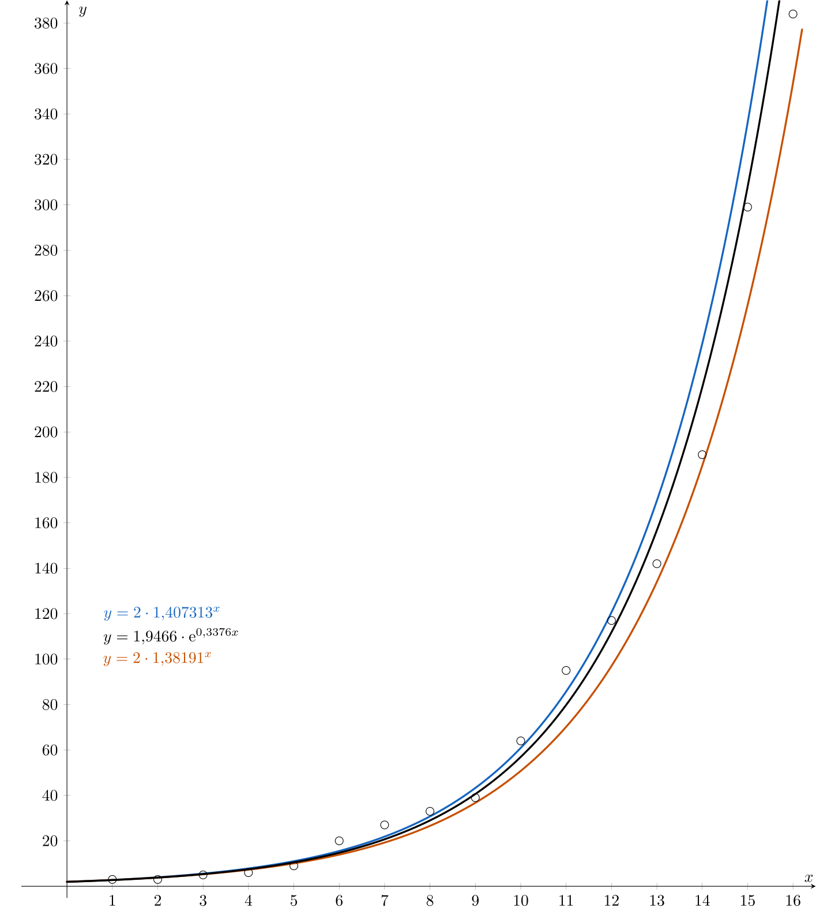

# Początkowe rozprzestrzenienie się epidemii

Najbardziej znaną niedawną epidemią jest pandemia COVID-19, choroba wirusowa wywoływana przez koronawirusa SARS-CoV-2, 
która wybuchła w grudniu 2019 r. w mieście Wuhan w prowincji Hubei w środkowych Chinach.

Początek epidemii COVID-19 w Europie datuje się na styczeń 2020 roku. 
Pierwsze potwierdzone przypadki odnotowano we Francji 24 stycznia 2020 roku. 
Było to trzech pacjentów, którzy niedawno wrócili z Chin, gdzie epidemia była już w pełnym rozkwicie.

Następnie choroba rozprzestrzeniła się na Czechy przed 1 marca 2020 r., kiedy potwierdzono pierwsze trzy przypadki. 
Na dzień 18 marca 2020 r. w naszym kraju potwierdzono już 464 przypadki.

Wczesna faza epidemii charakteryzuje się zazwyczaj wzrostem wykładniczym. W miarę upływu czasu,
rozprzestrzenianie się ma tendencję do zwalniania i podążania inną trajektorią (np. liniową, logistyczną itp.).

## Typowy scenariusz epidemii

Na podstawie zebranych danych spróbujemy zmodelować liczbę zarażonych osób w funkcji liczby dni od początku epidemii. 
Tabela zawiera dane opisujące liczbę zarażonych osób w odniesieniu do liczby dni od początku pandemii.

| Dzień $(n)$  | Liczba zainfekowanych osób ($a_n$) | 
| ------------- | ------------- |  
| $1$  | $3$  | 
| $2$  | $3$  | 
| $3$  | $5$  | 
| $4$  | $6$  | 
| $5$  | $9$  | 
| $6$  | $20$  | 
| $7$  | $27$  | 
| $8$  | $33$  | 
| $9$  | $39$  | 
| $10$  | $64$  | 
| $11$  | $95$  | 
| $12$  | $117$  | 
| $13$  | $142$  | 
| $14$  | $190$  | 
| $15$  | $299$  | 
| $16$  | $384$  | 

*Uwaga.* Są to rzeczywiste dane z Republiki Czeskiej, począwszy od 1 marca 2020 r.

> **Zadanie 1.** Oblicz stosunek liczby zarażonych osób w danym dniu do liczby osób zarażonych w dniu poprzednim.

\iffalse

*Rozwiązanie.* Jeśli przez $q_n$ oznaczymy stosunek liczby zarażonych osobników w dniu $n$th do liczby zarażonych osób w dniu $n-1$th, otrzymamy następujący wzór
$$
q_n=\frac{a_n}{a_{n-1}}, \qquad n\geq2.
$$
Możemy teraz obliczyć wszystkie wartości i uzupełnić tabelę.

| Dzień $(n)$  | Liczba zarażonych osób ($a_n$) |Współczynnik zarażonych osób |
| ------------- | ------------- |  --------|
| $1$  | $3$  | $-$ |
| $2$  | $3$  |$1{,}000$ |
| $3$  | $5$  | $1{,}667$|
| $4$  | $6$  | $1{,}200$|
| $5$  | $9$  | $1{,}500$|
| $6$  | $20$  | $2{,}222$|
| $7$  | $27$  | $1{,}350$|
| $8$  | $33$  | $1{,}222$|
| $9$  | $39$  | $1{,}182$|
| $10$  | $64$  | $1{,}641$|
| $11$  | $95$  | $1{,}484$|
| $12$  | $117$  | $1{,}232$|
| $13$  | $142$  | $1{,}214$|
| $14$  | $190$  | $1{,}338$|
| $15$  | $299$  | $1{,}574$|
| $16$  | $384$  |$1{,}284$|

Obliczony stosunek liczby zarażonych osób w danym dniu do dnia poprzedniego można interpretować jako tempo rozprzestrzeniania się choroby. 
W przypadku ściśle wykładniczego wzrostu lub spadku współczynnik ten byłby stały. Ponieważ jednak pracujemy tylko z obserwowanymi danymi, wartość współczynnika jest tylko przybliżona.
Przyjrzyjmy się bliżej temu wskaźnikowi.

\fi

> **Zadanie 2.** Oblicz średnią arytmetyczną i geometryczną wskaźnika liczby zakażonych.
> Który z nich jest bardziej poprawny w tym przypadku?

\iffalse

*Rozwiązanie.* Średnia arytmetyczna $\bar{q}$ jest określona wzorem
$$
\bar{q}=\frac{q_2+\cdots+q_{16}}{15}=1{,}40731.
$$
Podobnie, dla średniej geometrycznej $G$ otrzymujemy
$$
G=\sqrt[15]{q_2\cdot \cdots \cdot q_{16}}=1{,}38191.
$$
W tym przypadku lepiej jest użyć średniej geometrycznej.

 Na średnią arytmetyczną mogą wpływać wartości skrajne ​​(dla nas, na przykład, wartość $q_6$), 
które mogą zniekształcać interpretację średniego wzrostu lub spadku. 
Z drugiej strony, średnia geometryczna zmniejsza wpływ takich skrajności.

Co więcej, w przypadku wzrostu wykładniczego (jeśli ograniczymy się do podstawowej postaci $k\cdot a^x$) jest on mnożony przez stały czynnik (tj. stosunek dwóch zmierzonych wartości pobranych w stałych odstępach czasu jest stały). Średnia geometryczna bezpośrednio reprezentuje ten mnożnikowy charakter zmian. Na przykład, załóżmy, że mamy dwa kolejne pomiary z proporcjami
$$
q_1=2, \qquad q_2=0{,}5,
$$
wówczas średnia arytmetyczna $\bar{q}=1{,}25$ wskazywałaby na stabilny wzrost, podczas gdy średnia geometryczna $G=1$  prawidłowo odzwierciedlałaby zerowy wzrost netto.

\fi

> **Zadanie 3.** Zaprojektuj funkcję, która przybliży liczbę zainfekowanych osób każdego dnia.
> Utwórz wykres w programie GeoGebra (lub innym).

\iffalse

*Rozwiązanie.* Stosując metodę prób i błędów, możemy stworzyć funkcję wykładniczą, która odpowiednio reprezentuje nasze dane,
na przykład poprzez wykorzystanie obliczonych średnich.
Będziemy używać standardowego zapisu, która jest również używana w GeoGebrze i na poniższym rysunku.
Na wykresie, $x$ reprezentuje czas w dniach a $y$ liczbę zainfekowanych osobników.

Używając średniej arytmetycznej otrzymujemy funkcję $y=1{,}40731^x$, 
średnia geometryczna daje funkcję $y=1{,}38191^x$. 
Funkcje te są dość odległe od zaznaczonych punktów, więc nieco je zmodyfikujemy: $y=2\cdot1{,}40731^x$, $y=2\cdot1{,}38191^x$. 
Wykresy proponowanych funkcji przedstawiono na rysunku. 
Oczywiście możliwe jest uzyskanie jeszcze dokładniejszych funkcji wykładniczych.

\fi

>**Zadanie 4.** Stosując analizę regresji do danych, można uzyskać bardziej odpowiednią funkcję opisującą zachowanie liczby zainfekowanych osób:
>$y=1{.}9466\cdot \mathrm{e}^{0{.}3376x}$.
>Porównaj zaproponowaną funkcję z tą funkcją w programie GeoGebra (lub innym odpowiednim oprogramowaniu).
>Oblicz wartości wszystkich funkcji dla dni od 14 do 16, zaokrąglając wynik do najbliższej liczby całkowitej. Porównaj te wartości z wartościami w tabeli.

*Uwaga.* Funkcję wykładniczą uzyskaną w wyniku analizy regresji można utworzyć za pomocą arkusza kalkulacyjnego lub programu Geogebra. W programie Geogebra punkty uzyskane z tabeli należy wprowadzić za pomocą następującego polecenia:  `FitExp({(1,3), (2,3), (3,5),...,(16,384)})`.

\iffalse

*Rozwiązanie.*  Wszystkie trzy funkcje zostały przedstawione na poniższym rysunku. Na pierwszy rzut oka widać, że wszystkie funkcje są podobne na początku, ale dla większych wartości $x$, funkcja $y=1{,}9466\cdot \mathrm{e}^{0{,}3376x}$ wydaje się być najlepiej dopasowana do danych.

Możemy również określić tę obserwację ilościowo, korzystając z danych z tabeli.

| Dzień $(n)$  | Liczba zarażonych osób ($a_n$) | Przykładowe wartości według $y=2\cdot1{,}40731^x$ | Przykładowe wartości według $y=2\cdot1{,}38191^x$ | Przykładowe wartości według $y=1{,}9466\cdot \mathrm{e}^{0{,}3376x}$ |
| ------------- | ------------- |  -------- | --------| --------|
| $14$  | $190$  | $239$ | $185$ | $220$ |
| $15$  | $299$  | $336$ | $256$ | $308$ |
| $16$  | $384$  | $473$ | $354$ | $432$ |

Możemy wykorzystać zakres, w jakim poszczególne wartości różnią się od siebie, jako wskaźnik dokładności, z jaką nasze funkcje reprezentują dane. Daje nam to następujące wyniki:

$$
\begin{align*}
|239-190|+|336-299|+|473-384|&=175\\
|185-190|+|256-299|+|354-384|&=92\\
|220-190|+|308-299|+|432-384|&=87.
\end{align*}
$$

Zazwyczaj jednak do oceny dokładności wykorzystuje się kwadraty różnic. 
Wynika to z faktu, że podniesienie do kwadratu zmniejsza wpływ małych różnic (poniżej 1) 
i jeszcze bardziej zwiększa wpływ dużych różnic.

Powoduje to:
$$
\begin{align*}
(239-190)^2+(336-299)^2+(473-384)^2&=11{,}691\\
(185-190)^2+(256-299)^2+(354-384)^2&=4{,}174\\
(220-190)^2+(308-299)^2+(432-384)^2&=3{,}285.
\end{align*}
$$
W tym przypadku trzecia krzywa również okazała się najlepsza. 
Nie jest to przypadek, ponieważ krzywa utworzona przy użyciu regresji minimalizuje tego typu błędy.

\fi

> **Zadanie 5.** Czy epidemia będzie nadal rozprzestrzeniać się zgodnie z zaprojektowaną funkcją?
>Co może wpłynąć na jej przyszłe zachowanie?

\iffalse

*Solution.* Aby epidemia nadal rosła wykładniczo, warunki rozprzestrzeniania się choroby muszą pozostać niezmienione. 
W praktyce ludzie zaczną chronić się za pomocą sprzętu ochronnego, zminimalizują kontakt z innymi lub zaszczepią się. 
Zmniejszy to tempo wzrostu liczby zarażonych osób. Epidemia osiągnie swój szczyt, a liczba zarażonych osób zacznie spadać. Aby utrzymać wzrost wykładniczy, musiałaby również istnieć nieograniczona liczba osób, które mogą zarazić się chorobą.

\fi

## Literatura

* European Centre for Disease Prevention and Control *Novel Coronavirus: three cases reported in France*. Dostępne na https://www.flickr.com/photos/ecdc_eu/50321985653/in/dateposted/ [cit. 08.08.2024]

* Ministerstwo Zdrowia ČR. *Onemocnění aktuálně - COVID 19*. Available from https://onemocneni-aktualne.mzcr.cz/api/v2/covid-19 [cit. 30.8.2023]

