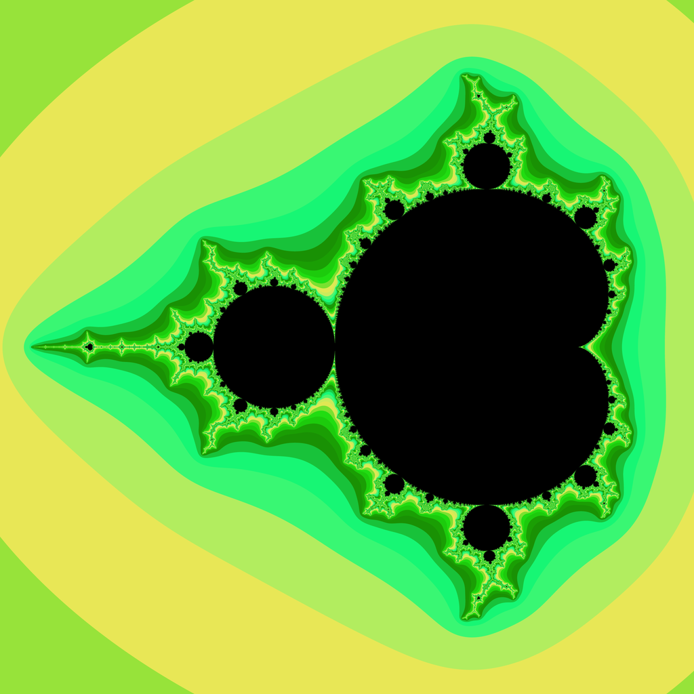

# Mandelbrot Set

The Mandelbrot set is one of the most famous and beautiful fractals, 
fascinating mathematicians, scientists, and artists around the world. 
Although it looks like a complex pattern at first glance, 
it is based on a simple mathematical rule of repeated exponentiation and addition. 
What makes it so interesting is its infinite complexity 
and the beautiful patterns hidden in every detail.

The use of the Mandelbrot set goes far beyond mathematics. 
It is used in computer graphics to create complex and realistic objects 
when modeling natural structures such as coastlines, mountains, or cloud formations. 
It can even be used in economics and physics to help simulate chaotic systems.

The Mandelbrot set is proof that even simple mathematical procedures can lead 
to incredibly complex and beautiful results with real-world applications.

## Creating a Set

Let us consider a relatively simple recurrent formula
$$
z_{n+1}=z_{n}^2+c,
$$ 
where the initial value is $z_0=0$ and $c$ represents an arbitrary complex number. 
The French-American mathematician Benoit Mandelbrot (1924–2010) 
was interested in when the sequence of numbers formed this way is bounded, 
i.e. for which $c$ in the complex plane the sequence converges or oscillates. 
If at some point the sequence diverges, he wanted to know how fast. 
It can be proven that if the absolute value of any term of the sequence $z_{n}$ exceeds 2, 
then this sequence is not bounded.

*The Mandelbrot set* is then the set of points $c$ in the complex plane for which the sequence created by the recurrent formula converges or oscillates. Thanks to the above fact, we know that for each term $z$ of this sequence, its absolute value $|z|$ must be less than or equal to two.

Verification of whether a given $c$ belongs to the Mandelbrot set is carried out by calculating individual iterations and observing the absolute values ​​of these iterations. To calculate the iterations, we use the recurrent formula

$$
z_{n+1}=z_{n}^2+c,\qquad z_0=0.
$$

For example, for $c=-i$ we obtain:

$$z_{1}=z_{0}^2-i=0^2-i=-i, \quad |z_1|=1,$$
$$z_{2}=z_{1}^2-i=(-i)^2-i=-1-i, \quad |z_2|=\sqrt{2},$$
$$z_{3}=z_{2}^2-i=(-1-i)^2-i=i, \quad |z_3|=1,$$
$$z_{4}=z_{3}^2-i=(i)^2-i=-1-i, \quad |z_4|=\sqrt{2}.$$

It is clear from the calculation that the results $-i$ and $-1-i$ will repeat indefinitely.
Therefore, the condition $|z|\leq2$ will always be satisfied, and therefore the number $-i$ belongs to the Mandelbrot set.

## Exercises

> **Exercise 1.** Verify whether the complex numbers $1$; $i$; $-1$; $1+i$ belong to the Mandelbrot set.

\iffalse

*Solution.* For simplicity, we will consider only the first few iteration steps. 
The image of a number $c$ in the Gaussian plane belongs to the Mandelbrot set if for all results 
of the iterative calculation the absolute value of the result is less than or equal to $2$.

Iterative process for $c=1$.
$$z_{1}=z_{0}^2+1=0^2+1=1, \quad |z_1|=1,$$
$$z_{2}=z_{1}^2+1=1^2+1=2, \quad |z_2|=2,$$
$$z_{3}=z_{2}^2+1=2^2+1=5, \quad |z_3|=5.$$
The calculation clearly shows that the condition $|z|\leq2$ was not met in the third iteration step, 
meaning that the number $1$ does not belong to the Mandelbrot set.

Iterative process for $c=i$.
$$z_{1}=z_{0}^2+i=0^2+i=i, \quad |z_1|=1,$$
$$z_{2}=z_{1}^2+i=i^2+i=-1+i, \quad |z_2|=\sqrt{2},$$
$$z_{3}=z_{2}^2+i=(-1+i)^2+i=-i, \quad |z_3|=1,$$
$$z_{4}=z_{3}^2+i=(-i)^2+i=-1+i, \quad |z_4|=\sqrt{2}.$$
The calculation shows that the values $-1+i$ and $i$ will repeat indefinitely. 
The condition $|z|\leq2$ will always be satisfied, therefore the number $i$ belongs to the Mandelbrot set.

Iterative process for $c=-1$.
$$z_{1}=z_{0}^2-1=0^2-1=-1, \quad |z_1|=1,$$
$$z_{2}=z_{1}^2-1=(-1)^2-1=0, \quad |z_2|=0,$$
$$z_{3}=z_{2}^2-1=0^2-1=-1, \quad |z_3|=1.$$
The values will repeat again and the condition $|z|\leq2$ will always be met, 
therefore the number $-1$ belongs to the Mandelbrot set.

Iterative process for $c=1+i$.
$$z_{1}=z_{0}^2+1+i=0^2+1+i=1+i, \quad |z_1|=\sqrt{2},$$
$$z_{2}=z_{1}^2+1+i=(1+i)^2+1+i=1+2i+i^2+1+i=1+3i, \quad |z_2|=\sqrt{10}.$$
It is clear from the calculation that the condition $|z|\leq2$ was not met in the second iteration step 
and the number $1+i$ does not belong to the Mandelbrot set.

\fi

> **Exercise 2.** Prove that if there exists $k\in \mathbb{N}$ such that $|z_k|>2$, then the sequence $z_n$ diverges.

\iffalse

*Solution.* By using the recurrent formula, we obtain the fraction
$$
\frac{|z_{n+1}|}{|z_n|}=\frac{|z^2_n+c|}{|z_n|}. 
\tag{1}
$$

Using the triangle inequality
$$
|a+b|\leq|a|+|b|,
$$ 
where $a=z^2+c$ and $b=-c$, we get
$$
|z^2+c-c|\leq|z^2+c|+|-c|=|z^2+c|+|c|
$$
and hence $|z^2+c|\geq|z^2|-|c|=|z|^2-|c|$.

Substituting into $(1)$ and modifying, we get
$$
\frac{|z^2_n+c|}{|z_n|}\geq \frac{|z_n|^2-|c|}{|z_n|}=|z_n|-\frac{|c|}{|z_n|}.
$$
Moreover, we know that there exists such $n$ that $|z_n|>|c|$ holds. For $|c|\leq2$, this follows from the assumption. For $c>2$, then for $n=2$ the following holds
$$
|z_2|=|c^2+c|\geq|c|^2-|c|=|c|(|c|-1)>|c|.
$$
So we can write
$$
\frac{|z^2_n+c|}{|z_n|}\geq \frac{|z_n|^2-|c|}{|z_n|}=|z_n|-\frac{|c|}{|z_n|}>|z_n|-1>1.
$$
And hence
$$
\frac{|z_{n+1}|}{|z_n|}>1,
$$
or $|z_{n+1}|>|z_n|$ and our sequence diverges.

\fi

## Literature 

*  Čápka Hartinger, David. *Mandelbrotova množina - lekce 3 [online]* https://www.itnetwork.cz/algoritmy/graficke/algoritmus-vykresleni-fraktalu-mandelbrotovy-mnoziny} [cit. 22. 9. 2023]

* Wikipedia. *Mandelbrot set [online]*. Available from https://en.wikipedia.org/wiki/Mandelbrot_set [cit. 22. 9. 2023].

* PantheraLeo1359531. *Mandelbrot set - figure [online]*. Available from https://commons.wikimedia.org/w/index.php?curid=103476207 [cit. 22. 9. 2023]
