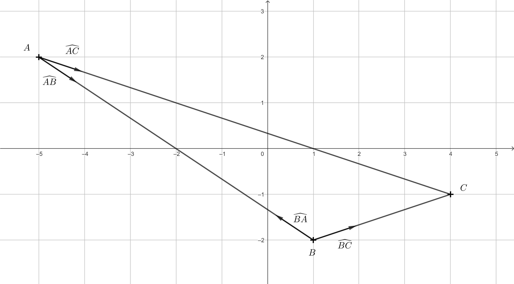
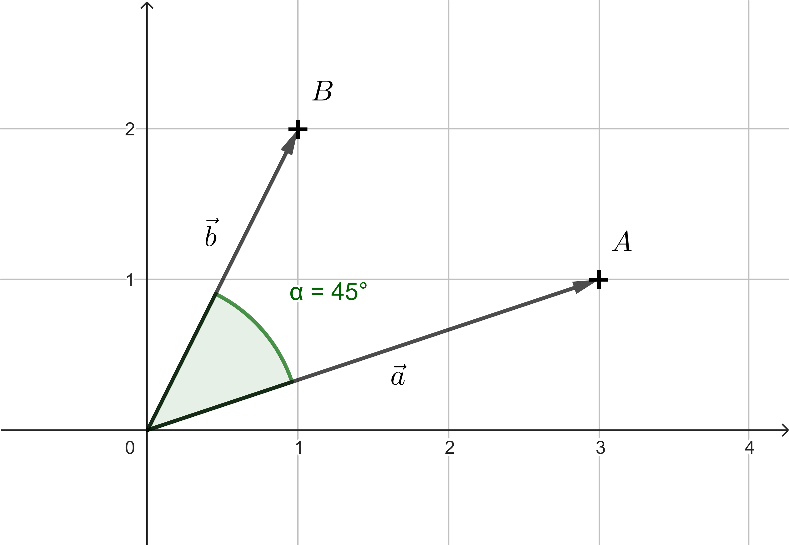

# Vektory

Vektory jsou důležité nejen v matematice ale i fyzice nebo informatice. 
V matematice se jimi zabývá část s názvem lineární algebra.

Vektor je většinou definován jako prvek matematické abstraktní struktury, tzv. vektorového prostoru.
Typickým zástupcem takovéhoto prostoru jsou třeba všechny uspořádné $n$-tice reálných čísel (tj. 
například dvojice nebo trojice) společně s pravidly pro jejich sčítání a násobení nějakým číslem. 
Na střední škole je tento vektor typicky prezentován jako množina 
orientovaných úseček, které mají daný směr a stejnou velikost. 

Ve fyzice se pomocí vektorů popisují veličiny jako rychlost a zrychlení pohybujícího se objektu, 
síly na něj působící, či elektromagnetické pole. 
V informatice je vektorem často myšlen jen uspořádaný seznam položek (nemusí jít jen o čísla). 
Vektory jsou efektivní možností, jak organizovat a ukládat objekty například v aplikacích strojového učení.

V informatice ale existuje i oblast, kde se vektory používají tím způsobem, 
jakým jsou definovány ve středoškolské matematice či fyzice. Touto oblastí je prostředí počítačových her. 
Zvládnutí práce s vektory je dokonce jedním ze základních stavebních kamenů k tomu, aby člověk mohl být programátorem her.

V závislosti na tom, zda vytváříte 2D nebo 3D hru, mají vektory dva nebo tři souřadnice 
a obecně se používají k reprezentaci geometrických vlastností objektů v herním světě.
Pro jednoduchost budeme pracovat pouze v dvourozměrném prostoru tedy v rovině a to v kartézské souřadné soustavě. 

*Poznámka:* Takových základních stavebních kamenů je třeba samozřejmě mnohem více. 
Kromě příslušného programovacího nástroje je třeba také znát matice transformací, jako je posunutí, otočení atd. 
V následujících úlohách se chceme zaměřit jen na operace s vektory.

## Body a směrové vektory

V následujících příkladech budeme rozlišovat zadání bodů (v hranatých závorkách) a vektorů (v kulatých závorkách). Současně ale budeme pamatovat na to, 
že bod $A = [a_1;a_2]$ také můžeme chápat jako koncový bod vektoru $\overrightarrow{a} = (a_1;a_2)$, jehož počáteční bod je počátek souřadného systému. 

Bod má souřadnice, ale na rozdíl od vektoru není určen délkou a směrem. Bod $[0,0]$ nebo vektor $(0, 0)$ pro nás bude středem herního světa. 

Běžným případem použití vektorů je výpočet vektoru, který popisuje vztah jednoho objektu vůči druhému. 
Vezměme si jednoduchý příklad bodů $A = [a_1;a_2]$ a $B = [b_1;b_2]$. 
Vektor $\overrightarrow{u}=\overrightarrow{AB}= (b_1-a_1; b_2-a_2)$ obvykle nazýváme směrový vektor. 
Pokud budou body $A$ a $B$ ve hře reprezentovat postavy, pak vektor $\overrightarrow{AB}$ určuje směr a jeho velikost pak vzdálenost,
kterou postava $A$ musí ujít, aby se dostala k postavě $B$.

> **Úloha 1.** Ve 2D hře máme programátora ovládajícího postavu $A$ a  hráče ovládajícího postavu $B$.
> Postavy stojí na začátku na různých místech a jsou reprezentovány pro jednoduchost body $A$, $B$.
> Postava $B$ postupně projde trasu ve směru vektorů $\overrightarrow{u}$, $\overrightarrow{v}$ a $\overrightarrow{w}$. 
> Vyjádřete vektor, který programátor potřebuje určit pro výstřel postavy $A$ na postavu $B$.

\iffalse

*Řešení.* Je jasné, že postava $B$ celkem prošla trasu $\overrightarrow{u}+\overrightarrow{v}+\overrightarrow{w}$. 
Postavy $A$ a $B$ ale na začátku stály na různých místech. 
Zbývá nám tedy určit vektor s počátečním bodem v bodě $A$ a koncovým bodem v bodě $B$, tedy směrový vektor $\overrightarrow{AB}$.
Víme že bod $A$ můžeme brát jako koncový bod vektoru $\overrightarrow{a}$
a bod $B$ jako koncový bod vektoru $\overrightarrow{b}$.
Pak tedy vektor $\overrightarrow{AB} = \overrightarrow{b}-\overrightarrow{a}$ (protože bod a vektor mají stejné souřadnice, 
používá se často i zápis $\overrightarrow{AB} = B-A$). 
Vektor určující výstřel postavy $A$ na postavu $B$ je tedy $\overrightarrow{b}-\overrightarrow{a}+\overrightarrow{u}+\overrightarrow{v}+\overrightarrow{w}$.

 

\fi

U každé postavy v herním světě se používá i vektor ve smyslu seznamu položek. 
Jednou z položek je třeba jméno postavy, její úloha, poloha. 
Další vlastností každé postavy v herním světě je směr, 
kterým je tato postava natočena. 
K určení směru natočení se používá takzvaný normalizovaný směrový vektor, 
tedy směrový vektor délky $1$. 

Normalizované směrové vektory se používají i k uchovávání informace, 
jakým směrem se vyskytují ostatní postavy nebo objekty.

*Poznámka:* Důvod, proč jsou v herním světě používány normalizované verze směrových vektorů, vysvětlíme později.

> **Úloha 2.** Mějme postavy $A = [-5;2]$, $B = [1;-2]$, $C = [4;-1]$.
> Určete normalizované směrové vektory postav $A$ a $B$ směrem k ostatním postavám.
> Nakreslete odpovídající obrázek.

\iffalse

*Řešení.* Pro směrový vektor $\overrightarrow{AB}$ platí $\overrightarrow{AB}= (1-(-5); -2-2) = (6;-4)$. 
Pokud ho chceme normalizovat, stačí ho vydělit jeho délkou 
$\left | \overrightarrow{AB} \right | = \sqrt{6^2+(-2)^2} = \sqrt{52}.$
Normalizovaný vektor k vektoru $\overrightarrow{AB}$ značíme $\widehat{AB}$ a platí

$$
\widehat{AB} = \frac{\overrightarrow{AB}}{\left | \overrightarrow{AB} \right | } = \frac{(6;-4)}{\sqrt{52}} = \left(\frac{3}{\sqrt{13}};-\frac{2}{\sqrt{13}}\right).
$$

Obdobně

$$
\widehat{AC} = \frac{\overrightarrow{AC}}{\left | \overrightarrow{AC} \right | } = \frac{(9;-3)}{\sqrt{90}} = \left(\frac{3}{\sqrt{10}};-\frac{1}{\sqrt{10}}\right), 
$$

$$\widehat{BC} = \frac{\overrightarrow{BC}}{\left | \overrightarrow{BC} \right | } = \frac{(3;1)}{\sqrt{10}} = \left(\frac{3}{\sqrt{10}};\frac{1}{\sqrt{10}}\right),$$

$$\widehat{BA} = \frac{\overrightarrow{BA}}{\left | \overrightarrow{BA} \right | } = \frac{(-6;4)}{\sqrt{52}} = \left(-\frac{3}{\sqrt{13}};\frac{2}{\sqrt{13}}\right).$$

Vektor $\widehat{BA}$ jsme nemuseli počítat, protože má stejnou velikost jako vektor $\widehat{AB}$ a opačný směr. Souřadnice takových vektorů se liší jen v opačném znaménku.

 

\fi

> **Úloha 3.** Mějme polohu postavy $A = [a_1;a_2]$ a postavy $B = [b_1;b_2]$ stojících na různých místech. Určete
> 
> a) normalizovaný směrový vektor $\widehat{BA}$,
> 
> b) kde se bude postava $B$ nacházet poté, co ujde tři jednotkové délky směrem k postavě $A$?

\iffalse

*Řešení.* a) To, co jsme počítali v předchozím příkladu s konkrétními souřadnicemi, nyní zapíšeme obecně. Tedy 

$$\widehat{BA} = \frac{\overrightarrow{BA}}{\left| \overrightarrow{BA} \right| } = 
\frac{(a_1-b_1;a_2-b_2)}{\sqrt{(a_1-b_1)^2+(a_2-b_2)^2}}.$$

b) Z předchozího máme spočítaný směrový vektor jednotkové délky. Nyní stačí vynásobit ho třemi a přičíst k poloze postavy $B$. Dostáváme

$$B+3\cdot\widehat{BA} = [b_1;b_2] +3\frac{(a_1-b_1;a_2-b_2)}{\sqrt{(a_1-b_1)^2+(a_2-b_2)^2}}.$$

\fi

## Skalární součin a jeho použití 

Výsledkem skalárního součinu dvou vektorů je skalár, tedy reálné číslo.
V programování her má důležité místo skalární součin normalizovaných vektorů. 

> **Úloha 4.** Určete skalární součiny normalizovaných směrových vektorů z řešení Úlohy 2.

\iffalse

*Řešení.* 

$$
\widehat{AB} \cdot \widehat{AC} = \left(\frac{3}{\sqrt{13}};-\frac{2}{\sqrt{13}}\right) \cdot \left(\frac{3}{\sqrt{10}};-\frac{1}{\sqrt{10}}\right) = 
\frac{9}{\sqrt{130}}+\frac{2}{\sqrt{130}} = \frac{11}{\sqrt{130}}
\dot=0{,}96
$$

$$
\widehat{BA} \cdot \widehat{BC} = \left(-\frac{3}{\sqrt{13}};\frac{2}{\sqrt{13}}\right) \cdot \left(\frac{3}{\sqrt{10}};\frac{1}{\sqrt{10}}\right) = 
-\frac{9}{\sqrt{130}}+\frac{2}{\sqrt{130}} = -\frac{7}{\sqrt{130}}
\dot= -0{,}054
$$

Skalární součin dvou normalizovaných vektorů je velmi užitečný, 
protože určuje, do jaké  míry dva vektory směřují stejným nebo podobným směrem! 
Skalární součin může totiž v tomto případě nabývat hodnot v rozmezí $-1$ až $1$, 
přičemž $1$ znamená, že oba vektory směřují přesně stejným směrem, 
a $-1$, že směřují opačným směrem, zatímco hodnota blízká $0$ znamená, 
že svírají úhel blízký pravému úhlu.
Důvodem rozsahu hodnot $-1$ až $1$ je to, že se pohybujeme v rozmezí funkčních hodnot funkce kosinus.
Pro skalární součin dvou vektorů $\vec{p}$, $\vec{q}$, totiž také platí vztah

$$
\vec{p} \cdot \vec{q}=\left | \vec{p} \right |\left | \vec{q} \right |\cos\alpha,  
$$

kde $\alpha$ je úhel který vektory $\vec{p}$ a $\vec{q}$ svírají.  

\fi

> **Úloha 5.** Pozorovatel v počátku se dívá na objekt $A=[3;1]$,
> určete úhel $\alpha$ o jaký se musí otočit,
> aby směr jeho pohledu mířil přímo na objekt $B=[1;2]$.

\iffalse

*Řešení.* Body $A$ a $B$ budeme opět brát jako koncové body vektorů $a=(3;1)$ a $b=(1;2)$.
Ze vztahu, který platí pro skalární součin dvou vektorů, vyjádříme $\cos\alpha$:

$$ \cos\alpha =\frac{\vec{a} \cdot \vec{b}}{\left | \vec{a} \right |\left | \vec{b} \right |}\,. $$

Po dosazení získáváme 

$$ \cos\alpha = \frac{(3;1) \cdot (1;2)}{\sqrt{3^2+1^2} \cdot \sqrt{1^2+2^2}} = \frac{3 \cdot 1 + 1 \cdot 2}{\sqrt{10} \cdot \sqrt{5}} = \frac{5}{\sqrt{50}} =\sqrt{\frac{25}{50}} = \frac{1}{\sqrt{2}}.$$

Víme, že $\frac{1}{\sqrt{2}}=\frac{\sqrt{2}}{2}$ je základní hodnota goniometrické funkce, tedy $\alpha=45^{\circ}$, resp. hodnotu úhlu $\alpha$ vypočítáme jako $\arccos \frac{1}{\sqrt{2}}$. Pozorovatel se tedy musí otočit o úhel $45^{\circ}$.

 

\fi

Pokud by v zadání úlohy byly dané normalizované směrové vektory, 
jejich skalární součin by byl roven přímo $\cos\alpha$.

$$ \cos\alpha =\frac{\vec{a}}{\left | \vec{a} \right |} \cdot \frac{\vec{b}}{\left | \vec{b} \right |} = \hat{a} \cdot \hat{b}$$

Toto je důvod proč bývají směry pohledů u postav a směrové vektory mezi postavami v seznamech položek uváděny v normalizovaném tvaru.

Skalární součin můžeme s výhodou použít i pro řešení následujícího problému. Řekněme, že vytvářím hru, ve které se hráč snaží 
schovat před nějakými strážemi. Bude nás tedy zajímat, zda strážný vidí či nevidí jednotlivé hráče. 

Pro větši realističnost chceme, aby měl strážný zorné pole, ve kterém danou postavu vidí. 
U člověka se udává velikost zorného úhlu pro vidění oběma očima přibližně $180^{\circ}$. 
To by pro našeho strážného bylo až příliš, takže řekněme že chceme aby jeho zorný úhel byl například $170^{\circ}$. 

> **Úloha 6.** Zorný úhel strážného $G$ je $170^{\circ}$, jakých hodnot budou nabývat skalární součiny mezi jeho směrem pohledu $\vec{d}$ a normalizovanými směrovými vektory k objektům, které strážný vidí?

\iffalse

*Řešení.* Od směru pohledu strážce k hranicím zorného pole (směrem doprava i doleva) máme $85^{\circ}$. Stačí tedy vypočítat $\cos 85^{\circ} \dot= 0{,}087$. Skalární součiny mezi směrem pohledu strážného a normalizovanými směrovými vektory k objektům, které vidí budou nabývat hodnot mezi $0{,}087$ a $1$.

 

Do seznamu položek příslušnému strážci tedy ke směru pohledu přidáme rozmezí, 
které bude určovat jeho zorné pole. Pomocí něj pak můžeme kontrolovat, 
zda strážný hráče vidí či nevidí. 
Pro jednoduchost předchozí výsledek zaokrouhlíme na jedno desetinné místo 
a zorné pole strážného tedy omezíme hodnotou $0{,}1$. 

\fi

> **Úloha 7.** Určete zda strážný, umístěný v počátku, vidí hráče $A=[3;-2]$,
> jestliže směr pohledu strážného je $\left(\frac{1}{\sqrt{5}};\frac{2}{\sqrt{5}}\right)$
> a hranice pro omezení zorného pole je dána hodnotou $0{,}1$.

\iffalse

*Řešení.* Směr pohledu strážného je už normalizovaný vektor. Stačí tedy normalizovat směrový vektor od strážného k hráči $A$. Díky tomu že strážný je v počátku, stačí normalizovat vektor $\vec{a}=(3;-2)$. Platí 

$$
\hat{a}=\frac{\left(3;-2\right)}{3^2+(-2)^2} = \frac{\left(3;-2\right)}{15} = \left(\frac{3}{15};\frac{-2}{15}\right).
$$  

Poté už můžeme vypočítat příslušný skalární součin těchto normalizovaných vektorů, tedy 

$$
\left(\frac{1}{\sqrt{5}};\frac{2}{\sqrt{5}}\right) \cdot \left(\frac{3}{\sqrt{15}};\frac{-2}{\sqrt{15}}\right) = \frac{3}{\sqrt{75}} - \frac{4}{\sqrt{75}} = -\frac{1}{\sqrt{75}} \dot= -0{,}12.
$$ 

Výsledek není v rozmezí od $0,1$ do $1$, strážný tedy hráče $A$ nevidí. Z výsledku je navíc jasné že mezi vektory je větší než pravý úhel.

Můžete se zamyslete v čem se situace z předchozího příkladu změní, pokud strážce není v počátku.

\fi
