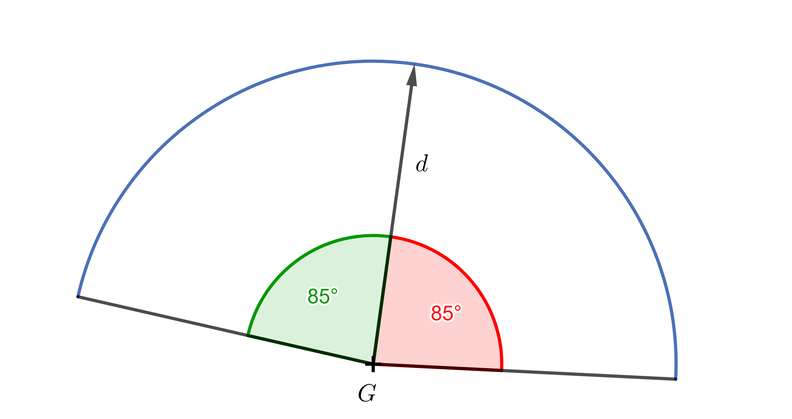

# Vectores

Los vectores son importantes no sólo en matemáticas, sino también en física o informática. 
En matemáticas, se tratan en una sección llamada álgebra lineal.

Un vector suele definirse como un elemento de una estructura matemática abstracta, el llamado espacio vectorial.
Un representante típico de dicho espacio es, por ejemplo, todas las $n$-tuplas ordenadas de números reales (es decir, 
por ejemplo, pares o triples) junto con las reglas para su suma y multiplicación por algún número. 
En secundaria, este vector se representa típicamente como un conjunto de 
segmentos orientados que tienen una dirección determinada y el mismo tamaño. 

En física, los vectores se utilizan para describir magnitudes como la velocidad y la aceleración de un objeto en movimiento, 
las fuerzas que actúan sobre él o el campo electromagnético. 
En informática, un vector suele ser una lista ordenada de elementos (no necesariamente números). 
Los vectores son una forma eficaz de organizar y almacenar objetos, por ejemplo en aplicaciones de aprendizaje automático.

Pero también hay un campo en la informática en el que los vectores se utilizan de la forma 
en que se definen en las matemáticas o la física del bachillerato. Este campo es el entorno de los juegos de ordenador. 
Dominar el manejo de vectores es incluso uno de los pilares básicos para ser programador de juegos.

Dependiendo de si estás creando un juego 2D o 3D, los vectores tienen dos o tres coordenadas 
y se utilizan generalmente para representar propiedades geométricas de los objetos en el mundo del juego.
Para simplificar, sólo trabajaremos en el espacio bidimensional, es decir, en el plano, y en el sistema de coordenadas cartesianas. 

*Nota:* Por supuesto, se necesitan muchos más componentes básicos de este tipo. 
Además de la herramienta de programación adecuada, también es necesario conocer las matrices de transformaciones como desplazar, rotar, etc. 
En las siguientes tareas queremos centrarnos sólo en las operaciones vectoriales.

## Puntos y vectores de dirección

En los siguientes ejemplos, distinguiremos entre especificar puntos (entre corchetes) y vectores (entre paréntesis redondos). Al mismo tiempo, recordaremos, 
que el punto $A = [a_1;a_2]$ también puede verse como el punto final del vector $\overrightarrow{a} = (a_1;a_2)$, cuyo origen es el origen del sistema de coordenadas. 

Un punto tiene coordenadas, pero a diferencia de un vector, no está especificado por longitud y dirección. Para nosotros, el punto $[0,0]$ o vector $(0, 0)$ será el centro del mundo del juego. 

Un caso de uso común para los vectores es calcular un vector que describa la relación de un objeto con otro. 
Tomemos un ejemplo sencillo de puntos $A = [a_1;a_2]$ a $B = [b_1;b_2]$. 
El Vector $\overrightarrow{u}=\overrightarrow{AB}= (b_1-a_1; b_2-a_2)$ suele llamarse vector de dirección. 
Si los puntos $A$ a $B$ representan personajes en el juego, entonces el vector $\overrightarrow{AB}$ determina la dirección y su magnitud determina la distancia,
que el personaje $A$ debe recorrer para llegar al personaje $B$.

> **Tarea 1.** En un juego 2D tenemos un programador controlando al personaje $A$ y un jugador controlando al personaje $B$.
> Los personajes se sitúan al principio en lugares diferentes y se representan, para simplificar, mediante los puntos $A$, $B$.
> El personaje $B$ recorre secuencialmente la ruta en la dirección de los vectores $\overrightarrow{u}$, $\overrightarrow{v}$ a $\overrightarrow{w}$. 
> Expresar el vector que debe determinar el programador para hacer llegar el personaje $A$ al personaje $B$.

\iffalse

*Solución.* Está claro que $B$ ha recorrido la ruta $\overrightarrow{u}+\overrightarrow{v}+\overrightarrow{w}$. 
Sin embargo, los personajes $A$ a $B$ estaban en lugares diferentes al principio. 
Queda por determinar el vector con punto inicial en $A$ y punto final en $B$, es decir, el vector de dirección $\overrightarrow{AB}$.
Sabemos que podemos tomar el punto $A$ como el punto final del vector $\overrightarrow{a}$
y el punto $B$ como el punto final del vector $\overrightarrow{b}$.
Entonces el vector $\overrightarrow{AB} = \overrightarrow{b}-\overrightarrow{a}$ (ya que el punto y el vector tienen las mismas coordenadas, 
se utiliza a menudo para escribir $\overrightarrow{AB} = B-A$). 
Así, el vector que determina el recorrido del personaje $A$ al personaje $B$ es $\overrightarrow{b}-\overrightarrow{a}+\overrightarrow{u}+\overrightarrow{v}+\overrightarrow{w}$.

 

Para cada personaje del mundo del juego se utiliza también un vector en el sentido de una lista de elementos. 
Uno de los elementos es el nombre, el papel y la ubicación del personaje. 
Otra característica de cada personaje del mundo del juego es la dirección 
en la que está orientado. 
Para determinar la dirección de rotación, se utiliza el llamado vector de dirección normalizado, 
es decir, un vector de dirección de longitud $1$. 

Los vectores direccionales normalizados también se utilizan para almacenar información, 
en qué dirección están orientadas otras figuras u objetos.

*Nota:* Más adelante explicaremos por qué se utilizan versiones estandarizadas de los vectores direccionales en el mundo del juego.

\fi

> **Tarea 2.** Tenemos los personajes $A = [-5;2]$, $B = [1;-2]$, $C = [4;-1]$.
> Determinar los vectores de dirección normalizados de los personajes $A$ y $B$ hacia los otros personajes.
> Haz el dibujo correspondiente.

\iffalse

*Solución.* Para el vector de dirección $\overrightarrow{AB}$ $\overrightarrow{AB}= (1-(-5); -2-2) = (6;-4)$. 
Para normalizarlo, basta con dividirlo por su longitud 
$\left | \overrightarrow{AB} \right | = \sqrt{6^2+(-2)^2} = \sqrt{52}.$
El vector normalizado al vector $\overrightarrow{AB}$ se denota por $\widehat{AB}$ y es

$$
\widehat{AB} = \frac{\overrightarrow{AB}}{\left | \overrightarrow{AB} \right | } = \frac{(6;-4)}{\sqrt{52}} = \left(\frac{3}{\sqrt{13}};-\frac{2}{\sqrt{13}}\right).
$$

Del mismo modo

$$
\widehat{AC} = \frac{\overrightarrow{AC}}{\left | \overrightarrow{AC} \right | } = \frac{(9;-3)}{\sqrt{90}} = \left(\frac{3}{\sqrt{10}};-\frac{1}{\sqrt{10}}\right), 
$$

$$\widehat{BC} = \frac{\overrightarrow{BC}}{\left | \overrightarrow{BC} \right | } = \frac{(3;1)}{\sqrt{10}} = \left(\frac{3}{\sqrt{10}};\frac{1}{\sqrt{10}}\right),$$

$$\widehat{BA} = \frac{\overrightarrow{BA}}{\left | \overrightarrow{BA} \right | } = \frac{(-6;4)}{\sqrt{52}} = \left(-\frac{3}{\sqrt{13}};\frac{2}{\sqrt{13}}\right).$$

No necesitamos calcular el vector $\widehat{BA}$ porque tiene el mismo tamaño que el vector $\widehat{AB}$ y la dirección opuesta. Las coordenadas de tales vectores difieren sólo en el signo opuesto.

 

\fi

> **Problema 3.** Supongamos la posición del personaje $A = [a_1;a_2]$ y el personaje $B = [b_1;b_2]$ parados en lugares diferentes. Determinar:
> 
> a) el vector de dirección normalizado $\widehat{BA}$,
> 
> b) donde estará el personaje $B$ después de caminar tres longitudes unitarias hacia el personaje $A$?

\iffalse

*Solución.* a) Lo que hemos calculado en el ejemplo anterior con coordenadas concretas, lo escribiremos ahora en general. Así 

$$\widehat{BA} = \frac{\overrightarrow{BA}}{\left| \overrightarrow{BA} \right| } = 
\frac{(a_1-b_1;a_2-b_2)}{\sqrt{(a_1-b_1)^2+(a_2-b_2)^2}}.$$

b) A partir del anterior hemos calculado el vector de dirección de longitud unitaria. Ahora basta con multiplicarlo por tres y sumarlo a la posición del personaje $B$. Obtenemos

$$B+3\cdot\widehat{BA} = [b_1;b_2] +3\frac{(a_1-b_1;a_2-b_2)}{\sqrt{(a_1-b_1)^2+(a_2-b_2)^2}}.$$

\fi

## Producto escalar y su uso 

El resultado del producto escalar de dos vectores es un escalar, es decir, un número real.
El producto escalar de vectores normalizados ocupa un lugar importante en la programación de juegos. 

> **Problema 4.** Determinar los productos escalares de los vectores de dirección normalizados a partir de la solución del Problema 2.

\iffalse

*Solución.* 

$$
\widehat{AB} \cdot \widehat{AC} = \left(\frac{3}{\sqrt{13}};-\frac{2}{\sqrt{13}}\right) \cdot \left(\frac{3}{\sqrt{10}};-\frac{1}{\sqrt{10}}\right) = 
\frac{9}{\sqrt{130}}+\frac{2}{\sqrt{130}} = \frac{11}{\sqrt{130}}
\dot=0{,}96
$$

$$
\widehat{BA} \cdot \widehat{BC} = \left(-\frac{3}{\sqrt{13}};\frac{2}{\sqrt{13}}\right) \cdot \left(\frac{3}{\sqrt{10}};\frac{1}{\sqrt{10}}\right) = 
-\frac{9}{\sqrt{130}}+\frac{2}{\sqrt{130}} = -\frac{7}{\sqrt{130}}
\dot= -0{,}054
$$

El producto escalar de dos vectores normalizados es muy útil, 
porque determina hasta qué punto dos vectores apuntan en la misma dirección o en una dirección similar. 
De hecho, el producto escalar en este caso puede tomar valores entre $-1$ až $1$, 
con $1$ significando que los dos vectores apuntan exactamente en la misma dirección, 
y $-1$, significando que apuntan en direcciones opuestas, mientras que un valor cercano a $0$ significa 
que están en un ángulo cercano a un ángulo recto.
La razón del rango de valores de $-1$ a $1$ es que estamos en el rango de valores de la función coseno.
Para el producto escalar de dos vectores $\vec{p}$, $\vec{q}$, la relación sería

$$
\vec{p} \cdot \vec{q}=\left | \vec{p} \right |\left | \vec{q} \right |\cos\alpha,  
$$
donde $\alpha$ es el ángulo que forman los vectores $\vec{p}$ y $\vec{q}$. 

\fi

> **Problema 5.** El observador al principio mira el objeto $A=[3;1]$,
> determinar el ángulo $\alpha$ con el que debe girar,
> para que la dirección de su mirada se dirija directamente al objeto $B=[1;2]$.

\iffalse

*Solución.* Los puntos $A$ y $B$ se tomarán de nuevo como puntos extremos de los vectores $a=(3;1)$ a $b=(1;2)$.
A partir de la relación que existe para el producto escalar de dos vectores, expresamos $\cos\alpha$:

$$ \cos\alpha =\frac{\vec{a} \cdot \vec{b}}{\left | \vec{a} \right |\left | \vec{b} \right |}\,. $$

Tras la colocación, obtenemos 

$$ \cos\alpha = \frac{(3;1) \cdot (1;2)}{\sqrt{3^2+1^2} \cdot \sqrt{1^2+2^2}} = \frac{3 \cdot 1 + 1 \cdot 2}{\sqrt{10} \cdot \sqrt{5}} = \frac{5}{\sqrt{50}} =\sqrt{\frac{25}{50}} = \frac{1}{\sqrt{2}}.$$

Sabemos que $\frac{1}{\sqrt{2}}=\frac{\sqrt{2}}{2}$ es un valor fundamental de la función trigonométrica, por lo tanto $\alpha=45^{\circ}$, o bien el valor del ángulo $\alpha$ se calcula como $\arccos \frac{1}{\sqrt{2}}$. El observador, por lo tanto, debe girar un ángulo de $45^{\circ}$.

 

\fi

Si en el enunciado del problema se dieran vectores direccionales normalizados, 
su producto escalar sería directamente igual a $\cos\alpha$.

$$ \cos\alpha =\frac{\vec{a}}{\left | \vec{a} \right |} \cdot \frac{\vec{b}}{\left | \vec{b} \right |} = \hat{a} \cdot \hat{b}$$

Esta es la razón por la que las direcciones de vista de los personajes y los vectores direccionales entre personajes en las listas de elementos tienden a darse de forma normalizada.

Podemos utilizar el producto escalar para resolver el siguiente problema. Supongamos que estoy creando un juego en el que el jugador intenta 
esconderse de unos guardias. Entonces nos interesará saber si los guardias pueden ver o no a cada uno de los jugadores. 

Para mayor realismo, queremos que el guardia tenga un campo de visión en el que pueda ver al personaje. 
Para los seres humanos, el tamaño del campo de visión para ver con ambos ojos se da como aproximadamente $180^{\circ}$. 
Eso sería demasiado para nuestro guardia, así que digamos que queremos que su campo de visión sea, por ejemplo $170^{\circ}$. 

> **Problema 6.** El ángulo de visión del vigilante $G$ es de $170^{\circ}$, ¿qué valores tomarán los productos escalares entre su dirección de visión $\vec{d}$ y los vectores dirección normalizados a los objetos que ve?

\iffalse

*Solución.* Desde la dirección de la mirada del vigilante hasta los límites del campo de visión (a derecha e izquierda) tenemos $85^{\circ}$. Así que sólo tenemos que calcular $\cos 85^{\circ} \dot= 0{,}087$. Los productos escalares entre la dirección de la mirada del vigilante y los vectores normalizados de dirección a los objetos que ve tomarán valores entre $0{,}087$ y $1$.

 

Así que añadimos un rango a la lista de elementos para el guardia correspondiente, 
que determinará su campo de visión. A continuación, podemos utilizarlo para comprobar 
si el guardia puede o no ver al jugador. 
Para simplificar, redondeamos el resultado anterior a un decimal 
y limitamos el campo de visión del guardia a $0{,}1$. 

\fi

> **Problema 7.** Determinar si el guardia, situado en la salida, puede ver al jugador $A=[3;-2]$,
> si la dirección de la mirada del guardia es $\left(\frac{1}{\sqrt{5}};\frac{2}{\sqrt{5}}\right)$
> y la frontera para la limitación del campo de visión viene dada por $0{,}1$.

\iffalse

*Solución.* La dirección de la mirada del guardia ya es un vector normalizado. Así que basta con normalizar el vector de dirección desde el guardia hasta el jugador $A$. Dado que el guardia está en el origen, es suficiente para normalizar el vector $\vec{a}=(3;-2)$. Es válido: 

$$
\hat{a}=\frac{\left(3;-2\right)}{3^2+(-2)^2} = \frac{\left(3;-2\right)}{15} = \left(\frac{3}{15};\frac{-2}{15}\right).
$$  

Entonces podemos calcular el correspondiente producto escalar de estos vectores normalizados, es decir, 

$$
\left(\frac{1}{\sqrt{5}};\frac{2}{\sqrt{5}}\right) \cdot \left(\frac{3}{\sqrt{15}};\frac{-2}{\sqrt{15}}\right) = \frac{3}{\sqrt{75}} - \frac{4}{\sqrt{75}} = -\frac{1}{\sqrt{75}} \dot= -0{,}12.
$$ 

El resultado no está entre $0{,}1$ y $1$, por lo que el vigilante no ve al jugador $A$ Además, del resultado se deduce claramente que hay más de un ángulo recto entre los vectores.

Puedes pensar en cómo cambia la situación del ejemplo anterior si el guardia no está al principio.

\fi

