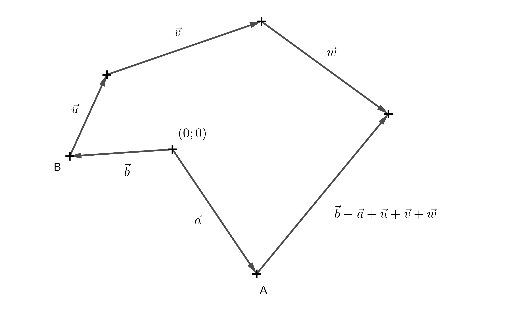
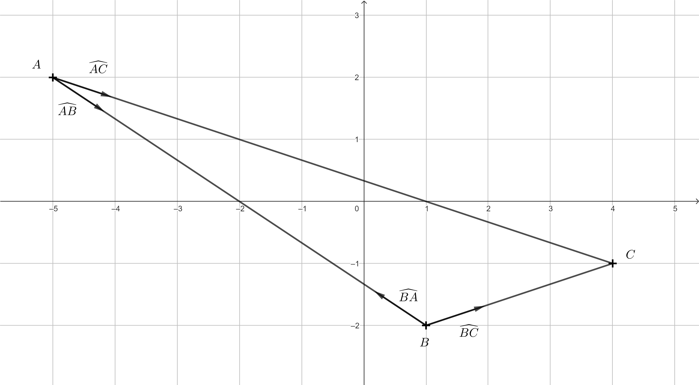

---
keywords:
- geometria analityczna
- wektory
- iloczyn skalarny
is_finished: true
---

# Wektory

Wektory są ważne nie tylko w matematyce, ale także w fizyce i informatyce. W matematyce są one badane w ramach gałęzi zwanej algebrą liniową.

Wektor jest zwykle definiowany jako element abstrakcyjnej struktury matematycznej zwanej przestrzenią wektorową. Typowym przykładem takiej przestrzeni jest zbiór wszystkich uporządkowanych n-krotności liczb rzeczywistych (na przykład par lub trójek), wraz z regułami ich dodawania i mnożenia przez liczbę. W matematyce w szkole średniej, wektory są często przedstawiane jako zbiór skierowanych odcinków linii, które mają tę samą wielkość i kierunek.

W fizyce wektory są używane do opisywania takich wielkości jak prędkość i przyspieszenie poruszającego się obiektu, działające na niego siły lub pola elektromagnetyczne. W informatyce wektor jest często rozumiany po prostu jako uporządkowana lista elementów (niekoniecznie liczb). Wektory zapewniają efektywny sposób organizowania i przechowywania danych, na przykład w aplikacjach uczenia maszynowego.

Istnieje jednak również dziedzina informatyki, w której wektory są używane w taki sam sposób, w jaki są definiowane w matematyce lub fizyce w szkole średniej. Obszarem tym są gry komputerowe. W rzeczywistości, opanowanie operacji wektorowych jest jednym z podstawowych elementów niezbędnych do zostania programistą gier.

W zależności od tego, czy tworzysz grę 2D czy 3D, wektory mają dwie lub trzy współrzędne i są zwykle używane do reprezentowania geometrycznych właściwości obiektów w świecie gry. Dla uproszczenia będziemy pracować tylko w dwóch wymiarach, to znaczy na płaszczyźnie przy użyciu kartezjańskiego układu współrzędnych.

*Uwaga:* Oczywiście zrozumienie wektorów jest tylko jednym z wielu podstawowych elementów. Oprócz odpowiednich narzędzi programistycznych, należy również zrozumieć macierze transformacji, takie jak translacje, obroty i tak dalej. W poniższych zadaniach skupimy się tylko na operacjach wektorowych.

## Punkty i kierunek wektora

W poniższych przykładach będziemy rozróżniać punkty (zapisane w nawiasach kwadratowych) i wektory (zapisane w nawiasach okrągłych).
Jednocześnie należy pamiętać, że punkt $A = [a_1; a_2]$ może być również interpretowany jako punkt końcowy wektora $\overrightarrow{a} = (a_1; a_2)$,
którego punktem początkowym jest początek układu współrzędnych.

Punkt ma współrzędne, ale w przeciwieństwie do wektora, nie jest zdefiniowany przez wielkość i kierunek. Punkt $[0, 0]$ (lub wektor $(0, 0)$) będzie służył jako środek świata gry.

Powszechnym zastosowaniem wektorów jest znalezienie wektora opisującego relację między dwoma obiektami.
Rozważmy prosty przykład z dwoma punktami $A = [a_1;a_2]$ i $B = [b_1; b_2]$.
Wektor $\overrightarrow{u}=\overrightarrow{AB}= (b_1 - a_1; b_2 - a_2)$ jest zwykle nazywany wektorem kierunku.
Jeśli punkty $A$ i $B$ reprezentują postacie w grze, to wektor $\overrightarrow{AB}$ wskazuje kierunek od jednej postaci do drugiej,
a jego wielkość reprezentuje odległość, jaką musiałby pokonać znak $A$, aby dotrzeć do znaku $B$.

> **Zadanie 1.** W grze 2D programista steruje postacią $A$, a gracz postacią $B$.
> Postacie zaczynają w różnych miejscach, reprezentowanych przez punkty $A$ i $B$.
> Postać $B$ porusza się po ścieżce złożonej z wektorów $\overrightarrow{u}$, $\overrightarrow{v}$ i $\overrightarrow{w}$.
>Wyraź wektor, który programista musi określić, aby postać $A$ strzeliła do postaci $B$.

\iffalse

*Rozwiązanie.* Jest oczywiste, że znak $B$ poruszył się po ścieżce $\overrightarrow{u}+\overrightarrow{v}+\overrightarrow{w}$.
Jednak znaki $A$ i $B$ rozpoczęły się na różnych pozycjach.
Nadal musimy więc określić wektor, który zaczyna się w punkcie $A$ i kończy w punkcie $B$ - czyli wektor kierunku $\overrightarrow{AB}$.
We know that point $A$ can be understood as the endpoint of the vector $\overrightarrow{a}$, and point $B$ as the endpoint of the vector $\overrightarrow{b}$.
Wtedy wektor $\overrightarrow{AB} = \overrightarrow{b}-\overrightarrow{a}$ (ponieważ punkty i odpowiadające im wektory mają te same współrzędne,
notacja $\overrightarrow{AB} = B-A$ jest również powszechnie używana).
Dlatego wektor potrzebny do tego, by postać $A$ strzeliła do postaci $B$ wynosi $\overrightarrow{b}-\overrightarrow{a}+\overrightarrow{u}+\overrightarrow{v}+\overrightarrow{w}$.

 

Każda postać w świecie gry jest również powiązana z wektorem w sensie listy elementów - takich jak imię, rola i pozycja postaci.
Kolejną ważną właściwością każdej postaci jest kierunek, w którym jest zwrócona.
Kierunek ten jest reprezentowany przez tak zwany znormalizowany wektor kierunku, który jest wektorem kierunku o wielkości $1$.

Znormalizowane wektory kierunku są również używane do przechowywania informacji o kierunkach, w których znajdują się inne postacie lub obiekty.

*Uwaga:* Powód, dla którego znormalizowane wersje wektorów kierunku są używane w światach gier, zostanie wyjaśniony później.

\fi

> **Zadanie 2.** Niech znakami będą punkty $A = [-5; 2]$, $B = [1; -2]$ i $C = [4; -1]$.
> Wyznacz znormalizowane wektory kierunku od znaków $A$ i $B$ skierowane w stronę innych znaków.
>Narysuj odpowiedni diagram.

\iffalse

*Rozwiązanie.* Dla wektora o kierunku $\overrightarrow{AB}$ mamy: $\overrightarrow{AB}= (1-(-5); -2-2) = (6;-4)$.
Aby znormalizować ten wektor, po prostu dzielimy go przez jego wielkość:
$\left | \overrightarrow{AB} \right | = \sqrt{6^2+(-2)^2} = \sqrt{52}.$
Znormalizowany wektor odpowiadający $\overrightarrow{AB}$ jest oznaczany przez $\widehat{AB}$ i otrzymujemy:

$$
\widehat{AB} = \frac{\overrightarrow{AB}}{\left | \overrightarrow{AB} \right | } = \frac{(6;-4)}{\sqrt{52}} = \left(\frac{3}{\sqrt{13}};-\frac{2}{\sqrt{13}}\right).
$$

Podobnie

$$
\widehat{AC} = \frac{\overrightarrow{AC}}{\left | \overrightarrow{AC} \right | } = \frac{(9;-3)}{\sqrt{90}} = \left(\frac{3}{\sqrt{10}};-\frac{1}{\sqrt{10}}\right), 
$$

$$\widehat{BC} = \frac{\overrightarrow{BC}}{\left | \overrightarrow{BC} \right | } = \frac{(3;1)}{\sqrt{10}} = \left(\frac{3}{\sqrt{10}};\frac{1}{\sqrt{10}}\right),$$

$$\widehat{BA} = \frac{\overrightarrow{BA}}{\left | \overrightarrow{BA} \right | } = \frac{(-6;4)}{\sqrt{52}} = \left(-\frac{3}{\sqrt{13}};\frac{2}{\sqrt{13}}\right).$$

Nie było potrzeby obliczania wektora $\widehat{BA}$, ponieważ ma on taką samą wielkość jak $\widehat{AB}$, ale jest skierowany w przeciwnym kierunku.
Współrzędne takich wektorów różnią się tylko znakiem.

 

\fi

> **Zadanie 3.** Dane są pozycje znaków $A = [a_1;a_2]$ i $B = [b_1;b_2]$, przy czym znaki te stoją w różnych miejscach. Wyznaczyć:
> 
> a) znormalizowany wektor kierunku $\widehat{BA}$,
> 
> b) gdzie znajdzie się znak $B$ po przejściu trzech jednostek długości w kierunku znaku $A$?

\iffalse

*Rozwiązanie.* a) To, co obliczyliśmy w poprzednim przykładzie przy użyciu konkretnych współrzędnych, można teraz zapisać w formie ogólnej. To znaczy,

$$\widehat{BA} = \frac{\overrightarrow{BA}}{\left| \overrightarrow{BA} \right| } = 
\frac{(a_1-b_1;a_2-b_2)}{\sqrt{(a_1-b_1)^2+(a_2-b_2)^2}}.$$

b) Z poprzedniego kroku mamy już wektor kierunku o jednostkowej długości. Teraz po prostu mnożymy go przez 3 i dodajemy do pozycji znaku $B$. Otrzymujemy:

$$B+3\cdot\widehat{BA} = [b_1;b_2] +3\frac{(a_1-b_1;a_2-b_2)}{\sqrt{(a_1-b_1)^2+(a_2-b_2)^2}}.$$

\fi

## Iloczyn skalarny i jego zastosowania
Wynikiem iloczynu skalarnego dwóch wektorów jest skalar, czyli liczba rzeczywista.
W programowaniu gier iloczyn skalarny znormalizowanych wektorów odgrywa ważną rolę.

> **Zadanie 4.** Wyznacz iloczyn skalarny znormalizowanych wektorów kierunku z rozwiązania ćwiczenia 2.

\iffalse

*Rozwiązanie.*

$$
\widehat{AB} \cdot \widehat{AC} = \left(\frac{3}{\sqrt{13}};-\frac{2}{\sqrt{13}}\right) \cdot \left(\frac{3}{\sqrt{10}};-\frac{1}{\sqrt{10}}\right) = 
\frac{9}{\sqrt{130}}+\frac{2}{\sqrt{130}} = \frac{11}{\sqrt{130}}
\dot=0{,}96
$$

$$
\widehat{BA} \cdot \widehat{BC} = \left(-\frac{3}{\sqrt{13}};\frac{2}{\sqrt{13}}\right) \cdot \left(\frac{3}{\sqrt{10}};\frac{1}{\sqrt{10}}\right) = 
-\frac{9}{\sqrt{130}}+\frac{2}{\sqrt{130}} = -\frac{7}{\sqrt{130}}
\dot= -0{,}054
$$

Iloczyn skalarny dwóch znormalizowanych wektorów jest bardzo przydatny, ponieważ mówi nam, w jakim stopniu dwa wektory są skierowane w tym samym lub podobnym kierunku!
W tym przypadku wartość iloczynu skalarnego waha się od $-1$ do $1$: wartość $1$ oznacza, że wektory są skierowane dokładnie w tym samym kierunku, wartość $-1$ oznacza, że są skierowane dokładnie w przeciwnych kierunkach, a wartość bliska $0$ oznacza, że wektory są prawie prostopadłe do siebie.
Powodem tego zakresu od $-1$ do $1$ jest to, że pracujemy w zakresie wartości funkcji cosinus.
Dla dowolnych dwóch wektorów $\vec{p}$, $\vec{q}$ iloczyn skalarny można również zapisać jako:

$$
\vec{p} \cdot \vec{q}=\left | \vec{p} \right |\left | \vec{q} \right |\cos\alpha,  
$$

gdzie $\alpha$ jest kątem pomiędzy wektorami $\vec{p}$ i $\vec{q}$.

\fi

> **Zadanie 5.** Obserwator znajdujący się w punkcie początkowym patrzy na obiekt $A=[3;1]$.
> Określić kąt $\alpha$, o który obserwator musi się obrócić, aby znaleźć się bezpośrednio w kierunku obiektu. $B=[1;2]$.

\iffalse

*Rozwiązanie.* Ponownie traktujemy punkty $A$ i $B$ jako punkty końcowe wektorów $\vec{a}=(3;1)$ i $\vec{b}=(1;2)$.
Na podstawie wzoru na iloczyn skalarny dwóch wektorów możemy wyrazić $\cos\alpha$:

$$ \cos\alpha =\frac{\vec{a} \cdot \vec{b}}{\left | \vec{a} \right |\left | \vec{b} \right |}\,. $$

Po podstawieniu określonych wartości otrzymujemy

$$ \cos\alpha = \frac{(3;1) \cdot (1;2)}{\sqrt{3^2+1^2} \cdot \sqrt{1^2+2^2}} = \frac{3 \cdot 1 + 1 \cdot 2}{\sqrt{10} \cdot \sqrt{5}} = \frac{5}{\sqrt{50}} =\sqrt{\frac{25}{50}} = \frac{1}{\sqrt{2}}.$$

Wiemy, że $\frac{1}{\sqrt{2}}=\frac{\sqrt{2}}{2}$ jest dobrze znaną wartością trygonometryczną, co oznacza, że $\alpha=45^{\circ}$. Alternatywnie, możemy obliczyć kąt $\alpha$ jako $\arccos \frac{1}{\sqrt{2}}$. Dlatego obserwator musi obrócić się o kąt $45^{\circ}$.

 

\fi

Gdyby znormalizowane wektory kierunku były jawnie podane w problemie, to ich iloczyn skalarny byłby równy $\cos\alpha$.

$$ \cos\alpha =\frac{\vec{a}}{\left | \vec{a} \right |} \cdot \frac{\vec{b}}{\left | \vec{b} \right |} = \hat{a} \cdot \hat{b}$$

Jest to powód, dla którego kierunki znaków i wektory kierunków między znakami są zwykle przechowywane w znormalizowanej formie na listach atrybutów.

Iloczyn skalarny może być również wygodnie wykorzystany do rozwiązania następującego zadania.
Powiedzmy, że projektuję grę, w której gracz próbuje ukryć się przed strażnikami.
W takim przypadku interesuje nas, czy strażnik widzi poszczególnych graczy.

Aby gra była bardziej realistyczna, chcemy, aby strażnik miał pole widzenia, w którym gracz jest widoczny. W przypadku ludzi poziome pole widzenia obejmowane przez oboje oczu wynosi w przybliżeniu $180^{\circ}$, 
ale byłoby to zbyt szerokie dla naszego strażnika. Powiedzmy więc, że pole widzenia strażnika powinno wynosić $170^{\circ}$.

> **Zadanie 6.** Osłona $G$ ma pole widzenia wynoszące $170^{\circ}$.
>Jakie będą wartości iloczynów punktowych między kierunkiem patrzenia strażnika $\vec{d}$
>i znormalizowane wektory kierunku do obiektów, które widzi strażnik?

\iffalse

*Rozwiązanie.* Od kierunku patrzenia strażnika do granic jego pola widzenia - zarówno w lewo, jak i w prawo - kąt wynosi $85^{\circ}$.
Musimy tylko obliczyć $\cos 85^{\circ} \dot= 0{,}087$. Zatem iloczyn punktów między kierunkiem patrzenia strażnika a znormalizowanymi wektorami kierunku
do widocznych obiektów będą mieścić się w zakresie od około $0{,}087$ do $1$.

 

Na liście atrybutów powiązanych ze strażnikiem dodajemy nie tylko ich kierunek widzenia, ale także próg, który definiuje ich pole widzenia.
Korzystając z tego progu, możemy sprawdzić, czy strażnik widzi danego gracza.
Dla uproszczenia zaokrąglamy poprzedni wynik do jednego miejsca po przecinku i ograniczamy pole widzenia strażnika przy użyciu wartości progowej wynoszącej $0{,}1$.

\fi

> **Zadanie 7.** Określ, czy strażnik znajdujący się w punkcie początkowym widzi gracza $A=[3;-2]$,
> biorąc pod uwagę, że kierunek patrzenia strażnika to $\left(\frac{1}{\sqrt{5}};\frac{2}{\sqrt{5}}\right)$
> a próg dla pola widzenia strażnika jest ustawiony na $0{,}1$.

\iffalse

*Rozwiązanie.* Kierunek patrzenia strażnika jest już znormalizowanym wektorem. Musimy więc tylko znormalizować wektor kierunku od strażnika do gracza $A$. 
Ponieważ strażnik znajduje się w punkcie początkowym, jest to równoważne normalizacji wektora $\vec{a}=(3;-2)$. Otrzymujemy:

$$
\hat{a}=\frac{\left(3;-2\right)}{3^2+(-2)^2} = \frac{\left(3;-2\right)}{15} = \left(\frac{3}{15};\frac{-2}{15}\right).
$$  

Teraz obliczamy iloczyn kropkowy dwóch znormalizowanych wektorów:

$$
\left(\frac{1}{\sqrt{5}};\frac{2}{\sqrt{5}}\right) \cdot \left(\frac{3}{\sqrt{15}};\frac{-2}{\sqrt{15}}\right) = \frac{3}{\sqrt{75}} - \frac{4}{\sqrt{75}} = -\frac{1}{\sqrt{75}} \dot= -0{,}12.
$$ 

Ponieważ wynik nie mieści się w przedziale od $0,1$ do $1$, strażnik nie widzi gracza $A$. Co więcej, ujemny wynik wskazuje, że kąt między wektorami jest większy niż kąt prosty.

Zastanów się, jak zmieniłaby się sytuacja, gdyby strażnik nie znajdował się w punkcie początkowym.

\fi
